   + <a href='https://github.com/dfchunsring/wer/blob/master/downldoad/jzmqr-pic-2.0-20161021.epub?raw=true'>《江泽民其人》epub电子书</a>        
+ <a href='https://github.com/dfchunsring/wer/blob/master/downldoad/ultiGoalCmCN8k.epub?raw=true'>镶崁8k mp3 的共产主义的终极目的中国篇 简体版epub电子书</a>
+ <a href='https://github.com/dfchunsring/wer/blob/master/fq/um4.1.apk?raw=true'>安卓版4.1(apk)</a>
    - <a href='https://github.com/dfchunsring/wer/blob/master/fq/um4.1.apk?raw=true'>安卓版4.1(apk)</a>
    - <a href='https://github.com/dfchunsring/wer/blob/master/fq/u1704.exe?raw=true'>桌机版17.04(exe)</a>
+ <a href='https://github.com/dfchunsring/wer/blob/master/fq/fg-20160129-32.zip?raw=true'>安卓版3.2(zip)</a>
    - <a href='https://github.com/dfchunsring/wer/blob/master/fq/fg-20160129-32.zip?raw=true'>安卓版3.2(zip)</a>
    - <a href='https://github.com/dfchunsring/wer/blob/master/fq/fg764p.exe?raw=true'>桌机版7.64(exe)</a>

<h1 align="center"><b>《江泽民其人》序─江泽民为何物？</b></h1>

<table border="0" cellspacing="3" cellpadding="3">
<tbody>
<tr>
<td align="center"></td>
</tr>
<tr>
<td align="center"><b>江泽民其人</b>
</td>
</tr>
</tbody>
</table>

【大纪元5月30日讯】如果冥冥之中有定数的话，历史的安排也必然会让某些人的出身极不光彩。

2003年3月12日，出席中共人大会议的江泽民参加了湖北省代表团的讨论。江泽民说：“1966年至1970年我在武汉锅炉研究所当所长，当时正值文革，……，造反派把我的档案查了个底朝天。也好，证明了我历史清白。”

听者无意，言者有心。身为总书记，为什么要表白自己“历史清白”呢？

因为江泽民的历史的确不清白。他的生父江世俊（又名江冠千）是日伪时期的汉奸，江泽民上的大学是日伪中央大学，他还编造故事说是过继给了死人，他在留苏期间又为贪恋一俄国女子遭克格勃收买……江泽民的历史完全是一本糊涂账，何来清白？造反派就是把档案查翻天，又如何能找到档案中根本就没有，被江谎报、隐瞒的重大历史问题呢？

在2005年初江泽民隆重推出他委托美国商人库恩写的《江泽民传》，对隐瞒历史做出公开回应。

有句古话叫“此地无银三百两”。江泽民在传记中为自己贴金的词汇里，出现频率最高的就是充斥满书的“爱国”二字了，甚至他上日伪大学的那一段历史的题目就叫“我是一个爱国者”──“爱国”乃是国民的本分，是与生俱来的品行，是一方水土养育的情结──任何一个清白的人，绝不需要到处叫卖自己是爱国者。

一个基本事实是，江的生父是替侵华日军做事的汉奸。在江泽民参加工作后的一生中，甚至他让人写的传记里面，都对他的生父唯恐避之不及，只有寥寥一句“生父于1973年去世”。

江泽民编造说他在13岁时被过继给了刚刚死去的共产党员叔父江上青。江泽民21岁大学毕业，13岁到21岁这8年间，是谁供养著江泽民呢？按江上青女儿江泽慧对库恩所说，江泽慧一家是“无尽的贫穷饥饿”，那么是谁替江泽民交纳高昂的学费去读贵族中学和南京中央大学，是谁让他在兵荒马乱物价飞涨的年代能够去学琴棋书画，是谁让他在离开校门不久，就可以在上海滩开着美式吉普车狂兜（库恩书中所言）？在这20多年中养育他的，难道不是他的生父吗？这跟8年前就死去的江上青有什么关系呢？江泽民的生活根本就不沾“过继”的边。后来共产党得了天下，江泽民才想起家族中有一位共产党的烈士，于是摒弃生父，要去过继死人，那是后话了。

我们不是要搞“出身论”，而是从江泽民隐瞒、编造出身历史看出了他的欺骗本性。甚至到了晚年，江更是变本加厉，还要把他的汉奸父亲暗示成抗击侵华日军的英雄。江泽民在传记中用他堂妹江泽慧的嘴不止一处地说，“我们全家都是革命者”“家里的男人都打仗去了”“他们全都出去参加了革命，既打日本侵略者，也打国民党。”这对于不知道他们家汉奸底细的大陆读者，很具有极大的迷惑性和欺骗性。

1999年12月11日《人民日报》报导，江泽民同叶利钦在北京签署了中俄边界议定书。令人惊讶的是，在江泽民让库恩写的传记中却找不到这次会晤的一丝踪影。大家知道，江泽民是连何时何地给谁唱了一首什么歌儿这些鸡毛蒜皮的事都要在传记中隆重写下一笔的，他跟其他国家领导人的会面更是一个不落了，为何偏偏漏掉了同叶利钦签署领土边界这样有关民族社稷的大事呢？原来，江泽民在这个条约中把从满清以来历届中国政府都不承认的中俄不平等条约全部承认了──江泽民签署的是个地地道道的卖国条约，断送了子孙后代讨回失地的合法依据，拱手让给俄国100多万平方公里肥沃的黑土地，相当于数十个台湾。面对海内外华人讨伐江泽民卖国罪行的风起云涌之势，江泽民竟然删节历史，这只能使其卖国贼的行为欲盖弥彰。

江泽民还在传记中把自己包装成如何关心人民的疾苦。看看他在1998年的大洪水中的作为吧。在当年9月上旬，无数人正在水灾的死亡线上挣扎时，江泽民却邀请电影艺术家们在中南海开派对，库恩称其为江泽民“心目中的开心一刻”。在联欢会上，江在女演员的伴唱下演奏著俄罗斯的旧日情歌《莫斯科郊外的晚上》。兴奋之际，江泽民和众人唱起了《大海啊，故乡》，库恩在书中描述“尤其是江本人，更是引吭高歌”。多么具有讽刺意味啊，人民在滔滔洪水的汪洋大海中苦苦挣扎，江泽民却在中南海的温柔乡中高歌《大海啊，故乡》。一个隐瞒汉奸出身窃取高位的人，他心里哪有人民的死活？

江泽民还让库恩把自己塑造成生活俭朴、反腐败的领头人。大家都知道，这些年中国的腐败是愈演愈烈，其根子就出在江泽民和他的家族本身。他的儿子们无才无德却营造起江家的金钱王国，成为名符其实的“中国第一贪”。

民间早就传说江泽民雪夜给李先念在上海养的小老婆送生日蛋糕之事，李当时有客人，江泽民亲自在门外等候了几个小时以表忠心。这事本来太过离奇，无以考证。有道是做贼心虚，江泽民在他的自传中居然为送蛋糕一事出面辩解，外人才知原来果有此事。书中美其名为“关心领导”，称那只蛋糕“是宾馆里的最后一只蛋糕”，目的是“与关键人物谋求共识”。果真如此，中国也就没有贪污受贿了，那个行贿者不是“关心领导”、“谋求共识”呢？

江泽民的发迹，一靠编造自己是烈士遗孤，从而得到烈士的战友汪道涵和张爱萍的一再提携，二靠溜须拍马，讨得党内大老的欢心，最后竟窃取了高位。

江泽民掌权后，为了出风头，开始在国际外交场合跳舞卖唱，完全不顾国际外交礼仪和中华民族尊严，使国家的颜面尽失。江泽民的“戏子”称呼就是这么来的。他跟西班牙国王见面时会突然拿出梳子梳起头来；别人要为他挂勋章时他会迫不及待一把抢过来自己戴上；在国宴进行途中他或者突然拉起东道国的第一夫人跳起舞来，或者从餐桌上突然站起来高歌一曲“我的太阳”，或者色迷迷的盯着小姐弹起琴来……这些不成体统的戏子行为都成为了西方媒体炒作的笑料。单说他同克林顿的几次见面。93年、97年江泽民访美，98年克林顿访华，江每次都要或弹或拉或唱，表演完毕每次都要求克林顿演奏萨克斯，可克林顿从不附和。97年江泽民访美时，记者会上有人提到西藏问题，江泽民突然高歌《牧场上的家》，弄得人们莫名其妙。江泽民背林肯的演说词更是经典。跟学生对话要背，接受记者采访要背，出国访问要背，别人没让他背他主动要背，别人让他背他就乖乖地背，哪有一国之君的正形？

江泽民走火入魔的还要算他的“说外语”。江泽民出访拉丁美洲，七老八十的他还要花几个月时间强化速成去现学现卖说西班牙语，放着正经的国家大事不顾，完全是戏子作了山大王，改不了现眼的本性。在他自己的传记中，江泽民炮制了一个谬论，说是“如果你由于语言的差异而无法与他人交流，你们怎么能交流观点或者达成协议呢?”懂点常识的人都知道，靠他那点三脚猫外语，就能与人自由的交流？世界上那么多的国家元首，他们都说着各自不同的母语，难道他们竟然不能达成外交协议？

也许是共产党国家的领导人历来都比较严肃，这一下来了一个“人来疯”的江泽民，西方政客竟把江当做共产党的异数，乐得看他尽情表演。

真有雄才大略的人不会在这些作秀上倾注精力。江泽民之所以蹦蹦跳跳“人来疯”，因为他的能力也就局限在一个学校文艺委员的戏子水平上。西方政客们用红地毯来欢迎他，不是因为他江泽民有多大的能耐，西方感兴趣的是江泽民兜里揣的订单和中国的潜在大市场。而中国经济的发展是海外20多年来5000多亿美元的对华投资加上中国人民勤劳而廉价的劳动力造成的。有巨额投资，有廉价劳工，有聪明的人才，当然会制造出丰富的产品。而江泽民的无能、专横、妒忌和保守，恰恰造成了中国政治改革的全面停滞、社会道德的全面下滑和贪污腐败的全面横行，更是让经济发展付出了资源、生态、环境、社会的巨大损失。事实上，中国的橱窗式经济繁荣是以牺牲子孙后代的可持续性发展和生存环境为根本代价的。江泽民对民族未来的伤害，对中国政治改革的全面停滞和倒退，对人权信仰的空前破坏——这些滔天罪恶是他这个历史的罪人还不清的。

江泽民让库恩写的传记中一个劲儿想把自己说成具有多么大的处事能力。事实上，重大事件发生后，比如大洪水、大使馆被炸、台湾选举、闹“非典”等等，江总是把别人推到前面，自己做缩头乌龟。“非典”时，江明明是贪生怕死，逃跑到了上海避难，可是，他在传记中用“一直住在上海”来为他的逃跑辩解。要知道几天前中央刚开完人大政协会议，江还在会上讲话呢。怎么能用“一直住在上海”这样的话来为自己的逃跑开脱呢？

除了拉帮结派，到处唱歌作秀之外，江泽民真正上心的、真正作为十万火急的头等大事来抓的，就是迫害法轮功了。外界都知道的，是江泽民在国际场合分派诽谤法轮功的传单小册子；外界不知道的，是2002年3月5日晚长春法轮功学员在8个有线电视频道插播45分钟真相节目后江泽民的快速反应。库恩在传记中提供了江泽民在长春的密友的回忆。密友说，法轮功结束对长春有线电视系统的插播后刚过10分钟，9点10分，江泽民就打电话给他。江在电话中非常气愤地问，“法轮功分子在长春有线电视里播节目！谁是你们市的市委书记？”──从江泽民对这起发生在外地的事件的迅速反应，而且立即向市委书记发威，可以看出江泽民是迫害法轮功的总指挥，而且是直接听取汇报，发布命令。要知道，中国大使馆被炸，几天之内，江泽民面都没敢露一下。

江泽民在他自己的传记中为自己辩护、贴金的一大手法就是用他说过什么话来证明他就是什么人。我们知道，哪个因腐败落马的高官不是在大大小小的会议上高喊“反腐倡廉”呢？我们不要看一个人说什么，要看他做什么。对于能说会唱的江泽民，尤其如此。

对生父的不孝，对其组织的不忠，对人民的不诚，造就了江泽民这个“不仁不义不礼不智不信”祸乱中华的人形大丑。如果我们还让江泽民继续用谎言来为他自己树碑立传，那就是贻误子孙了。

江泽民写的传记是处处充满谎言和矛盾的一本书，江泽民的一生同样是处处充满谎言和自相矛盾的一生。

还原一个真实的江泽民，是我们这一代见证历史的人们不可推卸的责任。

<h1 align="center"><b>《江泽民其人》一：瞒身世欺骗共党</b></h1>

<h3><b>第一章：瞒身世欺骗共党 编瞎话过继死人</b>
</h3>
<tr>
<td align="center"></td>
</tr>
【大纪元5月31日讯】在江泽民当上海市长时﹐上海坊间就流传他是癞蛤蟆转世。令人惊讶的是﹐这样一个科学发达的直辖市﹐又是江发迹的地方﹐对这种说法人们不但不惊讶﹐反而很认同。1989年江进京后﹐许多北京人也都叫他“江大蛤蟆”。这或许是因为江泽民长的太像蛤蟆﹐也可能因为有“妲己闹朝廷”在先﹐狐狸精能转生成美女祸乱朝廷﹐那癞蛤蟆转生当上海市长也不算先例。

这吸入千年邪气的蟾蜍﹐乃水泽之民﹐某年某月某日投人胎转生到江苏省扬州市田家巷一个江姓富裕家庭﹐遂得名“江泽民”。

<b>1﹒汉奸出身</b>

江泽民的祖父是江石溪﹐父亲江世俊﹐母亲吴月卿。江泽民无兄﹐有一姐江泽芬﹐妹妹江泽南（泽兰）﹑弟弟江泽宽﹐在江氏家族中江泽民是长房长孙。

1915年﹐中医师江石溪在45岁当口突然弃医从商﹐后来曾受聘大达内河轮船公司﹐为驻扬州协理﹐生活富裕后迁居到有钱人居住的城内琼观街田家巷。

江石溪有子女七人﹐其中两人早年夭折﹔老六江世侯（即江上青）1928年参加了共产党闹革命的行列﹐1939年被乱枪打死时才28岁﹐留下同岁的遗孀王者兰和两个年幼的女儿江泽玲﹑江泽慧﹔老五江世雄文革六十年代末中风而死﹔老七江树峰是扬州大学教师﹐1993年11月在北京去世﹔老大江世俊日军侵华时堕落为卖国汉奸﹐成为江氏家族的耻辱。

不论谁当政﹐汉奸卖国贼都为人所痛恨。因而江世俊的儿子江泽民对父亲避之犹恐不及。江不但绝口不提亲生父亲﹐甚至在自己当中共总书记时﹐把情妇亲信都提拔成了高官﹐任他们大贪大腐﹐也不肯拉亲生兄弟姐妹一把﹐不与他们往来﹐几乎到了不承认他们的地步。

这个不可思议的现象到邓小平去世后才被揭示出来。邓去世后﹐江泽民三权在握﹐他迫不及待的组织了一个专门写作班子为自己写传记。这个写作班子在走访搜集资料时费尽心思﹑不辞辛苦也找不到江能服人的政绩﹐反而了解到其大量鲜为人知的不光彩一面﹐其中就包括伪造出身的问题。江泽民对这个写作班子非常恼火﹐命其立即解散。但人的嘴巴不上封条总有缝隙﹐江的丑事还是被陆续传了出来。

江泽民的父亲是江世俊。1940年11月汉奸汪精卫的日伪政府成立后﹐江世俊投奔南京﹐改名江冠千﹐担任南京汪伪政府宣传部副部长兼社论委员会主任委员﹐为《中华日报》主笔胡兰成（张爱玲的前夫）手下一员大将。胡兰成与周作人并称当时国内最著名的两大汉奸作家。胡兰成离开中国后在日本出了本《历史的漩涡》﹐书中特意提及江世俊（江冠千）和他共事的历史。

为了让长子将来出人头地﹐江世俊不但送江泽民去学费不菲的扬州中学﹐还送他去汪精卫伪政府办的伪中央大学读书﹐而且从小就送他去学弹钢琴。那个年代正是中国人民处在水深火热﹑受苦受难之时﹐一般人连生计都难以维持﹐而这位阔少的父亲挣的大钱却是做汉奸换来的。江泽民没有辜负父亲的苦心栽培﹐不但弹拉跳唱﹐又歌又舞﹐还会京戏﹑越剧。

江泽民当政后曾回扬州祭祖﹐重修祖坟就动用了国库150万元。但记者发现一个奇怪的现象﹐江泽民喋喋不休的只谈在他七岁时就死去的祖父江石溪﹐却小心翼翼的避免谈到为他苦心经营的汉奸父亲江世俊。

<b>2﹒“烈士遗孤”</b>

共产党讲究出身﹐动不动就问“阶级成分”。为了能够往上爬﹐从建立档案的那一刻起﹐江泽民就把比自己大15岁的六叔江上青的名字偷偷填在了“父亲”的栏目中﹐一来江上青闹过革命﹐二来已成“烈士”﹐盖棺不再犯错﹐所以保险系数达到了极限。江泽民就这么壮著胆把出身从“汉奸狗崽子”变成了“革命烈士子弟”。为此他往穷困的寡妇六婶王者兰家走动的勤了﹐手里总不忘拎着点礼物。

江泽民小学毕业后没考上著名的扬州中学﹐只考进江都县立初级中学﹐心中闷闷不乐。第二年﹐他凭借着父亲的关系转入扬州中学就读。后来又在父亲的周旋下﹐伪中央大学送给他一个名额。江泽民耳濡目染﹐已经开始熟悉官场后门的权钱交易了。不过让他扫兴的是﹐最终取得抗战胜利的是国民政府﹔国民政府不承认汪精卫伪政权﹐所以也不承认伪中央大学﹐对江泽民在那里的学历也不予承认。因为尽管美国人库恩在《江泽民传》中把江泽民就读的南京伪中央大学称为“江苏最负盛名的高等学府”﹐但实际上那个真正最负盛名的中央大学﹐早已随国民政府迁到西南的抗日大后方去了﹐而南京这个所谓“中央大学”是汪伪汉奸政府后来拼凑起来的。

1989年﹐江泽民出任中共中央总书记不久﹐江苏的南京大学在整理旧学籍档案时﹐发现这位江泽民于1943年至1945年曾在南京大学前身之一的中央大学就读﹐并找到了他当年的成勣单和贴有照片的借书证。南京大学校方十分高兴﹐校友会赶紧给江泽民发了一封“认亲信”﹐但江泽民迟迟没有回信﹐令他们大失所望。看来江泽民不仅对自己的出身讳莫如深﹐对自己的学籍也唯恐避之不及。

上世纪90年代初﹐江泽民到江苏视察﹐特地访问了南京大学。南大校方在安排他的行程时﹐有意把江泽民过去住过的宿舍楼放在他的参观路线上。当江泽民走到这里时﹐不由自主地停了下来﹐遥望当年的宿舍﹐若有所思。当时﹐所有的陪同者都停了下来﹐四周鸦雀无声。南大的领导没有胆量上前说一声﹐“这就是你当年在此求学的住处﹐现在仍完好无损”。江泽民也一改喜欢高谈阔论的习惯﹐只是出奇的沉默著……

江泽民出任国家主席后﹐出访时被称作“戏子”的本事都是当阔少时练就的﹐那时他有足够的经济条件学弹钢琴﹑吉他等乐器。

而那时江上青的遗孀和女儿却过着非常贫困的生活。江上青次女江泽慧对《江泽民传》名义作者库恩回忆说﹕“在我11岁之前﹐我唯一记得的就是无尽的贫穷饥饿﹐家里没有多少粮食﹐有时根本连一点儿吃的都没有。”

江泽慧的话无疑把江泽民所有传记里的“过继”问题给否定了。1938年3月出生的江泽慧比江泽民小11岁﹐假定过继给死人也成立的话﹐那江泽慧在江泽民“过继”时才一岁。如果江世俊夫妇真如传记中所描绘的那样好心接济著弟弟的遗孀﹐为何江泽慧说11岁之前“有时根本连一点儿吃的都没有”﹖既然江世俊夫妇知道弟媳妇连孩子都养活不了﹐就应该收养那两个亲侄女﹐怎可能好事没做倒忍心把自己儿子送过去跟着一起“绝食”呢﹐这于情于理都说不过去。

江泽民是江家的长子长孙﹐他还有一个姐姐江泽芬和一个弟弟江泽宽。在中国的社会伦理传统和子嗣继承规矩中﹐如果没有特别特殊的情况﹐长子长孙是不可以作过继的。

江泽民杜撰出的生动有加的过继仪式更是让人摸不着头脑。除了那些穿帮的西方礼仪（比如13岁的江泽民起身拥抱比他只大十几的江上青遗孀什么的）﹐库恩在其《江泽民传》中还有这样一段描写﹕“‘我希望这个孩子能够继承他父亲的遗志﹐’江世俊在过继仪式上说道﹐‘向万恶的敌人复仇。’那年﹐江泽民13岁。”

这当然只能是一个笑话。江世俊随后便效忠于汪精卫的日伪政府﹐而江上青是中共烈士﹐不知江上青的“万恶的敌人”包不包括汪精卫的卖国政府﹖江上青是1939年死的﹐那时共产党未成势力﹐还被叫做“共匪”﹐汉奸江世俊避之惟恐不及﹐怎么可能把儿子过继给死去的“共匪”﹖

江泽民的堂妹江泽慧接受库恩的采访﹐谈到江泽民所谓的“过继”时更是“精彩”﹕

“在以后的日子里﹐江主席一直叫他的生母‘妈妈’﹐叫他的养母‘娘’”﹐“在我们的文化中﹐这两个称谓都是‘母亲’的意思。不过﹐它们在亲密程度上还是有细微的不同。‘娘’要显得更亲一些﹐更像一个爱称。”库恩特地注释﹐这两个称谓之间的区别很像英语里面“Mother”和“Mom”的区别。

事实上﹐扬州人管妈妈叫“姆妈”（“姆”读第一声﹐“妈”读第四声）或“阿母”（ “阿”读第一声﹐“母”读第四声）。绝没有叫妈妈为“娘”的。扬州几十年前倒是还有人说到老婆时用“我娘子”﹐但无人管母亲叫“娘”的。这段描写更证明江泽民从来没有过继给江上青的遗孀做养子。

江泽慧还对库恩说﹐“要理解江泽民主席﹐就必须懂得他的养父﹐也就是我的生父﹐江上青。”这种肉麻的话﹐江泽慧也说得出口。江上青成天在外闹革命﹐同江泽民相处无多﹐江家其他人又素对江上青的革命不理解﹐江上青被捕后﹐江家营救江上青的法庭说辞就是“上青仅仅是个被勾引而误入歧途的青年”﹐而且江泽民还只是个10来岁的小孩子﹐江上青能对他有什么影响?

自从江泽民成立的写作组调查出他篡改出身后﹐江惊恐万状﹐利用手中的权力急着出各种各样的回忆录﹑传记等等﹐利用一切机会大篇幅的反复述说自己在13岁时过继给了已成“烈士”的江上青。

2002年10月﹐在江泽民的授意下﹐由其亲信﹑时任广东省委书记的李长春在省委组织部管辖的刊物《广东支部生活》上刊出了一篇文章﹐大谈江泽民的“过继”问题。令人捧腹的是文章的第三部分﹕“烈士夫人誓育遗孤”──由生父江世俊悉心栽培的江泽民转眼成了“遗孤”﹗别小看这期杂志﹐发行量竟高达近两百万册﹐远远超过当时发行最红火的《南方都市报》两倍﹐其重点旨在告诉读者“江泽民是烈士遗孤”。

一个月后﹐2002年11月中共十六大上﹐为江泽民漂白出身有功的李长春就被提拔进了政治局常委会。一年后﹐2003年11月29日﹐《中记传媒网》发表消息﹐根据《中央治理党政部门报刊散滥和利用职权发行工作协调领导小组》办公室的意见﹐《广东支部生活》被宣布停刊。

李长春为了升官真下了大工夫﹐而库恩那本中文版的《江泽民传》里居然说“过继”是有法律手续的。但遗憾的是三十年代还是宗族长手握决定权﹐过继儿子不需要法律证书。

<b>3﹒顺藤攀爬</b>

当然﹐江泽民自己偷偷篡改出身还不行﹐其出身还必须得到王者兰一家的认可。江泽民知道物质投资是必要的﹐就开始到六婶娘那里去走动﹐但绝不空着手﹐总是拿着些让母女都惊喜的礼物。人是有感情的﹐感情培养起来﹐看见什么事就可以睁一只眼闭一只眼﹐何况江泽民谎报出身也只能使王者兰一家有收获而无损失。

对于江泽民来说﹐只在档案材料里有一个“烈士子弟”出身远远不够﹐并不是所有的“烈士子弟”都能飞黄腾达﹐没人提拔也不行。于是江泽民便时常蒐寻﹑打听哪位高层干部曾和江上青认识。

1982年﹐任国家进出口管委会副主任的江泽民有一次无意中听到﹐当时任国务院副总理的张爱萍有一段在皖东北特委工作的经历﹐这让他欣喜若狂。自那天起﹐江泽民开始搜集张爱萍的爱好﹑特长。当他发现张爱萍爱好书法时﹐就有了一个投其所好的主意。

一次会议结束﹐张爱萍忽听身后有人喊道﹕“张副总理﹗”他回头一看﹐原来是国家进出口管委会副主任江泽民。此前﹐因工作关系﹐他们曾有多次接触。江泽民匆匆几步走到他的身边﹐紧张地问道﹕“您还记得江上青吗﹖”张说﹕“当然记得﹐我们是好朋友。很可惜﹐他英年早逝。”江泽民脸上顿时露出耐人寻味的表情﹐声调提高了八度﹐说﹕“他是我的养父﹗……”张爱萍震惊得半天没回过神儿来。

张爱萍和江上青（原名江世侯）的相识是在抗日战争时期﹐当时江上青曾受中共党委派至皖东北特委与张爱萍一起工作过﹐遂成朋友。1939年江上青28岁遇难时﹐张爱萍正好29岁。江泽民知道张爱萍喜好书法﹐就找了一个“为江上青墓立新碑”的理由向将军求字。这一举动既让王者兰母女三人感动﹐又在张爱萍面前坐实了江上青“养子”的名分。

众所周知﹐因汪道涵的竭力推荐﹐江泽民当上了上海市长﹐这当然与江泽民自称是江上青的“养子”有直接关系。抗战初期﹐也就是所谓的“国共合作”时期﹐江上青曾经是汪道涵的顶头上司。那时共产党员江上青负责安徽国民党的地方政府及地方武装统战工作﹐取得了国民党安徽省第六行政区专员兼保安司令盛子瑾的赏识。江上青将中共派的一批上海﹑江苏等地的地下共产党员安排到盛子瑾下属的各个县里担任行政职务﹐汪道涵就是其中的一个。

当江泽民得知汪道涵和江上青的关系后抓住不放﹐一口一个“恩师”﹐在汪的提携下﹐江泽民仕途极顺﹐一路攀升。但在江手握党﹑政﹑军大权之后﹐去上海接见这个﹑会见那个﹐就是不理汪道涵﹐被上海人大骂“良心被狗吃了”。

和汪道涵﹑张爱萍建立了关系之后﹐江还不满足﹐他决不肯放过任何一块能够铺垫通往官场高层的垫脚石。

在赵紫阳担任总书记期间﹐江泽民直接讨好赵紫阳的机会不多﹐只能用迂回战术﹐先讨好赵的秘书。于是﹐江曾经拉住赵氏的一个秘书强认“老乡”的丑事一度在中南海里传为笑谈。中共前中央军委领导人之一洪学智上将是安徽金寨人﹐江泽民在他面前主动谈及自己的祖籍是安徽﹐借此与洪学智攀上了“老乡”。见什么人说什么话﹑下什么菜碟﹐这已经成为江泽民闯荡官场的最大特点。

<b>4﹒“一荣俱荣”</b>

随着江泽民的官职不断提升﹐他愈发恐惧出身被揭穿﹐不仅从不提及自己的生父﹐甚至还故意冷落自己的亲姐亲弟﹐掩饰与他们的关系。江的亲姐被划为右派﹐遭遣送回家﹐不得不靠每月8块钱艰难度日。只因怕汉奸出身曝光﹐江泽民对亲姐姐竟伸不出亲情之手。而据库恩在《江泽民传》中透露﹐那时候江泽民每个月都分别寄10多块钱给他的两个堂妹。堂妹江泽慧自己也说“那个时候﹐这可是一大笔钱了”。

江泽民住进中南海后﹐两个堂妹更是“鸡犬升天”。“扬州世明双语学校”﹐是扬州目前最大的也是条件最好的学校之一﹐该校不但有幼稚园部而且还有中小学部。该校名义上挂靠在“中国红十字会”的名下﹐但幕后老板是江上青的大女儿江泽玲﹐该校的官方网站上有江泽民的题字。同时﹐江让银行给江泽玲的儿子邰展无抵押贷款做生意。

江泽民更毫无顾忌的提升江上青的二女儿江泽慧。据官方报导﹐江泽慧从安徽农业大学一个普通教师窜升到安徽省人大常委会副主任﹑安徽农业大学党委书记﹑校长﹐不久火箭般升任中国林业科学研究院院长﹐成为国家林业局党组成员。现有头衔还有全国政协委员﹑全国政协人口资源环境委员会副主任﹑中国科协常委﹑科普工作委员会主任﹑国务院学位委员会委员﹑国际竹藤组织董事会联合主席﹑中国花卉协会会长﹑中国竹产业协会会长﹑中国林学会理事长等职。

江上青去世时﹐大女儿江泽玲才三岁﹐小女儿江泽慧一岁零四个月﹐对“父亲”只是有概念而形像模糊。江泽慧姐妹俩心里明白﹐中共的“革命烈士”多了﹐并不是哪个烈士子女都能高升。父亲江上青没有给自己带来任何好处﹐父亲死后自己连饭都没得吃﹐而江泽民利用了父亲拼命钻营﹐攀上了汪道涵那根高枝儿﹐抱牢了张爱萍这条粗腿﹐顺藤往上爬。如果没有堂哥篡改出身﹐江泽慧姐妹连想都不敢想会有今天这样显赫的地位。父亲这块“革命烈士”招牌也只有在堂哥江泽民的手里才最大限度的赚出利益来。所以她们自觉自愿的“自律”﹐在任何情况下都和江泽民的说辞保持一致。

不过人被捧晕的时候也会失口爆大料。有一次﹐几个知己和江泽慧侃大山﹐有人说﹕“你真好命﹐摊上江泽民这么个好哥哥﹐你才有今天。”江泽慧撇撇嘴说﹕“你说反了﹐是他好命﹐摊上我们这个好家庭﹐他才有今天。没有我们家给他撑著﹐他还不是黑五类﹖”有人小心地问﹕“他不是过继给你妈做儿子了吗﹖”“那个时候我们多困难啊﹐我妈还盼著有亲戚把我们给收留了呢﹖怎么可能过继别人的孩子﹐而且那时候他们家有钱﹐我们家没钱﹐他们那时候理也不理我们﹐后来用得着我们了﹐……谁沾谁的光啊﹗我们心里都有数。”

看看江泽民编的成长历程﹐实在是自相矛盾。为了淡化汉奸色彩﹐他说在中小学就很革命﹐热衷爱国运动﹐其实他大部分时间是在父亲的培育下拨弄琴棋书画﹔到了上大学时﹐号称爱“革命”的他并没有真正“爱国”﹐去追随南下的中央大学﹐而是去了日伪政府的南京中央大学﹐江泽民说是他要走“科学救国”之路﹔要“科学救国不理政治”吧﹐但现在出的传记里又说在校期间是积极参与共产党的地下活动﹐还入了党﹐而且还是当时上海中共活动的积极分子。库恩在江的传记中﹐描写了很多江泽民在校期间参与的所谓“革命活动”﹐这些都无从考证。但是﹐那时发生过一个众所周知的中共领导的“6.23”反蒋大示威。1946年6月23日在上海由中共的周恩来﹑吴学谦﹑乔石﹑钱其琛等领导发动了一场300多家单位的5万多人参与的大游行。可是到现在也没有任何文字史料和当事人可以证明江泽民以地下党员身份参加了“6.23”游行和接受执行了地下党分配的什么具体任务。

江泽民的“革命经历”﹐不过是怎么样对自己有利﹐就怎么去编。

历史的安排会让丑角的出身不光彩﹐但是﹐也会利用他欺骗和伪装的本性﹐安排他走到权力的顶峰。当他被历史抛弃的时候﹐历史就会安排时代的见证者们把他的底细完整地揭示出来以警后人──是谓天意。

<h1 align="center"><b>《江泽民其人》二：弄机电两代汉奸</b></h1>

<h3><b>第二章：舞文墨父子受宠 弄机电两代汉奸</b>
</h3>
<tr>
<td align="center"></td>
</tr>
【大纪元6月1日讯】江泽民给人的感觉是能歌善舞，至少可以摆弄三种乐器：钢琴、二胡和吉他。为显示自己的乐器才能，江泽民甚至到了不顾一切的地步。1999年3月30日，江在奥地利总统克莱斯蒂尔的陪同下到莫扎特故乡萨尔斯堡参观。莫扎特故居最有价值的收藏品是这位大师1785年在维也纳购买的一架钢琴。在总统介绍完这件200多年前的文物后，江泽民立刻跑到钢琴凳前坐下，拉开架子要演奏。如果江泽民弹奏莫扎特的代表作《唐璜》或《费加罗的婚礼》倒也算是对大师的追思和怀念，但江竟然开始弹奏不伦不类的《洪湖水浪打浪》。克莱斯蒂尔有心阻止江不要去碰大师的文物，但又要顾及外交礼节，表情十分尴尬，而江泽民一边演奏一边色迷迷地盯着旁边的一位漂亮中国小姐，希望能看到她赞赏的眼神。

当江泽民沉醉于炫耀他精通乐器，包括乐器之王──昂贵的钢琴时，他可能没有想到，由此也揭示出他父子两代汉奸的历史。

<b>1﹒汉奸洗脑术</b>

在汪伪时期，能够付得起贵族中学和汪伪中央大学的学费，并且能够练就一手钢琴的家庭绝不是一个普通的家庭。

江泽民的父亲江世俊在1940年的时候投奔南京，当时南京伪政府由三巨头──汪精卫、陈公博和周佛海主持，其中陈公博和周佛海都是中国共产党的创始人，一大代表，党内排名比毛泽东还要靠前。

汪精卫另立政府，从部长到办事员，需要一整套人马及后备人才，于是无耻文人、忘义商人、赋闲政客、旧日官僚蜂拥而上。南京汪公馆前，车马盈门，四十年代最新流线型灰、蓝、红、绿各色轿车及稍为老式的黑白两色卧车，从秦淮两岸的豪宅，从玄武湖畔，从西子湖边，从上海、从苏州、从无锡、从扬州，八方聚集，像从地下钻出来一样，一时沉渣泛起，都在抓住机会，争先恐后，蝇营狗苟，趋炎附势，其中就有商界文人江世俊。

江世俊是个善于投机和趋炎附势的人。当时侵华日军兵锋极盛，从中国大陆东北、华北、华中直打到上海、武汉、广州，随后香港、马尼拉、南洋诸岛接连沦陷；1941年底，山本五十六几乎全歼珍珠港的美国机群及舰队；而蒋介石中央政府却在用汉阳造老旧步枪与大刀片抵抗飞机坦克，因此许多人相信“亡国论”而去端侵华日军的饭碗。但江世俊出于小商人的精明打算，也需要防备有朝一日侵华日军战败后，国民党卷土重来，于是放弃自己原来的名字不用，而改用大号“江冠千”。

江世俊是文学和电机方面的爱好者，也在这两方面颇花过一些功夫。他悉心研究纳粹的宣传手段，尤为欣赏雷妮．瑞芬舒丹导演的纳粹纪录片《意志的胜利》，此片采用艺术的手法和类似宗教的狂热把希特勒塑造成为一个“神”。在希特勒上台最初几年，GDP以每年100%的高速增长，似乎也成了“意志的胜利”的旁证。雷妮为纳粹1936年奥运会拍摄的纪录片《奥林匹亚》更是“把奥运会转化成了法西斯仪式。”这些影片从美学的角度来说，让当时无数的年轻人如痴如醉。

江世俊主持伪中央政府宣传部日常工作，他把全部的心血研究用于法西斯宣传上。他也深深懂得了舆论的力量。虽然他每日“公务繁忙”，但是总不忘抽出一些时间，对江泽民进行“谆谆教导”。后来人觉得江泽民“六四”前封杀《世界经济导报》事出偶然，实则大谬。媒体的力量，江泽民在十五岁以前就已经懂得了，只不过日后在共产党官场的摸爬滚打中，吸收了更多共产党的宣传“理论”，锻炼得越来越成熟，也越来越有机会付诸实践罢了。

江世俊一手策划了“大东亚圣战太平洋战绩展”，利用他学到的宣传技巧和电机知识，用声光演示日美之间的空战和海战，日军开炮，美机中弹坠毁，模拟得栩栩如生；《奇袭珍珠港》的巨幅油画，占满墙壁，战云蔽空，零式战斗机黑蚊一般俯冲起落，显示日军武士道精神，以及天照大神保佑的“武运长久”，让观众感到侵华日军不可战胜，会永远留在中国，“歼英灭美”指日可待。

同时江世俊还参与策划了抗击英美的电影《万古流芳》，高酬聘名导演，请形象高大的明星高占非演林则徐，完全按侵华日军仇美需要改造历史。

为粉饰太平，让市民淡忘几年前的南京屠城，江世俊还搞民俗形式的宣传，利用佛教文化“盂兰盆会”，大放河灯，在报导中渲染秦淮河中，玄武湖上，绿波中一片莲灯花海，南京市民观者如堵，挤满秦淮两岸、夫子庙前，于无形中被麻醉洗脑，沉醉于“太平盛世”。

江世俊负责的日伪宣传部编创通俗儿童歌曲，深知洗脑要从娃娃抓起，用“宝刀如电气如虹，为争一盛荣，”灌输儿童为“民族”昌盛富强可以杀人和发动战争；用“千里万里，大风扬扬，”歌颂侵华日军进军亚洲千辛万苦，为争取东亚民族解放在大风中长途跋涉，英勇牺牲；用儿童读物连环画《英美侵华史》，煽动对英美的仇视，歌颂“大东亚共荣圈”，“亚洲人民齐努力，歼英灭美竟全功”。

江泽民算是比较早熟的人，当时一直亦步亦趋地跟着江世俊学习这一系列麻醉洗脑技术，而且天生坏水儿，一说即通，一点就会。今天的中共以倾国之力堆起北京、上海、深圳、广州四大橱窗城市，灯红酒绿，纸醉金迷。各路歌星、影星、笑星一起上阵宣传“盛世大联欢”。然而中国九亿农民人均年收入仅2620元人民币，低于联合国贫困线标准──人均年收入不超过三百六十五美元，即三千多元人民币。也就是说九亿农民整体贫困。这些农民和城市三千万下岗职工及家属，如果不是饿著肚子，光看电视宣传，真的以为自己生活在天堂里，这也是拜当年法西斯和汉奸给江泽民培养的宣传“才能”的种子，加上共产党的党文化浇灌和江泽民的“天分”而得以成熟发扬，结出的果子。

在江泽民三权在手之后，他利用密友陈至立任教育部长的机会，给孩子们洗脑，最令人发指的就是企图在教科书中把岳飞和文天祥排斥出民族英雄之列，并美化遗臭万年的卖国贼秦桧。江还采用类似《意志的胜利》的手法，斥资三千万美元，让张艺谋拍出了风景和动作美轮美奂的影片《英雄》来美化暴君秦始皇，并在人民大会堂首映。这种青出于蓝而胜于蓝的手笔，既有他老子当年对他的影响，又结合了江后来学到的中共宣传手法，其财力投入上更犹有过之。应该说江世俊所编造谎言的范围和深度是无法与江泽民相比的。

江泽民喜欢秦淮河畔的花柳繁华、温柔富贵。侵华日军捧红了色艺双绝的帝国之花李香兰，她演唱了许多红遍大江南北的歌曲，如《何日君再来》、《夜来香》、《卖糖歌》、《歌舞今宵》等等，在沦陷区听到如此甜美和风光旖旎的歌声，人们自然会淡忘几年前的那场屠城。李香兰主演了《支那之夜》并唱红了与影片同名的歌曲，描写一个中国姑娘虽然挨了日军的打，却还痴心不改地爱恋着日本侵略者。这种用甜歌和美女细致入微的洗脑手段，也令江泽民印象深刻。江泽民曾亲自指示中央电视台每年春节联欢晚会都要以宋祖英歌唱“盛世”的颂歌开幕，这种苦心就可见一斑。

对于当年貌美如花的李香兰，江泽民更是念念不忘。1991年，日本四季剧团来华演出大型音乐剧《李香兰》，其中不乏对历史的改述。当时已经71岁的李香兰本来准备亲自来华参加大连的闭幕演出，后因身体不适而不得不取消行程，江泽民还叹息了很长时间，为没有和当年千万男人的梦中情人直接见面说上几句话而遗憾。

江世俊年年祭祀孔子，举行大典，表演“八佾舞于庭”，以示弘扬中华文化，并且按照《礼记》王制，猪、牛、羊三牲作为“太牢”祭后分割送给日伪政府部、局级官员。江泽民打着弘扬民族文化的旗号，实则为中共涂脂抹粉，与乃父一脉相承。

<b>2﹒“青年干训班”</b>

侵华日军间谍总头目、陆军大将土肥原贤二有个得力助手叫丁默邨（亦名丁默村、丁默根）。当年丁以战略方案《上海特工计划》脱颖自荐，于上海基斯菲尔路76号成立“特工总部”，丁默邨、李士群分别任正、副主任。丁默邨早在1939年即就任伪国民党中央委员、中央常务委员兼社会部部长，相当于中共政治局常委兼国安部长。

江世俊望子成龙，深知唯有特工人员出身才能得到侵华日军的特殊信任与重用，如丁默邨之流，大有前途；而丁默邨在另选校址重建伪国民政府中央大学之前，就想到决不能让侵华日军办的大学培养出抗日分子，因此训练“职业学生”掺杂其中，监视抗日思想或行为，及早发现蛛丝马迹，并加以逮捕消灭已成为当务之急。于是丁创办南京大学青年干训班，吸取侵华日军经验，从高级官员子弟中，选拔幼苗，从小培养，以期植入心扉，处变不惊，应对有方。汪伪政府部、局级汉奸趋之若鹜。

丁默邨一共办了四期未来干部培训，每期人数不等。江世俊见缝插针，力荐其子，称之为特殊材料，极擅于隐藏自己。

有意思的是，特工训练除业务技术科目外，也上政治课，从思想上控制特工人员。一切特工被禁止信奉正神。德、意、日结成轴心国后，彼此交流特工资讯，无神论的祖师爷、宣布“上帝死亡”的尼采邪说被当作时髦的“先进文化”，成了特工精神训练的重要教材。

江泽民参加了第四期培训。干部培训班是以中央大学的名义办的，请有关专业教授及特工兼课，每期结业，直接送入中央大学。江泽民选择了电机系，这与其父业余爱好有关，也因为江泽民对江世俊在大东亚圣战展览上显示的电机技能感到好奇和新鲜。

江泽民除免费入学外，还有特殊津贴，出手阔绰，与趋炎附势的狐朋狗友徜徉花街柳巷。特工行当使江腐化很早，所以在江泽民任电子工业部部长时，第一次出差美国就嫖妓熟练。这在当时部长一级尚很少见。

这个青年干部学习班的成员，嗅觉都忒灵敏，侵华日军投降后纷纷逃散。落入中共手中者，都成了保卫部门的业余教员，定期给保卫干部上课。而江泽民也给中共上了一课，他虽然“干正事的能力不如一个地方单位的小科长”，却以特工手段，耍弄了土八路中一切新老对手。

2003年10月，有人公开发出呼吁，希望知情人提供一张照片，其题目为《李士群江泽民合影》，摄制于1942年6月。这张照片的见证人指出，李士群接见伪中央大学青年干训班（秘密）第四期成员，当时一共23人合影。第二排左五即为江泽民。

汪伪特工头子李士群1924年加入中国共产党。1927年4月12日，李士群受中共指派，前往苏联接受“特工”训练，1928年底返回上海，在中共“特科”工作。1938年，李士群投靠侵华日军，建立“76号特工总部”。与李士群在青年干训班的合影成为江泽民汉奸特务出身的铁证，也是他挥之不去的梦魇。

1945年9月3日，日军战败投降，中国失地开始光复。国民党政府在当月26日颁布《收复区中等以上学校学生甄别办法》，对日军侵华时的沦陷区公立专科以上的在校学生进行甄审。同年10月，国民政府教育部颁布命令，将上海交大、重庆交大和南京中央大学三校合并为一，以徐家汇的上海交大为校址。由于南京中央大学和上海交大等六所院校被列为汉奸伪学校，其在校学生为伪学生，均要进行甄审，因此江泽民也在有汉奸嫌疑的伪学生甄审之列。可就在此时，正待甄审的江泽民却突然离校跑掉了。

跑掉的原因是他看到了陈公博的下场。南京政府在1945年9月9日受降仪式结束后，立即由中方代表何应钦向日本代表冈村宁茨提出引渡陈公博回国受审，10月3日陈公博被押送回国。从国民党政府对于汉奸的严厉手段，江世俊也感到大难就在眼前，于是他把“江冠千”的名字丢掉，摇身一变，又成了商人、工程师、文学爱好者“江世俊”，跑回老家乡下隐姓埋名了一段时间。

江泽民则离校逃跑，流落到了江西永新一个叫棉花坪的地方。没有了《支那之夜》的歌声，也没有了秦淮河畔的《玉树后庭花》，更没有了特务经费和人人称羡的阔少生活，江泽民饥寒交迫，流落街头。后来当地一位农民收留了他，让他在那里一待就是半年多的时间，才被他的家人接走。

在走之前，江在那位农民家的一本旧医书上写下如果今后他发达了，一定回来看看之类的话，并且签下了自己的名字。江当总书记以后，曾去过井岗山，途中就在永新待了一天，而且特意去看了一下棉花坪。但随行人员都不知道他为什么熟悉这样一个小地方，也不知道他为什么要去看看。1997年，当时那位农民的后人找到了那本旧医书，大吃一惊。就找到了尉建行妻子（也是永新人）的一个亲戚，想通过他来想点办法，但是最后还是被那个亲戚劝住了。

在江泽民出逃期间，中共上海学委利用广大学生对甄审的不满情绪，发动六校学生成立学生联合会，并从1945年10月到1946年3月的半年内（正好是江避难江西永新棉花坪的半年之内）组织六校学生先后七次上街游行（其中最著名的是11月6日的示威游行，简称11.6游行），八次请愿，多次举行中外记者招待会。与此同时，南京、北平等地被列入伪学校的学生也在当地中共地下党的领导和鼓动下相继行动，走上街头游行抗议，引起社会舆论很大反响。

这么大这么风风火火的运动，江泽民如果参与了，以其巧舌如簧就足够附会出二、三十集自我吹嘘的电视剧，但江泽民硬是从不提起，实际原因是他根本没什么可说的，一说就露馅儿。当时他既不在南京也不在上海，而是躲在一个不为人知的偏僻角落，焦急地盼望着甄审活动停止的消息。

江泽民后来为掩饰这段历史，说他在1943年参加了中共地下党组织的学生运动。这纯属瞎掰，完全是为蒙骗不懂历史背景的外行，须知当时在侵华日军占领区学校里，并没有发生过中共地下党领导的学生运动，只有秘密的地下反日抗日斗争活动，在国统区才有要求蒋介石国民党政府抗日的学生运动。这种中共在国统区发动的学运与其说是为了抗日，倒不如说为了损毁蒋介石的声望和希望国民党与日本人两败俱伤。

江泽民对于大学毕业后1948年在上海的这段历史，历来也很避讳。据中共中央提供的简历里，介绍江1947年大学毕业后，接着就是有关1949年中共建政后的经历。

事实上江泽民当时的两个老板分别是美国人和国民党，用中共的话讲，就是剥削者和反革命。这段实情除了海外学者以外，也再没人提起。江泽民和马克思敌人的短暂共事，这是他在中共统治时期无论如何不敢说的。

1947年，江在上海交大毕业后于1948年进入了美资海宁洋行下属的食品工厂任动力科技术工程师，同年该厂被国民党联勤总部斥资收购，改为京沪杭警备司令部属下的第一粮粖厂，江仍任动力工程师。由于该厂属国民党严格控制的军工企业，对厂内工作人员、尤其对关键岗位的人员的审查极为严厉，有共产党嫌疑的，不受信任的，均不得重用。该厂并无地下党组织存在，江泽民一直夹着尾巴做人，生怕人问起他的家庭和历史。

<b>3﹒克格勃特工</b>

1949年中共军队进入上海，工厂改名益民食品一厂，江泽民又成了共产党的工程师。当时去工厂视察工作的中共干部正是后来被称为“红朝帝师”的汪道涵，而食品厂的董事长则是汪道涵的妻子。

见什么人说什么话的江泽民自然不会放过和汪道涵拉关系的机会。他先是以同是上海交大校友的身份和汪道涵套近乎，结果在聊天过程中，发现汪道涵竟然曾经是江上青的下属，而且喜欢诗词。江泽民立即拿出自己“是江上青养子”的杀手锏，并不伦不类地念了一句苏东坡悼亡妻的《江城子》。“十年生死两茫茫”这句话让汪道涵很感慨，因为江上青正好死了十年了。江泽民攻心成功，大获全胜。知书达理的汪道涵感念江上清旧日的提携之情，对此深信不疑，立刻决定提拔江泽民。这大大增加了江泽民对这个新出身的信心，从此汪道涵也成了江泽民这个伪出身的证明人。江泽民的仕途之路至少有一半是汪道涵为他铺就的。

和一般干部不同，江必须搞好四个方面的关系：一个是要和下级搞好关系，避免群众对他有不良反映或检举揭发，一个是要搞好上级所有干部的关系，免生不良印象，引起身份上的怀疑，再一个要和顶头上司的丈夫、有权有势的汪道涵靠近，并进一步和汪的家庭建立亲密关系，尤其重要的是要对中共烈士江上青遗孀王者兰及其家庭进行情感投资，于是他更加积极地去讨好假“干妈”，并娶了王者兰的姨侄女王冶坪为妻，生了两个孩子。

汪道涵将江泽民由益民食品厂副工程师调上海肥皂厂副厂长，再调一机部上海第二设计分局电器专业科长，1954年11月调往长春第一汽车制造厂。因为需要学会控制全厂供电系统，要去莫斯科培训，江首先在长春进行了四个月俄语训练，1955年3月与12名技术员同赴莫斯科。

江泽民各方面的感情投资都没有浪费，大获丰收，这个出身76号总部干部培训班的丁默邨门徒，拿出一半《官场生存术》与《厚黑学》对付中共土八路绰绰有余。

在莫斯科斯大林汽车厂，江泽民坐在控制中心的小板凳上耐心地控制供电仪器。这和十二年前《大东亚圣战大展》上的电器设备相差不多，只是规模大些。由于江冠千的电器爱好，使江泽民与电机结缘，一路走向苏联。但是福不是祸，是祸躲不过。

1945年苏联红军分三路突入东北，在长春搜到土肥原贤二的全部特工系统档案，当然包括青干训练班的文字及照片档案。苏联克格勃如获至宝，深知这些文件大有利用价值。这批文件后来果然给俄国带来近邻中国广袤的肥沃黑土，此事稍后在叙。

在中共大规模镇反、肃反运动中，并没有发现叛徒李士群行踪。有人称他因为曾有在苏联接受特工训练的经历，所以眼看侵华日军战败在即，就溜之乎也。当时陈公博已经跑到了日本，李士群一边做逃跑准备，一边窃笑陈太无眼光。日军如果战败自然无法庇护陈，如果日军能够战胜，又何必逃跑？李士群想来想去，觉得苏联最为可靠，一旦侵华日军战败，苏联就是战胜国，无论蒋介石还是中共都不会为一个过时的特务和苏联撕破脸皮。

1955年正是中苏开始交恶的一年，双方已面和心不和。双方都在对方民族中下手培养间谍。周恩来下手更早，与一对在苏联红色恐怖中逃亡到上海的白俄医生夫妇建立友谊，利用他们给在华苏联专家看病之机窃取高层情报。这对夫妻后来在文革中被上海红卫兵打死，为中共献出了生命。

江泽民在留学苏联期间为搞好各方面关系而使出浑身解数，到处吹拉弹唱、讲笑话，出风头。苏联情报部门看在眼里，记在心头，觉得中共治下会弹钢琴、拉二胡、懂外语的干部必定曾经家世显赫、财大气粗，又是南京人士，说不定是社会名流，甚至是汉奸。于是去档案馆查看是否有江泽民的档案。一查之下，发现江果然是大名鼎鼎的汉奸江冠千的儿子，于是派出一位色情间谍克拉娃诱江泽民就范。

俄罗斯的年轻姑娘大多高鼻深目，风情万种，像电影明星一样。相比之下，江泽民不再惦记自己的糟糠之妻，一头扎进美女克拉娃的怀抱，也算开了洋荤。江泽民许多的风流情事，现在早已传得路人皆知，此事后续章节再表。

江泽民与克拉娃两情相悦之际，克拉娃在江耳边轻声说出李士群三个字，吓得江六神无主。克格勃乘虚而入，给了江一笔钱，除了保证不泄漏他的汉奸历史，还保证他回国前可以与克拉娃风流快活，唯一的条件是加入克格勃远东局，负责收集中共留苏学生及中国大陆各种情报。

江泽民自莫斯科返国后，继续为克格勃效力。苏联当局也信守承诺，未重蹈斯大林五十年代出卖中共东北龙头高岗的覆辙，没有暴露江泽民的俄谍身份。

1991年5月，江泽民以中共中央总书记的身份出访苏联。当时，江泽民不会想到几个月后，这个地球上的第一个共产党国家会在一夜之间轰然倒塌。虽然当时苏共危机四伏，然而“瘦死的骆驼比马大”，苏共的克格勃组织在江泽民到访之前，就查到了江泽民的风流韵事和间谍经历。

在江访问原来的利加乔夫汽车制造厂时，《人民日报》曾载文说江泽民见到当年和他在一起的职工和他们的子女时，如何热泪盈眶，但实际上一位知情人透露说，就在江泽民参观工厂时，路过某宿舍，“正好”走出一个女人，见到江泽民就叫：“亲爱的江啊！”江泽民一见到这个女人，立即流出眼泪。这个女人就是当年让江拜倒在石榴裙下的克拉娃。这样的“巧遇”安排对克格勃来说实在是小菜一碟，他们了解江泽民过去风流事的程度以及江的心思就像知道自己长著几个脚趾头。那次出访江泽民与老情人重温了旧梦，回来就签署了中国和俄罗斯勘分东段边界的叙述议定书，无偿割让领土上百万平方公里。

在苏联解体后，江泽民巴结俄罗斯更加不敢怠慢。无论是叶利钦，还是曾做过克格勃最高领导人的普京，任何一个微妙的暗示都足够江泽民几天睡不着觉的。所以苏联虽然不复存在，但江泽民的卖国热情依旧不减当年。

江世俊和江泽民这两代侵华日军汉奸的经历，共产党没有追查过，原因就是共产党很爱侵华日军和那场侵华战争。如果不是卢沟桥事变，蒋介石早晚还是要消灭共产党；如果不是“九一八”事变，张学良丢了东北，中共也不能成功策动西安事变。毛泽东在庐山会议上亲口说，共产党在抗日时期的任务，就是配合日军夹击抗日军民，促使侵华日军多多占领中国土地。这样中共才有国民党鞭长莫及的沦陷区，并在那里继续搞整风、种鸦片、发展自己的队伍。所以中共对于日本汉奸的镇压远远没有镇压国民党旧部那么严厉，那么刀刀见血。毛泽东接见日本社会党人士佐佐木更三、黑田寿男、细迫兼光等时还说，如果没有日本皇军侵略大半个中国，中国共产党就夺取不了政权。

江泽民到苏联时，已经牢牢掌握了法西斯的宣传和统治精髓。到了苏联后，他发现苏联的历史都是假的，大学生不熟悉马克思、恩格斯，人人都学的《联共党史》整个是按斯大林的利益篡改历史，苏共把对马克思、列宁的理论崇拜变成了对斯大林的现实崇拜。

这让江泽民若有所思。原本他从来没有想过如果他执政的话，采用什么办法维持政权。苏联共产党又给他上了一课。

1956年2月，赫鲁晓夫在苏共二十大上做《秘密报告》，全面揭露斯大林的滔天罪行。消息迅速扩散到苏联全国，当苏联百姓知道斯大林屠杀了上千万苏联人时愤怒冲天，大街上到处都是撕碎的斯大林标准像，和被砸毁的斯大林铜像。这种对斯大林信仰180度的大转弯，使江泽民更加懂得暴露真相的可怕。

由于害怕中国人留在苏联会受到不良影响：从苏联打倒斯大林联想到中国对毛泽东的个人崇拜。政治压倒一切，除了外交使节，留在苏联的人员全部匆匆奉调回国，江从苏联的这场大揭发中知道了斯大林犯下滔天罪行竟然可以通过镇压和欺骗一直执政到死，这其中的手腕、方法江泽民铭记在心，并反复思考和玩味。

<h1 align="center"><b>《江泽民其人》三：小科长钻营有术</b></h1>
<H3><b>第三章：小科长钻营有术 假大空平步青云</b>
</h3>
<td align="center"></td>

【大纪元6月2日讯】<b>1﹒洋外号“客里空” </b>

1956年，是江泽民的而立之年，他满了30岁。年初，江泽民结束了在莫斯科斯大林汽车厂的实习，回到东北长春，参加筹建长春第一汽车制造厂，准备夏天正式投产。江泽民先被任命为该厂动力处的一个科长，到了那年夏天第一辆解放牌卡车生产出来以后，他又被任命为副处长，顶头上司是一位苏联技师和处长陈云衢。陈云衢是个专家，但不是党员，江泽民因此理所当然地担任了党支部书记。

江泽民在仕途之路上，可没少沾党票的光。中共在建立政权之后，在用人问题上，一贯重用党的干部，不信任非党员的技术人员和知识份子。江泽民本没有共产党的革命历史，照理说他是日伪中央大学培养出来的汉奸人才，并且在共产党占领上海之前为国民党服务过，充其量也只能是一个被观察使用的改造对象。但是江泽民利用其叔父江上青是共产党的烈士，假借过继承祧之说，成功地给自己弄了块“烈士遗孤”的金字招牌，成了共产党放心使用的干部。这样一来，他既是党员干部又是技术人才，真成了共产党的香饽饽。

在长春一汽，江泽民认识了同样来自于江浙地区的“老乡”沈永言，成了朋友，到了晚上无所事事的时候，就凑到一起闲聊天。工间休息的时候他们常凑到一起打乒乓球。据说江输的时候多，赢的时候少，但江一输了球就会咕噜几句俄语，然后再坐到一边。

在技术上，江的同事们公认他业务不行。但是江泽民有个本事，按照东北人的说法是“贼能侃贼能唱”，功夫都长在嘴皮子上了。在工厂里，江泽民与苏联专家关系最融洽，在“俄罗斯民歌”上达到了高度统一。江泽民最拿手的职责不是攻克技术难关，而是陪同各类代表团参观工厂。所以同事们讥讽的送他一个有50年代特色的洋外号：“客里空”。

客里空是位苏联小说中的人物，其人说话“假大空”，爱钻营，凡到办真事时就露馅。这个外号是对江的评语，也是对共产党提拔干部的准则的评语。

共产党吹喊的口号实在了得，从“共产主义人间天堂”到“四个现代化”，从“小康”到“三个代表”，现在还在画“和谐社会”的大饼。共产党不事生产，遇到危机的时候就以血腥暴力恐吓民众，危机过去了就接着靠吹和骗混日子，因此善于讲大话讲假话的干部对共产党来说实在不可或缺。在1958年毛泽东发起的“大跃进”运动中，说假话大话到了登峰造极的地步，翻出当年的官方报导，可见一端：

1958年6月8日报纸率先报导了河南遂平小麦亩产2,105斤的“卫星”；到9月18日《人民日报》报导广西环江红旗农业社的水稻亩产“卫星”时，已高达130,434斤了。农业部七月份公报夏粮产量比上年增长69%，总产量比美国还多四十亿斤。汽车工业也发生大跃进，仅仅半年全国各地就研制出二百多种汽车，不但制成了汽车，还采用了V型发动机、液压动力转向、自动变速装置等先进技术，使中国汽车达到了世界先进水平。

在那些达到“世界先进水平”的汽车里，就包括江泽民他们在长春一汽为完成任务而“创造”出的使用“木制气泵、竹木车身”的汽车新产品。江泽民学工科出身，当然知道他们的“创作”除了骗人没有什么真用处，但是他知道必须这样做才能和党保持一致，才能继续向上爬。于是，江泽民总能编造出理由来鼓动下属完成党交给的荒唐任务。

果不其然，就在那个不说假话办不了大事的“大跃进”时代，1958年底至1959年初，长春汽车制造厂重组，动力处合并成了新的动力分厂，江泽民骗人有功，对了党的胃口，自然更上一层楼，成了分厂的厂长。

<b>2﹒饿死人的年代</b>

大跃进带来的是经济灾难和可怕的大饥荒。因为农民们被强行组织到“人民公社”里去搞大炼钢铁、大跃进，地里的粮食没人种也没人收，各家各户的存粮又都被收缴到公社里一起吃大锅饭，农村开始出现断粮饿死人的事。很快饥荒从个别地方蔓延到全国，从农村发展到城市。专家估计在1959年到1961年约三年间，大约有两千万到五千万中国人因饥饿丧生。很多饥荒严重地区出现了易子相食的人间惨剧，河南信阳地区、四川仁寿县等地有的村庄整户整村的人被饿死，十室九空。

东北由于人少地多的优越自然条件，算是三年人祸中的轻灾区。但即使这样，汽车制造厂的工人们也吃不饱肚子了，做重工的壮劳力每个月也只有30斤的口粮，凭票购买。江泽民愈加觉得这东北的日子难熬。

江从苏联实习回厂后不久，王冶坪和两个年幼的儿子也从上海搬来了长春。与别人相比，先任处长后升厂长的“客里空”一家的生活条件算是相当不错的，除了他自己挣钱，王冶坪也拿一份理想的工资。江一家分到了一套位于四层的单元房，三室一厅。房子有苏式中央供暖系统、煤气灶、自家用的卫生间，还有特别适合于东北严寒天气的双层玻璃窗。这条件是当时中国绝大多数人梦寐以求的。

物质上的满足并不能使习惯于江南生活的王冶坪愉快，一年没有几天能穿裙子，而大部分时间裹在笨重棉衣棉裤里更使喜爱漂亮的王冶坪对江泽民充满了埋怨，怨他害的全家从大上海迁徙到这冰天雪地的地方。

汪道涵调江泽民去苏联实习是为了提拔这个后辈兼好友，但是却令江泽民离开上海到长春工作。本来江泽民也舍不得离开大上海的繁华，但他从长远角度着想，觉得这还不失为一条迂回升迁之路。

王冶坪生长在上海，是江泽民六叔江上青的妻子王者兰的娘家侄女，毕业于上海外国语学院，比江泽民小两岁。风流的江泽民从南京的日伪中央大学转到上海交通大学以后，去过王家几次，跟王冶坪有那么一点意思，但两人没真当回事。到了1949年，共产党眼看要得天下了，江泽民忽然灵机一动，追求起王冶坪来了。

王者兰对江世俊一家人有些怨气。江上青死时共产党还被称作共匪，大哥江世俊规劝六弟脱离共匪未果，为了避嫌就尽量不来往。江上青的死，江世俊认为是自找的，所以虽然自己花天酒地，但从不接济王者兰一家。28岁的寡妇带着一岁和三岁的两个女儿日子过得非常艰苦。二女儿江泽慧接受库恩采访时，说了真心话：“家里没有多少粮食，有时根本连一点儿吃的都没有。”

共产党建政以后，形势反了过来，江世俊倒成了抬不起头的人，儿女的日子也变得不好过。江泽民为了牢牢抓住凭空杜撰的“革命烈士遗孤”身份，就要更进一步拉近与王者兰家族的关系。于是，当王者兰再去上海娘家的时候，看见江泽民正和侄女王冶坪谈恋爱呢。王者兰不知江泽民的心思，还以为这孩子和他那无情无义的汉奸爸爸不一样，所以很赞同这门亲事。1949年12月，中共的“开国大典”刚过不到两月，江泽民就火速地同王冶坪结婚了。这场婚事把虚构的“烈士遗孤”金字招牌牢牢地砸在了江泽民的脑门子上。

王者兰自己则在上海一家银行里找到了工作，退休后20多年一直由自己的大女儿江泽玲照顾。在江泽民就任上海市长不到一个月的时候，王者兰在扬州去世，死时74岁。

<b>3﹒“猫头鹰”红杏出墙</b>

婚后一段日子江氏夫妻关系还不错。王在1952年和1954年相继生下江绵恒、江绵康两个儿子。

好景不长。江泽民在1955年去了苏联实习，留下王冶坪一人在上海带着两个幼子。战后的苏联男少女多，与《山楂树》那种两男追一女的情况颇有不同。早在南京就学会了穿花街、逛柳巷的江泽民到莫斯科汽车制造厂后不久就投入了苏联美女的怀抱。江回国后，眼里的王冶坪失去了魅力。虽然江泽民嘴上不说，但女人心细，王冶坪还是察觉到了。

“深夜花园里四处静悄悄，只有风儿在轻轻唱，夜色多么好，令人心神往，多么迷人的晚上……但愿从今后你我永不忘！”江泽民自从苏联回来后，就整天哼哼《莫斯科郊外的晚上》这首歌，他的心里自然是怀念风情万种的美女间谍克拉娃。王冶坪在那些天寒地冻的日子里听了这首歌就尤其难过，她当年带着孩子从上海到长春本来就极不情愿。住惯了江南都市后很难适应东北的严寒天气，再加上江泽民整天不着家，下了班就去和苏联专家唱歌跳舞，王冶坪一个人照顾两个孩子，常常一肚子怨气。

眼见丈夫回来后的变化，王冶坪感觉江泽民的心似乎还留在苏联的某个地方。尽管她常常有意无意的追问江泽民在苏联平常休息的时候，尤其是晚上下班后都做些什么，但特别爱“扯”的江泽民一直支支吾吾，口风特紧，这让王冶坪越发怀疑。

现在很多人都觉得王冶坪的长相实在困难，还讽刺说江泽民家里养了只猫头鹰。不过据长春汽车制造厂的人回忆说，王冶坪当年是厂里“三枝花”中的一枝，颇有些姿色。也许那时王冶坪才30岁上下，正是迷人的少妇年龄，再加上从大上海来的，姿色之外还带了一些都市气质。

王冶坪是学外语的，到了汽车厂没有合适的工作，但因为江泽民是干部，厂里给特殊照顾，安排王冶坪作了个秘书。长春汽车制造厂早期有两个分厂，江泽民在长春第一汽车制造厂当厂长时，王冶坪在长春第二汽车制造厂上班。王冶坪对江泽民的怀疑不好对别人讲，有次实在忍不住对二厂厂长倾诉出来，在厂长的极力宽慰下，王冶坪终于找到了平衡心理的着力点──红杏出墙。

好事不出门，坏事传千里。那个时候，这种事传出去非同小可，有人想不开甚至会自杀，但事发后王冶坪依然我行我素。当时汽车制造厂很多人茶余饭后扯的主要话题就是江泽民戴绿帽子的各种传闻。江泽民假装听不见，但夫妻俩回家就吵翻了天。

于是江找到时任一机部第一副部长的汪道涵，死活要调离长春。江泽民最具有说服力的理由就是，“人家都知道我戴了绿帽子，让我怎么再开展工作？”汪道涵对提拔过自己的江上青的“养子”深表同情。1962年，在汪道涵的帮助下，江泽民被调回上海，任一机部上海电器科学研究所副所长。王冶坪也回到了朝思暮想的大上海，被安排在同一单位工作。同时，根本不懂技术的王冶坪的履历上多了个职务“科技人员”。下属见江是汪副部长亲自过问的，就格外照顾，分配给江一套好房子，是位于1960年建的曹杨新村的一套宽大而敞亮的两室一厅的套房。从这件事上江泽民更体会到“权”就是“利”。从此他尤其重视如何讨好汪道涵，“恩师”二字整天不离嘴。

1965年，一机部组织了一个代表团出席在日本举行的科技会议，江也被安插进了代表团，在出访日本时还绕道香港参观了一通。江回来后，汪道涵建议任命江泽民担任新成立的武汉热工机械研究所所长兼党委副书记。江的仕途在汪道涵的亲自过问下非常顺利。江泽民此时不但庆幸江上青当过共产党的官，更庆幸他死得早，否则以江上青和江世俊的关系，即使不划清界限，又怎么会这么照顾他这个“汉奸狗崽子”呢？

<b>4﹒“江牛皮”在武汉</b>

1966年，江泽民40岁，所谓不惑之年。五月，江泽民被任命为一机部在武汉新成立的武汉热工机械研究所所长，并代理党委书记。这个任命把江泽民提拔成了十三级干部，也即跨进了中共高干圈子。更让江泽民庆幸的是，从上海调到新单位武汉时，正是毛泽东发动“文化大革命”前夕，因为调来时间太短，人们提不出什么东西来批判，江因此在被中共称为“触及每个人灵魂”的浩劫中却没怎么被触及灵魂。不过江泽民到这个研究所当所长时间不长却有了一个绰号──“江牛皮”。

毛泽东发动文化大革命，为的是在党内把丢失的独裁大权从刘少奇等人手中夺回来。他发动学生和基层工人起来“造反夺权”，一时间几乎所有的“当权派”都被冲击、揪斗，甚至被关押、毒打。在上海，张春桥、王洪文组织的造反夺权尤为激烈。“轰轰烈烈”的文革过后，许多当年在上海的同事劫后余生，纷纷打听各自的下落，他们却惊讶地发现江泽民这个“牛皮”所长竟然躲到武汉，基本没受冲击，还在72年被派到罗马尼亚转了一圈。那些吃尽了文革苦头的同事不禁不平地感叹，“还是人家江牛皮牛呀，人人都得脱层皮的文革人家都能躲过去，这‘牛皮’不是白给的呀。”

其实江泽民在文革中也是吓得够呛。虽然武汉热机研究所新成立，上上下下都是从各地调来的新人员，不像老单位那样人与人之间积累了很多矛盾和冤仇，因而文革搞起来时没有太多私仇公报的残酷，但是毕竟所长江泽民是“当权派”，文革中的揭批调查很让江害怕，担心他那日伪时期的丑事被调查出来。1966年11月，江泽民借探亲和汇报工作为借口，先到北京探听了一下政治风情，紧接着赶快回上海住了几周听听风声，对依然在上海工作的王冶坪一再嘱咐，千万不要乱讲话，尤其是出身问题。

王冶坪自然不会怠慢，因为江泽民要是成了汉奸，她自己就成了汉奸家属，一荣俱荣，一损俱损。王冶坪给江出了个主意，故意在一些小事上做得差一点，把造反派的注意力转移到那些无关政治大局的小事上来。

回到武汉所以后，江泽民采用了小事全承认，大事不含糊的态度。群众批判他工作不踏实，只会吹牛皮，他就自我检讨“大家说的对，我是江牛皮”。江泽民从小受扬州戏子的熏陶，口袋里总装着把梳子，时不时地就拿出来梳梳头发，不管人前人后，女里女气的还自我感觉良好。在批判“走资派”时，群众指出江泽民是“小梳子，大脑袋”，“资产阶级作风”，江泽民也赶紧认了。2003年江泽民在人大会议期间会见湖北代表团时说,“造反派问我最怕什么，我说最怕毛主席。就为了这句话，我被批斗了三天。”心里没鬼，怕毛主席干什么？当时的人们爱还爱不过来呢！那时候“政审”（政治审查）人员到处搞内查外调，许多人几十年前的陈年烂谷子的事都被翻出来了。江泽民始终没有被打倒的原因是他有金字招牌“革命烈士遗孤”──“烈士”已死，无从对证，调查的人也就到此为止。

<b>5﹒长期战略性的“投资”</b>

1969年，中共九大召开，中国政局开始发生变化。“烈士遗孤”江泽民很快通过了政治审查，先被送到“五七干校”劳动锻炼，紧接着在1970年被调回北京一机部任外事局副局长，被重新起用。

中共九大以后，在国际上非常孤立，美苏两个超级大国都成了中共的危险敌人。中苏两个共产党国家发生边界冲突，在边境上还打了几场狠架。中共为了摆脱孤立的地位，在世界上使劲拉拢一些共党小兄弟。继阿尔巴尼亚之后，中国又拉拢来了罗马尼亚，并靠罗马尼亚和巴基斯坦的牵头，与美国和解，从此开始了近20年（1970至1989年）的联美抗苏的国际战略。
为了报答罗马尼亚共产党的知遇之恩，中共决定派人帮助罗马尼亚的工业建设。在组建中国援助罗马尼亚技术小组时，江泽民因为其外语优势被选为组长。

据说周恩来约见了江泽民，对他还很欣赏。周是中共党内的不倒翁，以其内里残忍而表面特能迷惑人著称。在外人看来，周是谦谦君子，实际上他一手主持上海顾顺章灭门案，连八十多岁的老太太和几岁的小孩儿以及救命恩人都一起杀掉，手段十分毒辣。中共历次政治斗争，没有周恩来的参与，绝不会搞得那么大动静。

会面后，江泽民被任命为组长，于1971年率中国技术小组赴罗马尼亚进行15个工厂建设的可行性研究。江泽民1972年回国以后，被扶了正，成了一机部的外事局局长，他在这个位子上一呆就是八年。

1972年的时候，毛泽东看出中国社会和经济已经被他的文化大革命给破坏得不成样了，于是与周恩来一起，让已经被打成“党内第二号走资派”的邓小平复出，实施整顿，力图恢复正常生产秩序。江泽民这样靠嘴上本事吃饭的人对于重整经济没什么大用，所以这期间江只能守在外事局局长的位子上。不过外事局可是个“油水部门”。在那个一切物资都很匮乏的七十年代，跟外事沾边的都能近水楼台先得月。江守在这个位子上，时不时地给领导“捎点”好东西，上下讨好，左右逢源。

江泽民没有忘记汪道涵，虽然在那段时间里，汪道涵一度十分落魄，但投资要长远地看。江明白，以汪道涵在党内的资历和身份，一朝东山再起的可能性太大，如果现在不进行长期战略性的投资，等汪重新恢复职务后再怎么巴结恐怕都已经迟了。

在汪道涵处于每人每月食油四两、糖半斤时，江泽民从罗马尼亚满载而归没忘立刻赶到汪家，送上从罗马尼亚带回的奶粉、糖果之类，令汪道涵全家大开“洋荤”。江的大儿子江绵恒也是靠了江泽民能给领导经常孝敬点紧俏商品，才得以进了大学，1977年以工农兵学员的身份在复旦大学毕业。

江泽民工作平平，无善可陈。最早的江泽民传记写作组依据其经历，找了很多知情人，希望能挖掘出他的功绩，但没有人能说出任何从今天看仍能站得住脚的动人事例。大家普遍认为，不能说江泽民工作不努力，不积极，相反他跟形势，跟领导非常紧，实际上是个风派。江泽民曾说，一机部技术司某司长对他称赞有加。写作组费了很大力气找到了这位已故司长的夫人。结果司长夫人说：其丈夫生前曾讲过，江泽民这个人三分成绩，他能说成是十分。
江泽民常常研究《官场现形记》，深刻懂得在中共治下，只有善于钻营、吹牛拍马，才能左右逢源、官运亨通，在历次政治运动中，只有江泽民整别人，没有别人整江泽民的。有一个原江泽民所在单位的老知识份子，到今天仍对当年江泽民使用诬告手段把他打成资产阶级右派耿耿于怀。

<b>6﹒权力的滋味</b>

1976年是中国历史上一个重要的转折。那一年，江泽民50岁。中国发生了唐山大地震，震级达到7.8级，死亡了几十万人。这一年，周恩来、朱德和毛泽东三位中共巨头接连过世。

1976年9月，毛泽东去世不久，被毛临终托孤的叶剑英，没有按照毛的意图既支持江青也扶持华国锋。相反，叶剑英与汪东兴和华国锋联手，发动了一场宫廷政变，用汪东兴控制的8341部队逮捕了当时中共党的副主席王洪文、政治局常委张春桥、政治局委员江青和姚文元。江青虽然是毛的遗孀，但是在毛泽东路线的旗帜下，毛的尸骨未寒，老婆江青和侄子毛远新就成了阶下囚，正应了那句话，“中共的领导人都没有好下场”。

“四人帮”倒台，大快人心。北京人传说着一个笑话，说开始搞批邓运动时，有一天负责批邓的江青碰到了邓小平，邓问，批邓工作怎么样了？江青答道，已经轰轰烈烈地展开一个月了，估计再有一个月就能把你批倒批臭了。邓上下打量了一下江，说了一句，要是我批你江青，一个星期都用不了，你就臭不可闻了。

笑话归笑话，当时华国锋、叶剑英他们可也不敢轻视这个曾一度被称为“上海帮”的“四人帮”在上海的力量。当时上海的“四人帮”死党炮制了告全党全国人民书，准备搞上海起义。无奈“四人帮”在军队中没有人支持，起义很快便土崩瓦解。马天水、徐景贤、王秀珍三个“上海帮”的主力被骗到北京，看到大势已去只好投降。在这种情况下，华国锋、叶剑英为首的中央派了苏振华、倪志福、彭冲出任中共上海市委的第一、第二、第三书记，兼任市革委会主任和第一、第二副主任。苏、倪、彭三人被任命为中共中央工作组的组长和第一第二副组长，进驻上海。

为了对上海更好的进行控制、接管，选择上海人进工作组非常重要。当时在北京一机部外事局工作的江泽民，因其有在上海工作过的经历，也被临时抽调来做了一名组员，随队进驻上海。

事实证明中央对上海的担心是多余的。上海帮虽然在大上海经营了许多年，但是他们的极左路线根本就不得人心。中央工作组进驻上海的同时，驻沪三军三万余人，受命乘数百辆大卡车，在上海市区游行。军人们齐声高呼“打倒四人帮”，“坚决拥护中央的英明决定”，口号喊得震天响。一天下来，上海市人民的怕心被解除了，“四人帮”的余威被彻底摧毁了，被压抑了多年的上海人民，在复旦、交大、师院等大学学生的带动下，走上街头欢呼打倒“四人帮”。正如邓小平在那个笑话中对江青讲的，用不了一个星期就能把“四人帮”批得臭不可闻。上海百姓对中央工作组的欢迎让江泽民受宠若惊。

没过太长时间，工作组不再需要了，江泽民恋恋不舍的回到了北京，继续担任一机部外事局局长。这次在中央工作组的经历，握有尚方宝剑的权力感，和人见人求的得意滋味，对江来说就像吸了大麻一样太上瘾了。他决心一定要往上爬，做个人上人。

<b>7﹒押宝</b>

1978年，江泽民押错了宝，没有想到邓小平会复出，十一届三中全会召开，中国开始实行改革开放政策。江泽民因为在“批邓、反击右倾翻案风”运动中有过紧跟形势的激烈批邓言论，而差点被划到“三种人”里面去，仕途受挫。直到1980年才有了转机，这次还是受惠于汪道涵。

1979年，为贯彻邓小平的改革开放新政策，中央以谷牧为主任成立了两个部委级的委员会，即国家进出口委员会和外国投资委员会，汪道涵任副主任之一。1980年8月，汪道涵被任命为上海市长，而这时候江泽民正处于在一机部混不下去的困境，于是汪道涵向谷牧力荐江泽民，说他是有文化的干部，而且是烈士遗孤。于是江泽民峰回路转，升成了进出口和外国投资委员会的副主任，相当于副部长级。

江在这个任上做的一件事就是主持了对经济特区的评估。原中共中央总书记胡耀邦的秘书阮铭回忆江泽民说，“我见过他一面。1981年的时候，开一个关于特区工作的一个会议。那时候江泽民是一个进出口办的一个副主任，负责主持这个会议。他在这个会议上讲了许多比较空洞的话，他不支持对特区更大一步的开放，但是他也不敢反对胡耀邦的决定。所以就讲了一些模棱两可的话。给我感觉他比较官僚，善于投机。”

有个熟悉江泽民的干部说，我原以为江泽民像李鹏、林汉雄、邹家华、叶正大等人一样，是已故中共高干的子女，是靠找了父亲的老战友上去的，后来才知道江泽民四处撒网，利用一切可以利用的关系。

当时改革派和保守派的斗争还很激烈，江泽民见风使舵，忽左忽右，好在最后时刻看出是改革派占上风，而没有押错了宝。

有了一定地位，再往上爬就容易多了。利用江上青的关系，江泽民非常顺利的被任命为张爱萍直接领导的电子工业部副部长，后来转成部长。北京一机部与江一起工作过的人说，他工作并不太用心，但善于走上层路线。他会利用任何人，抓住任何机会。他经常利用大量的时间去设法认识、看望中央级、部级领导人。江泽民随身揣著一个小本儿，没事儿就掏出来复习，里面记着对他有价值的领导人以及他们七大姑八大姨的生日、爱好等等。他还有一个本事，与现中央领导人和已故中央领导人的子女（包括后来对他升迁为中共中央总书记起了重要作用的曾庆红）混得很熟。1989年江泽民初去邓小平家，抢著给小太子党倒水，给邓小平拿拖鞋的丑事至今还是太子党们饭桌上消遣的谈资。

在汪道涵和张爱萍的提携下，于1982年3月，56岁的江泽民出任电子工业部部长，并在同年的中共十二大上成为中央委员。

江泽民在电子工业部的几年间，并无大的建树，倒是传出了不少风闻。国内媒体曾报导过一名市领导出访时去看脱衣舞而遭同伴检举的事。其实，江泽民在八十年代访问美国时，也曾溜到拉斯维加斯的红灯区去看脱衣舞、嫖娼，回来用的是公款报销。当时一般高级领导人还不敢如此出圈儿，可是江泽民有在苏联和克格勃美女鬼混的历史，去美国红灯区嫖个娼在江来说不过尝个鲜而已。

后来，在江泽民手握党政军大权的十几年中，中国的“娼盛”已经远远超过了先进的西方资本主义国家，以江泽民为首的贪官污吏们都有了自己半明半暗的情妇、二奶，脱衣舞已经不再是高官到国外才能欣赏的特权，而是泛滥在全国各地的“先进”文化。中国民谣对江泽民的这一贡献总结说，“男的不嫖娼，对不起党中央；女的不卖淫，对不起江泽民”。

江泽民当电子工业部部长时，他的野心更大了。这时他已经不会再去巴结一般高官了，而是巴结副总理以及有干政权的中共元老们。电子工业部经常进口一些最新款的国外电子产品，借着这个工作便当，江泽民常常亲自将大彩电等高级进口电器送到高干们家中，名义上却说是让领导们试看、试用以便指教工作。在那些核心层的政治老人们面前，江泽民彻底放下身段，甚至会单腿跪地的帮领导把电视频道调好。

当时部里有些“木头”脑袋的人表示不理解，建议这种事派个秘书去就可以了，部长不必亲自出马。江泽民却表示，“这样有利于向党的先辈们学习。”虽然部里有些明眼人看不上江的这种恶劣作风，但长期被拍马屁的高级领导可没有那么敏感的神经，提起江泽民，他们都称赞“此人工作很踏实”。江泽民凭借这种“雕虫小技”为更上一层官楼打下了基础。

<h1 align="center"><b>《江泽民其人》四：上海学潮见风使舵</b></h1>
<H3><b>第四章：上海学潮见风使舵 拍足马屁再上层楼（1985——1989）</b>
</h3>
<td align="center"></td>

【大纪元6月3日讯】<b>1﹒左右逢迎主政上海 </b>

江泽民似乎与上海有着不解之缘。他在南京当汉奸，却因为转学到上海交大而成功地隐瞒了一部分汉奸历史；他在电子工业部成绩平平，却因为到上海当市长和市委书记，而有了用镇压学潮的鲜血染红顶戴花翎的机会；当上总书记之后，江泽民更是不遗余力地经营上海帮以稳固其权力；一遇到像SARS这样的危机，江泽民首先想到的也是躲到上海。

江泽民来到上海的时候是1985年，这是上海市委书记陈国栋和上海市长汪道涵一起大力推荐的结果。陈和汪这么做不仅仅是出于对“红色江山”的考虑，也是为了还江上青一个人情。

江上青曾经是汪道涵的顶头上司。抗战初期，汪道涵担任江上青直接领导的中共安徽嘉山县县委书记，而陈国栋也因为江上青的大力推荐，担任了安徽灵璧县县长。

四十多年后，这两位出身华东系统的中共干部都成了封疆大吏，对假称江上青遗孤的江泽民大加扶持。

从江泽民被推荐的过程不难看出，江爬上高位跟他本人的工作能力并无关系，不过是沾了死人的光且又善于攀爬而已。

上海是好几位具有干政大权的中共大老每年过冬必去的地方，尤其是可以左右党中央的陈云和左右国务院的李先念，这都给了江泽民继续巴结权贵往上爬的可遇不可求的良机。

陈云就是在上海出生的。遵义会议后，红军北上逃跑，陈云奉命到上海恢复地下党的工作。中共建政后，陈云曾担任中央书记处书记，同时出任中共政务院（后改称国务院）副总理，兼国家财政经济委员会主任。所有与陈云关系密切的干部，几乎都是计划经济的支持者，在政治上偏向左倾，因此都可称为保守派。包括后来接任中组部部长的陈云亲家宋任穷、陈云的学生姚依林，华东系统的干部几乎都是陈云的嫡系。这其中还包括陈云的副手，华东地区财经委员会主任，现任政治局常委曾庆红的父亲曾山。其他如陈国栋、汪道涵以及华东局组织部长胡立教，也都曾在陈云手下任职。而李先念更是跟邓小平矛盾重重，对改革开放持怀疑和否定的态度。

在邓小平和陈云、李先念等人的较量中，虽说邓小平是第二代领导核心，但他一直受到陈云和李先念的制约，双方从没有一方占有绝对的优势。身为上海市长的江泽民骨子里是个铁杆的保守派，见到陈、李的时候毕恭毕敬，伺候加奉承，为计划经济唱赞歌，但邓小平方面，江也不敢得罪。在胡耀邦和赵紫阳的面前，江泽民完全是另一副嘴脸，还是要做一点改革的姿态的。

<b>2﹒初试强权高压</b>

江泽民到上海时正赶上城市改革刚刚开始，百姓忽然发现副食品和其它日常生活用品的价格在一年之间上涨了百分之十七。此次物价上涨，被中共称之为物价闯关。这关不但没闯过去，反倒引发了巨大的社会不满和学潮，学生要求政府解决两个问题：一、生活费用增加；二、官员腐败的问题。

当时中央还是胡耀邦主政，胡已经开始积极推进政治体制的改革。江泽民自然以改革派的面目出现。江跑到大学去对一万多名师生发表演讲，承认消费品价格的攀升出人意料，但是他又解释说市场经济最终会把价格稳定到一个合理的范围。学生们当时听信了江的话。

1986年发生了几件事：7月，当时的中国科技大学副校长方励之从美国普林斯顿大学进修后回国，发表了一系列演讲，提倡民主理念。9月，台湾第一个反对党“民主进步党”成立，十四年后，这个党在大选中获胜，开中华民国政党轮替之先河。不少学生从美国之音中听到了这一消息，同文同种的台湾可以成立反对党，这也令当时受到些民主启蒙的大学生们感到兴奋。

到了年底，在安徽省基层人民代表的选举中，科大党委不准许大学生和研究生与官方指定的候选人进行竞选，直接引发学潮。12月初，中国科大等合肥高校上万名学生先后两次上街示威。消息传至上海，令学潮规模扩大，上海同济大学、交通大学学生纷纷上街响应，要求民主、自由、平等，并且提出废除专制独裁。其后学潮席卷北京乃至全国。

上海的学生要求与江泽民对话，并且提出了政治改革、新闻自由、放松控制等要求。江泽民带着上海市委宣传部长陈至立在12月8日到上海交大与学生对话。整个过程十分富有戏剧性。

江泽民走上讲坛的时候是带着讲稿的，他带上老花镜，摊开一张纸，开始大谈经济五年计划的成果，但是这显然不是学生们感兴趣的东西，台下三千多名学生嘘声一片。江泽民恼怒的抬起头，摆出严厉的姿态盯着学生，看谁不把他放在眼里。学生们照嘘不误。有学生喊道：“你那个东西，我们在报纸和电视上天天看，现在你应该先听我们讲！”还有学生开始喊抗议口号。

江泽民指著那个嘘得最响的学生声色俱厉的说：“你嘘我是没有用的，我告诉你大风大浪我见得多了！你叫什么名字？你敢上台来吗？你敢上来讲吗？”

没想到这位学生真的起身到了台上，接过了麦克风，开始侃侃而谈他的民主观点。另外十多个学生也立即跳到台上，和江泽民面对面地站着，准备跟他理论，这个阵势让江的两腿有些发软。这些学生要求新闻自由，要求对游行示威进行公开、公正的报导，要求张贴大字报进行辩论。学生们的发言吸引了下面所有人的注意。

最让江泽民大惊失色的是，他们竟然质问到一个极其敏感的问题：“你是如何当上市长的？”江一边尴尬地赔著笑，一边往后退，一直退到讲台边上，并趁著大家没有注意到他的时候，示意陪他一起去交大的陈至立把每一个上台的学生都用照相机照下来，以便秋后算账。

学生一阵激动的演讲之后，终于，轮到江泽民说话了，“刚才我一进到校园，就看到你们的大字报，”江尽力堆出一脸笑容说，“你们要求建立一个‘民有、民治、民享’的政府，这是1863年11月19日，林肯在葛底斯堡公墓为了纪念南北战争中阵亡的烈士发表的演讲。现在我想请问你们，谁能一字不差地背下来这篇演说？”

激动的学生们不知道江泽民葫芦里卖的什么药，都不说话了。面对学生的沉默，惯于用作秀转移视线的江泽民恢复了自信。他挺了挺肚子，清了清嗓子，开始用英文大声背诵头一天晚上反复记忆的美国宪法的开篇部分，以及林肯1863年在葛底斯堡的演讲。

不可否认，当年处于文革之后、改革开放的初期，学生们的英文水平普遍不高，江泽民一直背到他不会背的地方才停下来，洋洋得意地问“听懂了吗？我告诉你们，中国和美国的国情不一样……”正当江泽民滔滔不绝的阐述什么民主要以党的领导为前提时，一位学生高声喊道“我们现在要有宪法规定的游行示威的自由，要新闻公开报导！”江泽民收起了挤出来的笑容，色厉内荏地说：“谁阻断交通、破坏生产，就是阻断改革，谁就要负政治责任！”这当然吓不倒学生。任何一个国家的游行示威没有不妨碍交通的，如果以此理由进行限制，当然也就不存在宪法所规定的游行示威的公民权利了。软硬不吃的学生们虽然再没机会拿到麦克风，但依然情绪激动的继续和江泽民对峙。

下午的会见长达三个多小时，气氛逐渐升温。江谎称有外事活动，离开了会场。因为心慌意乱，急于逃跑，江出门时一头撞在半开的门上，虽然伤口不深，但流了很多血。江顾不上包扎，用手捂著额头急步出门，钻进汽车溜了。江泽民的狼狈逃窜被学生们当作笑话传了很长时间。

贵为上海市长的江泽民回到办公室，第一件事居然是亲自打电话给上海交大的党委书记何友声，让他到陈至立那里去取下午发言的学生相片，并叮嘱他一定要找出这些学生的姓名和所在班级。何友声意识到问题的严重性，连声答应一定照办。

随后江泽民指示，上海交大因为搞资产阶级自由化，必须关闭所有学生社团和学生刊物，除了舞会，不搞学生集体活动。江泽民那个时候就开始用声色犬马的方法转移民众对民主和人权的关心，这一招儿还比较奏效。等到1989年学潮兴起的时候，各地学生游行串联如火如荼，上海交大的学生照样关起门来搞通宵舞会，自此以后直到89年北京学生5月13日绝食，上海其他学校大学生都出来游行声援时，上海交大的学生还日日开舞会。直到1989年5月19日戒严的前一天，交大学生才出来参与了大规模的游行。

在江泽民和交大学生对话的第二天，学生们涌上街头，在人民广场集会后游行到市政府，要求继续与江泽民对话。整个会面几乎是头一天的重复。这次江泽民有了经验，事先紧急命令2000名警察在广场待命。在武力的保护下江泽民不再露出笑容，他非常强硬、寸步不让，和前一天判若两人。对话失败，警察强行疏散聚集起来的学生，将最活跃者用大公共汽车拉走，学生们一哄而散。这两天的经验使江泽民尝到了强权的重要和武装镇压的甜头。

报复心极强的江泽民绝不肯放过任何一个不服从他的人，当然更不会忘记当众挑战、让他下不来台的学生。那些被陈至立拍下照片的学生不是同一年级的，毕业时间不同，当时中国实行大学生毕业分配制度，身为市长的江泽民竟然有精力一直追踪那些学生的毕业分配情况，直到他们一个不落的都被分配到穷苦边远地区才算完。

<b>3﹒雪夜送蛋糕，暗中倒胡</b>

政坛上的人都知道这样一个规律，凡是对下级对民众越狠的人越是巴结上级。其实这两个截然不同的表现都是为了达到同一目的──掌握更大的权力、控制更广的地盘。

做为上海市的市长有着得天独厚的上爬优势，就是中共党内大老中的几个重量级人物都喜欢到上海休养。江泽民要上北京觐见这些人，求爷爷告奶奶也不容易见上一面，这送上门来的好机会江又怎肯放过。和报复交大学生一样，江泽民溜须拍马也尤为用心专注，把几个重量级大老侍候得迷迷糊糊的。

没政绩升官的人都是踩着别人上去的，江泽民更是如此。

学潮落幕了，邓小平在1986年12月30日发表了“旗帜鲜明地反对资产阶级自由化”的讲话，其中说：“上海的群众中传说中央有个保护层，对是否坚持四项基本原则，是否要反对自由化，也有两种意见。”江泽民第二天就读到了邓小平的讲话，他明白胡耀邦的改革理念与党内保守势力格格不入，陈云、李先念等人早就欲除去胡耀邦而后快，而胡之所以在台上是有邓小平这把大伞遮阳。如今邓小平公开宣示对胡耀邦“反自由化不力”的不满，中央倒胡的气味愈来愈浓。

对邓小平的讲话，江泽民如获至宝，他认为在此关头表白自己和中央保持完全一致是非常重要的，但苦于没有机会和邓小平等中共大老们对上话。

刚好就在这年冬季，国家主席李先念又来上海，住在宾馆里。一天晚上李召见了江泽民，并且一起吃了饭，席间无意中提到那天过生日。虽说江泽民当上海市长两年后，上海人就发生了“菜篮子”危机，可中央几位大老们的生日江都牢记心中。江泽民边吃心里边纳闷，李先念的生日他背得滚瓜烂熟的，明明是“1909年6月23日”,怎么在冬天过起生日来了。

当时中国还没有“包二奶”这个词汇，但如《毛泽东的私人医生》中所记载的高级干部的生活作风问题却非常普遍。有人说彭德怀被打倒并不是因为大跃进的问题，而是他反对“中南海文工团”。彭德怀公开讲“我不反对毛主席和周总理跳舞，虽然我自己从来不跳舞。但是跳舞就跳舞吧，干嘛一定要为陪中央首长跳舞就组织一个中南海文工团，尽弄些年轻漂亮的姑娘成天关在这里。老百姓知道了是要骂娘的！”中央一级的高干几乎人人如此，李先念自然也不例外。他在上海有个小老婆，是护士出身，不但对李体贴周到，还为李生了个儿子。

江泽民明白了，原来不是李先念的小老婆过生日就是小儿子过生日。江泽民当然知道这份礼非送不可，谁都知道“枕边风”最硬，尤其是“偏门风”更硬。江泽民本来是为了胡耀邦那事来的，没想到又出了这么件事。他压住自己的懊恼情绪，边吃饭边小心翼翼地打探李先念对胡耀邦的看法，当他听明白李的态度后，马上态度诚恳地表示李老的话使自己终生受益，自己坚决按照李老的指示办。李先念大悦。饭后江泽民不敢久留，因为还有一件“天大的事”没有办。

当司机送江回家后﹐问他还有什么事情可办﹐江说没有了﹐让他回家。望着车子渐远﹐江料定司机不会再看到他﹐连家门也没进﹐立即偷偷出去买了一个大蛋糕。虽然天色不早﹐江还是毫不犹豫﹐未带任何人﹐自己坐计程车再次去宾馆。这时李先念正在接见别人﹐警卫看见江又来了﹐好心叫他进去﹐江摇摇头﹐恭立在门口。不巧的是那天天气寒冷还飘着雪花﹐而江泽民历来车接车送﹐第一次去只穿了一件薄大衣﹐而第二次没想到会在外面站那么久﹐所以冻得哆哆嗦嗦。警卫看江冻成这样子﹐多次叫他进去﹐江只是笑笑一言不发。江知道这样更能讨得李先念和他的小妾对自己的好感。手提着蛋糕的江站了整整四个小时﹐被接见的人还是没走﹐江后来在警卫的多次劝说下﹐只好把蛋糕留下﹐失望地回去了。

李先念的访客走后，警卫把蛋糕送进去并说江在外面恭恭敬敬站了数小时之久。李先念一时感动得不行，连声说：“小江不错，现在这种人很少啦！”

库恩在《江泽民传》中写道：“江对李照顾得异常周到，以至于出现了一个毫无根据的谣言──说江泽民是李的女婿。”的确如此，谣言的传播是由于民众当时不了解中共大老们举足轻重的地位，因而也不明白江泽民的真正用意。事实上，类似这样的付出最终使江泽民在“六四”前夕得到了最大的回报，江后来替代赵紫阳成为中共中央总书记。这将在下一章细表。

<b>4﹒胡耀邦下台</b>

据在场的人回忆说，在1987年1月16日，由邓小平、陈云、彭真、薄一波、王震等人召开的民主生活会上，胡耀邦被迫辞职。实际上与其说是辞职，倒不如说是撤职。在会上胡耀邦听到逼他下台时，当时呆住了，震惊得半天说不出话来。那次会上胡几十年的朋友也发了言，局势已经明朗了。胡耀邦为了维护所谓党的团结，违心地做了一次让他一直后悔到死的检讨。最后胡耀邦说了十个字──“可以不做事，但是要做人。”散会后胡耀邦像个孩子一样毫无掩饰地大哭起来。他痛心的是为何几十年推心置腹的朋友也能在此刻落井下石。

共产党不需要胡耀邦这样的人，“做人”是没有用的，谁为老百姓说话，必然就会对专制权力造成威胁。彭德怀、胡耀邦以及后来的赵紫阳都是明证。而逢迎拍马、两面三刀、镇压民众毫不手软的江泽民是共产党最需要的，因此江渐渐的成了党内大老们注意的对象。

1987年10月，和江泽民闹得不可开交的上海市委书记芮杏文终于走了。芮杏文可以说是铁杆的改革派，和赵紫阳关系非常密切。长期以来，紧跟保守派大老的江泽民对于芮杏文非常排斥，江在上海结帮搭伙形成的“上海帮”也处处与芮杏文作对，使其无法开展工作。为了摆平这种矛盾，赵紫阳任命芮杏文到中央去做书记处书记，连一届市委书记都没有做满。

<b>5﹒妒忌朱镕基</b>

江泽民虽然拉帮结伙占据上海地盘，但他当上海市长的两年中市民们叫苦连天。在1986年，全国很多地方的经济呈现一片繁荣景象，全国人民面对日益丰富的市场供应眉开眼笑时，上海人民许多东西还要凭票购买。

原来，1986年广东省长叶选平上缴国税是2.5亿人民币，而上海市长江泽民为了自己的政绩却上缴了125亿人民币，是叶选平上缴的50倍。仅仅两年，江泽民就把上海人民拖入到需要解决“菜篮子问题”的困境。

不管江泽民对党内大老们的马屁拍得如何山响，江泽民整了这一大堆烂摊子却是摆在邓小平面前的现实。邓不得不紧急派“经济沙皇”朱镕基到上海当市长给江收拾残局，让江泽民转任市委书记，只需耍嘴不用管实事。中共当时实行“市长负责制”，市长还是一言九鼎的。但不管把上海搞得怎样糟糕，1987年11月中共十三届一中全会上，善走上层路线的江泽民还是从中央委员升任中央政治局委员，进入到中共最高权力机构。

朱镕基既不是太子党，也不是烈士“遗孤”，在党内远远没有江泽民人脉广泛，更何况他还在1957年的“反右”斗争中当了右派，被下放劳改，一耽误就是二十年。可以说朱镕基的升迁跟他的才干和个人魅力有很大关系。

1988年4月25日，朱镕基身穿驼色西服，系著红黑相间的领带出现在800多名上海市人民代表面前。按照大会规定，市人大常委会主任、副主任、市长、副市长、高级人民法院院长和高级人民检察院检察长的候选人可以做不超过十分钟的施政演说，最长不得超过十五分钟。前面的人都讲了不到十五分钟即告结束，而朱镕基一上台开口就得了满堂彩。整个会场中一会儿是掌声，一会儿是哄堂大笑，气氛活跃而热烈。妒忌心极强的江泽民看到朱镕基如此受欢迎，心里就像爆炸了一样，表情十分尴尬。

在那种场合下，江泽民只能竭力掩盖、强装笑脸。别人鼓掌时，他勉强地跟着拍两下手，别人哄堂大笑时，他咧咧嘴做出笑的样子，表情比哭好看不了多少。平时一点小事江泽民都容不下别人，更不用说朱镕基在如此多的人面前风头十足，江泽民对朱镕基的嫉妒从这个时候就深深种下了。

朱镕基到上海后抓了不少小事，比如坚持阅读群众来信并做亲笔复信等；同时他也抓了几件大事，比如和兄弟省市的关系、“菜篮子工程”、交通问题和上海的市政建设。朱镕基曾经亲自到黄浦江上游解决污染问题，使上海人日常饮用水的质量得到改善。这一系列的成功使朱镕基大获人心。

在这些方面江泽民比不了，就避免提，省得给朱加分。那些在江泽民当市长期间舒舒服服过日子的副市长和局级干部们到了朱镕基这可得真干事。朱镕基相貌跟一般人都不太一样，拉下脸来就更令人生畏。朱的脾气又特别急，训斥起副市长和局级干部们可以让他们当众下不来台。这些人就跑到江泽民那里去哭诉和告状。江泽民趁机严厉训斥朱镕基搞不团结，个人主义膨胀，弄得朱不得不忍气吞声再去和局级干部们做自我批评。

1991年4月，在七届人大四次会议上，朱镕基当选为国务院副总理，一次，邓特意指著朱镕基对江泽民说：“我不懂经济，他懂！”其真意是：“你不懂经济，他懂！”江泽民听后心里如打翻了五味瓶，却又不敢和邓顶撞，暗中对朱镕基却更加妒恨了。1992年朱镕基成为中央政治局常委，进入中国最高领导层。1998年，朱镕基担任了中国第五任总理。那时不学无术的江泽民已经担任总书记、国家主席和军委主席多年了。

<b>6﹒媒体阵地要死守</b>

虽说江泽民正事做不了，但吹的功夫却是一流。

江泽民早年跟着汉奸父亲做日伪宣传工作的经历使他深深体会到媒体的力量。所以在上海他把重点放在舆论宣传上，宣传部门也要挑选自己的嫡系人马。

在上海发行的有很多都是全国性媒体，无论对江泽民是表扬还是批评，最终都很可能会被中央的大老们看到。从他当市长开始，江泽民就对媒体报导的内容异乎寻常地关注，有时甚至让媒体工作者觉得他是个偏执狂。“六四”前的《世界经济导报》事件在外人看来是个偶然，但是对于江来说实在是一种自然反应。

举例来说，江泽民在一次记者会得意表演中，使用英文词汇“Faces”代表中文“面貌”一词，当《解放日报》第二天负责地将“Faces”用“面貌”代替以便使老百姓人人看得懂时，江泽民却大发脾气。因为他本想炫耀他的英文，虽然用得不太确切，谁知道却被媒体把这个机会一笔勾销了。为此江泽民事后特意命令他的私人秘书给《解放日报》打电话。这位秘书教训那名记者：“你还是写三个Face吧，这更符合江市长的意思。”

从1986年开始，江泽民代替市委宣传部和市里所有主要媒体的高级编辑开会。历任市长从无此先例，不过这却成了江的一个例行的主要工作。同年10月，黄浦江边的一栋政府大楼发生火灾，威胁到相邻的上百户居民的房屋。后来大火虽然灭了，但因为灭火而大量用水却造成市区许多旧水管炸裂，南京路上都淌满了溢出的自来水。上海电视台两次奔赴事故现场，连续关注这一灾难。江认为这些关注民众焦点的直言不讳的报道使他这个市长面子上难堪，因而非常生气，在一周后的防火会议上，他责怪宣传部说：“像这样的报导不应该只是提醒人们，应该让人们了解上海基础设施的问题，并且看到问题正在逐步改进。”

还有一次是1987年5月4日，江泽民和地方人民代表开会，他得知上海新客站附近的一个水管往街道上漏水，将近一年也无人理会。有位代表几次给闸北区政府写信，总是得到同样的回复：“问题正由有关单位解决。”

江泽民喜欢做秀尽人皆知，他一共主抓了三个项目，空港、码头，还有就是火车站，因为这些地方是脸面所在。新客站漏水不仅仅影响上海的脸面，更会影响江泽民的脸面，于是他找到地方供水局，向他们叫喊：“找个人把那个水管修了！”据说水管当天便修好了。

几个星期后，《解放日报》记者许锦根向人大代表询问有关解决水管爆裂问题的进展，结果得知江泽民亲自处理这桩小事。许锦根认为市长实在不该事必躬亲，于是便写了篇文章，叫做“事必躬亲的另一面”，发表在1987年7月6日的《人民日报》上，文章对江泽民只顾及个人做秀却忽略全局、不从根本上解决问题的做法提出尖刻批评道：“领导干部参与每一件小事是非常不正常的，这只会在下级干部中间造成依赖和拖延的作风。”

江泽民看到这篇文章后怒火中烧。这篇文章虽然没有点他的名，但矛头毫无疑问就是指向上海的最高市领导人。文章结尾的影射简直让他暴跳如雷，其中说：“全国一些报纸不断载文，表彰某些市长解决出租收费过高的问题，但是如果这种事情继续下去，还要物价局局长或者出租车公司的总经理干什么呢？”

在全国最权威的党报头版被人公开取笑，这还了得！江泽民在7月10日特别召开由上海宣传机构所有党政官员参加的特别会议。江用拳头狠狠地砸著桌子说：“许锦根一点儿也不知道管理这个城市是什么样子，这个作家真的认为自己了不起，我认为他应该多走出办公室到处看一看！”与会的《解放日报》编辑们垂著头，满脸不自在。结果这次会议演变成责骂许锦根和其上级领导的讲坛。这还不算，江泽民随后对有关媒体进行整顿，一大批说实话的总编、领导被撤换掉。从此以后，上海媒体再也不敢点评江泽民。

<h1 align="center"><b>《江泽民其人》五：封导报六四屠城</b></h1>
<H3><b>第五章：封导报六四屠城 捡便宜儿皇进京（1989──1990）</b>
</h3>
<td align="center">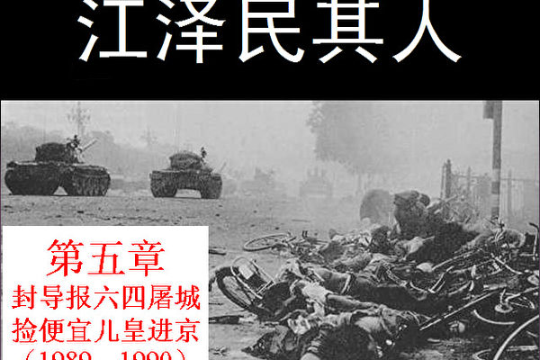</td>

【大纪元6月4日讯】1989年是江泽民政治生涯中最关键的一年。毫无疑问，江是“六四”事件中最大的受益者。其实，江也在“六四”事件中扮演了一个重要角色。这使得原准备退休的江泽民从上海市委书记一跃而被任命为手握党、政、军最高权力的“核心”。

<b>1﹒导火索──胡耀邦之死</b>

1989年初，邓小平主持的经济改革给中国带来新的生机，同时也带来不安的躁动。虽然国民经济不断增长，市场供应花色渐多，但中央政府在各省的税收收入却减少了三分之一。新的通货膨胀率已逼近20%。物价飞涨，恐慌的采购成了大城市生活的一个内容。“屋漏偏遇连天雨”，越来越多的国有企业出现了亏损和倒闭，成千上万的国有企业工人被送进待业市场。新经济体制的既得利益者与旧经济体制的既得利益者之间的矛盾已日渐明显。一部分做生意的人已经富起来了，而大量原国有企业的工人、技术人员却失掉了他们已享有的各种福利和退休保障。他们人数之众，也形成了社会中的一个新阶层。社会贫富差距在迅速扩大。

当时中国民众最痛恨的就是“官倒”。中国从1985年开始对农产品收购价格、主要工业产品出厂价格和紧缺商品实行“双轨制”，也就是国家计划内的生产部分按照计划内价格采购，超出计划的部分按照远远高于计划内的市场价格采购。“双轨制”的目的是为了解决生产资料的需求大于供给的矛盾，并保证国家指令性计划能够以低成本完成。而所谓“官倒”就是用批文按照计划内的价格购买紧俏产品，如钢材，转手再以计划外的价格卖出，其中的差价可能有数倍之高。

越来越多的中共官僚在自己无需下海经商的情况下，利用手中权力大肆攫取社会财富、贪污腐败，把订单、配额等稳赚钱的项目统统给了自己的亲属和朋友。在形形色色的驻京办事处和高级饭店里，住着一个特殊的人群，他们揣着数百万元的钱，盯着各大部委的京官儿们，目的就是要在他们身上花掉这几百万，换来的是进口指标和各种配额。有了一纸批文或配额，他们就可以赚回数千万甚至数亿元的钱。中共的跛足改革造成的畸形体制，为无数的官商勾结营造了最佳环境。这些肮脏的交易肥了官商却牺牲了民众，因为差价的最后承担者就是普通的百姓。1988年，国家控制的价格双轨制差价就在3569亿元以上，约占当年国民收入的30%。太子党们利用权力倒卖批文而一夜暴富。

“官倒”这个名词充分反映出中共的官僚腐败。人们要求全面改革的情绪如激荡的暗流在社会上涌动，这时一个火星儿就能引起连锁爆炸。

4月15日，被视为党内开明改革派的胡耀邦在一次政治局会议上突发心脏病，一周后去世。他的去世，让民众对民主改革的前途充满了悲哀、失望与愤怒。

当天晚上，北京大学内学生们开始扎花圈，校园的墙上或树上贴上了大字报。15日至17日，著名高校北大、清华、人大、北师大、政法大学等院校内均出现大量关于悼念胡耀邦的大字报和挽联。4月17日，星期一，几千名学生离开校园走向天安门广场，将花圈放在人民英雄纪念碑脚下。学生打出了“悼念胡耀邦”，以及“铲除腐败”、“依法治国”、“打倒官僚主义”等标语。同时全国各地学生纷纷响应，举行大规模集会、游行、请愿等。几天后，学生运动扩大，呼吁国家领导人和学生对话，促进政治改革，使国家走向民主和法治的道路。

4月25日晚上，中央电视台在全国电视新闻节目上多次播放人民日报社论《必须旗帜鲜明地反对动乱》，社论谴责学生的做法“扰乱了秩序”，把他们的行动定性为“非法”，呼吁制止动乱。4月26日，这篇社论在《人民日报》发表。

社论称：“这是一场有计划的阴谋”，“其目的是搞散人心，搞乱全国”，“其实质是要从根本上否定中国共产党的领导，否定社会主义制度”，等等。

“4﹒26”社论将学生运动定性为“动乱”，激起了学生强烈的不满。随着“五四”这一传统的学生运动纪念日的到来，学生运动再次扩大。4月17日游行的时候，清华大学的队伍最前面的是几位白发老教授，他们举著一个白色条幅，上面写着一位著名作家的话：“跪久了,站起来遛遛”。许多老人回想中国在这几十年的风风雨雨中，中国知识份子实际上就是跪着的，给党跪着，只能为党唱颂歌，绝无机会挺起脊梁作为社会良知发出独立的声音。老教授们公开走上街头抗议当权者，这是中共当政后从来没有过的事情，也被视为一个危险信号。

5月13日，学生在天安门开始进行绝食，要求政府与学生平等对话，希望政府拿出实质方案解决问题。与此同时，成千上万的北京市民、机关干部、新闻记者们纷纷涌上街头支持学生。

与《人民日报》“4﹒26”社论并行的，促使整个事件发生恶性变化的另一个导火索是上海市委书记江泽民对《世界经济导报》的整肃。它促使党内大老中的几个人决心用武力屠城，换取所谓“稳定”。

<b>2﹒《导报》事件</b>

中共的政权缺乏合法性，不像民选政府每一届都可以依法平稳地在完成权力交接，如何维持独裁统治始终是中共的心病。尤其胡耀邦、赵紫阳的所思、所想、所作、所为都不能令中共核心层满意，因此寻找合格的总书记就成了重要课题。江泽民对《导报》事件的整个处理过程使党内大老们感到这才是“接班人”。

1989年的学潮一开始仅仅有学生的参与，而从学生运动到全民运动的转折点则是江泽民在上海整肃《世界经济导报》事件。

众所周知，胡耀邦去世引发了《导报》事件。《世界经济导报》的创办人及主编钦本立是一位70多岁很受编辑尊重的老知识分子。这个刊物倡导民主思想，在30多万高层次读者中信誉很高，在全国性的讨论定调方面影响力极大。

胡耀邦去世后的第四天(4月19日)，《导报》的编辑们举办了一个研讨会。钦本立认为研讨会的内容应该带有实质性的东西而不是一般的哀悼之词。这得到与会者的认同。会上戴晴谈到中国共产党七十年来的历史和几位总书记的命运。她说党的总书记都没有好下场，因为都是“非程序权力更迭”。

4月20日，上海市委宣传部得知，《世界经济导报》将开辟专栏悼念胡耀邦同志。宣传部长陈至立随即告诉了江泽民。21日下午，江派市委副书记曾庆红、市委宣传部长陈至立找《导报》总编辑钦本立谈话。钦本立说，《导报》确实将在新的一期中用几版篇幅刊载该报与《新观察》杂志社4月19日在北京举办的一个悼念胡耀邦同志的座谈会内容。曾庆红和陈至立要他将这期《导报》的清样尽快送阅。第二天晚上八时半，曾庆红与钦本立讨论第439期《导报》清样问题时，要钦本立删节五百字，主要是严家祺、戴晴等人的发言。

钦本立强调政府同意报纸总编责任制，并说：“出了事情我负责，反正江泽民同志没看过清样。如果发表出去有什么后果，不必市委、市委宣传部负责。”

曾庆红大怒道：“现在不是哪个人负责的问题，而是整个社会效果的问题。”钦本立坚持由他负责，不同意删改。曾庆红看说不服他就去向江泽民汇报此事。

江泽民没想到钦本立是个铁杠子头，连曾庆红都败下阵来，于是将此事告诉了《导报》的名誉理事长汪道涵。有汪道涵在旁边，江泽民声色俱厉地要钦本立改清样。汪道涵也搬出党性原则来压钦本立。当江泽民和汪道涵硬压软劝要钦本立同意删节时，却发现十几万份报纸都已印好了，并且四百份已批发给个体报摊。此外，还有相同数量报纸直接送往北京了，最后才追回两万份，但影响已经造出去了。

4月22日上午，胡耀邦的追悼会在人民大会堂召开。仪式由杨尚昆主席主持，中国大部分高级领导人都参加了。江泽民一面在上海反对悼念胡耀邦，一边送去花圈以示“悼念”。

4月26日《人民日报》发表社论《必须旗帜鲜明地反对动乱》后，江泽民召开的市委书记紧急会议持续到凌晨一时，江说要采取果断措施。同日在有一万四千名党员参加的大型集会上江泽民宣布停止钦本立的领导职务，并决定对《导报》进行整顿。

4月27日，江泽民派刘吉、陈至立负责的“上海市委整顿领导小组”进驻《导报》。整起人来不比江手软的陈至立对江泽民言听计从。她遣散《导报》员工，还特别下禁令不许《导报》的编辑再做记者。

江泽民的亲信陈至立在钦本立癌症晚期，起不来床时，竟笑眯眯的去了病房。别人还以为她前来探望，谁知陈至立突然大声宣读了对钦本立的党纪处分。看来陈不但要刺激这位70岁的老人早些死，还要他死也不得安宁。

《导报》编辑们的行为赢得了海内外无数正义之士的支持和敬佩。但是，库恩在《江泽民传》中，却完全按照江泽民的口吻对《导报》事件进行了抹黑。把钦本立和他的编辑们丑化成“口是心非”、“不合逻辑”、“欺骗”、“公然挑战”江泽民并“终于抛弃了伪装”的一群人，江泽民反倒成了受害者，真是倒打一钉耙。

<b>3﹒“六四”前奏曲作者</b>

江泽民及其亲信对于导报的粗暴处理引发了一场席卷上海乃至全国新闻界的抗议。上海市委整顿《导报》引发的风暴来临了。第二天上海街头就发生了大规模游行，公开打出了“还我导报”和要求恢复钦本立职务以及言论自由的旗帜和横幅。上海作协部分名人纷纷参加游行，北京知识界和新闻界的著名人士致电江泽民，要求收回对钦本立及《导报》的处理决定。

在市政府门口席地而坐的学生们不时呼喊口号。一些群众说，“学生的口号我是赞成的。现在实际上最大的失误是不推进民主进程。”有的说，“学生的爱国热情应该予以肯定。”还有的说，“这不像是动乱！”据测算，当时在外滩的大学生约有八千余人。这是这次学潮中上海学生游行规模最大的一次。到晚上十时零五分，聚集在市政府门前的学生开始陆续散去。

江泽民害怕了。对于整肃《导报》引发的抗议声浪，江泽民承认，“后果比我们预料的要严重得多。”有人指责他的行为引发了“上海大规模的示威”。事实上不止是引发了“上海大规模的示威”，而且促发了北京的大规模示威。

在北京，两名记者把有1013名首都新闻工作者签名的请愿书送交中华全国新闻工作者协会，请愿书要求与中央主管宣传工作的领导人对话。《中国青年报》的学校教育部兼科技部主任李大同在递交请愿书时向在场的中外记者宣布，请愿书的1013名签名者分别来自《人民日报》、新华社、《经济日报》、《中国青年报》、《北京日报》、《北京晚报》等三十多家首都新闻单位。这份写给全国记协书记处的请愿书说，根据赵紫阳5月4日接见外宾时关于对话的谈话精神，有必要与中央主管新闻工作的领导人就新闻界发生的不正常的事件对话。请愿书列举了三项对话内容，其中的第一条就是关于引起海内外强烈反响的上海《世界经济导报》总编辑钦本立停职。报社实行总编负责制的说法与事实不符，这恰恰是新闻改革要解决的首要问题。

4月27日晚，江泽民在惶恐中打电话给原中共中央组织部常务副部长、当时的中顾委委员李锐，通话达四十余分钟，江在电话中既恳请李锐向北京有些朋友通融，又在电话里向李锐探询北京情况。江在电话里还以“受不了啦”的口气向李锐表示当时的心情。

4月30日，中共总书记赵紫阳访朝归来，当晚江泽民与曾庆红飞赴北京，欲向赵紫阳汇报工作。赵很快接见他，江汇报完后问赵：“你对我在上海处理《导报》怎么看？”赵并未即时表态，反问江泽民：“你看呢？”

江泽民支吾其词，他发现和赵紫阳隔膜已深。赵紫阳看了一眼江泽民，接着说：“现在没有时间谈这个问题。”

江泽民用恳求的语气说：“紫阳同志若不拿出意见，我和庆红同志就不好工作，也不好回上海交代。”

赵紫阳只好表态了：“上海市委行事仓促地处理了《世界经济导报》的问题，把小事化大，才让自己步入了死胡同。”说完扭身便走了。据当时在场的人士透露，江呆呆地望着赵离去的身影足足有十分钟没有说出一句话来。

显然，赵紫阳对江泽民把小事化大致使引发了大规模示威的做法非常不满，言辞之厉让江泽民吓得六神无主。江的密友陈至立说：“如果中央追究责任，就由我一人来承担好了，绝不牵扯你。”从此江泽民和这个女人的关系更加亲密了。事后，江泽民虽然安心一点，但还是到处找关系，希望知道党内大老们是什么态度。他得到的反馈是中央意见分歧，赵紫阳的话不代表中央精神。

5月13日，600名主要来自北京大学的学生开始在天安门广场进行绝食抗议。更多的学生市民来声援，各国记者渐渐把镜头和注意力对准这里，并纷纷指责上海市委书记江泽民破坏民主。在上海，4000名学生聚集在市委门前声援北京绝食的学生们，并要求市委书记表态。江泽民对中央精神心里有了底，当然不肯露面。这引发了学生的极大愤慨。为了避免事态再扩大，江不得不去看望住院学生，不过这仅仅是权宜之计，这并不影响几天之后江对北京实施戒严表示坚决支持。

<b>4﹒“可靠”接班人</b>

在5月中旬的政治局会议上，党内斗争明显升温，有些人认为江泽民没有处理好学生的合法要求，希望江能与学生直接对话并宣布运动是爱国的、合法的。赵紫阳干脆宣布既然《导报》事件“是上海市委挑起的，就应当由上海市委来结束”。赵公然点名陈云和李先念中意的江泽民，这让几位党内大老怒火中烧。

在北京，绝食抗议活动仍在继续。学生要求收回4月26日《人民日报》的社论，并由电视台现场直播中央领导人与他们的会面，这些要求对于独裁政府来说简直是赶鸭子进烤炉。

更让中共尴尬的是，同一天，苏联总统米哈伊尔﹒戈尔巴乔夫飞抵北京进行访问。数百名来北京报道这一事件的记者都知道他们遇到了比两国首脑举行峰会更重大的新闻。视线被转移到中共最不希望聚焦的地方。

政治局会议上谈崩了，没有实权的赵紫阳预料到自己将面临着什么。5月19日凌晨，赵紫阳进入天安门广场含泪看望了绝食的学生，他没有请示政治局，他也不需要请示大老们。这时他只是代表自己，做了自己想做的事。晚上10点钟，李鹏发表了讲话，重申了中央的立场采取“严厉措施结束骚乱”。两小时后，午夜时分，天安门广场的一个大喇叭宣布实施戒严。

20日凌晨2时，在李鹏讲话后不久，江泽民立即以明传电报的形式表态对中央精神坚决支持。这个及时表态的大动作走在所有省、市、自治区领导的前面，和给李先念送蛋糕产生的效果是一样的。毫无疑问江泽民的表态让党内大老们找到了可靠的接班人。库恩在英文版《江泽民传》第162页提到（中文版中此内容被删除），“早在5月20日，中共元老就内定江泽民获提名成为新任中共总书记。”

<b>5﹒为屠城扫清最后障碍</b>

“六四”屠城前还有关键的一步，这一步迈不出去，恐怕当时的中国就是另一番局势了。所以虽然5月20日党内大老们就内定了江泽民当新任中共总书记，但在江完成了这一步，扫清了屠城前的障碍，几位政治老人才最后表态把总书记职位交到江泽民手里。

5月21日，江泽民被邓小平秘密召往北京。江不知到底何事，忐忑不安地来到北京西山去见邓小平。不料会见中邓小平赞扬了江泽民对《世界经济导报》事件的处理，并说上海市接待戈尔巴乔夫的工作做得比北京好。江泽民这才松了口气，心中暗想：幸亏没听赵紫阳的话，否则后果不堪设想。

邓小平看着江泽民瞬息万变的表情，说还有一个非常重要的任务要他去完成。邓小平要他截住奉命出访加拿大提前回国的人大委员长万里。他们耍了个花招让万里乘坐的飞机在上海降落，江泽民的任务就是劝说万里同意大老们的主张，否则不让他回北京。邓小平解释说，由于当时有五十七名人大常委要求开会讨论李鹏宣布北京戒严是否合法的问题。如果万里回京主持人大会议，形势极可能向他们所反对的方向发展，那时局面就难以控制。江刚刚放下的心又提了起来，他知道这个任务不好完成。

邓小平似乎看出了他的心思，用轻描淡写的语气暗示这是中央对江的一次考验，如果这个任务完成得出色，则此事很可能成为江的政治生涯的一个重要转折点。江泽民听后又紧张又兴奋，同时心里也明白万一有个闪失，那前途就彻底“无亮”了。

5月23日，江泽民返回上海，万里的飞机在5月25下午3时在上海机场降落，江泽民接机并立即递过去“邓的亲笔信”，万里是邓小平的桥牌朋友，邓在信中恳求万里“看在几十年朋友的份上，在此关键时刻帮我一下。”

万里在上海住了六天，痛苦了六天，最后江泽民交了底牌，在万里不答应之前，江得到指令要把他留在上海。5月27日万里发表了公开声明同意中央颁布的戒严令。江泽民对万里的胁迫等于在战略上切断了赵紫阳的臂膀。

江泽民为屠城扫清了最后一个障碍。

同一天，5月27日，邓小平召来八位元老开会，决定总书记人选。最早的时候邓小平本来提议乔石和李瑞环，但是陈云力推江泽民，李先念和薄一波对邓小平转而起用江泽民中更是起了关键性作用。李先念当时说：“江泽民虽然缺乏中央工作的经验，但他有政治头脑，人正壮年，可信任。”

于是，历史的安排把江泽民推向了权力的顶峰，成为“六四”镇压的最大受益者。

<b>6﹒登上权力的顶峰</b>

5月30日，江泽民再一次奉命秘密进京。江不知自己的命运将会怎样，不过多少预感到此行将不同寻常。

江抵京后稍作休息，陈云的秘书进来通知他：“陈云同志正在等你。”陈云与江泽民的谈话十分简单，陈云直接了当地说：“小平同志让我告诉你，你到中央来工作，代替赵紫阳同志。”江泽民没有说一个字。他明白这个关键时刻说错一句话都会前功尽弃。他听说在他来京之前，有干政大权机位大老已在邓小平家开了两次会。陈云是第一个提出由他来接班的人。陈云说李先念同他讲过，上海的江泽民党性比较强，这次对戒严态度也很坚决。但江泽民不知道陈云本人对他态度如何，所以他只带耳朵没用嘴。

到了李先念那里就轻松了许多。李先念问了一些上海的情况后说：“小平那里你不用急着去，决定是小平同志的意思，当然会找你再谈。”江泽民知道自己在李先念那里下过的功夫没白废，但他记住了曾庆红的建议，多听少说。所以，除了简短回答问题外，他只是微微弯著腰，做出一副洗耳恭听的样子。

江泽民回到休息室后，马上往上海打了三次电话。第一个电话是打给曾庆红。江泽民告诉他说：“看来我回不来了。”

曾显得紧张，问：“你不是去两三天就回来吗？”

江说：“我就要在这里工作，你明天马上来一趟。”

第二个电话是打给原上海市长汪道涵，江泽民说：“以后要请您多关照了。”

第三个电话是打给他的夫人王冶坪让她准备来京，但王冶坪没有表态。

大局已定，晚八时，李鹏，姚依林等在人大会堂里客气地宴请江泽民。江泽民真恍如在梦中。

军队进城一再拖延，6月1日才有了进城的新部署，最后实施的日子定在6月3日夜里。江泽民作为新任总书记从5月底就已经开始批阅文件了。

6月4日那个令人震惊的日子终于来了，又过去了，至今16年了，江泽民希望“六四”在人们的记忆中完全消失。但每年这一天前后人们都用大量的图片和文章来奠祭死者，这是江泽民最不愿看到的。在2002年江卸去总书记和国家主席时，他给政治局常委定了几条规矩，其中一条就是不许给“六四”翻案，因为他是“六四”镇压最关键的参与者之一和最大的受益者。

<b>7﹒做不完的噩梦</b>

“六四”之后，江泽民的日子也并不好过。江一直处于恐惧之中，怕有人给“六四”翻案，给赵紫阳翻案。赵紫阳去天安门广场看望学生的照片成了不肯屠杀学生的历史见证。江最恼恨的就是十几年来人们在“六四”期间总是把这张照片翻来覆去的刊登，似乎是影射自己上台的不光彩。江泽民也不会忘记赵紫阳“六四”前对自己的批评，江对赵家的监视控制让保卫部门的人都感到难以理解和不忍下手。

“六四”以后，全世界几乎所有的新闻媒体都转载了一张照片，这张照片上一个青年赤手空拳只身挡在行进的坦克前，这位青年叫王维林。国外媒体以十分敬佩的口吻称赞其和平抗暴的勇气，并称之为二十世纪英雄。王维林的存在自然也是促成“六四”翻案的潜在因素。江泽民对之恼恨不已，密令按录像找到这位青年，王被抓获后，江下令秘密处决。

在2000年美国哥伦比亚广播公司资深记者华莱士采访江泽民时，华莱士拿出王维林的照片问江泽民：“你是否佩服这名青年的勇气？”不料江说：“他绝没有被捕。我不知道他目前在哪里。”这个答非所问的回答对老牌记者来说，等于是给了答案。

“六四”事件中另一位被海内外华人赞赏的英雄是38军军长徐勤先。徐军长在“六四”事件
中直接抗命，拒不服从向学生开枪的命令，也被军委主席江泽民下令在军事法庭秘密审判并在监狱关押了五年。

“六四”后不久，在一次中外记者招待会上，一个法国记者提问，问到因“六四”被捕的女研究生在四川监狱里被轮奸之事，江泽民当众脱口而出一句震惊全球的话：“她是罪有应得！”

除此之外，对江泽民来说更重要的是要淡化、模糊，并最终扭曲全体中国民众对于“六四”的记忆，这样才能保证“六四”不可能平反，保证无人威胁他的最高权力地位。这一方面，江泽民可谓得心应手。在青少年时期，江泽民就亲身经历了父亲江世俊采用欺骗宣传将一场大屠杀从民众的记忆中渐渐淡化。不过现在的技术条件更加优越了，江马上下令制作电视节目，极力渲染学生的“暴行”，甚至不惜焚烧部分军车并拍摄现场，力图使全国民众相信，军队的开枪是不得已。很快，许多未亲身经历其事的民众便开始相信北京真的发生了所谓的“暴乱”。

另一方面，江泽民又下令各单位清查参与“六四”、支持学生、反对镇压的人，鼓励检举揭发，对他们一一清算。谎言和恐惧加在一起，基本上使民众不再敢谈论“六四”，也不再敢回忆“六四”。很多历史事实到后来人们都弄不清了，因为没有一个当事人敢于回忆这段历史了。比如“六四”后人们议论最多的谜团之一，就是在“六四”镇压时中共的坦克究竟有没有压人？原中共中央文献研究室室务委员，周恩来生平研究小组组长，《晚年周恩来》一书的作者高文谦先生曾举了这样一个例子：“关于在六部口是不是坦克车压人的问题，这件事情是当时在各个机关里面议论最多的，事实证明确实是压人。后来是我到海外之后很多当事人都讲了。就是在新华门六部口那块儿坦克车追着从天安门广场撤出来的学生碾，结果很多人就当场被碾成肉酱啊。但这场面马上就被传出去了，但那时候毕竟是个小场面。但是我知道一个情况，就是在六部口附近，中宣部的一个宿舍在那儿。中宣部有一个博士生当时是中宣部培养的第三梯队的人，很受信任。他当时就亲眼看到了这个场面。

当时这个事情被说成是最大的谣言，这个事情如果传出去那简直是……。再怎么说，坦克车追着人去压，就什么都解释不了了，所以就要‘辟谣’。在我们机关那些搞清查的人吹胡子瞪眼的追：你是听谁说的？你又是听谁说的？最后追到了中宣部的这个博士生身上，就把他给拽到了戒严部队去了。在戒严部队里面他被严刑逼供。‘你看到没有？’，‘我确实看到了，我是一个党员对党要忠诚，要老实，我看到什么我就说什么，我确实是看到了。’后来戒严部队的人拿着一千伏的高压电棒，威胁他：‘你看见没有？’博士生说：‘看见了，我确实看见了。’啪，用高压电棒电他，博士生当场就昏过去了。一会儿醒过来后，又被问：‘你看见没有？’，回答说：‘看见了。’啪，又电一下，他又给电昏过去了。就这么弄了几次之后，最后博士生说：‘没看见。’

后来据说这个人身体就垮了，精神也垮了，这不光是一个电刑的问题，这是精神上的一种折磨。

共产党原来自己标榜自己讲真话，要实事求是，结果他完全不让你讲真话。我有时候经常就想起这么一句话就是，所谓墨写的谎言，怎么能掩盖血写的事实。”

“六四”时一个就读于北京体育学院理论系的应届毕业生方政，双腿被高速行驶的坦克车碾过落下双腿截肢的故事更是让人心有余悸。

16年后方政接受《大纪元》记者采访时，作证说，“我躲闪不及倒地，坦克压到我的双腿，就从我的双腿上碾过去了，坦克履带都是链条、齿轮，我就感觉到裤子被卷到履带的链条上面，很紧很挤压的感觉，当时我意识还有一点，只觉得身体咚咚咚的在地下被往前拖，被拖行了一段距离，头部、后背、肩部都被擦伤（到医院后医生说的），坦克车的履带链条把我的腿撕拉掉了，裤子也扯烂了，我就从履带上掉下来了，掉下来之后，我就滚到了路边靠到护栏上……

这个情景，后来我用动态网上网时偶然看到了，看到了我自己当时的这个情形。国外的网站上应能看到这张照片，一个人躺在地下，双腿被压掉，靠在护栏下。那个人确实就是我。我的双下肢被截肢，右侧截肢到大腿上部，左腿到膝盖位置……”

在这次掩盖、栽赃和清查中江泽民熟练掌握了宣传和暴力机构，此后相同的手段又被用来镇压法轮功学员，这是后话。

手上染的血太多了，不管江泽民怎么捂著盖着，每年也都要过“六四”。

<h1 align="center"><b>《江泽民其人》六：沙漠风暴老贼心惊</b></h1>
<H3><b>第六章：沙漠风暴老贼心惊 宁左勿右如履薄冰（1989──1990）</b>
</h3>
<td align="center">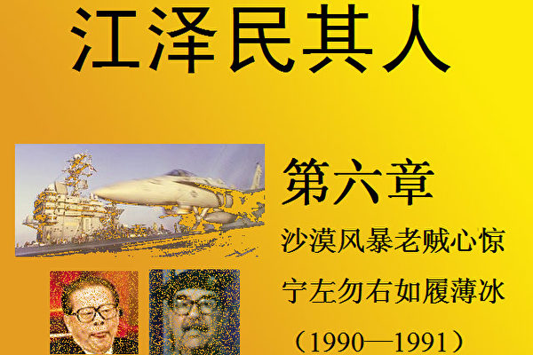</td>

【大纪元6月5日讯】在江泽民当总书记一年有余之时，美伊之间爆发了海湾战争。美国在代号为“沙漠风暴”的军事行动中取得的巨大成果让邓小平重新考虑中国今后的发展方向。

1990年8月2日，伊拉克突然入侵科威特，一天后，科威特全境沦陷。伊拉克的入侵行动引起了国际社会的强烈反应。以美国为首的多国联盟在联合国安理会授权下，为恢复科威特领土完整而对伊拉克实施了军事打击。伊拉克的残暴独裁者萨达姆是中共的好友，二者之间暗地里一直来往密切，当时中共在国际上非常孤立，怕得罪国际社会而不敢公开支持萨达姆。

江泽民是在参与屠杀“六四”学生后上台的，从他的绰号“客里空”和“江牛皮”知道，此人除了耍嘴、作秀、打小报告外，没有什么真才实学。海湾战争客观上检验了江在当上总书记后到底能承担和解决多大的难题。

面对这样大的国际挑战，江心慌了，很有些不知所措。他这时才知道坐在总书记的位子上也有不舒服的时候。中共当时正处于“六四”屠城后的贸易禁运，国际上朋友十分有限。出于摆脱外交困境的考虑，邓小平定下的调子是：“少插嘴，不插手！”这给江泽民解了围，因而中共在联合国决议上投了弃权票。

<b>1﹒沙漠风暴</b>

1991年1月17日晨，以美军为主体的联合国部队开始向伊拉克发起了代号为“沙漠风暴”的军事行动，几周之内就使得萨达姆的军队毫无还手之力，伤亡惨重，被迫接受联合国自伊拉克侵略科威特以来通过的十二项有关决议。2月28日零时，联合国多国部队停止了一切进攻性行动，持续了四十二天的海湾战争结束。

在这次战争期间，翻开中共的报纸，还充斥着人民战争、游击战等战术分析，甚至预期美国可能会陷入越战那样的泥潭。没有想到，以美国为首的多国部队，采用航天、航海和航空技术立体作战，武器之先进、配合之精妙令国际社会叹为观止。

美国情报部门当时调动了航天通信卫星、民用观察卫星、光谱分析卫星，对伊拉克军事情报进行监听、破译和红外线高空拍摄，并用巨型计算机进行信息处理，伊拉克的一切信息都尽收眼底。同时，在战争打响的前6个小时，美国发动了一场强大无孔不入的电子干扰战，以至于伊拉克的指挥系统全面瘫痪，雷达荧光屏上则飞飘起一片斑斑点点的雪花﹔美国的隐形战斗机则从空中撒下大量的干扰片，故意在敌方雷达上显示出虚假的飞机磁信号目标，迷惑萨达姆的“空中眼睛”，让伊拉克的“萨姆—6”地对空导弹去追踪那些虚无缥渺的“幽灵”。萨达姆的军队顷刻间变成了聋子和瞎子。

美军使用高科技武器以极少的伤亡取得了巨大的军事成就。这不但给邓小平很多启示，而且强烈地震撼着中共高层，要求以现代化高科技武器装备军队的呼声也陡然升起。摸枪就哆嗦的江泽民神经里还缺少这根弦，他对于中美两国的军力对比还停留在韩战和越战的历史中，一时不知如何是好。

江泽民这时想起了《1999﹕不战而胜》。中共无论在精神信仰和军事实力上都与美国天差地远。随着东欧剧变，冷战已经趋近尾声。民主从欧洲大踏步向东迈进，离中国已经仅仅隔着一个苏联，而戈尔巴乔夫面临着民主化浪潮的重重压力，这个红色帝国已经风雨飘摇。以美国意识形态和武器装备之先进，如果对中共延续冷战思维或实施军事打击，后果不堪设想，一党专政就会解体。

江泽民站在世界地图前一筹莫展，他带话给还在美国读书的长子江绵恒，建议江绵恒书可以慢慢去读，毕业之后先在美国找个工作，在美国多盘桓几年，因为一来江泽民在中央立足未稳，二来江泽民对中共前途也毫无信心。

<b>2﹒讨好苏联</b>

自1989年“六四”屠城后，被视为在复杂系统的融合方面处于世界领先地位的美国对中共实施武器禁运政策，而中共在系统工程和融合方面缺乏经验。但中共不难雇佣到那些系统工程方面的“天才”人物。例如，中共利用俄罗斯经济的贫弱，以支付硬通货的方式获得技术专家的丰富经验。另外，自90年代以来，约有1500名俄罗斯科学家和技术人员一直在为中共军队建设提供帮助。

在邓小平、杨尚昆等人的注视下，领导内行的门外汉江泽民作为军委主席必须有所为。他后来宣布向俄罗斯购买现役高性能武器系统，结果花巨款买回来的都是前苏联淘汰的武器和大批前苏联性能落后需要清仓的装备，接收的战机频频失事。中共自接收苏战机（包括苏-27及苏-30）以来，分别在1997、1998、2000、2001年发生五起事故。

1975年下水、1994年退役的俄罗斯航母“基辅”号在2000年8月被军委主席江泽民如获至宝地迎进天津港。据有关人员透露，购买“基辅”号航空母舰的总贷款达到7000万人民币，可谓耗资巨大。“基辅”号好不容易进了港，专家们以为能从中得到技术情报，结果发现原有参考价值的东西全部被卸光了。军方大呼上当，向老军头们告状。干了蠢事的江泽民，更加没有安全感，这个军委主席当得战战兢兢，用江泽民自己的话讲，“如履薄冰”。

当时的苏联国内经济不振，加上武力镇压若干加盟共和国，在国内外面临严重困难。中共为了加强军事装备，表示对苏共的支持，1990年10月份，和苏共进行军事合作，决定向苏购买一批新式战机。中国外交部发言人1991年1月25日告诉外国记者，中共总书记江泽民将于当年5月访问苏联。这是自1957年毛泽东赴莫斯科参加“十月革命”四十周年庆典以来，访苏的中共最高领导人。

江泽民访苏时，苏联改革派重要人物叶利钦要求会见江泽民，但被江泽民拒绝﹔江单独会见了反对改革的苏联副总统雅纳耶夫，告诉他希望苏联回到社会主义路线上来。这也反映出江泽民反对改革的左倾态度很鲜明。副总统雅纳耶夫在三个月后监禁戈尔巴乔夫的政变中起了关键作用。

在江泽民访苏期间，为了拉拢与苏联的关系，稳固自己的权力，江不惜一切代价讨好苏联。江对中俄边界毫不在乎，同意重新进行中俄边境勘测。在克格勃的精心安排下，当年苏联间谍、江泽民的旧情人出现在江的面前。江明白自己过去的一切把柄都在克格勃手里，因此心知肚明地乖乖就范，秘密把相当于几十个台湾面积的有争议国土（实际上是被强占的中国领土）拱手送给俄罗斯。本书第14章将详述此事 。

<b>3﹒低估邓小平</b>

邓小平认为改革开放、搞活市场，从经济入手与美国抗衡，已经迫在眉睫。光有几个经济特区已经不能适应形势的需要，中国必须改革经济、全面开放。已是大权在握的江泽民可不这么想，他认为自己好容易爬上来就不能再下去，越开放老百姓越难控制。爬上高位的江泽民有点飘飘然，大大低估了邓小平的政治能量，所以江上台后讲过一句与邓小平顶着干的“名言”：“让私营企业家和个体户倾家荡产”（具有讽刺意味的是，当江泽民的家族成为“中国第一贪”时，江泽民又大搞起“让资本家入党”了），他还有对应的另一个方针：“把一切不稳定因素消灭在萌芽状态”。

邓小平开始后悔不该轻率听信陈云、李先念的话让江泽民当总书记。1990年春天，邓在上海多次召见上海市长朱镕基，并对朱镕基进行考查，觉得朱是中共高层少有的懂经济的人才，而且有魄力，具有实干精神，不是江泽民那样耍花架子的人。江在上海的耳目及时把邓小平的动态报告给江泽民，江的妒忌心又翻腾起来。

江的妒嫉源于自己无德无能，而又怕任何有才能者威胁到自己的权位。虽然表面上江泽民大权在握，但自从他上台，党内外许多人士都不看好这个投机钻营者，并估计江只是个过渡性的人物。処在高位上的江虽然洋洋而自得，但其内心也多少感到了自己在党内地位还远未巩固，论资历、才干、人脉，自己远居人后。对于权力的偏执使得江形成了强烈的妒忌心，将一切才干、资历、人脉等胜过自己的人都视为潜在的威胁。

1991年2月邓小平在离开北京去上海过农历新年之前，明确说：“我现在在北京讲话没有人听，我只有到上海。”这一次邓小平在上海告诉了朱镕基，想要调他到国务院工作。邓并且委托杨尚昆召集上海市委、市政府的一班领导，传达这一“中央决定”。

1991年春节前，邓小平在上海发表讲话，要坚持改革开放、坚持搞市场经济。时任《解放日报》负责人的周瑞金等人根据邓小平在上海的讲话精神，撰写了《做改革开放的“带头羊”》、《改革开放要有新思路》、《扩大开放的意识要更强些》、《改革开放需要大批德才兼备的干部》四篇文章，署名“皇甫平”，开篇发表在1991年大年初一的《解放日报》上。“皇甫平”的后台老板实际上是邓小平。

这一切邓小平既没有通知也没有刻意瞒江泽民，邓完全把江排斥在外。

这些由邓小平支持、上海市长朱镕基直接过问的改革开放文章受到江泽民的忌恨和抵制，江不仅对这个改革趋势沉默不言，而且支持北京党内左派人物发起的抨击、批判，还派人对邓小平在上海的言行进行调查。江泽民本人则在北京忙着游说中共核心层的其他元老，寻找能够制约邓的人。

1991年4月12日，在全国七届人大四次会议上，邓小平力排众议，正式任命上海市长朱镕基为国务院副总理。5月，邓小平为了表示对朱镕基的支持，带着他一起视察首钢，并且当面由衷的夸奖说：“我党高级干部中真正懂经济的还不多，像朱镕基这样懂经济的同志，应当提到更高层次的领导岗位上来”。邓对朱的夸奖让鼠肚鸡肠的江泽民既惊慌又忌妒，以后江泽民经常让亲信搜罗材料，不管是不是朱镕基的责任，反正逮著机会就压制、排挤和打击，让朱受到许多冤枉气。

江泽民暗中反对邓小平的言论也被邓知道，邓对江强烈不满。政治局常委乔石和副总理田纪云多次发表支持改革的讲话，邓小平称赞说：“很长时间没有听到这样好的讲话。”这又让妒忌心非常强的江泽民埋下了怀恨乔石、田纪云的种子。邓小平在对江泽民等反对改革的人的强烈不满和失望中，和杨尚昆、万里、乔石等人商量，准备让赵紫阳复出，并且在92年的十四大上彻底改组中共中央领导班子。江泽民闻讯大惊。

<b>4﹒苏共垮台引起的惊恐</b>

1991年6月，邓小平重新启用赵系人马胡启立、阎明复和芮杏文。胡启立任机械电子工业部副部长、党组成员，芮杏文任国家计委副主任，阎明复任民政部副部长。这是邓小平准备为赵紫阳复出做的铺垫。

几个月之后，1991年年底，貌似强大的苏联共产党，在几天之内就垮台了，使得整个世界格局发生了巨大的变化。苏共的解体强烈冲击中共，严重地打击中共的信心，使得中共高度紧张，认识到强大如苏共也有倒台的一天。中共以前常说一句话，“苏联的今天就是我们的明天。”如今苏共倒台了，中共不能不想想自己会不会还有明天。

中共常常说美帝国主义和一切反对派都是纸老虎，而反观苏联解体和东欧剧变，共产党才是真的纸老虎。所有独裁者的垮台都是树倒猢狲散。当时除了苏联解体外，柏林墙倒塌、波兰团结工会获胜、捷克斯洛伐克发生天鹅绒革命、匈牙利完成了民主转型、罗马尼亚独裁者齐奥塞斯库被推翻和处决、保加利亚完成了第一次全国大选……共产世界土崩瓦解。有个形象的说法，说推倒共产党执政的政权，在波兰用了10年，匈牙利10个月，民主德国10周，捷克10天，在罗马尼亚只用了10个小时。共产政权的连锁崩溃，令江泽民如坐针毡，极度不安。

1991年7月1日，江泽民在中共建党70周年的讲话中，抛弃邓小平以“经济建设为中心”的路线，大力鼓吹以“反和平演变为中心”，加紧在思想意识形态上的控制，并且强调：“要划清两种改革开放观，即坚持四项基本原则的改革开放，同资产阶级自由化主张的实质上是资本主义化的‘改革开放’的根本界限。”江泽民甚至从理论上声称“改革开放中也有路线斗争”，直接把批判矛头指向了上海的“皇甫平”，即指向朱镕基以及朱的支持者邓小平。江泽民坚决反对改革开放的讲话获得台下左派们的热烈掌声。第二天，承受很大压力的副总理朱镕基被打发到湖北考察并巡视暴雨灾情，而江泽民则在北京支持了左派们对朱镕基新一轮的全面清算。

江泽民没有看到问题的实质是共产党政治上的高度控制、经济上的落后在现代社会走入了死胡同，反而把问题归咎到改革开放上，要继续往左转，实在是过时思维。

库恩在为江泽民作的传中大肆吹捧江对改革的贡献，改变了中国，其实都是信口开河，因为江泽民从一开始就是极端保守派，根本不赞成改革路线。不过他的见风使舵以及作秀还是欺骗了不少不了解内情的人，尤其是外国人。

江泽民后来虽然迫于情势转向支持改革，但是对思想意识形态的控制却是江泽民当权期间的一贯思维和政策。江泽民极端仇视思想自由，指责异议人士是不爱国。他竟然对他的传记作者库恩说：“我不知道那些人（异议人士）的血管里是不是还流淌著中华民族的血液？”真是荒唐，忧国忧民的人不算爱国，难道江泽民这样的出卖国土的日俄汉奸反成了爱国者？

<b>5﹒讨好李鹏和军方</b>

在最初的几年，江泽民在党内地位十分不稳，他不仅仅受到来自左、右两派干政大老的压力，也面临着党内党外对“六四”屠城的不满。对外交往这时降到了冰点，许多国家在“六四”屠城后都把大使召回国内一段时间，贸易和武器禁运对中共的出口经济打击很大。

李鹏原来是江泽民的顶头上司，现在倒成了江泽民的下属，二人见面的时候都有些尴尬。江泽民当时每次政治局开会都是和李鹏并排而坐，共同主持会议，江泽民每每看着李鹏的脸色行事，外界称其为“江李体制”。为了巩固自己在党内的地位，江不得不讨好李鹏这个出身于水利部的总理。江泽民第一次出外巡视就选择了李鹏一心想上马的“三峡工程”，并积极策划使人大强行通过“三峡工程”的预案。

这种讨好是十分赤裸裸的。常把科学挂在嘴边的共产党和江泽民，此时却把最权威的专家们扔在一边，不顾三峡将引发的航运、发电、移民、生态、环境、战备等重重问题，让一些完全不懂水利科学的人，包括文艺明星、劳动模范和少数民族代表等来决定这个关系国计民生的大工程，这在外界看来简直就是一个笑话。江泽民这么做，除了讨好李鹏，实在没有其它任何意义。

无德无能、没有军方资历的江泽民在1989年11月被任命为军委主席，但老军头们怎么肯听他这个从来没有摸过枪的人的指挥？江泽民当时还不敢像邓小平那样封几个上将，在军队中又无自己的班底和人马，所以除了拨巨款给军方向苏联购买陈旧的武器外，江泽民又想起来汉奸老爹教给他的宣传技能。他指示要拍出几部歌颂解放军的片子，一方面讨好军方，一方面给“六四”后痛恨解放军的老百姓洗脑。江泽民亲自为一些片子题写片名，包括三部斥巨资的战争片《大决战》。

在拍片子的过程中，江泽民还有一个意想不到的收获。当时有一位姓李的导演拍出了一部《开国大典》。影片对蒋介石的塑造没有采用中共的脸谱化做法，而是把他塑造成为一个有血有肉的人。负责电影审查的人不许电影公映，并要求导演把蒋介石描绘成一个愚蠢而凶残的人，导演拒绝了。

思想开放的李瑞环听说了这件事，就邀请江泽民一起观看这部影片。其中一些镜头让江泽民十分好奇，因为看起来像是极为珍贵的纪录片镜头。江泽民问李导演那些镜头是从哪里找到的。导演回答说，那些镜头根本就不是找的，而是他们刚刚拍摄的，经过特殊技术处理后，看起来就像纪录片一样。江泽民十分满意。他最后看完电影后总结说：“真的和假的糅合在一起——我都被骗过去了。”

这种手法用于电影当然是正常的，但江泽民却从中想到了宣传欺骗中可以用的重要的一招儿。读者将会在第17章看到江泽民为欺骗民众而对于这种手法的发挥。

<b>6﹒邓小平的反击</b>

1991年8月31日上海的“皇甫平”在《解放日报》第一版发表题为《论干部精神状态》的文章，提出：精神动摇是最可怕的事情，干部必须解放思想。9月1日，中央人民广播电台播发了一篇由《人民日报》总编室副主任李德民和理论部一位高级编辑起草的社论《一切为了改革开放》和邓小平对着干，这篇社论由当时主管意识形态的政治局常委李瑞环阅读通过后，《人民日报》社长高狄却故意加进一段“对改革开放要必须先问姓‘社’姓‘资’”的内容，对“皇甫平”进行全面性的、更高层次的批判。李瑞环根据邓小平的指令，在第二天见报的社论内容中删去高狄的这段话。为此，邓小平狠狠地说：“《人民日报》想全面批判邓小平。”邓对江产生了极度的不信任。

在1991年年底的时候，邓小平完全被江泽民的所作所为激怒了，对所谓“第三代领导核心”的江泽民不仅完全失去信心，而且到了无法忍受的程度。邓小平虽然在名义上没有任何职位，但是仍然牢牢地控制着军队：军队由邓最亲密的老朋友杨尚昆和十分信任的部下杨白冰管理。杨尚昆和邓小平是1932年认识的，是60年的老朋友。杨白冰的上将军衔是邓小平于1988年9月亲自授予的，一直忠实地执行邓小平在军中的政治路线。另一位军委副主席刘华清是邓的老部下，也对邓忠心耿耿。

邓小平看到，平庸、软弱、无能、妒贤，思想保守、顽固的“第三代领导核心”江泽民妄图阻挠改革开放。因此，邓小平痛下决心利用手中的军权做最后一搏，准备在中共十四大上，撤换反对改革的总书记江泽民等人，让坚决执行改革开放路线的人上台。邓小平筹划由乔石替代江泽民，担任中共中央总书记，并在八届人大一次会议上当选国家主席、军委主席﹔由李瑞环或朱镕基替代李鹏，担任国务院总理﹔由万里继续担任全国人大委员长﹔杨尚昆卸任国家主席﹔彻底解散陈云把持的中共中央顾问委员会。

邓曾就这个方案向杨尚昆、万里征求过意见。同时，为了表示对乔石的支持，邓小平对乔石在各地的讲话予以高度肯定。这又让江泽民嫉恨不已，把乔石看成了冤家对头，邓小平死后，江最后以年龄为限逼迫比自己年轻的乔石下台，这是后话。

邓小平还准备再次起用被软禁的赵紫阳，让他担任全国政协主席。邓并不怀疑赵紫阳坚持改革的态度，关键是“六四”是邓晚年的最大心病，而赵在“六四”问题上坚决不认错的态度让邓小平非常恼怒。邓小平于是派人捎话给赵紫阳，要求赵在出来工作前承认一下“六四”事件中的错误，以防赵日后为“六四”翻案。联系人回来汇报说，赵紫阳坚持认为自己没有错，不写检讨。赵紫阳说：“我为什么下台不作检查？因为这是我自己的选择。……我觉得自己没有错，何必检讨？一检讨就不能说明事实真相。”听完汇报后，邓小平心中五味俱全，长时间沉默不语。

<h1 align="center"><b>《江泽民其人》七：江贼倒杨抢班夺权</b></h1>
<H3><b>第七章：小平南巡经济开放 江贼倒杨抢班夺权（1992-1994）</b>
</h3>
<td align="center">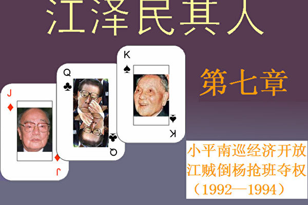</td>

【大纪元6月6日讯】胡耀邦和赵紫阳下台后，邓小平失去了推动改革开放的最得力助手。“第三代领导核心”的江泽民不仅不推动改革开放，而且从理论上批判改革开放。邓想来想去，万般无奈，只有亲自出马，在女儿邓楠的帮助下南巡，以老迈之躯推动停止转动的改革开放车轮。

1992年1月17日，一行专列从北京开出，向南方疾驰而去。车内的邓小平以88岁高龄再次南下，在夫人、女儿和老朋友、国家主席杨尚昆的陪同下，从1月18日到2月21日，开始他的武昌、深圳、珠海、上海之行，史称“邓小平南巡”。

“邓小平南巡”的直接起因是由于江泽民推行极左路线，反对改革。邓南巡之后，阻挡公开报导邓小平南巡讲话的也是江泽民。但是，江泽民后来却恬不知耻地把改革的功劳抢到自己手中，并且收买外国人写书来欺骗各界民众。事实上，当年帮助邓小平推动改革开放起最大作用的，是掌握军权的杨尚昆、杨白冰兄弟，在随后的岁月里在经济领域起最大作用的是朱镕基。十四大之后失去军权的杨氏兄弟，则成了江泽民的死对头。江泽民和曾庆红不仅在1998年害死了杨尚昆，并且一直想把杨白冰置于死地而后快。这其中除了个人恩怨之外，就是江泽民一方面妒嫉杨氏兄弟的功劳，另一方面要把改革的功劳抢到自己手中，而杨氏兄弟被视为障碍。

<b>1﹒邓小平的最后通牒</b>

1992年1月18日，邓小平到达武昌，会见了湖北省委书记关广富和省长郭树言。在会见期间，邓小平直接点了江泽民的名，要求关广富和郭树言两人给“中央”带话：“谁反对十三大路线谁就下台。”江泽民对此怀恨在心，之后对邓的南巡讲话，迟迟不表态支持。

19日，列车到达深圳特区。一向比较沉默寡言的邓小平在深圳发表长篇讲话，明确地向江泽民发出最后通牒：“改革开放是大势所趋，得到了全党全国人民的拥护，谁不改革谁下台。”同时，邓小平让杨尚昆、万里负责筹备1992年底的中共十四大“人事班子”，拟定包括总书记在内的新的人事班子名单。除了他的密友，时任国家主席、军委第一副主席的杨尚昆陪伴着邓小平南行之外，邓小平在这次巡视活动期间，单独会见了乔石、刘华清、叶选平、朱镕基、杨白冰等人，一方面说明邓小平为改革开放大力造势，另一方面反映出邓小平想提拔乔石、撤掉江泽民的打算。

邓小平在南巡途中还一再提起，说赵紫阳主管经济工作的那五年“加速发展功劳不小”。南巡回来后，邓小平还不死心，又派人和赵紫阳联系。赵紫阳仍然不认错。邓小平在南巡前后，多次派人和赵紫阳联络，赵紫阳就是坚持自己没错，不改初衷，坚持良知而不坚持党性，这在共产党内是少有的。

江泽民自当上总书记的两年多时间内，推行极左路线，鼓吹“反和平演变”已经昏了头。邓小平说的“谁不改革谁下台”，深深戳到江泽民的痛处，江泽民一直耿耿于怀。2月20日上午由江泽民召开政治局扩大会议，传达邓小平讲话。在把邓小平的一系列谈话作为中共中央文件正式向全党传达的时候，江泽民以“容易引起党内干部思想不稳”为借口，删去了邓小平南巡讲话大量内容，尤其是删去了“改革开放是大势所趋，得到了全党全国人民的拥护，谁不改革谁下台”这类的内容，而且不许报导邓小平南方之行的详情，全国绝大多数人并不知情。

2月下旬的一天，主管意识形态的政治局常委李瑞环询问《人民日报》社长高狄：“《人民日报》为什么不登（邓南巡讲话），为什么没有反应？”高狄理直气壮地反问：“小平同志现在只是一个普通党员，我们不知道该以什么样的口径报导。”高狄敢顶撞李瑞环，是因为自恃有江泽民做后台。但他不知道江泽民的总书记职位是邓小平给的，邓有军队作后盾，随时还可以收回这个任命。

<b>2﹒魂飞魄散</b>

1992年3月20日至4月3日，北京召开全国七届人大第五次会议。搞不搞改革是大会的焦点。面对江泽民扣压邓小平南巡讲话内容，中共历次政治斗争中的王牌──军队说话了。在人大会议上，中共中央书记处书记、中央军委秘书长兼总政治部主任杨白冰率先喊出：“为改革开放保驾护航。”同时，杨白冰直接授意《解放军报》发表题为“为改革开放保驾护航”的社论，公开表示“坚决响应小平同志号召，为改革开放保驾护航”，旗帜鲜明地支持邓小平。在总参系统中头一个响应的就是副总参谋长何其宗。杨白冰的“为改革开放保驾护航”直接针对江泽民，从此江泽民对杨白冰和何其宗两人恨之入骨，他们后来都遭到江的清洗。

差不多同时，在人大会议期间的3月26日，《深圳特区报》一版头条刊出长篇通讯《东方风来满眼春──邓小平同志在深圳纪实》，率先披露了邓小平南巡及发表重要讲话的事实。同日下午，《羊城晚报》以少有的规格几乎全文摘发了这篇报导；3月28日的上海《文汇报》、《中华工商时报》均全文转载该文。3月30日，由江系人马控制的新华社才全文播发此文，比《深圳特区报》晚了四天，反映出江泽民的强烈抵触情绪。

杨白冰代表军方正式公开对南巡讲话表态，军队成为邓小平的最坚强后盾。解放军的强有力支持，极大地震慑了反对改革的人马，使得形势急转直下，江泽民惊呆了，感到军队的锋芒直逼自己。在惊慌之余，江又使出了政治上两面派的伎俩，4月1日在会见日本人时，也在口头上附和邓小平讲话。邓小平认为，江泽民说的完全是空话，根本没有诚意，只是应付。

这时离召开中共十四大只有几个月了，杨白冰亮出军队底牌强烈地冲击了中共高层，北京的政治形势凶险莫测。江泽民在南巡之后的平庸和搞政治投机、阳奉阴违的表现，已经令邓小平忍无可忍。1992年5月22日，邓小平不顾北京的酷暑高温，亲自到首钢视察，并且当着在场所有干部工人的面发牢骚说：“对我的讲话，一部分人马马虎虎，应付我，一部分人很沉闷，其实是反对、不同意，只有很少部分人真正动起来了。”邓小平当时要求陪同前往的北京市领导人李锡铭和陈希同“给中央带话”。这个“中央”自然就是江泽民了。

在这期间，政治局常委、政法委书记、中央党校校长乔石多次指出对邓小平的讲话不能只停留在“大话、空话”上，暗中批评江泽民。副总理田纪云强烈表示支持邓的改革。

田纪云应乔石要求于1992年5月在中央党校发表了不点名批评江泽民的讲话：“在消除‘左’的影响的时候，要特别警惕那些风派人物。这种人翻手为云，覆手为雨，见人说人话，见鬼说鬼话，一有机会就跳出来反对改革开放。这些人一旦掌握了国家大权，对国家、对人民都是一场灾难。”

这些话让江泽民恨得咬牙切齿。他看到形势不对，准备再装出改革派的面孔，竟被田纪云几句话戳穿。

李先念曾经对田纪云全力支持改革开放十分不满，“六四”之后的1989年10月27日政治局会议上，江泽民全面否定赵紫阳的改革成绩，田纪云当场指出不能下届否定上届，成绩大家有份儿，问题大家也都有责任。田的讲话被李先念骂为“赵紫阳的狗腿子又跳出来了！”

但令江泽民无可奈何的是，当田纪云发表揭露江泽民两面派讲话的时候，江泽民的大靠山，一向与田纪云对着干的李先念因病住院。在5月底时，专家治疗小组报李先念病危。江泽民这时倍感自己的地位岌岌可危，形势对自己非常不利。迫不得已，江泽民只好见风使舵，反对“资产阶级改革观”的声调开始降低。

1992年6月9日，中共中央党校戒备森严，如临大敌。江泽民在乔石和大批军人及警察的簇拥下进了党校礼堂。党校的教员和学员看到这番架式，都纷纷议论取笑说：“江泽民肯定是被乔石动用专政力量押送来的。”江泽民在乔石的逼迫下，在党校表示支持邓小平的南巡讲话，但是觉得被乔石逼来丢了大面子，心中更加怨恨乔石。人们在会下说：“看架式就知道江泽民没有诚意。”但是表面上江泽民已经老实多了。

1992年春夏之际，中共总书记江泽民的政治行情一落千丈，有人已在议论江泽民的总书记位置是否还能保得住了。6月21日，李先念在北京病死。江泽民被形势所逼改变了态度，言不由衷地声称支持邓小平的改革开放路线，但还是比其他人晚了很多。江泽民后来对自己可能下台的消息还是越想越怕，寝食难安，更担心什么时候老账新账一起算，说不定还要受到党内大批判。于是江泽民又偷偷去找邓小平，做了“深刻”检讨，眼含热泪表明誓死紧跟邓小平，把改革开放进行到底。

江泽民感受到来自杨氏兄弟、乔石、万里、田纪云等的强大压力，对他们既恨又怕。江泽民从反对改革到不得不支持改革，如何面对这一段历史，对于急于把自己包装成思想开明的“改革派”人物的江泽民而言，当然至关重要。最能刻画江泽民隐瞒、篡改这段历史的性格特点的，是库恩在《江泽民传》中说的一句话：“在内心深处江也是一个经济改革者。”一个“内心”，一个“也”，一下子就把江泽民上台以后自觉抵制改革，大搞“反和平演变”的桩桩丑事一笔勾销，他似乎反而成了被保守派“绑架”的受害者。果真如此，邓小平何必带着手握军权的杨尚昆去长途跋涉地南巡，去一趟江公馆不就谈妥了吗?

<b>3﹒耍阴谋施毒计</b>

是年6、7月时，邓小平和陈云就十四届中共高层人事安排进行激烈的讨价还价，高层为了人事安排的权力斗争进一步加剧。江泽民摇摇欲坠的政治处境让江的亲信、中央办公厅副主任曾庆红看在眼里，急在心里。曾庆红是个极有野心的人，权力欲极强，善于玩弄权术。曾庆红看到，利用江泽民，是自己可以达到最高权力的捷径，而且因为江泽民的平庸无能，更容易操纵和控制江本人，以致几年后声称自己是“摄政”。如果江泽民现在下台了，曾庆红明白自己的政治生涯也就结束了。

曾庆红为人阴险，工于心计，热衷于权谋，恨一个人不动声色，然后置其于死地。曾庆红的父亲曾山曾经担任内政部长，母亲邓六金曾任延安保育院院长，许多现任中共高官都是延安保育院长大的，称邓六金为“邓妈妈”。曾庆红的出身使得他熟悉高层权力斗争，学会了如何在高层权力斗争中保护自己、打击异己，如何在错综复杂的局势中巩固和获得更多的权力，尤其是如何利用整理黑材料、散发假情报打击对手。所有这些，都在曾庆红后来的中共高层权力内斗中反复加以运用。

这时，曾庆红给魂飞魄散的江泽民分析，邓小平有可能用乔石代替江做总书记，杨氏兄弟、乔石、万里、田纪云、李瑞环等人都是政敌。这其中最大的威胁来自杨氏兄弟，而杨氏兄弟手握军权，又最受邓小平信任，因而动杨氏兄弟的难度最大，也最危险。另一方面，一旦杨氏兄弟被清除，就除去了最危险的对手，就可以死里逃生，掌稳权力。曾庆红认为虽然杨氏兄弟权势冲天，但他们都是军人，不懂政治权谋，他们的权力主要来自邓小平的完全信任，因此最重要的一点是离间邓和杨氏兄弟之间的关系。而邓小平怕改革路线被抛弃，更怕死后“六四”被平反；而杨尚昆和赵紫阳关系密切是众所周知的，杨尚昆开始并不愿意用军队武力镇压学生。因此在“六四”问题上，邓杨之间有隙可乘。江泽民对杨氏兄弟在军中瞧不起自己一直敢怒而不敢言，听了曾庆红的分析和对策，心中产生了希望，决心把杨氏兄弟打倒，一来可以保权力，二来可以泄心头之恨。因此曾庆红和江泽民把主要精力放在对付杨氏兄弟上，同时积极利用中央办公厅的方便条件搜集打击杨氏兄弟的黑材料。

二野出身的邓小平当军委主席时，其它派系的人马受到排挤，尤其是原来三野和四野的非常不满，当时掌管军权的杨氏兄弟、刘华清都是邓小平的人，杨氏兄弟在军中权力大，军队内其它派系的不满自然就转嫁和集中到杨氏兄弟身上。在改革开放之初，邓小平作出过“军队要忍”的指示，把更多的资源用于发展经济，这让军队艰苦了一段时间，而忠实执行“军队要忍”的，正是杨尚昆兄弟。另外邓小平以“干部年轻化”为理由说服张爱萍、杨得志和余秋里等人退位。但这三位同意退位的军委副秘书长发现竟然上来了比张爱萍大三岁、比杨得志大四岁、比余秋里大七岁的杨尚昆。这让几位老军头心里很不平衡。曾经在三野任五师师长的李先念更是在很久以来就全力支持后来受到军中排挤的原三野四师师长张爱萍、参谋长张震、一师师长叶飞、三师参谋长洪学智等的“倒杨”行动。

张爱萍是反对“六四”开枪的，因此在江泽民上台的最初几年，江刻意和张保持距离。因为江上青曾经是张爱萍的直接下属，在江泽民初见张爱萍的那几年，他以“烈士遗孤”自居，对所谓“养父”的老上级毕恭毕敬。但是，江当上总书记之后，为表明坚决支持开枪的立场，对张爱萍很冷落。如今，为了“倒杨”需要，江泽民又开始对张爱萍热乎起来。

曾庆红看到虽然江泽民在军中毫无根基，但是可以利用军队中的这些不满情绪来孤立杨氏兄弟，进一步离间邓杨之间的关系，以达到意想不到的效果。

1992年8月，邓小平为了十四大的安排以及在人事上和陈云之间的互动，操劳过度，中风病危住进医院。杨白冰自杨尚昆处得风声在先，便在8月下旬召聚了高级将领46人，在北京召开“碰头会”。

军队高级将领根本不拿正眼看江泽民，这已经是公开的秘密了。邓小平给江泽民安排的“顾命大臣”杨尚昆取笑江一摸枪就哆嗦，还不知射击是什么滋味。“碰头会”上，杨白冰透露了邓身体不好，讨论江泽民能不能胜任军委主席一职。杨白冰提到中共党内外反对邓小平改革开放政策的人很多，提出邓百年之后军队如何保驾护航、贯彻邓小平的改革开放政策的问题，请与会者谈谈各种设想和应变之道。这些人毫不留情的数落江泽民反对改革而又平庸无能，对军事一窍不通，没有魄力，无法胜任军委主席的职务。

江泽民得知这一消息后，惊恐失措，对杨白冰更加咬牙切齿，此后一直想置杨氏兄弟于死地。曾庆红倒觉得此事是个机会，可大做文章，借邓刀杀杨氏兄弟。于是江泽民一边向外面散布谣言，一边向病中的邓小平多次告“御状”，说杨氏兄弟已经有迹象夺邓的权，心中非常忧虑。几次吹风之后，邓小平开始怀疑，再让人去打听，果然外面有这种说法。于是杨氏兄弟失去了邓的信任。

<b>4﹒谣言惑众抢班夺权</b>

为了迎接中共十四大，中共中央就各级领导班子成员进行选拔。9月7日至10日，中央军委召开会议，讨论军方在十四大上的人事安排。掌握军队人事组织大权的杨白冰列出了提拔100名中高级将领的名单，交给刘华清和杨尚昆批准之后，然后交给江泽民审核批准。江泽民和曾庆红对名单进行一番分析之后，觉得这是离间邓杨的大好机会，于是扣而不批杨白冰列出的名单。

江泽民和曾庆红为了离间邓小平和杨尚昆之间的关系，采取多方位进攻的方式。邓小平晚年深居简出，深受其子女的影响。身为太子党一员的曾庆红深知这一点，于是策划利用邓的子女来离间邓杨之间的关系。曾庆红通过同是太子党的朋友刘京和俞正声，让他们和邓朴方联系。刘京是文革中造反派头头，是“老子英雄儿好汉，老子反动儿混蛋”的“血统论”原作者之一，也是曾庆红的校友（北京工业学院，即后来的北京理工大学），当时任昆明市市长；俞正声当时任青岛市市长。俞正声和刘京曾先后担任过邓小平长子邓朴方的中国残疾人理事会副理事长。在曾庆红的授意下，俞正声和刘京在和邓朴方见面时，故意耸人听闻，大谈“杨家将”的危险，要提防他们。随后，曾庆红亲自和邓朴方会面，强调江泽民忠于邓小平，有能力，只是被杨氏兄弟架空，无法施展。尤其是针对杨白冰的“100人名单”，曾庆红对邓朴方说，杨尚昆、杨白冰的势力过大，要在军队内彻底替换“老爷子”（指邓小平）的人马，这非常危险。针对赵紫阳可能复出的问题，曾庆红说，赵紫阳如果复出担任政协主席，实际上是“老爷子”间接承认错误，而且杨尚昆在“六四”问题上内心矛盾，有较明显的平反意图，一旦杨尚昆与赵紫阳联合，整个形势就翻过去了。曾庆红针对邓小平的政治心病，“对症下药”，在“六四”问题上大做文章，离间邓杨关系。曾庆红进一步恐吓邓朴方说，那样的话，政局就要失控，“老爷子”就会被秋后算账。

与此同时，江泽民、曾庆红更加紧搜集打击杨氏兄弟的黑材料，一方面越发在暗中鼓动扩散杨白冰所提“100人名单”事件，另一方面继续在私下叫人散布谣言。一时间北京针对杨尚昆、杨白冰兄弟谣言四起，说“杨家将不可一世”，“杨尚昆想取代邓小平”、“杨尚昆、杨白冰试图搞一场不流血的政变”、“邓小平将不久于人世”、“杨尚昆想当军委主席”等等。

中共军队中本来山头林立，矛盾错综复杂，一些人对杨尚昆、杨白冰兄弟不满。于是江泽民、曾庆红找来张爱萍、汪道涵等人，让他们联络军中反对杨氏兄弟的势力，向邓小平打小报告，说杨氏军中势力太大，有篡权的野心，建议改组中央军委，解除“杨家将”的军权。

<b>5﹒逃过一劫</b>

杨尚昆见江泽民扣住“100人名单”，问江泽民为什么不批，江泽民回答说要请示邓小平。曾庆红和邓朴方见面之后不久，江泽民带着总政治部副主任于永波一起亲自拜见了邓小平，当面向邓小平指控杨氏兄弟有野心，要夺取军权，当时中央军委副主席刘华清也在场。

江泽民、曾庆红通过多方渠道把杨氏兄弟要“夺军权”和“平反六四”的消息从四面八方传到了邓小平的耳朵里。邓小平觉得问题严重，尤其是经过了这一场病，意识到要对后事进行安排，既要在十四大上确保改革开放的路线，又要防止“六四”被翻案，死后被鞭尸。在江泽民一连串的刻意效忠假象下，邓小平完全中了江泽民和曾庆红的阴谋毒计，加上陈云和薄一波的反对，事到如今，邓小平也只好放弃了原来的主张，打消了撤换江泽民之意，并且废除了杨氏兄弟的军权，举荐刘华清、张震等老军头辅佐江泽民执掌军权。但邓小平内心深感江泽民靠不住，只能作为过渡人物，要从长远打算，挑选年轻的“跨世纪接班人”。在中共十四大上邓出人意外地给江泽民安排了接班人──四十九岁的胡锦涛。给接班人安排接班人，在中共历史上是前所未有的。

邓小平在世就隔代指定第四代接班人胡锦涛，这当然是出于对江泽民这个“第三代领导核心”的不信任。胡锦涛是邓小平钦定的“王储”，这几乎是个公开的秘密。可是，江泽民在让库恩写的传记中，完全抹煞邓小平隔代指定的这一事实，一如既往的篡改历史。传记中称“可以说我（江泽民）在10年前就看中他（胡锦涛）了”。江泽民赖著不下台引发百姓广泛的厌恶。可是，传记中却用江泽民热爱领导“年轻化”来给江的脸上贴金，江泽民说自己“经常有一种与大部分西方领导人不是一代人的感觉”，“期望任命胡为国家副主席能改变中国的国际形象”，把人们早就预料的事情说成“很可能没有人想到我们会选择胡锦涛。”江泽民的种种丑事都能通过传记重新打造，为自己粉饰贴金。

据刘华清回忆，在十四大召开前夕，已经退休的邓小平于1992年10月6日给中央政治局写过一封信，谈到了对中央军委人事安排的意见：“今后主要由刘华清、张震两位同志在江泽民同志领导下主管军委的日常工作。将来挑选接班人的工作，需要熟悉军队的人来承担责任。”邓小平在信中对新一届军委领导班子有个具体方案。

中共十四大在1992年10月12－18日在北京举行，杨氏兄弟出人意料地被剥夺了军权。杨白冰明升暗降，成为有名无实的政治局委员。

邓小平虽然老谋深算，但是这次却栽在小辈江泽民和曾庆红的身上，中了两人的阴谋诡计。从此以后，亲密无间的邓、杨两家断绝了来往，邓小平和杨尚昆之间60年的友情在中共残酷内斗中付之东流。事实上，邓小平砍掉胡耀邦、赵紫阳、杨氏兄弟后，等于是自毁长城，在党内和军队中失去了最有力的助手。刘华清虽然忠于邓小平，但是一方面年事已高，另一方面能力有限，在政治斗争中不是江泽民和曾庆红的对手，几年后也遭到江、曾的整肃。

<b>6﹒两副嘴脸</b>

江泽民一向两面三刀，用人时卑躬屈膝，不用时落井下石。这里有必要回顾一下江泽民对杨尚昆兄弟的态度变化。1989年11月的中共十三届五中全会上，邓小平辞去了军委主席的职务。江泽民在就职演说中再三表示“没有思想准备”，“力不从心”，“没有做过军事工作”等等。江泽民还一再向杨家将表忠心。他表示由杨尚昆任军委第一副主席，杨白冰任军委秘书长是他自己做好工作的“有利条件”。十几天后，江泽民的讲话被放在头版以通栏的形式发表在《人民日报》、《解放日报》等各大官方媒体上。

江泽民将自己卑谦的态度高调、明确地发表在官方头版上，无疑表明江对杨家将是十分讨好、甚至是卑躬屈膝的，但后来那个在邓小平面前告杨家将黑状的，却恰恰又是同一个江泽民。

这种前恭后倨的变化也反映在江泽民对邓小平家族的态度上。邓活着时，江每次见邓夫人卓琳，没说话笑脸就先递过去了；邓小平逝世后，江泽民就狠狠地整了一下邓小平的后人。江泽民自己有个“中国第一贪”的儿子，此时却以贪腐为由威胁要拿邓的儿子开刀，并剥夺了邓家人对邓小平言论的解释权。

但当年江泽民进北京后，终于等到被邓小平召进邓府的那一天，当时的情景至今还让太子党们记忆犹新。当一脸谦卑、笑容可掬、局促不安的江泽民站在邓小平面前的时候，在场的人根本没拿他当回事，因为来巴结的人太多了，这副嘴脸实在不新鲜。邓小平笑着向大家介绍了这位新面孔是总书记，在座的人依然一副不为所动、不以为然的表情，顶多朝他多瞥一眼而已。

江泽民进北京后的第一件事就是想尽办法能够进出邓府。江泽民初入邓府，人脉不熟，人事不清，对谁是邓老的秘书、护士，哪个是邓的外孙、亲戚，甚至谁是勤杂人员、保安人员统统都搞不清爽。

尽管江泽民还无法知道这些人谁是谁，有什么背景，但江本着一个原则：进了邓家门无论见到谁都决不能得罪。

来邓家的人太多了，像走马灯似的熙熙攘攘、川流不息，这难不倒有丰富拍马实践经验的江泽民。

在走廊里院子里，无论见到谁，哪怕是个孩子，江都把腆著的大肚子收回去，微微侧着身，满脸堆笑，毕恭毕敬地说：“您先走！”这种过分的讨好让小孩子高兴，让警卫和烧锅炉的害怕，说这个人很有心计，但也让很多人感到反胃。

众所周知，邓小平抽烟特别厉害。为了他的健康，据说烟还是特制的。护士不但要保证让他按时吃药，还要提醒他少抽烟。当他又要抽时就劝阻说，刚才那支烟是什么什么时间抽的，请再等一会儿。虽然尼古丁没有鸦片中毒那样厉害，可是也让人上瘾。所以烟民们最不高兴的就是烟瘾上来却不能抽。

当所有的人都好心地劝阻时，不会抽烟的江泽民却麻利地从口袋里掏出早已准备好的打火机，点着火递到邓小平的眼前，让护士既错愕又气愤，但却讨得了邓小平的欢心。

一般情况下，邓家都是由护士或警卫员给邓小平端茶、递水、拿拖鞋，那些被人侍候惯了的到邓家来玩儿的小贵族们只知道管邓小平叫“邓爷爷”，可不知道应该帮他做什么事情。这就给了江泽民不可多得的可乘之机。

江泽民常常在护士或警卫员已经伸出手之后，仍冲到前头去倒水或从地上拎起拖鞋来，让那些工作人员伸着手进退两难。

那些小贵族们至今仍津津乐道当年的总书记江泽民抢著倒水的笑闻。

但2001年8月22日邓小平97岁冥诞纪念日的时候，照常理受恩于邓小平的江泽民本应向媒体打招呼，多出一些歌颂的文章以显示其不忘邓恩人的提拔，再者给追随者做个好榜样，也可在人前留个好名声。但是据中央宣传部得到指示，江泽民竟然下令不准刊登纪念邓小平的文章，过河拆桥、忘恩负义的本性暴露无遗。

<b>7﹒篡改简历</b>

在1992年10月召开的中共十四大上，江泽民坐稳了总书记位置，但是仍然感觉到自己资历肤浅，于是立刻命令秘书要回他本来已经圈阅过的个人简历，将原文“一九四六年四月加入中国共产党并参加工作”打上问号。秘书一看就明白江要篡改简历！秘书立即找到简历起草人员说：江总书记已经回忆起来，他在1943年考入上海交大的当年就已经靠拢上海地下党的外围组织。这个提法伸缩性大，不是靠拢上海地下党，也不是加入外围组织，而是“靠拢”外围组织，这个“靠拢”的距离有多远就不得而知了。

这一改动就把江泽民从解放战争时期的干部变成抗日战争时期的老干部，在资历上升了一个大台阶。

在江泽民的授意下，1992年10月中共十四届一中全会开过后，由新华社统一发布的《中国共产党第十四届中央委员会、中央军事委员会领导机构成员简历》称：江泽民“一九四三年起参加地下党领导的学生运动，一九四六年四月加入中国共产党”。然而1943年的时候，江泽民在南京的伪中央大学上学，根本没有在上海靠拢地下党的外围组织。熟悉上海学生运动的乔石看到新华社发布的江泽民简历中，凭空多出了“一九四三年起参加地下党领导的学生运动”，心中对江泽民更加厌恶和愤怒。十四大后，江泽民和乔石之间的矛盾越来越尖锐。

<b>8﹒忌恨邓小平</b>

按照1992年中共十四大的内定，江泽民在2002年的十六大上要全面交权给胡锦涛。邓小平还向李瑞环、万里等人交底，以保证江泽民在十六大上全面交权，以示安抚。1992年10月19日，邓小平与出席中共十四大的全体代表见面，领着政治局其他常委与胡锦涛握手拍照。照片中邓胡居中，江泽民居后。但江泽民对胡锦涛的这样一张私人照也受不了，觉得自己遭到矮化，有失总书记形象，因此派人把自己和其他人物都抹掉了。中央办公厅后来交给胡锦涛的照片背景成了一片黑，照片中只剩下邓小平和胡锦涛两人。12年之后，2004年在邓小平诞生100周年的时候，这张本应相同的照片竟然出现了三个不同的版本，引起了一场不大不小的风波。

十四大后，横空出来一个胡锦涛，各界议论纷纷。江泽民和曾庆红密令情报部门对胡锦涛的一举一动进行严密监视，同时收集有关他的所有资料，以备后用。胡锦涛自然深知自己所处位置上所面临的风险，处处小心，从此过着漫长的谨小慎微的“王储”生涯，艰难地熬著日子。

江泽民和曾庆红阴谋得逞，打倒了杨氏兄弟，坐稳了总书记的位子。这使得二人胆子和野心急剧膨胀，更热衷于耍诡计、以散布假情报和整黑材料的方式在中共高层恐吓、拉拢和打击异己，后来曾庆红在中共高层得到一个“黑面杀手”的称号，使得众多人对曾又怕又恨。

十四大后，江泽民表面上对邓小平毕恭毕敬，内心深处却既恨邓小平想撤自己，又暗骂邓小平给安排了一个接班人。这笔账江不会忘记，在邓小平死了之后，江泽民整治邓家，连烧锅炉的、警卫员一干人都没有放过。此事后面再表。

<b>9﹒江记私家军</b>

“六四”之后不到一个月的时间，在重兵把守的京西宾馆召开了中共十三届四中全会。当天晚上，时任中办主任的温家宝和中办副主任兼中央警卫局局长杨德中向新任总书记的江泽民汇报了对赵紫阳的审查情况和管制计划。江泽民回忆起他以前每次见到杨德中，杨都是赵紫阳的保镖，忠心耿耿地保卫著赵的安全，一旦赵紫阳大势已去，管制赵紫阳的也正是杨德中。

踏着“六四”血迹登上中共最高权位的江泽民对自身的安全充满危机感。1976年逮捕“四人帮”的，就是中央警卫局局长汪东兴。因此江泽民一直希望安排一个铁杆亲信出任中央警卫局局长这一职务。但是杨德中资历甚高，担任过周恩来、胡耀邦和赵紫阳的保镖，江泽民找不到什么借口把他拿掉，所以只好想尽办法在周围安插人马。原在总参警卫局任职的由喜贵，急于投靠新的主子，先拍上了江泽民的心腹曾庆红，然后顺着这根藤攀上了江，对江极尽溜须拍马之能事，终讨得江的欢心与信任。在江的费尽心机安排下，由喜贵被升为中央警卫团副团长，担任杨德中的副手。

江泽民后来权力稳固后，为了把由喜贵扶正，不顾军头们的不满，打破中共的规矩，对中央警卫局长杨德中进行政治收买，把他提到军队最高级别“上将”，然后劝退，由喜贵接任中央警卫局局长，把该部队变成了江泽民的私家军。

因为中央警卫部队负责所有中央领导（包括人大正、副委员长、政协正、副主席）的警卫工作，曾庆红对这支队伍就尤其重视。他以“轮训”为名，命令所有人必须参加政治学习，教育这些人不但要忠于党，更要忠于“江核心”。由喜贵因此与曾庆红配合采用特务的做法，以保卫为名在各个首长身边安插监视人员。

江泽民对中办主任温家宝也不信任，因此，他先是把贴身秘书贾廷安调入中办，接着把曾庆红也调进中办做了温家宝的副手，同时撤销了赵紫阳建立的中央政治体制改革研究室。虽然温家宝继续担任中央办公厅主任职务，但从此之后直接服务于总书记本人的秘书班子却不再由他这个主任指挥，而是由副主任曾庆红全权负责。江泽民对温家宝的不信任感办公厅所有的人都能感受到。

1992年10月，十四大召开之后，江泽民的地位暂时稳住。1993年3月八届人大召开，江泽民安排曾庆红出任中央办公厅主任一职，温家宝被调任中共中央农村工作领导小组副组长，从此江氏人马完全控制了中央办公厅。

江泽民处心积虑地监视其他中央领导，也担心自己被监视，对谁都不放心。江泽民卸任总书记职位后，更干脆以军委主席的身份，亲自兼任中央警卫局第一政委。

1994年，十四届四中全会宣布党内大老正式退出干政。曾庆红为巩固江泽民的地位在公报中加进了一段引起极大争议的话：“党的历史表明，必须有一个在实践中形成的坚强的中央领导集体，在这个领导集体中必须有一个核心。如果没有这样的领导集体和核心，党的事业就不能胜利。”反对的人认为这会让人想起对毛泽东大树特树的个人独裁时代，但江泽民对此甘之如饴。可笑的是，当江泽民从总书记职务退下来之后，他禁止国内媒体上出现有关“以胡锦涛为核心的党中央”的提法。吹捧自己可以，吹捧别人绝对不行，这也是江泽民的一贯本色。

※※※※※※※※

1992年还发生了一件后来对中国以至全世界影响深远的事，法轮功创始人李洪志先生将佛家修炼大法──法轮大法──弘传于世。

<h1 align="center"><b>《江泽民其人》八：抢滩北京希同束手</b></h1>
<H3><b>第八章：抢滩北京希同束手 恐吓台湾导弹狂射（1995——1996）</b>
</h3>
<td align="center">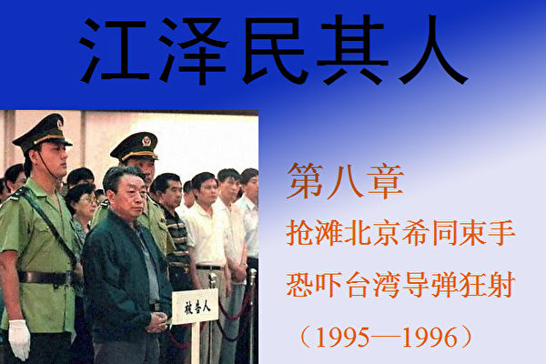</td>

【大纪元6月7日讯】十四届四中全会宣布中共第二代领导集体向第三代移交权力的工作已经全部完成。当时邓小平的健康每况愈下。十四大上让多年的铁杆支持者杨家将兄弟退出军队核心，更是邓小平自毁长城之举。江泽民最怕的就是军队不跟他这个没摸过枪的军委主席走。如今，一方面元老们风烛残年，另一方面在军队中江泽民也逐步有了亲信，江泽民开始盘算著把矛头指向北京市这个重要的政治滩头阵地了。

北京市是权力斗争的必争之地。如果不能把北京卫戍区、北京市委市政府和中央警卫团的权力牢牢抓在手里，中共的最高领导人就毫无安全感可言。文革前毛泽东已经被捧上了神坛，然而北京市市委书记彭真就是敢让《人民日报》、《北京日报》和《光明日报》拒不转载姚文元的《评新编历史剧〈海瑞罢官〉》，令毛泽东不得不在上海出姚文元的单行本，并称北京是“针插不进，水泼不进”的独立王国。“文化大革命”全面铺开是在1966年5月16日，其先行动作则是于1966年3月底将当时的北京市委书记彭真和中宣部部长陆定一解职。即使对毛泽东这样“一句顶一万句”的党主席来说，要干大事也必须先掌控北京。因此，江泽民十分急于拿下北京。

<b>1﹒与陈希同结怨</b>

在干部选拔上，江泽民只有一个原则，就是对他不效忠的人都不用。这样一来，其政绩可想而知。陈希同在北京当市长和市委书记期间，北京成功举办了亚运会，打通了二环路和三环路，北京市的面貌改观很多。相比之下，江泽民在上海执政期间，不仅毫无业绩，相反，他上台仅两年上海就发生“菜篮子危机”，以至于邓小平不得不把能干的朱镕基调往上海补漏。在“六四”问题上，陈希同一直抱着敢做敢当的态度，而不是象江泽民这样一会儿镇压《导报》，态度强硬，一会儿又想向赵紫阳做深刻检讨，承认不该镇压。陈希同因此认为自己维护江山有功，至少在政治局委员的位置上应该再上层楼，谁料想却被江泽民捡了个现成便宜，心理自然十分不平衡。此外陈希同与邓小平的关系非常好，在1992年邓视察首钢的时候公开宣称陈是改革派，这些都给了陈看不起江泽民的本钱。因此，江泽民要想控制北京，要解决的最大问题就是陈希同。

江泽民好出风头，嫉恨心又强。对于看不起他的人，心胸狭窄的江是一定会报复的。对于陈希同，江泽民一直又恨又怕。江泽民尤其感到不能容忍的还有几件事。

第一件事，就是陈希同宴请赵紫阳的追随者胡启立。

江泽民当了儿皇帝之后，凡是跟着赵紫阳的人马都遭到了江不遗余力的清洗。对于江泽民来说，否定赵紫阳越彻底，江泽民的宝座就越有合法性。这种否定早已到了完全罔顾事实的地步。江泽民“当选”总书记的当天，就表示要挽回赵紫阳造成的“损失”，而绝口不提赵紫阳当总理和总书记期间为中国经济和政治体制改革所做的贡献。

江泽民深知赵紫阳在老百姓心目中的地位。在“镇压”的问题上，赵紫阳的表现迥异于各位政治元老，甚至是各级党员，这使赵紫阳身上笼罩着为民请命而不顾个人安危的光环。而在赵紫阳当政期间，中国国民生产总值迅速增长和居民生活水平的大幅度改善，也不能不使民众对赵深怀感激。无论从民心、资历，还是政绩上考察，一旦邓小平让赵紫阳复出，江泽民从赵紫阳手中窃取的权力如何还能保得住？

江在上台后高举“反和平演变”的大旗，对于改革派以及与赵紫阳关系密切的人进行整肃。此时，陈希同偏偏“逆流而动”。

当时随着赵紫阳下台的还有政治局常委胡启立和中央书记处书记芮杏文，这三位是因“六四”下台的级别最高的党和国家领导人。陈希同却并不避讳，秘密安排了胡启立与万里会面，地点就在首都宾馆。陈不但出面作陪，还到宾馆门口亲自迎接胡启立。

无巧不能成书，陈希同自以为安排得天衣无缝时，没想到被日本人捅了漏子。那天傍晚，正好有几家日本电视台和报社的驻京记者也去宾馆的日本餐厅聚会，其中一位走错了路，进了陈希同的包间，亲眼见到胡启立、万里与陈希同觥筹交错。陈希同当时以为闯进来的是日本商人，就没有理会，结果第二天那个日本记者就写了篇报道发表在日本报纸上。第三天，新华社内参又以《国内动态清样》形式，将消息递送到江泽民那里。这让江又惊又怒。江泽民惊的是，陈希同本来就资历甚深，能力颇强，现在居然和胡启立走在一起。江一时拿不准邓小平是否属意胡启立复出，并为重新起用赵紫阳打铺垫。江泽民怒的是，陈希同竟然背着江和江最忌讳的赵氏人马搞在一起，显然是故意跟江为敌。江泽民立即下令由中纪委出面调查。首都宾馆负责人证实此事后，江亲自给陈希同打电话，指责陈“丧失立场”，陈推说是应万里的要求，自己不能不办。

江不敢得罪万里，只能自己生闷气。后来，邓小平亲自下令让胡启立复出，印证了万里与赵系人马关系密切。江泽民最怕赵系东山再起，因此对陈希同愤恨不已。

旧恨未去，又添新仇。邓小平1992年春天南巡，陈希同早已知道邓小平力主继续并深化改革。陈在当时北京电视台的节目间隙不断打出深化改革的标语口号，利用各种场合发表改革言论，这都让投靠陈云和李先念等左派元老的江泽民十分不快。为了避免邓小平对江泽民不满的消息透过媒体泄露给民众，江泽民指令中央级报刊对邓南巡的报导，要遵循中宣部“统一报导口径”，不准擅自行动。

不料陈希同又先行了一步，他要求北京市委机关报《北京日报》“尽快对小平同志南方讲话精神作出反应”。在陈的授意下，《北京日报》全文转载了深圳报纸上关于邓小平南方讲话的内容，比《人民日报》还早了一天，令江泽民十分被动。在江泽民看来，陈的改革言论和表现，更凸显江的僵化和保守。江泽民对陈希同的痛恨又加深了一层。

不久以后，时任首钢董事长的周冠五又与陈希同等人安排邓小平视查首钢，当时的中央政治局常委居然没有一人到场。邓小平当着首钢众多干部、工人的面说，我最近说的话有人听有人不听，北京市已经行动起来了，但中央一级还有人顶着不办。邓随后要求陈希同“给中央带话”，“谁反对十三大路线谁就下台。”这些话当时在江泽民听来简直如五雷轰顶。

江泽民听得背后直冒冷汗，通过中央办公厅责问陈希同为什么事先不向江泽民通报邓的巡视时间。陈反驳说中办应该向邓办了解邓的活动安排，而不应向北京市发难。江泽民受到顶撞后更是怒气冲天，气恨不已，从此更下定了倒陈的决心。

当年陈希同任北京市长的时候，江泽民是上海市委书记。但是做为京官，陈希同的消息要比江泽民灵通得多，江泽民也知道陈与邓小平、李鹏关系非常好，所以那时每次见到陈希同，都笑得很谄媚。在当总书记的最初两年，江泽民还算是夹着尾巴做人，至少对李鹏还很尊重，但在十四大倒杨成功后，江泽民的尾巴是一天比一天翘得高了。

陈希同是眼看着江泽民的这种变化的，也知道因为胡启立事件以及南巡事件，江泽民和他结下了梁子。根据陈希同的观察，江泽民绝对是一个睚眦必报的人，江在1986年上海学潮后对那些敢于挑战他的学生进行秋后算账之事，陈也颇有所闻。既然得罪了江，出于自己安全的考虑，陈希同希望趁著邓小平还活着，把江泽民拉下马。

于是陈希同在1995年初联合了七个省委，给邓小平写联名信举报江泽民。这封信的内容外界并不知情，邓看后没有发表意见，却把信交给了薄一波处理。“六四”之前，八大元老在商量赵紫阳的接班人问题时，邓是想让李瑞环或者乔石上的，薄一波当时极力推荐江泽民。邓小平也是年事已高，没有精力再换一茬总书记，否则在1992年南巡后就会动手，但是他把信交给薄一波，也是想让薄一波看一看他推荐的江泽民是个什么货色。

薄一波是整人能手，惯于投机钻营，过河拆桥，落井下石，在高层里口碑甚差。其中有一件事最说明问题。1979年给薄一波平反出狱的是胡耀邦，当年中共十一届四中全会上，使薄一波增选为中央委员、后任国务院副总理、国务委员、中顾委副主任的还是胡耀邦，但1987年1月15日薄一波主持政治局扩大会议，力主让胡耀邦下台。

薄一波看到陈希同这封检举信，不但不想继续往下追究江泽民的问题，相反还暗自高兴抓住了江的把柄，因为这就等于抓住了江的权力，可以好好利用和要挟江，为儿子薄熙来和亲信等加官晋爵。

于是薄一波把江泽民叫来，一言不发亲自把信递过去。江看过举报信内容后，脸色发青、一身冷汗、战栗不已，当场哀求薄一波在邓小平面前为他美言，保住自己总书记的职位。薄一波表示尽力而为，并授意江要想以后不节外生枝，就必须把陈希同搞倒，做法上可以先从陈希同的周围下手。江泽民点头如捣蒜，连连称是。薄熙来日后飞黄腾达，全靠其父薄一波与江泽民的这层特别关系。

<b>2﹒扳倒陈希同</b>

1994年年底的十四届四中全会，邓小平权力的无保留移交使江泽民认为倒陈的时机已经成熟，只缺一个机会。1995年初的举报事件，更让江感到必须立刻动手。

曾庆红给江泽民出主意，在元老凋零之后，他们的子女会拉帮结派，或许对江的权力也是威胁。但这并不足为虑，因为这些太子党们忙着钻政策的空子发大财，只要祭起“反腐败”的大旗，太子党为了躲过公、检、法和中纪委的大刀，就不得不向江泽民表示效忠。

江泽民本来准备让江绵恒、江绵康两兄弟以及江自己的七大姑、八大姨和八杆子内打得着的亲戚们在十四大之后都进入中央部委或成为地方大员以维系自己的权力基础。现在考虑到要用“反腐败”的名义清理政敌，只好让他们先等一等。待到政敌清理完毕，“反腐”告一段落的时候，空出的一些位子正好让自己的亲戚拾遗补缺。

江打好如意算盘，就决定按照薄一波的建议，先从北京的副市长下手。经过一番精密的盘算，江泽民把枪口对准了王宝森。

1995年，首钢前董事长周冠五因经济问题下台，其子周北方也被捕入狱。北京市秘书集团受贿案被曝光，副市长王宝森在同年4月死在了北京近郊怀柔县一个叫崎峰茶的山上，官方的口径是王吞枪自杀。而实际上从现场的脚印、创口、火药、弹壳等线索可以看出：王是他杀而非自杀。一个明显的证据是：现场只找到了子弹头，而子弹壳是干警们用探雷器找到的，该子弹壳已经被踩入土里。王死的地方人迹罕至，事发后又保护了现场，弹壳被“踩入土里”只能说明王死的时候身边有人。据国安内部消息透露，这个人就是江泽民派的国安特工。

王宝森的死使陈希同慌了手脚。按照中共官场的规矩，什么能够报道什么不能报道，完全取决于最高领导人的喜好。然而王宝森的死既然通过中央电视台大播特播，这预示著权力斗争的风暴拉开了序幕。而周北方被判刑，让邓小平也不得不为自己考虑后事，如果与江交恶，邓家的后代也可能会成为被江整肃的对象。陈希同见自己的举报信送上去几个月，江泽民竟然还在台上，说明邓小平无意换马。至此，陈终于知道自己是在劫难逃了。

江泽民费了九牛二虎之力，最后搞出的证据也不过是陈希同“自1991年7月至1994年11月，在对外交往中接受贵重礼物22件（其中金银制品8件，贵重手表6只，名贵水笔4支，照相机3架，摄像机1台），共计价值人民币55．5万余元”（新华社北京1998年7月31日电）。这对于政治局委员这个级别的领导人来说，实在算不了什么，甚至可以说相当清廉了。陈希同为此锒铛入狱，因贪污罪被判13年，因玩忽职守罪被判4年，两罪并罚共计有期徒刑16年。

2003年底，陈希同因为患膀胱癌而保外就医。出狱后，陈写了五万字的申诉书，指控江泽民对他的政治迫害，称自己是权力斗争的牺牲品，并举报江泽民父子的经济犯罪问题。陈说他曾与江泽民合伙做生意，江泽民儿子江绵恒非法转移国有资产涉金额1500万元人民币。这也许只是陈可以透露给媒体的东西，隐藏的内幕只能等到陈可以自由发言的时候才有可能披露更多。

不过中共“反腐败”是为了权力斗争，如今在中国已经是尽人皆知的事情。看看现在高高坐在台上的大贪贾庆林、黄菊、陈良宇等人无一不是劣迹斑斑。中共的腐败，早已深入整个系统从上到下的每一细胞。

<b>3﹒台海危机</b>

1996年新年刚过，台海危机爆发。

3月23日，台湾举行了第一次民主大选。总统候选人除了有李登辉之外，还有无党籍人士陈履安和林洋港，以及民进党候选人彭明敏。

江泽民对台湾的选举十分担心，害怕台湾民主选举的声浪会影响到国内民众的民主诉求。为了无限期拖后民主选举，以江泽民为代表的中共常常抛出“国情论”、“素质论”和“中国传统文化不适合选举”等谬论。台湾与中国大陆同文同种，血脉相连。台湾的大选一旦成功，等于是用行动否定了中共有关大陆不能实行民主的托辞，这怎么能不让江泽民这个未经选举而窃据王位的独裁者忧心如焚？

江泽民在1995年年初的时候曾经提出过《为促进祖国统一大业的完成而继续奋斗》的讲话，外界称之为“江八点”。可以说，“江八点”了无新意。当时两岸关系并不紧张，香港回归在即，江泽民当然希望在两岸关系上有所作为，这样他的贡献就可以写入史书了。但江泽民在外交、治国方面是个平庸无能之辈，毫无制度创新能力，没有那个金刚钻，还想揽那个瓷器活，结果自然是糟蹋了名器，还差点闹出战争来。

自1988年李登辉接任总统之后，一直推行务实外交，比如1989年的新加坡“度假之旅”，在1994年对菲律宾、印尼和泰国的访问，都让江泽民对李登辉推动台湾获得国际承认的意图深具戒心。江泽民感到最不能容忍的是，李登辉以私人身份于1995年5月访问母校康奈尔大学，美国政府在国会两院的压力下批准了李登辉的旅行。李在康奈尔大学发表了“民之所欲，常在我心”的演说，表达他的民主思想。如今，李登辉更进一步，准备在台湾举办第一次大选，在老军头们的鼓动下，江泽民决定还以颜色。

在军事演习的问题上，江泽民相当慎重。因为他是一个从来没有摸过枪，没有指挥过任何一场战斗、更别说战役、会战或决战的军委主席。对于军事指挥，江泽民完全外行，他最大的“建军思想”，恐怕就是“讲政治”，也就是让军队永远听他的指挥。面对军方的压力，江泽民需要指定一个人作为全权指挥，这个人必须是江的铁杆心腹，于是江想到了军委副主席张万年。

<b>4﹒江泽民的军中代理人</b>

张万年的提升非常有戏剧性。1992年当江泽民视察济南军区的时候，张万年还是济南军区的司令员。他不失时机地向江泽民表忠心，高喊坚决“拥护以江泽民为核心的党中央和中央军委”。言下之意，江泽民不但是党中央的核心，也是中央军委的核心。

当时，江泽民党内地位还不稳，急需在军队中培养亲信。虽然江泽民与张爱萍关系密切，而且以张爱萍为首的三野军人不喜欢杨家将，但是他们未必就会喜欢江泽民，更何况江见到所谓“养父”的上级们只能以晚辈面目出现，无法颐指气使。只有真正能够听命于江泽民的军人，才能成为江在军中的代理人。

张的口号让江泽民大喜过望。回到北京后，江泽民马上把张万年调到了中央军委，任总参谋长，1993年又给了张万年一个上将军衔。张万年果然努力，当着江泽民的面，在总参大院中指挥全体机关干部高声合唱《枪杆子永远听党指挥》。江泽民听了十分受用，因为这就等于是说“枪杆子永远听江主席指挥”。

张万年的马屁路线一击奏效，后来人有样学样，也斩获颇丰。其中一个是于永波。于处处对江泽民拍马奉承，在1992年被江任命为总政治部主任。1993年，江泽民也册封于永波为上将。2001年初，江泽民在中南海怀仁堂宴请解放军高级将领，于永波在席间高呼“江主席万岁”，一时被传为笑谈。

另一个马屁专家是郭伯雄。1992年郭伯雄还是47军军长，少将军衔。九十年代初，有一天江到陕西视察，顺便去了47军。江中午饱餐后要睡个午觉，郭伯雄一看机会难得，赶紧把战士轰走，亲自在门外站岗。江泽民这一觉睡了两个钟头，郭伯雄在外面百无聊赖，但连厕所也不敢去，怕江随时醒来，就功亏一篑了。江睡醒后一推门，猛然看见一卫兵笔挺地立在门前，甚为满意，但也有些奇怪，这兵咋这么老啊？定睛一看，原来是47军少将军长郭伯雄！

江泽民到哪个军也没享受过军长站岗的待遇，对郭顿生好感。于是郭伯雄从47军军长，调到了北京军区任副司令员，随后连升三级，当了中央军委的副主席，也混了一副上将的肩章。

面对这样的军委主席，这样的马屁将军，李登辉自然不会把中共的军事威胁放在心上。

<b>5﹒军事演习</b>

中共一共举行了三次军事演习，一次是1995年8月15-25日的东海飞弹试射，距离北台湾90哩。为了影响台湾1995年12月2日立法委员选举，中共在11月15-25日于东山岛举行海军与两栖军事演习。1996年初，中共已经将其他区域的兵力，移防部署于面对台湾的沿海区域。

中共的频繁演习和军事调动，使美国认为事态严重。2月下旬，美国中央情报局局长杜奇（John Deutch）重提担心中共军事演习会导致“错误的估算或非蓄意的意外事件”。

中共军方最初的部署是实弹射击、越过海峡中线、动用潜舰、攻占外岛。整个演习的预算，解放军编列了40亿人民币以上，规模惊人。然而克林顿政府向中共传达了“非常明确且毫不含糊”的意见，称导弹演习是草率鲁莽的决定，并警告中共说“如果演习出现问题，会造成不可预计的后果”。同时，美方派出“独立号”和“尼米兹号”两个航空母舰战斗群，在台海附近游弋。

江泽民知道军方强硬派绝不会甘心放弃演习计划，但是江自己却不敢真的和美国搞僵。他更害怕冲突一起，军方乘机坐大，自己这个军委主席到时候就成了空头主席了。

江泽民于是抬出了邓小平“韬光养晦”的教导，并提出三点主张：导弹不飞越台湾本岛、战机和军舰不过海峡中线、不占外岛。

政治局扩大会议的决定，被当时台湾策反的解放军少将刘连昆报告给李登辉。李登辉为稳定岛内民心，公开称“共军打的都是空包弹，天一下雨就点不着了”。后来到1998年两名台湾军情局官员叛逃北京，所抖出来的情报导致1999年刘连昆东窗事发被逮捕和处决。

<b>6﹒江泽民做秀</b>

1995年底，江泽民在视察北京的时候提出了“三讲”。这算是江泽民的第一个“理论”发明。“三讲”中，江泽民讲得最多的就是“讲政治”。江自己的解释是“讲政治，包括政治方向、政治立场、政治纪律、政治鉴别力、政治敏锐性”。

“三讲”实际上是江泽民树立个人权威的一种途径，所谓“讲政治”，无非就是“坚持共产党的领导”，也就是坚持“党的核心”江泽民的领导。当时邓小平还没有死，江泽民的地位远远没有达到固若金汤的地步，所以“三讲”提出之后，应者寥寥，远远没有象另外一件事那样，在全世界引起轰动。

这件事情，就是江泽民梳头。

江泽民在1996年6月下旬去西班牙访问。西班牙国王卡洛斯请江泽民一起检阅三军仪仗队。令卡洛斯吃惊的是，江泽民居然在这个时候，突然拿出一把梳子，在国王面前梳理头发。晚上在欢迎国宴上，江泽民坐在王后右侧，再次在摄像机面前梳头。6月25日，西班牙第一大报《国家日报》和其它许多报纸以头版头条刊出新闻图片:《卡洛斯国王看江泽民梳头》。很快，全球多家报纸进行了转载。许多海外华侨看后顿觉炎黄子孙颜面尽失。

卡洛斯显然很不习惯江泽民这种完全不顾外交礼节的动作，奇怪的是外交部礼宾司却从来没有对江的这种恶心表演提出过异议。

江泽民在电视镜头前梳头有许多次记录。1993年3月，北京召开全国人大会议时，江泽民坐在主席台中央，拿起梳子旁若无人、专心致志的梳头。法新社曾把这张照片传遍了全世界。1995年10月24日，江泽民在联合国“世纪宝鼎”前演说，面对世界各国的摄影记者，又一次从西装内侧口袋中拿起梳子梳头。

江泽民被人称为“戏子”，他每次出访几乎都是一场场的文艺演出，而不是外交会谈。1996年，江泽民出访菲律宾，主动提出放弃南沙群岛的主权争议，共同进行经济开发。当晚，菲律宾总统拉莫斯在游艇上宴请江泽民。江泽民想起了他刚刚见过的参议员阿罗约（阿罗约后来在2001年当选为菲律宾总统，被其国民称为“美女总统”），意犹未尽，拿起麦克风高歌了一曲猫王的《温柔地爱我》（Love me tender）。

江泽民的“做秀”热情常常到了令人吃惊的程度。他可以不分时间场合地吟诗赋词、引吭高歌、卖弄英语。2000年江泽民在纽约华尔道夫酒店会见华侨时，当一位华侨问中国西部开发计划时，江泽民突然从口中冒出两句唐诗，他对华侨说：“劝君更尽一杯酒，西出阳关无故人。”当另一位华侨问他是否退休时，他则高声吟诗“我欲乘风归去”。江泽民在访美时，还莫名其妙地在克林顿总统前用英文背诵林肯的一段演说词。1999年江泽民去法国之前先到英国访问。他说：这里空气很好，到处都是natural gas。他大概想说空气很自然，但用的词却是“天然气”，而“natural gas”在英文俚语中是“放屁”的意思。第二天就有中文报纸撰文取笑他。其实早在任上海市长期间，江就出过这样的洋相。有一次陪同外宾去公园游览，江想向外宾显示上海很开放，年轻人敢在公园里公开谈恋爱了，就用手指著说，他们在“make love”（意指做爱），让在场的外国人听了目瞪口呆。

1999年10月24日，江泽民在法国参观一座博物馆时，一时兴起，乘法国总统希拉克不备，拉起希拉克夫人贝娜黛特的手就跳起华尔兹舞来。希拉克正在诧异时，江泽民又拉着贝娜黛特的手仰头大笑。这件事让希拉克非常不悦，认为是给自己难堪。而法国民众更义愤填膺，认为是对整个法兰西民族的侮辱。

2000年4月19日江泽民访问土耳其时，土耳其总统德米雷尔向江授国家勋章。众所周知，在这样的场合，按正常礼仪应该由主人给江戴上勋章。不料江泽民却抢先一步，拿起勋章自己戴上了，令在场宾主目瞪口呆。

2002年2月21日，江泽民在人民大会堂设宴欢迎美国总统布什。江泽民当着在场百余名嘉宾高歌一曲“我的太阳”，美国总统布什马上鼓掌，并接着半开玩笑地请国务卿鲍尔唱一首小夜曲，鲍尔礼貌地微笑拒绝。晚宴中，江泽民又拉着美国第一夫人劳拉跳舞，跳完之后仍未尽兴的江又先后拉着美国国家安全顾问莱斯及驻北京大使夫人莎拉共舞。2002年，江泽民去冰岛的时候，更是出了个巨大的洋相。在国宴上吃着半截饭，江泽民突然站起来高歌一曲，在场宾主都错愕不已。王冶坪当时的面部表情十分尴尬，整个情景被冰岛最大的日报以大幅彩色照片详细报道。

一个国家主席出访外国是有外交礼仪和尊严的。这个尊严不是属于其个人的，而是属于国家的。如果江泽民不在国家主席之位，那么他如何去取悦于外国元首，人们都不会在意的，因为这时他不过是外国元首的座前弄臣而已。但是当江泽民以中国国家元首身份出访时，那么其不顾外交礼仪地做秀就不仅是其个人出丑，也令国家和民族在世界舞台上丧失了尊严。

<b>7﹒法轮功的飞速发展</b>

在1995年到1996年，民间修炼法轮功的人数呈指数型增长。短短几年的时间里，修炼者就增加到两千万人以上，而且继续增长的势头仍十分迅猛。

法轮功的创始人李洪志先生1951年5月13日出生于吉林省公主岭的一个普通知识份子家庭，曾经参过军，1982年转业到长春市的一家粮油公司工作。李先生从童年起即修炼佛家独传大法，1984年开始把独修单传的大法改编为适合普及的气功，叫做法轮功，1992年5月13日开始在长春公开传功讲法。

李先生在粮油公司工作的时候，仅仅是一个普通的职员，那时候他和家人住在单位的宿舍楼里，条件也十分简陋。据去过李先生家里的学员讲，屋里的陈设十分简单，楼道里也没有灯。在刚刚开始传法的时候，李先生带着几个弟子，条件非常艰苦。在他第一次到达北京时，没有人知道他们是谁。他们在拥挤的北京火车站度过了抵京后最初的几个夜晚，在那里吃东西并夜宿在长凳上。

从1992年到1994年这两年多的时间里，李先生在全国共开设了54次讲法传功的学习班，每次大约八到十天。这样他为了赶去办班而奔波于中国多个城市之间，常常连火车硬座都坐不上，累了，只能席地而坐﹔饿了，方便面充饥﹔困了，就倚靠在座椅边或者车厢壁打个盹。为了让更多的人能在法轮功中受益，李先生办班的收费标准当时在全国是最低的，一个10天的气功学习班，仅收费40元，只相当其他气功师的二分之一到三分之一。因为收费太低，与其他气功师办班的收费标准反差很大，很多气功师对此都有意见。为此，中国气功科学研究会曾多次要求李先生提高学费，但李先生为照顾学员的经济能力始终没有答应。

李洪志先生1992年传功讲法的时候，中国气功师多如牛毛，真伪俱在，鱼龙混杂。虽有许多人从太极拳、五禽戏等传统功法中获得了身体的健康，但上了假气功师的当、花了冤枉钱却治不好病的也不在少数。法轮功一开始就从千百门气功功法中脱颖而出，这与此功法祛病健身的奇效是分不开的。

1992年9月，法轮功被确定为中国气功科研会的直属功派。同年12月，李先生率领弟子出席了在北京国贸大厦举办的东方健康博览会。李先生的名字和法轮功不胫而走，引起了不小的轰动。博览会总指挥李如松先生和总顾问姜学贵教授对李先生的功力和法轮功的贡献，给予了极高评价。姜教授说：“李洪志先生可以说是92年东方健康博览会的一颗明星。我看到李老师为这次博览创造了很多奇迹：看到那些拄著拐棍，乘着轮椅和各种行动不便的病人，经李老师的调治，就能奇迹般地站立行走了。我作为博览会总顾问，负责地向大家推荐法轮功，我认为这个功法的确会给人们带来健康的身体和新的精神风貌。”

1993年8月31日，中国公安部所属中华见义勇为基金会致信中国气功科学研究会，感谢李洪志先生为全国第三届见义勇为先进分子表彰大会代表免费提供康复治疗。1993年9月21日，中国公安部主办的《人民公安报》刊登报导《法轮功为见义勇为先进分子提供康复治疗》，称公安部见义勇为先进分子“经调治后普遍收到了非常好的效果”。

随着法轮功的传播，在法轮功修炼中身心受益的人无计其数，很多人从疑难绝症中康复。而法轮功创始人李洪志先生也被尊称为李大师，在北京几乎家喻户晓，老少皆知。一个人从沉疴顽疾、甚至绝症中痊愈，必然会带动他的亲朋好友都来炼功，这种人传人的传播方式是极其迅速的。

法轮功真正对人的改变还不仅仅是身体层面的，而是以“真、善、忍”为原则，指导人如何做好人，全面净化心灵，并向更高层次迈进。随着中国的经济市场化开始日益普及和深入，对利益的强烈追求导致社会道德急速下滑。也正是在这样的环境中，这些修炼“真、善、忍”的人们，格外感到法轮功的珍贵。法轮功在社会上广传，对各阶层修炼者的影响是巨大的，这不仅包括身体方面，也包括道德和精神层面的影响。这从1999年镇压前的媒体报道也可见一斑。

《大连日报》1997年3月17日登了一篇文章《无名老者默默奉献》，报导一位名叫盛礼剑的古稀老人，利用一年时间，默默为村民修了4条路，全长约1100米，当人们问他是哪个单位、给多少钱时，老人说：“我是学法轮功的，为大伙儿做点好事不要钱”。

《大连晚报》1998年2月21日报导了大连海军舰艇学院学员袁红存。2月14日下午，袁红存从大连自由河冰下3米救出1名掉进冰窟窿的儿童，被称为“活着的罗盛教”，学院为他荣记二等功。当时袁红存已经修炼法轮功2年。

《中国经济时报》1998年7月10日刊载《我站起来了》一文。该文介绍一个叫谢秀芬的人，曾被北京301医院诊断为脊椎损伤半截瘫，卧床16年，修炼法轮功后恢复行走。

《羊城晚报》1998年11月10日登载一则摄影报道，题目是《老少皆练法轮功》。报道中说，8日早上，广东省体委武术协会有关领导到广州烈士陵园等处，观看了5000法轮功爱好者的大型晨练活动。体委的同志现场询问了几位法轮功的受益者，他们的修炼故事非常感人。其中有一位“原患高位瘫痪，全身70%部位麻木失灵，大小便失禁”，现见她“红光满面，练功的动作灵活自如”，该报道配发了93岁老人和2岁小孩练法轮功的照片，并介绍说，目前广东有近25万人修炼法轮功，法轮功强调传功不收费，义务教功。

……

江泽民在1999年镇压法轮功时，声称从来没有听说过法轮功。其实江泽民早在1993年就听说了法轮功的神奇，特别是中共退休的高官们都特别注意保养身体，开始炼法轮功的人也相当多。王冶坪早就在炼法轮功了，而且江泽民本人还看过《转法轮》。不过江最感兴趣的并不是治病。江泽民想通过享誉京城的李大师了解自己的前世，预测自己的政治前途，看看谁对自己忠心，谁是自己的政敌，仕途上是否还有大难，用何种办法可以保住权位等等。

1993年夏，江两次派人找到李洪志先生商谈，要求见面。李洪志先生明白其心思，回复道：治病可以，不谈政治。来人习惯于别人迎合自己，一听李洪志先生的答复，感到又惊又失望：惊的是这位李大师到底是不一般，把江泽民的心思都看穿了；失望的是李大师与以往其他气功师的攀附反应完全不同，自己不一定能捞著什么好处，因此对李洪志先生与江泽民的会面采取消极态度。

拖了些日子，外界对李大师的好评又勾起了江想见面的欲望。这次双方在两星期前就约定好了时间，但最后一刻那人觉得自己没得到实惠，又担心江泽民提出的问题李先生不回答，闹出尴尬来，于是跑到江面前编造了好些见面不如不见的理由，江在前一天临时取消了会见。

1995年，李先生结束了在国内传功讲法。是年初李先生赴巴黎传法，与当时中国驻法国大使等使馆官员进行了小范围会面，并应邀在中华人民共和国驻法兰西共和国使馆文化处举行了一场讲法报告会。随后李先生又去了瑞典和美国，法轮功由此开始弘传世界各地。

而在中国，自1996年1月起，《转法轮》一书被《北京青年报》列入北京十大畅销书，并一直处于畅销书排行榜的前列。

<h1 align="center"><b>《江泽民其人》九：小平去世乔石下台</b></h1>
<H3><b>第九章：小平去世乔石下台 飞扬跋扈唯我独裁（1997）</b>
</h3>
<td align="center">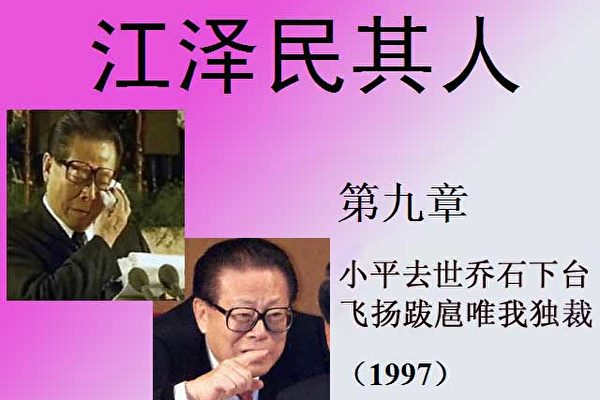</td>

【大纪元6月8日讯】<b>1﹒邓小平去世</b>

1997年是中共高层政坛上非常重要的一年。

1993年12月，邓小平在上海杨浦大桥亮相，接着在农历除夕出现在电视上，这是邓去世前的最后一次公开亮相。邓小平衰老的神情不但令香港股市立即一泻千里，而且令中共党内与之关系密切的人也神经绷紧。

江并不能随意见到邓小平，有事都由邓办通知，所以邓这次亮相让江泽民感到快熬出头了，头上的紧箍咒已经松动。江泽民和曾庆红常常研究如何进一步站稳脚跟，他们发现，只是安排自己人马抢夺地盘还不够，还要全方位收买人心。在随后的几年里，江泽民用各种腐败方法拉帮结派换取高官们的忠心。江泽民发现腐败还有一妙用，不效忠自己的就采用“反腐败”的办法清除，这种办法在江泽民后来打击政敌时被派上大用场。

不过，只要邓小平还活着，江泽民就心存顾忌。1996年12月，多年身患帕金森综合症的邓小平，因病情加重，住进了医院。两个月过去了，令江失望的是邓小平还是没有咽下最后一口气。江泽民焦急的是如果邓拖拖拉拉不走，弄不好病情又有了转机。等待的日子对江泽民来说是一种极其痛苦的折磨。

1997年2月19日21时08分，邓小平病逝。

江泽民的人马迅即以“中共中央、全国人大常委会、国务院、全国政协和中央军事委员会”的名义发表了《告全党全军全国各族人民书》，声称“以江泽民同志为核心的党中央”一定能把邓小平开创的改革开放坚持下去。

在邓小平遗体告别仪式上，为了掩饰自己的内心世界，江泽民发言时还是尽量让自己的声音显得悲切。为增强效果，江泽民特意挤出了眼泪。但了解内情的人都知道江真实的心态是怎么回事。那张江泽民抹眼泪的图片，到今天还时不时地被人拿出来当笑料。

追悼会结束两天后，军队和武警部队全体指战员被要求学习江泽民所致的悼词，军官们被要求“绝对与以江泽民为核心的党中央保持完全一致”。2月25日《人民日报》发表社论，“以江泽民为核心的党中央”的词句出现达九次之多。

<b>2﹒忌恨乔石</b>

这时被江泽民曾庆红搞下台的杨尚昆已经九十一岁了——但他还活着﹔其弟杨白冰虽然失去军权但并不等于没有兵权。这都使江泽民心中不安。但事情总得一步一步地来，江泽民感觉当务之急是搞掉乔石。

乔石1924年12月生于上海，十六岁时加入中国共产党，组织过上海学生运动。1945至1949年任上海同济大学地下党总支书记、上海地下党学委总交通、上海地下党新市区委副书记和上海市北一区学委书记。而那段时间，江泽民还正处于彷徨不可终日当中。中共建政后乔石从基层做起，1982年成为中共中央对外联络部部长和中共中央书记处候补书记。后来历任中办主任、中组部部长、国务院副总理、中纪委书记、中共中央党校校长等。1993年至1998年任第八届全国人大常委会委员长、政治局常委。党内象他这样从学运到工业系统，从对外联络到主管组织、情报、纪律，最后进入最高决策层的人，别说长期身处下位的江泽民，即使李鹏这些货真价实的烈士子弟，甚至连老一代的杨尚昆、薄一波等都无法相比。

显然，论资历、才干，江泽民无法把自己和乔石并列。凭著江的察言观色，他来到北京后很快发现，乔石是两派元老邓小平和陈云都非常看好的人选。中央机关的人们也常常说乔石是凭真本事上来的，这让江泽民认为是故意在暗示他江某人的无能，心里不由对乔石充满忌恨。其实乔石在1985年就与胡启立一起被党内大老们内定为接班人，他稳健踏实和敏锐果敢的特点得到了元老们的赏识。“六四”时，邓小平对总书记赵紫阳失望之余，考虑接替的人选里就有乔石。

江知道自己的地位远不如乔石。乔石背后是彭真、万里的政法系统、人大委员会。更让江泽民难以下咽的是，乔石的口碑和内外形象很好。乔在选入高层之初，被改革派和保守派的元老同时看中，十三大被内定为政治接班人。在中共“十四大”上，以316票高票当选政治局委员，只差一票便获得全票──因为妒忌心极强的江泽民没有投他。

北京圈子里有“江落石出”的说法，表明人们希望江泽民下台、让乔石上来的愿望，这让江泽民想起来就恼火。在杨家兄弟倒台之前，江泽民每天提心吊胆，因为不仅所有人知道，连他自己也很清楚，坐上中共第一把交椅，与其说是邓小平的提拔，不如说是老家伙们妥协的结果。邓小平虽然同意，但犹犹豫豫，几次要把他撤下来。真正欣赏自己的李先念也不是因为他政绩高，而是他把李侍候得好。

江泽民望着桌上的那张1989年6月21日拍下的照片，那是十三届四中全会提上来的六个常委合影，江泽民、李鹏，乔石，宋平、李瑞环，姚依林，中间则是当时的军委副主席杨尚昆。邓的意图非常明显，杨尚昆是邓小平意图的执行者，而江泽民不过是吃烤鸭时旁边的那盘小红萝卜，有没有都无关大局。

现在，执行邓小平意图的杨家将被搞下去了，邓也过世了，这让江的胆子壮了起来。他认为，邓小平去世以后，自己职位最高，大家应该向“核心”靠拢才对﹔而乔石似乎不买自己的账，看见不对的该指责还指责，该批评还批评。这让江泽民胃里好象老有个消化不了的东西，愤恨不已。

江泽民从上海发迹，当上海市委书记时搞的那个“上海帮”早就臭名在外。江有了党政军大权后更是见缝插针安插“上海帮”。为此，邓小平不止一次提出批评，乔石也在政治局提出选拔干部要讲五湖四海，虽然乔石没有点名，但在座的人都把眼光扫向江泽民。

邓去世后一个月，《德国商报》采访了乔石，曾庆红马上找人翻译成中文后送给江泽民。曾庆红神秘地说：“乔石同志除了继续谈法制和人大外，还对这个德国记者强调了一件事”，他故意停了一下，看到江有些发急时才继续，“他说，主要还是要‘反左’。”江泽民惊愕地重复了一句“反左？” 他不由地想起邓小平南巡时自己差点下台的险情。

1995年3月9日，乔石在接受中央电视台采访时表示，市场经济是法制经济，经济立法是各项立法的重点，应在一年内完成。人大副委员长田纪云也呼应说，人大代表应有选择候选人的权力，政府新政策应向人民公开说明。乔石还在八届人大三次会议上呼吁：一切国家公务员都是人民的公仆，决不是骑在人民头上的老爷。要从制度上着手，切实加强廉政建设，最根本要靠法制。乔石的句句讲话都让江耿耿于怀。

邓小平去世、杨尚昆、杨白冰兄弟倒台后，江泽民心头的大石落了地。乔石坚持法制的主张就成了江泽民心中另一个挥之不去的心结。打发乔石在十五大退休，成为江的下一步棋。

于是江泽民再一次与薄一波做了交易。薄答应向乔石施压，要乔石退休﹔江则抱歉说自己对薄的儿子薄熙来“关照”得还远远不够。

1997年4月26日，彭真去世。江泽民认为彭真是乔石的最大政治靠山。1966年连毛泽东都对彭真无可奈何。不好对付的彭真一走，江泽民大大地松了一口气。

<b>3﹒御用文人</b>

在江泽民使用的三个御用文人滕文生、王沪宁和刘吉中，滕文生是和江关系最远的一个，王沪宁是江最崇拜的一个，刘吉是私交最好的一个。江泽民做秀的东西，大多就是从这三个人中搬来的。

<b>“中南海第一笔”滕文生</b>

滕文生1940年10月出生于湖南常宁，1964年毕业于中国人民大学中共党史系，历任中共中央书记处研究室副研究员、研究员、理论组组长、副主任，中国职工思想政治工作研究会常务理事，中共中央顾问委员会副秘书长。1989年起滕文生任中央政策研究室副主任，后被江泽民提拔当了主任，是中共十五届中央委员。后来的十六大政治报告就是滕文生主笔的。

滕文生1980年在中央书记处研究室工作时，专门收集各种开明人士的材料，方励之、王若望、刘宾雁等就是因为这些材料而被开除党籍。1987年9月赵紫阳在邓小平的支持下撤销了这个研究室。

北京消息来源说，研究毛泽东的专家滕文生向江泽民提出，要以毛主席的风格控制政治局：不是把权力给予某一亲信，而是让二三个高级幕僚在内部相互斗争，最后都要找他自己仲裁。

滕文生对江泽民思想的最大贡献是“三讲”之一的“讲政治”。

<b>“三个代表”的原作者王沪宁</b>

1955年10月6日上海出生的王沪宁，1995年进入中共中央政策研究室前，是复旦大学国际政治系教授、博士生导师。

江泽民当上海市委书记时对王沪宁这个名字很熟悉，虽然没有见过他，但对他很崇拜，对他的著作非常着迷。数年后，当王沪宁被调入中央政策研究室工作时，初次见面的总书记江泽民竟一开始就大段地背诵王沪宁著作的原文，让王大吃一惊。

江泽民热衷于背诵别人的东西，一来是因为自己没东西，公开做秀时经常答非所问，因为他根本就不知怎么答﹔二来是为了显示自己的“博学”。江泽民以为可以抬高自己而执意要塞进党章和宪法里的“三个代表”，原作者就是王沪宁。江泽民还时不时地背诵一段别人的东西，甚至古诗和外国经典来提高自己的身价，成为国人的笑谈。

当年调王沪宁进入中央政策研究室，是由于曾庆红的力荐。而吴邦国也曾有过请王沪宁任江泽民政治顾问的想法。吴邦国进入北京后，仍念念不忘要调王沪宁入京辅佐江泽民，多次在江泽民面前提起。后来，王沪宁调入中南海后，江泽民与他见面时曾开玩笑地说：“如果你再不进京，这一帮人可要跟我闹翻了。”可见江的亲信曾庆红和吴邦国对江的无能着急到了何种地步。

王沪宁进京不久，就为江泽民起草了十四届五中全会上的讲话《论十二大关系》。

王沪宁最大的“贡献”是为江泽民提出了“三个代表”和“与时俱进”的理论，成为江泽民拒绝下台的“护身符”，并把此理论作为自己的“创造性论述”塞进党章和宪法。王沪宁曾是主席特别助理，2002年11月“十六大”上被江指定为中央委员。但在江失势后，据透露，时任中央政策研究室主任的王沪宁先提出到社科院当副院长，对方表示不欢迎，王又要求到高级党校当副校长，又被婉拒。而江泽民则恼怒他泄露了“三个代表”真实作者的秘密，让自己没有了成就。

<b>叫王冶坪“嫂子”的刘吉</b>

江泽民身边虽然政治吹鼓手不止刘吉一个，但即使“大内总管”曾庆红、“政治化妆师”王沪宁等人，在江泽民面前也从不敢象刘吉那样举止随便，更不敢在没有事先通报的情况下随时闯进江府。

刘吉1935 年10 月出生，安徽省安庆市人，毕业于清华大学水利工程系，毕业后分配到上海。虽然毕业于理工科，但刘吉热衷研究的却是“领导学”。在江泽民主政上海期间，刘吉被提拔为上海市委宣传部副部长，是陈至立的下级。1993年他被调到北京，后任中国社会科学院副院长。

刘吉的理论功底主要发挥在“明主论”，试图在党内为江泽民包装开明形象，以及把“核心论”和“新权威论”变成主流意见，让江开始藉权施威、藉威扩权。

江把王沪宁的理论背诵下来就变成了江的理论。不过江泽民不能把“明主论”背下来，因为这是让亲信给自己脸上贴金用的。但刘吉能够指导江泽民如何提高权斗“艺术”，这一点对江实在是太重要了。为此江泽民与刘吉有过几次促膝长谈，把刘吉奉为“国师”。

江泽民入主中南海后，刘吉出入江府从不用事先通报，负责江府内勤的警卫人员从不敢挡驾。在上海工作时，刘吉从未称呼过江泽民的职务，总是“泽民同志”长、“泽民同志”短。到北京后，“泽民同志”改成了“总书记”，但在江泽民家里，对王冶坪仍然以“嫂子”相称。

据称，刘吉调北京后，一般在上海驻京办事处用餐，想换换口味时便驱车直驶江府。王冶坪兴致好时便亲自下厨，烹饪几样刘吉喜欢的江南菜。即使王冶坪本人无暇顾及，身边工作人员也早已习惯刘吉这种想来就来，想走就走的特权，随时为他打点用饭。

但后来刘吉公开表态支持一些改革派知识份子，江泽民在执政后期就开始疏远他，刘吉最后从社科院副院长的位子上退了下来。

<b>4﹒香港回归</b>

1984年，英国首相玛格丽特‧撒切尔与当时中国政坛上最耀眼、最具改革意识的总理赵紫阳签署了97年香港回归中国的协定。法新社1984年12月19日曾拍摄到赵紫阳陪同撒切尔走过红地毯的图片。然而，一心只想别人吹捧自己的江泽民不能容忍赵紫阳拥有这份功劳，也不能容忍民众了解这个真相。在中共后来的宣传中，见证历史的这张照片里的赵紫阳却被模糊处理或干脆剪掉了。其实回顾中共起家的这80年，这类事情屡见不鲜。

五月份，香港主权移交前，北京政坛为十五大人选吵翻了天。江泽民让宣传部门大造舆论，把全中国老百姓的注意力集中到香港回归上来。

乔石在一次会议上说，香港回归虽然是大事，但是毕竟不是什么特别光荣的事，收回是理所当然，所以参加回归的代表团应淡化共产党的色彩，不要给人共产党在收回的印象，而是要突出政府和人大的角色。言外之意就是中共总书记、中央军委主席江泽民应该留在北京，政协主席李瑞环对此看法深表赞同。对此，江泽民气得全身发抖。

香港回归大典万众瞩目，是千载难逢的历史盛事。江泽民此时不去做秀，还等何时？况且这次做秀对十五大人事安排将有很大影响。所以江泽民坚持出席，绝不让步。

此时，秘书处来人报告说，赵紫阳也希望参加回归大典，以实现1984年12月和撒切尔夫人签订中英联合声明时许下的心愿。“添乱！”江泽民捶了一下桌子，命令秘书立即通知罗干，加强对富强胡同的监视，严防有人借这事把赵抬出来。

丁关根转来中央电视台的请示函，问九七专题片，如何处理“中英联合声明”签字仪式的画面。曾庆红出了主意，淡化赵紫阳角色，主要宣传邓小平，但不要痕迹太明显，以免授人以柄。

1997年6月30日，江泽民抵达香港，一路上精神亢奋。在“老人中心”，他和上海老年人用上海话谈论麻将的技巧﹔在购物场所，他又用半扬州普通话半广东话同周围事先安排好的欢迎人群打招呼、搞笑，“我知道如果我同这位握了手，而没有同那位握手，这不好─姆好！”他还特意选中一个小姑娘谈了几句交底话，江告诉她，他虽然听得懂广东话，但他讲不好。其实，讲不好、现学现卖也要讲，“人来疯”式的哗众取宠正是江的本色。

香港人早已看惯英国绅士的风度、英国王室的优雅举止，以及政务司司长陈方安生彬彬有礼的微笑，看到顶着国家主席头衔的江如此疯颠、轻贱自己，香港市民不由自主地皱起了眉头。

6月30日驻港部队进驻香港欢送大会在深圳举行，军委副主席刘华清向即将启程的部队官兵发表讲话。次日凌晨，大雨倾盆，部队在低沉的黑云下开入香港。

6月30日午夜至7月1日凌晨，中英两国政府香港政权交接仪式在香港会议展览中心新翼五楼大会堂举行。6月30日23时42分，交接仪式正式开始，中方国家主席江泽民、国务院总理李鹏、国务院副总理兼外交部长钱其琛、中央军委副主席张万年、香港特别行政区首任行政长官董建华，英方查尔斯王子、首相布莱尔、外交大臣库克、离任港督彭定康、国防参谋长查尔斯‧格思里一行，同时步入会场，登上主席台主礼台。1984年签署联合声明的两个主角只有英国首相萨切尔到场，而另一位主角赵紫阳正被交接仪式中大出风头的江泽民软禁在北京的家里，只不过站岗的军人多加了几个而已。

1997年7月1日零时，中国国旗和香港特别行政区区旗在香港升起。根据中英关于香港问题的联合声明，两国政府如期举行了香港交接仪式。

当日上午，香港特别行政区成立庆典在香港会议展览中心新翼举行。成为香港回归的焦点新闻人物的江泽民以国家主席身份发表讲话，重申赵紫阳签署的联合声明中的话：“一国两制”、“港人治港”、“高度自治”，50年不变，是中央政府一项长期的基本方针。

话音未落，香港的天就变成红色。香港特首必须由北京当局指定，港府的政策必须在中央的首肯下方能实施，港府开始按照北京眼色行事，钳制民众的言论自由。没出几年，被誉为“亚洲四小龙”之一的香港被迫向中共伸手要钱，曾经高度繁荣和自由的东方之珠，变得黯然失色，民怨遍地。2003年，香港特首董建华在江泽民授意下试图通过“23条”立法，更导致香港百万人上街大游行。

97年的香港回归，让江泽民做足了秀，他的虚荣心得到了最大的满足。事实上，江抢赵紫阳的风头去作戏，是江遇到好事往前猛冲，遇到坏事使劲往后缩的典型性格使然。

<b>5﹒第二次访美</b>

1997年7月8日，北约正式决定接纳原华约成员国。前共产党国家波兰、匈牙利和捷克加入北约。自由社会继续向东方推进。

10月26日至11月3日，江泽民开始了对美国的第二次访问。在出访前，江十分担心美国对中国的人权批评。在江上台后，政治体制改革停止，人权持续恶化，异见人士被大量投入监狱，民主的氛围比起“六四”以前大幅度倒退。为了平息美国的指责，江泽民耍了个花招儿，在出发的前一天，批准了《经济、社会及文化权利国际公约》，该公约承认“人类大家庭中所有成员的与生俱来的尊严、平等和其他不能剥夺的权利”，同时新华社罕有地承认“在社会生活中仍存在着违反人权的现象。”

如果有人以此认为江泽民打算尊重人权，那就大错特错了。既然江连宪法中规定的信仰自由和结社、集会、游行、示威的自由都随意践踏，一个国际公约又怎么能捆住这个独裁者的手脚？江泽民在美国回答记者提问的时候，就直接否定了新华社的报导。他在接受公共广播公司《新闻时间》节目记者吉姆‧莱勒的访问时说：“中国在人权领域没有什么不当之处。”

江泽民在为期一周的访问中处处凸显他的独裁本性。当时在白宫附近的Lafayette公园有两千多名示威者抗议江泽民来访，这其中包括民主人士、西藏人、内蒙古人、台湾人、工会领导人、反童工者、环境保护主义者等等，他们指责中共“侵害人权”。江泽民故作有风度地说：“我沉浸在美国人民的友好气氛中，但有时会有一些杂音传入耳朵里……我也注意到在美国可以表达不同的观点……在我这次访问中我切身体会到这一点。”

江泽民将抗议说成杂音，说明他从来不曾认真了解民众为什么抗议，也不在意他们说什么。江泽民也决不允许在国内出现对他的抗议，以至于他对“表达不同观点”都需要到美国来才能有“切身体会”。

他到波士顿哈佛大学演讲的时候再次展现其独裁者的真实面目。当一位《新闻周刊》的记者问江泽民对于演讲大厅外的抗议之声做何反应时，江泽民说：“尽管我在台上发表讲话，我仍然听到从外面传来的扬声器的声音。我唯一能做的就是比他们的声音还要大！”除了霸道独裁，江泽民没有一丝关心百姓呼声的诚意。

与江泽民态度形成鲜明对比的，大概是克林顿1998年访华时在北大的回答了。当时一个学生问克林顿：“江泽民主席作为客人访问哈佛大学时，竟然遭遇示威抗议，今天您在这里做客，如果也允许向您示威抗议，您会做何感想呢？”克林顿回答说：“我会与示威者见面，听取意见，实际上我常常遭到人民的抗议。”

克林顿不用作戏，在这简单的一句一答中，人们可以清晰看到民众与最高权力者在专制体制和自由社会下所体现出来的截然不同的心态和思维。

<b>6﹒人质外交</b>

江泽民回国后，做了一个讨好克林顿的举动–释放民主人士魏京生。

魏京生出身于高干家庭，当年因为在西单民主墙发表了批评邓小平的文章《要民主还是要新的独裁》，警告邓会成为一个独裁者，结果被捕入狱，1979年被控以“反革命”罪判刑15年。魏京生先在死牢里待了八个月，后来又被单独囚禁了近五年。他在条件艰苦的唐山监狱和青海劳改农场接受狱卒和其他犯人的折磨，直到1993年被第一次释放。

1994年美国助理国务卿夏塔克先生访华，在与中共谈判之前，主动约见了魏京生先生，征询他对时局的看法。

北京在1993年提前释放魏京生本来是为了争取申办2000年奥运会，塑造一个民主开明的国际形象。如今夏塔克约见魏京生，让江泽民妒忌心骤起，江大发雷霆，很快将魏第二次逮捕，并处以14年重刑。北京申奥最后因为北韩反目而以一票之差功亏一篑。

美国知道魏的遭遇与那次会见有关，因此对魏怀有歉意和道义上的责任，在随后与北京打交道时，美方屡屡要求释放魏京生。1997年的这次克江会谈更是如此。

对江泽民来说，释放魏京生是取悦于美国的一个捷径。反正最恨魏京生的邓小平已经死了，放了魏不会得罪任何人，反而会被克林顿认为江给了他一个面子。

1997年11月，魏京生结束了18年的牢狱生活，从囚室被直接送上飞往美国的班机，开始了流放生活。

但不管怎样，外国人多少上了些当，以为江是个开明的人。自此以后，江泽民对无耻绑架中国人的“人质外交”更加乐此不疲。1998年，天安门学运领袖王丹即是以“保外就医”的名义被流放到美国。

但在江泽民的监狱里，政治犯的数量并没有因为释放了一些著名人物而减少。恰恰相反，人数不断上升，美国提交给中共的要求释放的政治犯名单越来越长。每到中共在国际上谋求某种利益时，就会释放几个中国人以示开明，但随即就会抓起更多的中国人作为和西方社会谈判的筹码。

这种热衷于把自己人抓起来当人质要挟其他国家的做法，江泽民算是中共第一个。不许中国百姓有言论自由，对敢言的中国人实施流放海外的迫害，中共不仅不反省自躬、引以为耻，反而以此来标榜中共治下的人权，显示独裁者的“开明”，欺骗取悦自由社会，这也是当代中国的怪现象了。

<b>7﹒乔石引退</b>

十五大人事安排，在香港回归之后仍然没有明确。其中最不明确的，是乔石退不退的问题。89岁的薄一波哆嗦著行走不便的双腿去告诉乔石，十五大将重新规定留任年限，以70岁为死线劝退了乔石，而71岁的江泽民却仍留在了“核心”的位置上。

乔石答应退休，而且是全退，这完全出乎江泽民、曾庆红等人的意料，因为这事要搁在他们身上，玩命也不能答应。乔石的全退给江的十五大人事安排铺平了道路，此届光新任的中央委员就高达56％，他们都是通过总书记及其亲信考查、核准的。

江泽民还有一块心病就是自己没摸过枪，军队里没有人脉，再怎么提拔将军也没有邓小平给他安排的军事摄政杨尚昆、刘华清、张震他们的根子硬，人家那是拼出来的感情。薄一波出主意说：党指挥枪，那政治局常委会里有军人就不合适了。老规矩该改的还是要改。从十五大开始，军人被挡在政治局常委会之外，这又为江泽民解决了一个大难题。

江泽民欣喜万分，头上没了婆婆，心上又拔掉了钉子，他感觉自己终于当了个名符其实的“核心”。

乔石临退前，提出了两个条件，一个是让尉健行当中纪委书记，另一个是田纪云保持人大副委员长职务，江一口答应，对他来说，这个交易便宜得很。

然而，乔石走得并不简单。临退前，他公开透露了一个消息：胡锦涛为第四代核心，是邓小平和老一辈革命家、中央政治局常委、政治局委员所作的战略安排。过程中，也征求、听取了党外人士的意见和建议，然后形成了组织上的决议。

乔石、李瑞环和万里等人，在不同场合不约而同地公开了当年邓小平及政治局常委确立胡锦涛为第四代领导核心，政治局是有通过的，是合法的。显然，他们爆出这一内幕的目的，就是向党内昭示这一合法性，并说明任何企图推翻这个决议的做法，都是非法的。

如果江泽民要废黜胡锦涛，就等于是背叛邓小平的旨意。江泽民不敢不高举邓小平的旗帜。因此乔、李、万等于把邓小平当成规定江泽民下台的定时炸弹。显然，乔石的讲话令江泽民极不高兴，中央书记处、中央办公厅等中央各有关部门禁止以内部文件形式刊载这一讲话。同一时间，乔石批评了党内政治生活极不正常。

乔石在退休之前的一系列动作，却使得江泽民只能在邓小平所建立的游戏规则下运转。江泽民虽然以70岁为借口逼退乔石，但乔石也提出建立一套“七十而退”的规则，要求江泽民再任一届就把权力移交给胡锦涛。

五年之后，江泽民不得不面对这个规则带来的下台压力。贪恋权势的江泽民坑了乔石一把，但最终自己也尝到了苦果。

<h1 align="center"><b>《江泽民其人》十：穷奢极欲腐败治军</b></h1>
<H3><b>第十章：穷奢极欲腐败治军 声色犬马长城尽毁（1998）</b>
</h3>
<td align="center">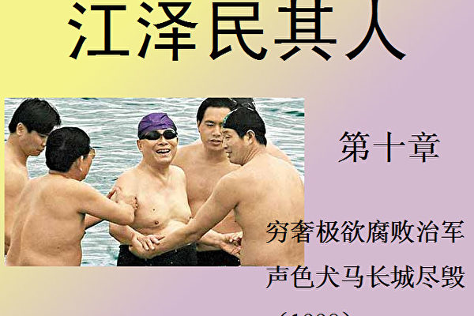</td>

【大纪元6月9日讯】江泽民心里很清楚，自己在军中毫无威望。老军头们大都有过厮杀疆场的资历，况且手里握著的都是江泽民最缺乏的硬家伙──军中的人脉。毛、邓都曾统领大军，军人们心服口服，偏偏江泽民不但没有政治资本，就是在军中也从未有过任何经验，甚至连枪都没摸过。

在一个正常的现代社会制度下，执政党要通过民主选举才能组成政府，社会上的不同声音是为了监督执政党正确行使权力的，国家搞得不好，领导人就可能面临被弹劾、甚至下台的危险。

在那些国家里，军队不属于任何政党，而是只属于国家。军队以维护人民利益和保卫领土完整为天职，因而政党之间的争斗，乃至任何党派内部的斗争并不牵扯军队。不论是哪一党派当选，军队都必须效忠于国家，根据宪法规定服从国家最高权力机构的调遣。这也是西方民主国家尽管党派之争惊心动魄，但国家政局却能保持稳定的重要原因之一。

然而中国的军队不同于西方国家，中国实际上只有党的军队，而没有国家的军队，军队成了谋取一党私利的工具。中共一直讲“支部建在连队上”，毛泽东早就提出所谓“党指挥枪”的理论。党内的政治斗争胜负，首先取决于谁掌握军权。不把军权完全握在手里，实际上就等于把政治前途交给了别人，这让江泽民无论如何心里都不踏实。

不过江泽民有自己的手段。

<b>1﹒加官晋爵收买人心</b>

在军队里，晋升是件大事情，它代表着浴血奋战、保家卫国的光荣业绩。

在毛时代，被封元帅封将军的人都是出生入死、功勋显赫的。被晋升者非常珍惜和自豪。在和平时代，军人们都知道，除非实力、表现特别突出的，要想晋升成将军绝非易事。然而自从江泽民上台以来，拍马屁成了军队里的晋升捷径。张万年、郭伯雄、由喜贵的提升典故，在军队中广为流传。最典型的是47军的少将军长郭伯雄，在掌党政军三权的江泽民午睡时，因亲自给江站岗而站出了一个军委副主席！

自1988年军队恢复军衔制以来，中央军委共授予96位高级军官上将军衔、警衔。除1988年9月14日邓小平在世时授予17位高级军官上将军衔外，江泽民从1993年至2004年光上将军衔警衔就送出79个，至于送出的少将、中将更是如同游戏，数以百计。

1993年6月7日授予6位高级军官上将军衔。1994年6月8日，江泽民一口气册封19名上将。

1996年1月23日，江泽民一时高兴，对旁边人说，今天，我们来封它几位上将，高兴高兴，怎么样？左右趋炎附势，答复当然是再好不过。于是江即时就封了4位。二炮政委隋永举就是在这一天从中将爬上了上将。

1997年10月24日江泽民一天提升了152名将军。高干子弟和有裙带关系的更成了江泽民拉拢的对象，如贺龙的儿子贺鹏飞，“四人帮”垮台后才去参军，不过当了十几年的兵，一升就是海军中将副司令。到1997年江泽民就一手册封了各级将军530名。

1998年3月27日，中央军委举行仪式，晋升10位高级军官警官上将军衔；1999年9月29日晋升2位上将军衔，2000年6月21日，中央军委举行仪式，晋升16位高级军官警官上将军衔。

2002年6月2日晋升7位上将，当军队老干部从电视转播中看到江泽民单用一只手颁发命令状时，气愤地说：“江泽民连起码的规矩都不懂，也太不严肃了。”

2004年6月20日，在江泽民快下台时，又授予15位军官上将军衔警衔，其中包括他的亲信由喜贵。

那些被册封的人并没有把这看成荣誉，他们心里明白，这样的加官晋爵绝不是论功行赏，而纯粹是收买人心。所以他们在册封仪式上非常不严肃，根本没当回事。

过去的老将都是凭本事提升的，有很高的威望，下达军令，无人不从。现在五花八门用什么路子上去的都有，他们互相之间不服气、打小报告，有任务时互设障碍、不予配合，妒忌、拆台。这样的人品能带出什么样的军队来呢？这样的军队有多现代化的武器都不会打赢仗的。

<b>2﹒纵容走私贪污</b>

军队经商，始于八十年代中期，当初的目的是为了补贴军用，中共高层对此一直乐观其成，称赞为“以军养军”。一些军队元老如杨尚昆、王震等还经常为军队企业题词，以示鼓励。江泽民当上军委主席后，为了控制军权，就充分利用这个空子和手中职权，向军人大许甜头，放纵军队大肆经商，纵容军队腐败，以收买人心。江泽民想的是这些人在中饱私囊、贪得无厌时依赖自己，对自己感恩戴德，但问题却由此而一发不可收，军队出现了前所未有的腐败，东南沿海军队走私比海盗还猖狂，北方军队走私比响马还厉害。

朱镕基在一次“反走私”会上讲：光1998年上半年军队开枪、开炮打死海关缉私人员及公安武警、司法人员450人，打伤2200多人。他们还动用军方气象台来服务，冒用总理签字，随便盖上军委副主席大印就冒领20亿，事情到江泽民那里就被压下了，军队的这些行为真使海盗、响马、地方贪官皆望尘莫及。

1998年7月26日，北海舰队四艘炮舰、两艘猎潜艇、一艘四千吨运输舰，对四艘来自北欧的装满七万吨成品油的走私油轮，进行保驾护航。

无巧不成书。行经一百零四年前甲午海战邓世昌为国捐躯的海域时，撞著了公安部和全国海关总署调来的十二艘缉私炮艇。缉私艇向海军喊话，要求海军配合其执行公务，也就是搜查。海军回答，除非有中央军委、海军司令部的命令，否则你们不可造次！

双方对峙了约15分钟。在这15分钟里，为走私油轮护航的海军紧急向岸上领导请示，上司不敢作主，又向北京军队高层请示。命令很简单，也很干脆，一点也不拖泥带水：“给我打，打他个稀巴烂！”

于是，海军一艘炮舰迅速对准海关和公安的指挥艇，发射了数发机关炮。几乎同时，海军的运输舰和其它三艘炮舰，开足马力，撞向缉私艇。整个战斗，历时五十九分钟。此次黄海炮战，造成八十七人伤亡。就那么巧，公安和海关缉私人员阵亡的十三个冤魂当中，有一位姓邓的，正是邓世昌的嫡玄孙。事过之后，不了了之，没有人受到任何处罚。

1998年7月13日中共中央开会，朱镕基证实统战部走私汽车一万辆，与政协党组合伙分赃23.2亿元人民币。军队走私，是走私队伍中的大户。1998年9月全国走私工作会议上，朱镕基讲：近年每年走私8000亿，军方是大户，至少5000亿，以逃税为货款的三分之一计，便是1600亿，全未补贴军用，八成以上进了军中各级将领私人腰包。

军中走私物品无所不有，甚至包括毒品。据BBC2001年3月28日消息，菲律宾国家安全顾问戈莱日表示，在中国东部五个省内有些非法毒品制造厂由身兼二职的中国军队人员经营，他们每年向菲律宾提供价值约12亿美元的“冰毒”。戈莱日希望中国能够制止毒品运送到菲律宾。他说，若中国毒品走私减少50%，菲律宾的毒品问题就可以解决一半。后来菲律宾政府不得不多次派代表去北京协商这个问题，抗议江泽民领导下的军队依然在走私毒品。

军队走私，只是军官们发财的一条捷径；而另一条捷径，就是借军队经商，乘机大捞特捞。

南京军区下面有一个火箭炮营，该营有一名上尉成立了一家“宜兴中国人民长城公司”，以优厚的分赃条件，从银行贷得巨款，一个小小的上尉就贪污了三个亿！军委办公室主任董良驹一人九幢豪华别墅分别建于全国名胜之地，一人十五辆豪华轿车；广州军区司令员以经济实体资金买六幢花园别墅，四辆豪华轿车；军事科学院副院长从意大利进口私人住宅装饰值12万美元；二炮副司令，安排家属到欧美逛商场，购物花销了25万美元；广州军区七名军级干部，搬个家，花巨资装修，仅卫生间设备就花了120万美元，全从意大利进口，平均每户卫生设备18万美元。

1998年11月西山军委、军纪委生活会，迟浩田讲：“1994年以来，军队所办经济实体的资本及收入80％以上被高、中级干部挪走私分，每年军费中有50％以上是花在高、中级干部吃喝、出国旅游、修建豪华住宅、购买豪华轿车上。”

1998年军费加超支共1311亿，50％是655.5亿，加上从军中经济体挪走的共计贪污公款1863.5亿，也就是说军中干部1998年挥霍相当于当年军费预算940亿的两倍！至1999年3月底经军事检察机关已立案的贪污、挪用、携公款外逃等大案2170多宗，那年已有二十四名少将级或以上军官挟巨款叛逃海外。

在中央军委主席江泽民的领导下，各级将官们加官和发财两手都抓，两手都硬。

朱镕基看到军队经商严重打乱正常的经济秩序，在1996年就提出军队应当禁止经商的问题，但是没有得到支持。1998年，问题越来越严重。朱镕基感到问题不能再拖，于是再次向江泽民提出这个问题，强烈要求禁止军队经商。

终于，在98年7月，江泽民在“全国打击走私工作会议”上宣布，军队、武警、政法和公安系统不准再经商，并在12月底完成“脱钩”，向地方政府交接业务。

江泽民从原来的纵容军队经商，到后来的禁止经商，看起来好像是相反的动作，但是，江背后的动机却是一脉相承的。库恩在《江泽民传》里把禁止军队经商一事当成江泽民的功劳大吹特吹，这纯粹是颠倒黑白。

江泽民当初纵容军队经商，是因为他在军队中培植亲信、滥授军衔需要一个腐败的环境，需要一个不把注意力放在正规化和强化战斗力上面的军队──军队腐败的一团糟现象对没有军人经历的军委主席江泽民在军队搞帮派是最有利的。

但江泽民害怕军队经商会给军人带来更大独立性，不利于江的控制，因此又希望能断了军队的财路，这样军队在经济上不得不依靠江来拨款，听令于江。禁止军队经商是江的一条出路，而且，禁止军队经商还可以成为江泽民在军队显示权威的一个好机会。这些年在军队培植势力使江泽民有了信心。在杨氏兄弟倒台、邓小平去世后，江泽民大权独揽。在朱镕基的强烈坚持下，江泽民权衡个人的得失后，才走出了禁止军队经商这一步。

但为保险起见，江泽民还是使出了惯用的招法，让政治局常委排名第五的胡锦涛出面来处理这件棘手的事情，自己躲在幕后。当时胡既非军委副主席、军委委员，亦非副总理，而是负责党务，这次只好到军队硬著头皮虎口拔牙。胡锦涛是邓小平隔代钦定的第四代接班人，始终令江鲠骨在喉，所以是凡难事江都让胡锦涛出面顶着，名义上是锻炼，实际上是万一出事，对于军队的反弹和各种阻挠，不必直接负责，胡就是替罪羊，正好也顺势把“第四代”的名分拿掉。这种手法以后江多次使用，好在胡天生谨慎，再加上运气，居然从未遇有大闪失，直到接班。

但在大约两万家军队所属企业中，当年底只有不到五千家完成或即将完成向地方交接。由于军队企业属独立经营、独立核算，且享有巨大特权，与地方工商、税务部门无涉，资产、分配、盈利走向基本上是一本糊涂账，涉及到军方既得利益，自然是刁难、阻拦、阳奉阴违，为清查带来数不清的障碍，过分深入又可能触及“军事机密”，所以则是能糊涂就糊涂，因为认真对谁都没有好处，所以最后脱钩查证一事仍然等于是不了了之。

<b>3﹒分赃不均 互相残杀</b>

从1999年2月2日到2月22日，中共向军队连下三道紧急金牌。

2月2日国务院、中央军委紧急通知：“坚决制止争夺经济体资金、财产的流血事件发生。”

2月8日自总参、总政、总后、总装备部发出命令：“坚决查办争夺、摊分、转移经济体资金、财产的违法、犯法行为。”

2月22日国务院、中央军委再发紧急通知：“立即停止争夺经济资金、财产活动，依法严惩动用武器、争夺经济体资金财产的肇事者。”

1998年撤销了军队、武警、公安经办的经济实体后，原经济实体的资产就在军中瓜分了。已经钻到钱眼儿里的军队、武警为分钱、分赃，更频繁爆发武斗，用枪、用炮甚至动用装甲车，拼个你死我活。

江泽民利用腐蚀治军，拉拢的军队将领当然不是凭著真本事上来的，枪杆子搁在这些道德败坏的人手里是非常可怕的。下面几个小例子读起来让人毛骨悚然。

广东军区副政委和南海舰队副政委各领部下在酒吧间瓜分财产，珠海警备区做和事佬。席间双方将士一言不和各以酒瓶击头，淌出脑浆者有之，流血者甚众。广东军区后勤部唐处长和海军湛江基地政治部肖主任，二人皆因流血过多，砸出脑浆而丧命。

十三军副军长崔国栋少将于1998年11月28日飞往西昌，向西昌军分区后勤部宋副部长索要2000万元。二人发生争吵，宋副部长手脚麻利，掏枪动作略胜一筹，军长崔国栋与警卫蒋国民应声倒地。此事惊动总参谋长傅全有、总政治部副主任王瑞林和军内纪律检查委员会书记周子玉疾飞西昌。

湖北咸宁的“空六五六基地”雷达站大爆炸，一千多官兵与十多架直升飞机救火，死伤惨重。事故起因是，曾在1996年因向台湾海峡发射中程导弹而立功的云南楚雄导弹基地，其后勤处仓库主任将上级贪污到手的赃款，雁过拔毛，经手三分肥因而被上级苦整，于是趁1998年4月5日星期日营中无人，心怀报复到储藏室放火，大火从早晨烧到下午二时，死伤一百二十多人，损失无数。

在中央军委主席江泽民的领导和指挥下，“人民军队”的指战员没有死在保家卫国的战场上，却倒在了人为财死的烽火中。而这类事件几乎遍及全国各省各地，无法一一细述，这里东南西北中地区，各举一例。

东面：华东军区属下安徽省军区，合肥市警备区和安徽省武警总队，三方合伙经商，办移交前三方财政由省军区掌管，安徽军区首长移交前先吞没四分之三，余四分之一瓜分。不服者动枪，在省军区礼堂三方混战，仅军官就伤亡三十多名。

西北：兰州军区与甘肃省军区合营经商。1999年1月15日，眼看办经济实体移交，兰州军区首长派军队去省军区抢走三十多辆崭新轿车。几乎同时，省军区也出动兵车、载重汽车多辆到兰州军区“零七五”仓库抢钢材，双方窄路相逢，未打招呼先开火，伤亡72人，打死军官12人。

西南：遵义驻军与贵州省军区为争夺260万元在驻军大楼展开枪战，伤亡90余人，打死官兵52人。

东北：辽宁锦西驻军与二炮部队合营经商。移交前，锦西驻军先吞50万，二炮全员出动，将驻军大楼包围70多个小时。幸而导弹不能近战，吓得沈阳军区司令员，二炮司令员乘直升飞机如丧考妣，奔赴现场。

1997年9月7日晚11时，沈阳警备区、三十九军一一六师、辽宁省武警三家为瓜分1.2亿元利润，开枪混战出动军队350人、37辆军车、两辆装甲车。一一六师出动250名官兵，机械化团蒋副团长第一枪便丧命。武警武器不如人，死伤40多人。

西面：1997年11月22日中午，山西省大同市郊西坪的二十八军，军部被炸，东一楼被炸毁，死亡军人63名，包括军党委办公室主任巩大校。

中部：亚洲最大、世界第二的中国空军飞机储存中心，位于河南省南阳的社旗，1990年8月动工，1994年12月竣工，耗资80亿。该中心有二层式飞机洞库20个，可储350架飞机，地面停机坪可停160架战斗机、强击机和轰炸机。1996年8月3日晚11时，该中心西南七号值班室，两军人为参与外面另一军事单位经商所得赃款分配不均而争吵，进而动火器引发爆炸，继而引发火灾，又进一步引发更大爆炸、火灾，形成连环套：炸了烧，烧了炸，没完没了地烧炸8小时，直到次日8月4日晨7时20分。空军司令于振武、总参谋长傅全有及时赶到现场，81架飞机炸毁，90名军人伤亡，直接军事损失11亿。中国只有5000架飞机，这一下损失1/60！

官方报导说，军队在军事训练、技术考核上实战演习鉴定中，优秀率一直下降，没有达到军委的要求准则；军中违纪违法事件则持续高居不下，恶性事件(开小差、开枪等)不断。

更让人不安的是，各大军区、集团军虽然军费支出不断增加，但没有积极开展加强军事训练、技术考核的运动，而是在轰轰烈烈地大搞“军官、干部减肥运动”，还分“连营”、“团师”、“军”三级，减5公斤以上者奖1000至2000元；减7.5公斤以上者，奖2000至5000元；减10公斤或以上者，奖5000至10000元。江泽民这样治军，军队如何能有战斗力呢？

<b>4﹒声色犬马 纵欲奢靡</b>

《解放军报》2004年9月24日曾发表综述文章“江泽民同志领导国防和军队建设十五年述评”，总结所谓江泽民国防和军队建设思想，说来说去就是一句话：“必须高度重视军队的思想政治建设，必须把它摆在全军各项建设的首位。”也就是“坚定地在思想上政治上同党中央保持高度一致”，而党中央又是“以江泽民同志为核心”的，所以江泽民的所谓“建军思想”，说穿了，就是绝对地服从他的指挥。

军队建设只要在思想政治上靠得住，其他方面都好说。

在江泽民的领导下，军队前所未有、前所未闻的大搞黄色产业，总参、总后、总政色情泛滥，沉溺于声色犬马之中，竟无人反对。可见，社会的腐败糜烂症同样染给了“钢铁长城”。仅1995年总参三部属下就有15间娱乐场，编制外招聘476名“六陪”女郎。

军方有很多档次不同的俱乐部、招待所、疗养院、度假村，都与时俱进、争先恐后地给高官提供声色犬马、寻欢作乐的场所。

2001年11月1日，国务院、中央军委，突然发出《关于立即查封、停办军警俱乐部》的通告，并成立了领导小组督办。朱镕基任组长，迟浩田、罗干、傅全有、周子玉、于永波等任副组长。

11月2日，国防部、总参也发出了《关于严格执行中央通告，整顿俱乐部、招待所、度假村等场所》的通知。这次被中央下令查封、停办、整顿的俱乐部、招待所、度假村等，大多是90年代初江泽民当军委主席后兴建的，到了97年达到了高峰。这些灯红酒绿、寻欢作乐的场所，分三个档次：特级、高级、次高级。特级的，全国约有8所；高级的，全国约有30多所。特级的俱乐部、招待所、度假村等，全年每天24小时提供服务；高级、次高级的，一年365日，天天“客满”。持不同证件进入这类俱乐部、招待所、度假村寻欢作乐，享受招待的等级、待遇是不同的：持永久证，即某俱乐部荣誉会员证者，吃喝玩乐只要签字，不用支付分文。

特级的、高级的场所，还配备医务所，并有高资历的军医服务，还有急救医疗设备和救护车。特级俱乐部还配备有急救用的“直九”型直升机。内部设施都十分讲究、豪华。“服务员”“协理员”“护理员”等工作人员，全部是未婚女青年，都经过“政审”从军警文工团、军警卫生学校、中小城市党政机关中挑选出来，再经过文化、文艺、礼仪、社交等培训过的。

导致中央此次采取查封、停办军警俱乐部的原因，是为了应付六中全会决议要改善党风，才不得不做出的样子。其次是，党内、军方内部对这些供高官特权享受的灯红酒绿场所，一直反应强烈，要求禁止党政军高层到这类场所寻欢作乐。这类场所尽管控制严密，但是其内部的活动还是外传了，而且上行下效。不少地方的军队、基地也都搞起俱乐部来，供当官的在假期、节日也能过过声色犬马的生活。这种糜烂的风气已经严重影响了军队的士气。各俱乐部、招待所、度假村等更发生了女青年被奸污后自杀的事件。

军方的洪学智、萧克、廖汉生、杨成武、杨白冰等老将军，为此都曾表示强烈不满，说江泽民在“自毁长城”。可是这些老家伙此时都已被江泽民用硬刀子、软刀子整下去了，在军中早已没有实权了。

<b>5﹒下软刀子消除“噪音”</b>

一些很有威望、握有实际兵权的老军头，对江泽民的腐败治军非常不满，致使他们的部下对江泽民也不屑一顾，这些人都是江泽民的心头之恨。但是江又惧怕他们联合起来对付自己，所以硬的不敢来，就下软刀子。

江泽民的做法是给老将们先升级再退休，尽释兵权：见官升一级，升完办退休（少将升中将，中将升上将），再换上自己人。江泽民为了巩固在军中的地位，一拨接着一拨地提拔对他表忠心的将军们，在军中大换血。

2001年7月，江泽民下令中共中央、国务院将特拨经济津贴分为三个档次(50万、30万、20万)，发放给党政军已故元老遗孀(共有322名)。

8月中旬，于若木(陈云遗孀)、刘英(张闻天遗孀)、林月琴(罗荣桓遗孀)、李昭(胡耀邦遗孀)、王光美等五十多名元老遗孀，将她们所收到的特拨经济津贴，如数上缴给了中央直属机关党委，要求以“无名氏”的名义，转交给当年高考录取，因家庭经济困难交不起学费的西北地区贫困新生。剩下那270名元老遗孀收下“特拨经济津贴”，从此江泽民耳边清静了许多。

2002年春节前夕，曾庆红任部长的中央组织部筹措了一笔数目不小的资金，总金额在1700万到2500万元人民币之间，资金来源不能公开。这笔钱以江泽民关心老干部的名义，有选择、有重点的照顾了“部分”能影响未来十六大选票的老同志。此次照顾面不宽，给谁、不给谁、给多少，都由江泽民和曾庆红事先圈定。

据高层的秘书们透露，这次得钱的都是身居要职或影响面大的，平时对江泽民和曾庆红老有微词、总有妨碍的有影响力的实权派们。

<b>6﹒害死杨尚昆</b>

自杨尚昆被整下台后，江泽民很心虚，曾庆红谈了自己的看法，认为这老东西留着终归是个麻烦，但邓小平活着时不宜动手。

97年2月邓小平去世后，92岁的杨尚昆身体并无大碍。他对江泽民在军队中乱提拔将军、收买人心、打击异己一直不满，时常在老干部聚会上数落江泽民。98年下半年的一天，在一次许多军队老干部聚会上，杨尚昆又指责江泽民，并且说，现在这个军委主席要再干下去，军队就彻底毁了。曾庆红到处布置耳目，此话自然传给了江泽民。

江泽民知道杨尚昆、杨白冰兄弟虽在中共十四大被夺去军权，但是在军队中的影响力依然难以估计。江也知道自己进谗言把赵紫阳和杨尚昆踢下去、自己独揽党政军大权的做法招致很多人的不满和怨恨。如果这时，前军委第一副主席和前国家主席杨尚昆真做个召集人讨伐他，那江还真招架不了。虽然常有个薄一波给出出主意，但他毕竟不是军人出身，没有军权，再则薄对胡耀邦落井下石的事，至今还让不少人痛恨。

江泽民经过一番周密计划，决定寻机除掉杨尚昆，以防后患。江泽民部署得很周密，但人算不如天算，这出阴谋后来还是露出了马脚。2003年8月3日，新华社突然发出了一个奇怪的“新闻”，说的是1996年隆冬时节，在中南海勤政殿里，时任中共中央总书记、国家主席、中央军委主席的江泽民主持召开了一次特殊的小型会议。会议的主题是研究解放军总医院(301医院)南楼病房温湿度的改造。江说，解放军总医院温湿度问题不是小问题，而是大问题，因为这里住着许多戎马一生的开国元勋，一定要“关心好”“照顾好”他们。

为什么江泽民把解放军总医院视为“大问题”呢？因为江泽民和曾庆红发现了医院在打击异己中的妙用。中共的元老们大多都看不惯无德无能的“戏子”江泽民，又自恃功高，不把江泽民放在眼里，在中共高层许多内部会议上批评、指责甚至围攻江泽民，但是江拿他们毫无办法。不过江泽民和曾庆红看到了一点，就是人老了，总会有病，于是想到了医院。一方面可以利用医院照顾讨好住院的元老，另一方面又把这些人的生死操控在自己的手中，在关键的时候发挥作用。

果然，江泽民特别“关心”的解放军总医院就被派上了用场。

1998秋，杨尚昆得了感冒，住进了完全被江泽民和曾庆红控制的解放军总医院。杨尚昆住院不长时间，98年9月14日凌晨1时17分，在医院突然去世。俗话说，要想人不知，除非己莫为。杨尚昆去世不久，民间盛传，杨是被害死的。后来杨的家人要求中央调查杨尚昆的死因。

※※※

《孙子兵法》说，无能而又逞能、贪权、贪财、胆小、言而无信、残暴、自私之中，三军统帅出现其中任何一个问题即可导致失败。仔细想想，军委主席江泽民哪条没有沾上？难怪江泽民治下的军队腐败、溃烂不堪。这样的军队，又如何能保家卫国、抗击外侮？这真是中华民族的大不幸。

<h1 align="center"><b>《江泽民其人》11：洪水滔天死保龙脉</b></h1>
<H3><b>第十一章：洪水滔天死保龙脉 草菅人命哀鸿遍野（1998）</b>
</h3>
<td align="center">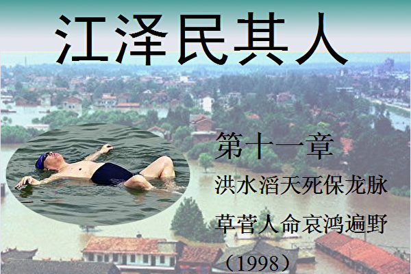</td>

【大纪元6月10日讯】<b>1﹒小洪水引发大灾难</b>

1998年中国长江流域遭遇了一场世纪洪灾。

尽管中共新闻媒体统一口径称此次洪水为“百年一遇”的“特大洪水”，但许多水利专家们却认为，这场洪水本身其实并不算“特大”。衡量一场洪水大小的重要标准是最大洪峰流量。根据长江宜昌水文站的观测资料，此次洪水期内最大洪峰流量是8月16日出现的63,600立方米／秒，略大于宜昌站5年一遇的洪水流量60,300立方米／秒，但远未达到20年一遇的洪水流量72,300立方米／秒，因此，专家认为此次洪水应该属于“小洪水”。

然而这次洪灾却意外地酿成“高水位，重灾情”。长达两个多月之久的灾难过去后，官方的内部统计证实：洪水受灾人口近4亿，死亡近5000人，直接经济损失3000多亿元。

国内曾对这场洪灾的原因有过争论，焦点是天灾还是人祸。很多专家认为这次洪灾虽是天灾，但更主要的是人祸。其实，许多人可能还不知道，如果不是因为江泽民执意要严防死守，拒不分洪，这场灾难的损失完全可以不必那么惨烈。

<b>2﹒严防死守 保江龙脉</b>

1998年8月6日，长江上游第四次洪峰将到达湖北宜昌。湖北省委书记贾志杰和省长蒋祝平联合呈上了启用荆江分洪区的请示报告。中午12时，沙市的水位已经达到44.68米，超过了1954年特大洪水的最高洪水位（44.67米）。分洪区群众开始向安全地带转移。16小时内，分洪区完成了33万人、1.8万头耕牛的安全大转移，但是荆江分洪闸最终没有被开启。

按照国务院专门制定的长江防洪计划，一旦沙市的水位达到44.67米，荆江分洪区就必须开闸分洪。此后的8月12日和8月16日，荆江分洪区的居民两次转移，为分洪做好准备，而分洪闸依旧没有打开。

8月17日9时沙市水位上升到历史最高水位45.22米，比1954年的最高洪水位高出0.55米。

在此前一天，8月16日22时30分，温家宝在沙市听取气象、水文专家的汇报，决定是否要分洪。而江泽民则在四个小时前（18时20分）就已经发出命令，沿线部队全部上堤，“军民团结，死守决战，夺取全胜”，否定了分洪方案。

事实上针对这次“特大”洪水，江指示中共中央确定了“严防死守、力保长江干堤”的方针。在7月21日深夜12点，江泽民打电话给温家宝副总理，要求“沿江各省做好迎战洪峰的准备……，严防死守”。7月28日第三次洪峰正在通过武汉三镇，当时新华社报导：江泽民对此“十分关切”，他在给温家宝的电话中，要求“人在堤在”。 8月14日江泽民在湖北省视察抗洪时指示：“坚决严防死守，确保长江大堤安全。”

“严防死守”的口号被喊得震天响。在汛情的发展中，尽管洪水滔天、愈来愈猛，尽管地方多次呈请中央启用荆江分蓄洪区，分洪的方案都没有得到江泽民的批准。

其实利用分蓄洪区减轻洪水危害，是西方发达国家防洪的最主要手段之一，因为按协议使用分蓄洪区，对社会、经济、生态环境的破坏最小，防洪的成本最低。荆江分洪工程建成于1952年。在1954年特大洪水期间，荆江分洪区曾被三次启用，使最高洪水位减低了0.96米。据专家分析，如果1998年利用荆江等分蓄洪区分洪，应能取得同样的效果，将8月17沙市的历史最高水位45.22米降至44.26米。倘若如此，则长江水位就不会在荆江河段造成如此紧张的洪水险情。

外界一直难以理解江泽民为何拒不接受专家们的劝告，坚决不同意从荆江分洪。后来有人传出，江泽民当时相信了在中南海走红的一位易学先生透露的“要保龙脉” 的“玄机”。江泽民相信如果从荆江分洪区分洪，主动决堤，就等于挖断了自己的“龙脉”。1998年是虎年，正是江上台近10年的第一个本命之年，江泽民更是不敢怠慢，于是决心严防死守，决不可主动开闸泄洪。

中共号称“无神论”，不过党内很多高官却非常相信风水，求神问卜的不计其数。毛泽东以“8341”命名自己的禁卫军，就是一个典型的例子。毛泽东在进北京前，有老道告诉毛四个数字“8341”。毛不解其意，但仍然以“8341”命名自己的禁卫军。后来毛死后，才知道“8341”是指毛活到83岁，从1935年遵义会议掌权到1976年逝世，一共掌握最高权力41年。

中共高层领导内部都知道江本人十分信奉风水、阴阳、命理。“六四”学生运动遭镇压后，江泽民也希望通过风水来延续统治，当时在北京做了三件事。一件事是给白洋淀灌水。北京六朝帝王之都，东西北三面环山，南面临水，是所谓披山带河的风水宝地。但是中共统治造成的生态危机使北京南面的白洋淀干涸。因此江泽民打着恢复华北明珠的旗号，给白洋淀灌水，实际则是为了恢复北京的风水，以求江山永固。第二件事，则是加高天安门的旗杆。因为天安门放着个停尸房——毛主席纪念堂，破坏了故宫的风水，而旗杆的高度比停尸房还低，风水先生说这样阴气太重，于是江泽民又以扬国威，树立爱国主义思想为名，增高旗杆。增高后的旗杆远远高于毛的纪念堂。第三件事是搬走天坛的土山。这个土山是毛泽东时代深挖洞广积粮挖出的黄土，堆积在天坛公园朝天神路的西侧，形成了一个比祈年殿还高的土山。在风水先生的指点下，江泽民命令把土山搬走，在原来的地方种上柏树。

江很在意犯忌，虽然到处走，“镇江”这个地方江泽民就从来不去，因为怕被镇住，坏了风水。江泽民对下属的言语吉凶更是敏感，谁要敢犯了江的忌，必给以颜色，连省级干部都随意撤换。

前湖南省委书记王茂林在任期间到机场热情迎接江泽民到湖南考察。王茂林准备大大地款待江氏一行，早已为其安排好了一切。王茂林非常高兴豪爽地对江说：“到了北京听您的，到了湖南来听我的。”这句话在中国人来讲，都知道是盛情款待的意思。可独裁意识极强的江泽民已经不能用正常人的思维去考虑问题了，一听“到了湖南来听我的”这句话就认为是要夺权的谶语，极为不满。事后没过多久，就将王茂林调到北京当精神文明领导小组当副组长─一个形同虚设的职位。 王茂林知道自己说错了话﹐于是百般向江泽民表忠心﹐后来江终于给了他一个掌握实权的职位──“610”办公室主任﹐结果2004年底被法轮功学员在海外告上法庭，并在反对迫害法轮功的“追查国际”组织那里挂了号。

江泽民还喜欢好名字的吉利，比如滕文生、贾廷安、由喜贵、王沪宁等人有了好名字就可以升官，李长春的名字也很好，很受江泽民的重用。

这次长江大洪水，江死保其“龙脉”，拒绝启用荆江分洪区泄洪。朱镕基、温家宝等人只得硬著头皮执行江的指示，对外则说是泄洪会造成更大经济损失。事实是，这次洪水期间，荆江分洪区的居民曾3次全部撤到安全地带，为分洪做好了准备，可以说，万事俱备，只等一声令下即可分洪。

在江泽民的天平上，洪水灾区亿万民众的生死远远不如他的“龙脉” 重要。

<b>3﹒借机调兵 坐实军权</b>

江泽民拒不采用分洪方案的另一个原因，是要借此调动军队，真正掌握实权。

江泽民虽是军委主席，但是一辈子没摸过枪，更没有老将军们疆场拼杀的资本。没有机会在军中树立威信，在关键时刻军队是否能无条件服从其指挥，江泽民心里一直没有底。邓小平死后，江更加急于找机会建立自己在军中的绝对权威。然而在和平时期大规模调遣、演练军队必须有一个正当的理由，否则势必引起周边地区的不安和抗议，甚至引发国际争端。1998年入夏以来长江出现几乎是全流域范围的洪灾威胁，江泽民觉得这是一个机会。

1998年8月7日，长江的九江段干堤决口。当晚，江泽民立即召开了中央政治局常委扩大会议，会上做出了“中共中央关于长江抢险工作的决定”，紧急调动中国人民解放军和武警部队到抗洪抢险第一线。总参谋长傅全有随即下达命令，要求被指定参加抗洪抢险的部队在接到命令后2小时内，必须无条件执行命令，迅速开往前线。

在这次军队“抗洪抢险”行动中，江泽民调集了广州、济南、南京、北京和沈阳军区，包括空军、海军、二炮、武警部队以及解放军沿江沿湖各大专院校，共计10多个集团军、30万官兵。114位将军、5千多名师团级干部听从江泽民调度亲临长江大堤。在这场洪水中，总计出动官兵700万人次，组织民兵和预备役人员500多万人次，用兵总人数居然超过了中共建政之前的淮海、辽沈、平津三大战役解放军人数的总和。

此外，江泽民在抗洪部队中还进行了“指挥互换”的操演，如将广州军区和南京军区的司令员对调指挥。这显然与抗洪抢险毫不相干，完全是军事演习的训练内容。不但如此，抗洪部队还经常接到换防“转移阵地”的命令。例如，某摩托化师被紧急空投至武汉，再赶到800里之外的石首、监利——如果只是为了紧急抢险，直接空投石首、监利自然最快，何必让将士空耗体力，而且还耽误时间？又如，北京军区某部先在江西九江抢险，然后接到命令赶往湖北沙市，最后又急急赶赴湖南岳阳，如此等等。

实际上，冠冕堂皇的“抗洪抢险”口号，不过是使得江泽民“师出有名”，能够在和平时期检验自己对军队的权威控制而已。如果采用分洪方案，江泽民就不可能进行如此大规模的兵力调集和军事操演，因此江无论如何坚持不分洪。灾区亿万百姓的生命财产，不过是用来调兵遣将的砝码，几十万官兵的性命，在江泽民眼里也不过是儿戏。军队士兵们奋勇拼搏抢救人民的生命财产时，并不知道将百姓、官兵性命置于险境的正是中央军委主席江泽民。

在此期间，江泽民还特意过了一把军委主席的干瘾。

8月13日上午，江泽民和中央军委副主席张万年、中央办公厅主任曾庆红一起乘飞机到湖北沙市，查看长江堤防重点险段的位置和参加抗洪抢险部队的兵力部署。在飞机上，江泽民问张万年：“现在沿江一共有多少部队？”张万年答道：“解放军和武警一共投入了13万人，还有200多万民兵。仅在湖北，就集结了8万多兵力。济南军区、南京军区还准备了5个师的兵力，正处于紧急出动状态，可以随时调用。这是解放战争渡江战役以来，我军在长江沿岸投入兵力最多的一次重大行动。”

他们到达荆江大堤后，在众多记者的摄像机和照相机镜头前，张万年打开军事地图，向江泽民汇报了参加抗洪部队的调动和部署情况。身穿军服头戴军帽的江泽民像总指挥那样地问张万年：“济南部队现在哪里？”张万年指着地图答道：“在武汉。”江泽民又问：“空降兵部队呢？”张万年答道：“在洪湖。”接着张万年又向江泽民汇报……。”听完汇报后江泽民发表演说：“事实证明，我们的部队不愧是一支用马列主义、毛泽东思想和邓小平理论武装起来的，与老百姓有着鱼水之情和血肉联系的人民军队。还是那句话：军民团结如一人，试看天下谁能敌？”

“过瘾！”江泽民真是过足了军委主席的干瘾。和平时期的司令不需要冒任何危险，如此指东道西，江的发挥可以演好几遍。悲哀的是，如果真的是战争来临，恐怕连江的影子都找不到了。

不管怎样，江泽民利用长江洪水，组织了自“抗美援朝”以来最大的一次军事行动，在长江流域进行了一次渡江战役以后的最大一次兵力调动，满意地检验了军队不顾险情只听命于自己“核心”地位的“政治觉悟”。通过这次调兵，江泽民真正地掌握了军权，完成了第二、第三代之间的权力交接，这正是“严防死守”背后的第二个真实目的。

<b>4﹒大堤决口 哀鸿遍野</b>

洪水期间，江泽民除了不断下令增派军队和武警，还指示各级官员务必增派人力物力严防死守大堤。据水利部门统计，仅长江沿途调动官兵及民工7,000万人次以上，投入财力物力100亿人民币。

在江泽民不同意分洪的情况下，在“严防死守”、“要人给人，要物给物”的指示下，100多亿元劳民伤财的财力物力投入并没有收到成效。从8月1日到8月5日，长江嘉鱼县排洲段、九江段、江心洲等民垸先后溃堤，8月7日，长江主干堤决口。

嘉鱼县外江民垸合镇垸是在8月1日最先溃口，决口处经过官民五天五夜的围堵、外围炸沉船舶、打桩，固定铺板，灌注泥石堵口等办法终于堵住了。但 8月5日，长江嘉鱼县排洲段、九江段、江心洲等民垸先后溃堤。

长江嘉鱼县排洲段大堤内人口密集，是土地肥沃、风调雨顺的鱼米之乡，且工商业也很发达，工矿区林立。下游的二十多个乡镇近五十万人口，年富力强的劳力都上堤筑坝去了，滞留在家的都是年迈体弱的老人、妇女及初级中学以下的儿童。由于决口是发生在8月5日深夜，浸泡了一个多月的大堤终于抵抗不住越来越高涨的洪水的冲击，洪水一下子就决开了50米的大口，以摧枯拉朽之势向村庄、向工矿区、向学校、向农田奔泄。守卫在堤坝上的近100名武警官兵和民工当即被洪水卷走，睡梦中的老人、妇女及儿童有的还没惊醒就已被洪水吞噬。惊惶失措的人们有的爬上屋檐、大树，但不一会儿，屋檐和大树就在洪水的冲击中倒下了。祖祖辈辈的辛勤劳作创造的财富及栖身之地顷刻间化为乌有，鸡鸭猪牛等牲畜多数葬身洪魔的大口。从8月5日深夜3点到第二天下午，短短的二十四小时里，天塌地陷，数十公里内一片汪洋，洪流滔滔，哀鸿遍野。

大小官员们一面调配大车大船堵塞溃口，一面组织船只在洪水中抢救幸存者。但一切都已经晚了，咆哮的洪魔，没有以人的意志为转移。决口处推置粮袋、车辆也好，还是炸毁船舶也好，打几个水泡就没有了踪影。救护洪水中的幸存者更是爱莫能助，鞭长莫及，因为船舶上的官兵在凶猛的洪水中自身难保。救援工作受到很大限制。

8月6日到7日，除了一部分爬上大树、高楼的幸存者被救助以外，全县1.1万人“失踪”。事后，湖北嘉鱼县的民政部门内部统计得知，全县两次决口期间，在洪水中死亡及失踪妇女、儿童及老年人1.1万人，官兵及民工1千多人，很多家庭妻离子散，有一些家庭全数葬身洪水，连尸体都没有找到。

8月5日那天，长江下游的九江段、江心洲一同溃口，所幸这两地溃口都在白天，人员伤亡要少一些。8月7日九江长江主干堤决口，官员们一时间手忙脚乱，像热锅里的蚂蚁急得团团转，指挥员手足无措，下令胡乱向决口处抛进物品，只要能装的物资都向决口倾倒，推进大米、稻谷、黄豆等粮食达500万吨，大卡车50多辆，炸沉船18艘，后来调集一支来自张家口地区约200人的堵漏特种兵团，采取了外围打桩，固定铺板，灌注泥石堵口，终于把决口堵上。此次溃堤共造成了82亿元的直接经济损失。除排洲湾死亡1.2万人外，外江民垸合镇垸、九江段、江心洲及九江长江的四次溃口共死亡平民百姓6千多人，损失财产达500多亿元。

到了8月中旬﹐已有2.4亿人因洪水肆虐而撤离家园﹐与此同时﹐洪灾地区爆发了传染病﹐此后灾区人民一直承受着难以想象的痛苦。可是﹐被库恩称为“改变了中国”的江泽民﹐在这段时间做着什么呢﹖库恩的书里说9月初﹐江泽民邀请“15位杰出电影艺术家到中南海做客”﹐江泽民是要组织艺术家们为灾区难民搞赈灾义演吗﹖错了! 照江泽民的话说﹐那完全是他自己“心目中的开心一刻”。书中写道﹐“曾庆红看到自己的领导江泽民兴致颇高﹐便邀请江背首诗。江从不怯场﹐他用俄语背了首诗。”“不出任何人的意料﹐江泽民主动地坐下来开始弹琴。曾庆红立即请嘉宾们一起跟着唱。”“江演奏的是俄罗斯旧日情歌《莫斯科郊外的晚上》。”年轻女演员跟着唱了起来。接着﹐大家唱起了一首很流行的歌曲《大海啊﹐故乡》。“由于几乎所有人都知道歌词﹐大家都唱了起来───尤其是江本人﹐更是引吭高歌。”在长江变成“汪洋大海”威胁著亿万人民的生命时﹐江泽民却高唱着“大海啊故乡”﹐一向讲究避讳的江泽民这时却又百无禁忌了，其心中何曾有一点关心人民疾苦的影子﹖

1998年举行的第七届河流泥沙国际学术讨论会上，原水利部长、九届全国人大常务委员杨振怀在分析洪水造成重大损失原因时说：未按原规划使用分、蓄洪区，是致使洪水逼高的主要原因。

面对这一重大的决策失误，江泽民指示媒体进行全面掩盖，官员们统一口径、统一上报人员死亡及财产损失的数据，将统计数据缩小到最低限度。人员死亡与财产损失，实际情况是官方报导的五十倍以上。

具有讽刺意味的是，对于江泽民违反自然规律、废弃水利专家荆江分洪的建议造成的惨重损失，库恩的书写道：“江赞扬了人们取得的成绩，并称他们的抗洪斗争证明了党、社会主义制度以及人民解放军的重要作用”。江泽民还不忘把中华民族扯上来为自己粉饰罪过。他说：“这一胜利还充分说明中华民族具有自强不息、艰苦奋斗的光荣传统，是具有强大凝聚力的伟大民族。”凝聚在哪里呢，当然只是在江“核心”的周围。

在中共的宣传机器中，在“百年一遇特大洪水”说辞下，如此惨重的人祸仿佛真的只是一场天灾，江泽民的罪责被完全掩盖过去。

这一谎言，不禁令人想起1959－1961年的那三年饥荒灾难。在那段时间里，中国非正常死亡的人数多达3000多万人，是人类历史上和平时期因饥馑死亡最多的一次，是8年抗日战争期间因战乱死亡人数的1.5倍。中共官方把这一灾难归咎于“特大自然灾害”。

但后来学者们却发现，在那三年中，中国并没有发生严重的自然灾害，只在局部地区出现过洪涝灾害和旱灾，属正常年景。发生如此惨祸的原因，是因为中共1958年所谓“总路线、大跃进、人民公社”的运动，把中国搞得民穷财尽，而当局为粉饰太平没有采取救灾措施。在国内人民处于极度饥饿状态下，还继续支援“社会主义小兄弟”国家，导致中国饿死那么多人。然而，一直到今天，三年饥荒的真相还被官方封闭着不敢让百姓知道，因此很多中国人把这场人类历史前所未有的人祸当成了天灾——所谓的“三年自然灾害”。

面对这场惨绝人寰的世纪洪灾，令人难以置信的是，库恩的《江泽民传》里竟写道：“大洪水展现了江泽民作为工程师和诗人两方面的才华。”是的，罔顾客观规律，为了个人私利拒不分洪，可以无视数亿灾民的性命财产安危，这就是“江泽民作为工程师和诗人”的特殊才华。

<b>5﹒猫哭耗子 现场做秀</b>

这场前所未有的洪水灾难，还成了给江泽民脸上贴金、显示他“英明形象”的机会。把坏事变成“好事”，把自己造成的巨大灾难，变成为自己歌功颂德的机会，这是江泽民最擅长的本事。

8月13日，溃口堵上、洪水下落后，江泽民来到了湖北，在武警官兵铁桶般的保护下，他手拿麦克风，满面愁容地到长江大堤上发表了“精彩”的演讲，“抗洪抢险是沿江地区当前的头等大事，坚决严防死守，确保长江大堤安全”，对着摄像镜头喊出了“坚定信心，决战到底”等口号。

新华社荆州1998年8月13日发表了这样的消息：“中共中央总书记、国家主席、中央军委主席江泽民和中共中央政治局委员、国务院副总理、国家防汛抗旱总指挥部总指挥温家宝等一起，今天冒着酷暑亲赴湖北长江抗洪抢险第一线，看望、慰问抗洪第一线的广大军民，指导抗洪抢险斗争。”在这样的时候，江泽民的“喉舌”们总是知趣地避开了此时最需要关注的灾民，避开了所有的“阴暗面”，把聚光灯照向带领人民从“胜利”走向“胜利”的“党的核心”。

自洪水退后，宣传部接到指示，要借“江主席”领导“抗洪斗争胜利的丰功伟绩”之势，为“江核心”造舆论，新一轮造神运动悄悄进行。于是中共的宣传口径和江泽民讲话的底气都有明显的提升。　
　　　　　
中共报刊更是假借外国报刊之口，继续吹捧江泽民。甚至选用一些肉麻又可笑的语句为标题、副标题，赤裸裸地将江泽民捧上与毛、邓平起平坐的“伟人”之列。

<b>6﹒蹊跷的洪水</b>

1998年这场大水来得实在蹊跷。

在发大水的时候，北京流传着一种说法：江泽民，江泽民，江水淹死人，就是说江泽民上台会带来水灾。

此说法并非完全空穴来风。1996年，江泽民去南方路过一著名寺院。在大殿上香后，江泽民便来到钟楼。不料方丈以善言百般相劝：“施主万不可在此撞钟。”江泽民大为不悦，毫不理会，撞响了古钟。老方丈当场半晌无语，只是默默垂泪不已。后来有人得知，老方丈曾言道，江泽民本蟾王转世，钟声一响，必定引发中原水族作怪，从此中原大水连年，再难平安。

在那之后，中国大陆水灾似乎确实比过去来得猛了。在98年这一江泽民的本命年，中国出现了前所未见的洪灾。在后来几年，中国洪灾仍然频繁。

蟾王钟声一说，或许有点难以考证。但江泽民的确嗜水出名，一生不能离水，出访时亦不忘随时到水里泡泡，媒体上流传很广的就有他在夏威夷和死海游泳的照片，他入住的酒店也多选养有水生尤物。江的突出的蛤蟆眼及大嘴薄唇外貌特征酷似蛤蟆，五指张开的爪式鼓掌方式乃江的独家专利。

国外近年来人们从研究圣经《启示录》、诺查丹玛斯的《诸世纪》、唐朝《推背图》等古今中外的著名预言中，发现江泽民在现在扮演着一个非常特殊的角色，给中国以至全世界都带来灾难。

江的出身和水有密切关系。法国著名预言家诺查丹玛斯曾预言“一个虎年出生的三水之人将给东方带来巨大灾难”。江泽民1926虎年出生在江苏 （一水） ，发迹于上海 （二水） ，到北京后当上“三位一体”后居于中南海 （三水） 。提拔他发迹的几个人也带水性，例如江冒认江上青为养父而得到张爱萍的提拔，萍有水字；在上海得到汪道涵的提拔，汪有水字。江的政治恩人薄一波，帮他搞掉北京帮，波带水字。大家知道蛤蟆平生喜水忌土厌火，所以紫阳、乔石等必犯其忌。

浙江余姚县（现在改为市）有个“河姆渡遗址博物馆”，1982年，河姆渡遗址经国务院公布为全国重点文物保护单位。“河姆渡遗址博物馆”的招牌题词是由乔石写的。江泽民得势后1992年9月去参观，看到题词是乔石写的，脸沉得很厉害。乔石名字的土石就是克江泽民的水，江容不下乔石，看见他的题词就生气。于是1993年5月，终于借口博物馆整理后重新对外开放，把乔石的题词拿下来，挂上了江泽民的题词。

令人惊叹的是唐朝《推背图》第五十象直接预言了这场和江有关的洪灾﹐第五十象的图示画的是一只很凶的虎在草丛中寻食﹐成攻袭之势﹐其谶语中一句“兽贵人贱”寓意深刻。

第五十象颂曰﹕“虎头人遇虎头年﹐白米盈仓不值钱﹐豺狼结队街中走﹐拨尽风云始见天”

“虎头人遇虎头年﹐白米盈仓不值钱”指属虎的当权者江泽民（“虎头人”）在1998寅虎之年（“虎头年”）﹐出于私利不正常处理洪水导致严重洪灾。众人为了挡住大堤缺口﹐把许多的粮食当杂物抛入河中浪费掉﹐滚滚而来的洪水﹐更冲毁了无数“白米盈仓”﹐这些平日最值钱的东西瞬间就成为一钱不值的废物了。

后两句“豺狼结队街中走 拨尽风云始见天”暗示了一场正邪较量大风暴的来临与结局﹐形象比喻出江执政期间的军警司法等国家机器的行为表现。

五十象中金圣叹批注说﹕“此象遇寅年遭大乱﹐ 君昏臣暴﹐下民无生﹐息之日﹐又一乱也。”

前两句读者自明﹐后面“息之日﹐又一乱也。”喻98年大洪灾之乱刚过﹐未及喘息﹐1999年江对法轮功的镇压接踵而来﹐这“又一乱也”﹐将在下章详细讲述。

<b>7﹒印尼排华事件</b>

大洪水显示江泽民对于有多少中国人葬身洪水是毫不在意的，任何一次重大的天灾人祸，能利用来巩固自己权力的，江泽民就会充分利用，否则就假装什么也没看见。

如果说1998年的洪水还有天灾成分，那么华人同一年在印尼面临的就完全是一场人祸。

1998年5月13日至16日，印尼发生排华事件，印尼华人财产遭到大规模的抢劫破坏，两千多名华人被杀死，数百名华裔妇女被集体强奸凌辱，有些人甚至被奸杀。

全世界对这种野蛮行径感到非常震惊和愤怒。美国国会和联合国人权委员会都发表声明加以谴责，很多国家政界领导人和社会团体纷纷对印尼政府进行了强烈指责。新闻媒体进行了大量的揭露和报导。全世界的海外华人情绪激愤，他们强烈要求中国政府进行谴责。

而此时，江泽民竟然指示：印尼发生的暴行是印尼的内政，对此报刊不报导，政府不干涉。当时国内新闻媒体对中国人民封锁消息，事发半个月后才有一两个小报做了零星报导。中国对印尼的巨额援助，仍然按照原来计划进行。印尼政府对暴行的熟视无睹和没有及时采取必要的平暴措施，与江的这种暧昧态度是紧密相关的。事实上，如果江泽民代表中国政府发表任何公开声明或警告，印尼华人当时的状况就不会那么凄惨无助，而且中国政府在那种环境下完全有权利，也有义务那样做。但江为了不影响自己与印尼当权者的关系，又一次罔顾人民死活，当了缩头乌龟。

江泽民的所作所为，让全世界华人心冷，也令海外华侨丢尽脸面──一个具有5千年文明历史的泱泱大国政府，居然连最起码的道义都没有。面对屠杀和强奸炎黄子孙的暴行，江泽民居然厚颜声称什么“不干涉内政”。江泽民视人命如草芥的冷酷本性、遇事胆小如鼠的性格，由此可见一斑。 

<h1 align="center"><b>《江泽民其人》12：法轮常转和平请愿</b></h1>
<H3><b>第十二章：法轮常转和平请愿 神州大地山雨欲来 (1999上半年)</b>
</h3>
<td align="center">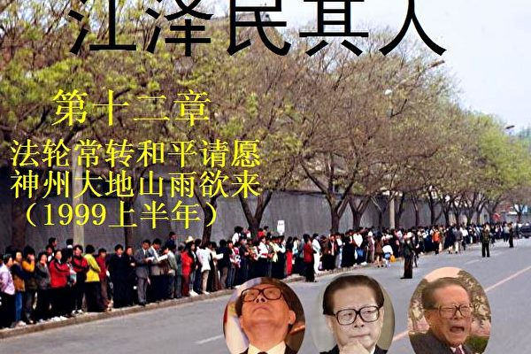</td>

【大纪元6月11日讯】1999年可谓是中国的多事之秋。

一向被称为火药桶的巴尔干半岛发生了塞尔维亚军队大规模屠杀阿尔巴尼亚平民的种族清洗事件，超过一百五十万阿尔巴尼亚人逃离家园。据难民描述，至少在科索沃省内有75座城市和村庄发生了大规模屠杀，被集体处决的阿族人达到5000人以上。

当时国际社会对于米洛舍维奇的屠杀罪行群情激愤，然而中国大陆却因为一言堂的宣传对此一无所知。由于中国和俄罗斯的杯葛，联合国未能采取军事行动，而以美国为首的北约出于人道主义考虑，于3月24日对南斯拉夫实施空袭。

<b>1.“消气外交”</b>

当时人大会议已经结束两个星期，朱镕基总理在人大的记者会上谈及出访美国的问题时曾经说：“因为既然你们有气，我就要去给你们消消气。”但北约空袭开始，再去美国商谈WTO问题并做大幅度让步，恐怕无以安抚国内已经被煽动起来的民族情绪，但不去商谈似乎又错过了一个大好时机。

政治局专门为此召开会议，进行讨论。李鹏和钱其琛都反对朱镕基的美国之行，认为他所谓的“消气外交”是有求于人，也是示弱于人。但江泽民极力主张朱如期动身。谈成的话，自然归功于总书记，并会成为江任期内可以载入史册的成绩；谈不成，也可以煞一煞朱镕基功高震主的锐气。在江泽民当时和幕僚的一些谈话中，似乎江泽民更希望朱铩羽而归。

如果不是因为江泽民需要朱镕基为他收拾千疮百孔的经济烂摊子，他根本就不会去用朱。从上海开始，江就一直妒忌朱镕基的魅力。朱镕基每次接见记者和会议发言都能够说出一些真诚而又感人肺腑的话，不但比江的讲话要实在，更显得充满正气或人情味，就连香港台湾的漂亮女记者们也常常对朱老总投以敬佩的目光。

朱镕基的态度是很明朗的，他看到加入世贸会对中国的农业、电信和金融业造成冲击，另外国营企业效率低下，公平竞争会导致许多企业倒闭，因此并不想做太大让步。但江泽民指示他说：“我看中美之间农产品协定、电信、金融领域都可以答应美国的要求，我们一到美国就宣布同意签署《农业合作协议》，我想可以和克林顿达成一种默契，其它的慢慢答应，争取打个漂亮的政治仗。”

朱镕基此次“消气外交”可谓大受挫折，尽管所有的让步都经过江泽民的同意，但因为美国不认为中国是市场经济国家，又提出很多附加条件，到朱回国的时候，签署WTO已经基本没有指望了。中共元老们却对朱镕基的让步十分不满。一直深居简出的乔石知道江扮演的角色后十分气愤，他说：“国家利益至上，这是任何时候，任何情况下都不能忘记的。”万里、宋平等人甚至骂这些协议是新“二十一条”。江泽民一看形势不对，就耍了个滑头，用一句意味深长的话回应元老的指责——“将在外，君命有所不受。”把这一切责任轻轻巧巧地推到了朱镕基身上。

4月21日，朱镕基访美归来。江泽民为了避免和朱镕基见面，带着中办的人去湖北开会，并授意李岚清去了辽宁。朱镕基回来时，欢迎场面冷冷清清。在随后的政治局会议上，江变过脸来责问朱“谈判为何要超越政治局当初确定的底线”，并故意当着朱的面，表扬和朱一起出访的吴仪说：“吴仪同志敢于坚持立场，不以原则做交易”，让朱非常难堪。

看到朱镕基的锐气消磨了许多，江泽民有一种扬眉吐气的快感。

<b>2.中共早已了解法轮功</b>

中共建政后逢“九”必乱似乎成了规律：1949年建政；1959年，镇压西藏“叛乱”并与印度开战；1969年和苏联打了一仗；1979年有中越战争；1989年先是镇压了西藏“骚乱”，接着就是“六四”屠城；1999年则发生了“镇压法轮功”事件。

外界对法轮功有两种误解：其一是认为在江泽民开始镇压法轮功的时候，他对法轮功并不了解，中共高层也几乎对法轮功一无所知——这完全不符合事实；其二是认为镇压和迫害是从1999年开始的，在此之前，中共一直和法轮功和平共处——这也不确切。

事实上，中共高层对法轮功很早就了解，也非常清楚。但其中也有人试图搅浑水，中间出现不少波折。

李洪志先生在1992年5月开始传法，当时在北京紫竹院有一个相当大的炼功点。紫竹院附近有许多退休老干部，有的是部队的退役将军，也有的是国务院或中央机关的退休高干。这些人的资历比江泽民、朱镕基、罗干、李岚清等人老得多，是属于真正的被中共称为“老一辈无产阶级革命家”的人，有的人甚至是参加过长征的。十五大的这些常委原来都是他们的下属，属于小字辈。

国务院有个退休干部姓周，原来是朱镕基的上级，见到朱的时候都叫小朱。这些退休干部闲着无事，练气功的人非常多，互相之间也走动很频繁。他们开始炼功后，也向后来这些身居高位的下属介绍过法轮功。

至少在1996年以前﹐紫竹院就有一位法轮功学员亲自到江泽民的家里教王冶坪炼功。

李岚清原来在外经贸部当部长，他是另一位法轮功学员的顶头上司，两人原来关系不错。早在1995年，这位学员也说起过向老部长李岚清介绍法轮功的事，但他主要是介绍法轮功对国家和民族的益处，还给了李岚清一本《转法轮》。

李鹏也看过《转法轮》，是他的电力工业部的一个副部长给他的。由于中南海里江住李鹏隔壁，所以李鹏也送了一本《转法轮》给江泽民。

江泽民原来在武汉热工所的上级也炼功，江泽民和武汉热工所的人聚会时，老同事也给他当面介绍过法轮功。江泽民后来说他1999年4月25日才第一次听说法轮功，这是公然撒谎。1996年，江泽民去视察中央电视台，看见一个工作人员桌子上有一本《转法轮》，还对这位工作人员说“《转法轮》，这本书挺不错。”

罗干也是在1995年就知道法轮功的，是他原来在机械科学院的老上级和老同事介绍的。

胡锦涛至少在1998年就了解了法轮功。他原来在清华的同学张孟业得了肝硬化肝腹水，面色青黑浮肿，被医院判了死刑，后来修炼法轮功后起死回生。清华校友聚会时，张孟业在1998、 1999年两度到北京当面向胡锦涛介绍他的亲身经历，并给胡锦涛的夫人寄过法轮功的书籍，希望他们也能炼功改善身体，胡锦涛夫人曾回寄明信卡以表谢意。1999年的那次聚会正好是“4.25” 当天 （万名法轮功学员在国家信访局和平上访）。胡锦涛夫妇在参加清华同学聚会后回中南海时看到了这一奇观，随即通过在北京的同班同学转告了正在南下火车上的张孟业，提醒他注意。

从1992年开始，各大部委就有人开始炼功，人数越来越多，有的在任副部长也炼。从部长、副总理到人大委员长、副委员长、政协主席、副主席，几乎人人都看过《转法轮》。中共七个政治局常委的夫人也都练过法轮功。当时法轮功因其对人身体和精神道德的改善作用巨大，人传人，速度远远超过一般人的想像。到1999年，大陆真正看过《转法轮》的超过一亿人。

<b>3.山雨欲来风满楼</b>

李洪志大师学员众多，其中也难免有犹大。在传法初期，有几个长春的负责人一再违反法轮功的规定，贪污挪用当时十分紧张的资金，篡改法轮功的功法等，李大师一再给他们改过的机会，但遗憾的是这些人最终还是走上了与法轮功对立的路。从1994年开始，他们就向中共13个部委写信诬告法轮功，写了几十万字，三大本，罗列12条罪状，却没有任何事实根据。这些材料就是中共1999年刚刚开始镇压法轮功时所罗列的那些诬蔑之词。

1995年2月9日，中国法轮功研究会向中国气功科学研究会（并转报有关部门）写了三份详细的汇报材料，其中有一份专门针对长春8个人的揭发材料逐条解释了事实真相。当时很多领导得知真相后都非常惊讶，还说：“原来法轮功这么好，那为什么你们不跟我们联系呀？我们一直不知道你们呀！希望今后多联系。”这样，1994年底的诬告揭发材料事件就算解决了。

关于气功，中共前总书记胡耀邦曾经作过一个著名的批示。1980年2月，由《自然杂志》编辑部主持，在上海召开了第一届人体特异功能讨论会，邀请一些特异功能人士进行现场测试，胡耀邦也派秘书到场参加鉴定。胡耀邦在北京亲自写了一个字条并密封于容器中，只有他一个人知道，派秘书送来鉴定。后来秘书把特异功能者透视看到的字样带回去，胡耀邦检查他亲自密封的容器，核对字条，终于确信人体特异功能的存在。不久胡耀邦指示中宣部，对气功和特异功能“不宣传、不争论、不批评”。同时，允许少数人进行研究。82年4月，中宣部下发了传达这个精神的通知。这就是著名的“三不”政策。

1996年的时候，中宣部副部长徐光春趁负责气功的副部长出国一个多月之际，召集十个中央大报总编开会，要光明日报刊登诋毁法轮功的文章，并要其它各大报转载。随后，中宣部管辖的新闻出版署向全国各省市新闻出版局下发内部文件，以“宣扬迷信”为由，禁止出版发行《转法轮》、《中国法轮功》等法轮功书籍。徐光春这么做实际上违反了胡耀邦制定的“三不”政策，想通过打击法轮功捞取政治资本，当时就想给法轮功扣一个“初级简陋邪教”的帽子。

但是各大报都有许多人修炼法轮功，真正执行镇压的国家机器——公安部中炼功的人就更多。原来公安部的部长王芳是个气功爱好者，夫人则是虔诚的佛教徒。后来王芳退休后到了中华见义勇为基金会。受到王部长影响，公安部练气功的人相当多。尤其到了司长、局长、处长这一级，还有很多外地公安局或公安厅的厅局长就是法轮功学员。法轮功研究会的成员叶浩和李昌原来都是公安部的副局长﹑处长。

1996年的镇压根本没来得及开始就收到了几十万封群众来信，澄清法轮功的真相，后来不了了之。罗干在1997、1998年两次想把法轮功定为“邪教”进行镇压。这倒不是因为法轮功做错了什么，而是罗干那时当了中央政法委书记，官儿坐到头了，要想继续往上升，就必须做出大动作来。这个和战争时期军人尤其受到重视一样。罗干也想把水搅浑，这样他这个政法委书记才能成为政治焦点。

罗干当时发的文件明显带有构陷的性质，先是声称法轮功是“邪教”，然后让各地公安去搜集证据，等于“先定罪，后调查”。当时陆续有公安、统战部和特工到法轮功的炼功点上学功，并和学员一起学习《转法轮》，其实都是去卧底。但是法轮功无底可卧，因为法轮功学员的一切活动都是公开的，而且来去自由，谁愿意来炼都行，不愿意了就走，既没有人员登记，也没有会费。很多卧底人员倒因此机缘而对法轮功有了深刻了解，成为坚定的学员。

但罗干的两次“调查”还是在一些地区造成了严重后果。如：辽宁省朝阳市公安局，向所属公安部门发出了朝公发（1998）37号《关于禁止法轮功非法活动的通知》，有的辅导员被数次罚款，累计金额达4000多元。有的不给收据单，有的只给白条。由此引起40余人到公安部上访；1000余人联名投诉朝阳公安局侵害公民合法权益的违法行为。新疆、黑龙江、河北、福建等地还出现基层公安部门强行驱散炼功群众，非法抄家，私闯民宅，没收属于个人的私有财产等违法乱纪问题。

罗干搜集不到资料也很着急。他发现公安部这些负责气功的人都很懂气功，很多人也炼。罗的镇压命令下去之后，相关的负责人不要说抓紧落实，反而连动都不动。罗干在1996年开始为此特意改组公安部，不但把编制改了，原来管气功和懂气功的人一律调走。

朱镕基知道这件事情后把罗干叫去训了一顿，说他“放着大案要案不抓，却用最高级的特务手段对付老百姓”。搞得罗干灰头土脸，但是他仗着和江泽民关系好，把朱镕基对法轮功的一份正面批示扣在手里，没有下发。

<b>4.“科痞”何祚庥</b>

1998年5月﹐罗干连襟何祚庥挑起了北京电视台事件。事情的起因是何祚庥对北京电视台《北京特快》节目的一个记者造谣﹐说中科院一个孙姓的研究生﹐因练法轮功导致精神病。实际上孙当时表现的不正常状态和法轮功毫无关系。孙的室友和孙的同学都多次以详细具体事实向何讲清了。可何祚庥在十分清楚事实的情况下﹐在电台竟仍用同一假证栽赃法轮功﹐纯属故意。许多从法轮功中受益的人自发去北京电视台澄清事实真相。北京电视台的一个副台长看到法轮功学员的祥和﹐在了解真相后立即决定制作节目挽回错误宣传的影响。事情得以圆满解决。

何祚庥号称是“两院院士”，实为政治投机分子。他善于在科学家面前冒充政治家，在政治家面前冒充科学家，尤其善于从意识形态领域批判真正的科学。由于鼓吹“自然科学的阶级性”，何祚庥得到中宣部科学处处长的赏识，大学毕业后转到中宣部从事意识形态宣传，利用他井底之蛙的见识，在科技界到处挥舞大棒。

举例来说，上个世纪初凯库勒发现苯的环形结构，之后数十年化学家对此结构一直知其然不知其所以然，后来诺贝尔化学奖得主泡林提出“共振论”概念，合理地解释了凯库勒模型， 此为量子力学在化学结构学的开始。但是何祚庥等指责已经被证明的凯库勒模型是“阶级调和论在科学界的反映”，中国大批的结构化学专家因此受株连而检查“资产阶级立场”，中国量子力学研究因此受到严重冲击而长时间中断。

著名犹太裔学者维纳曾在清华任教，是何祚庥的校友。1965年，他研究发现，老鹰在捕捉兔子时很少失手，这是因为老鹰脑子中有一套反馈闭环系统，能根据兔子的方位、速度不断调整自己的飞行路线，直至成功。如果将类似的系统装在高射炮上，将使命中率大为提高。由此维纳认为生物界和非生物界存在一定的共性。而何祚庥认为阶级之间尚不能调和，更妄论生物与非生物了。何祚庥等人再一次挥舞“阶级调和论”的棒子把多位科学家打入冷宫。

何祚庥还抡起意识形态的棍子批判过摩尔根的遗传学说、用马列主义批判盖尔曼获得诺贝尔奖的“夸克模型”，一直到晚年转而批判气功，声称是“伪科学”。人称何祚庥“人老心红，战士风采依旧，棍法依然娴熟”。

因为何祚庥打击科学、维护中共意识形态有功，《红旗》杂志力荐他当了中科院的院士。何则继续利用他的院士头衔拍中共、特别是最高领导人的马屁。2001年，江泽民的“三个代表”宣传如火如荼，何祚庥在中科院的一次量子力学研讨会上发言说“量子力学的运动规律符合江泽民的三个代表精神”，当即有几位正直的学者拂袖而去。而更多的人则是敢怒不敢言。

因为罗干想借打法轮功向江泽民邀功请赏，罗的连襟何祚庥也就一次次不遗余力地打着科学的外衣诋毁法轮功。因为何祚庥的名声实在太差，北京市的一位副市长亲自指示，今后北京市的媒体不得刊登何祚庥的欺骗言论，对气功仍旧执行中央“不干涉、不宣传、不打棍子”的政策。

<b>5.中央调查结论</b>

国家体育总局也于1998年5月对法轮功进行了全面调查了解。9月由医学专家组成的小组为配合此次调查，对广东12553名法轮功学员进行表格抽样调查，结果表明祛病健身总有效率为97.9%。10月20日，国家体总派到长春和哈尔滨的调研组组长发表讲话说：“我们认为法轮功的功法功效都不错，对于社会的稳定，对于精神文明建设，效果是很显著的，这个要充份肯定的。”其间，大连、北京等地对法轮功功效的民间调查也得出了一致的结果。

1998年下半年，以乔石为首的部分全国人大离退休老干部，根据大量群众来信反映公安非法对待法轮功炼功群众的问题，对法轮功进行了一段时间的详细调查、研究，得出“法轮功于国于民有百利而无一害”的结论，并于年底向江泽民为首的政治局提交了调查报告。

法轮功继续快速发展，到1999年初，国内有媒体在报导健身运动的时候提到法轮功的炼功人达到了一亿。同时《转法轮》被翻译成多国文字，传到世界三十个国家和地区。不少西方人甚至不远万里来到中国学习中文，只希望能像中国法轮功学员一样能够读懂《转法轮》的中文原著。

1999年2月，美国一家权威性杂志《US News and World Report》发表文章谈到了法轮功在健身方面的好处：“国家体育总局局长说：‘法轮功和其他气功可以使每人每年节省医药费1000元。如果炼功人是一亿，就可以节省一千亿元。朱镕基对此非常高兴。国家可以更好地使用这笔钱。’”

<b>6.“四‧二五事件”</b>

何祚庥因为无法继续在北京刊登诬蔑法轮功的文章，就跑到天津的一家小报——天津教育学院的杂志上发表了《我不赞成青少年练气功》一文，将明显违背法轮功原则的表现归罪在法轮功头上，暗示读者修炼法轮功会出大问题，甚至导致亡国。许多法轮功学员感到，如果不能澄清事实，不但学员们的合法炼功权利会受到威胁，炼功群众还可能被别有用心的政客硬拉入肮脏的政治斗争中去。于是数千名法轮功学员自发陆续前往编辑部澄清事实。在双方和平理性的会谈即将结束，出版社方面准备发声明更正之际，天津市突然出动防暴警察，驱散请愿人士，殴打并逮捕了45名法轮功学员。海外媒体直指罗干是此次暴力行动的直接指挥。天津市政府也对去请愿的法轮功学员说，镇压是北京的命令，并鼓励他们去北京反映情况。

消息传到北京，当时的北京法轮功研究会负责人李昌、王治文、纪烈武等商谈后，决定于4月25日去北京上访，得知这一行动的法轮功学员也相互联络，结果那天紧邻中南海的国家信访局外请愿人群达到一万余人，这就是震惊中外的“四‧二五事件”。

那时，朱镕基刚刚访美归来不久。受过右派之冤的朱镕基显然把群众上访视为对政府的信任，更何况他于1998年在法轮功问题上曾亲笔作过正面批示，因此他一改中共对于民间请愿不接触、不对话、不妥协的传统，亲自接见上访人群。

朱镕基说：“你们有宗教信仰自由嘛！你们有什么问题，你们派代表来，我带你们进去谈。”朱停了一下，又接着说，“我也没法和你们这么多人一起谈呀！”

由于法轮功学员都是自发前往的，彼此大多不认识，并没有什么代表，于是朱镕基就点了最先主动举手的三个人。朱镕基一边转身带着三位代表朝中南海西门走，一边大声问道：“你们反映的情况我不是做了批示吗？”这几个人都愕然回答：“我们没有听说呀！”朱镕基可能意识到他的批示被压下去了，马上换了话题说：“我找信访局局长跟你们谈，找副秘书长跟你们谈。”说着转向工作人员，吩咐找人。

法轮功学员的要求很简单，第一、天津放人；第二、炼功自由；第三、合法出版法轮功书籍。朱镕基立即指示天津方面放人。

实际会谈进行得并不十分顺利，政法委书记罗干、中央办公厅副主任王刚、公安部部长贾春旺、国务院副秘书长崔占福以及北京市常务副市长孟学农等与法轮功学员对话，但是因为江未给出谈话底线，罗干又想找法轮功的麻烦，没有答应任何要求。后来法轮功研究会的李昌（公安部官员）﹑王友群（监察部官员）等五人也进了中南海进行对话。

在国务院工作人员和法轮功代表会谈之际，上万名学员一直在外静静等候。到晚上八点多，会谈完毕，在得知天津方面已经释放被捕的法轮功学员后，中南海前的法轮功学员也很快散去，临行时，地上连一片碎纸都没有留下。

海外媒体一片赞誉之声，既赞赏法轮功学员的和平理性，也赞赏政府的开明，并称这是中共建政后官民第一次和平理性的对话，开中共历史之先河。

事情如果这样落幕无疑是个皆大欢喜的局面，但是却有一个人暴跳如雷，这个人就是江泽民。

<b>7.江泽民的妒忌</b>

江泽民对法轮功创始人李洪志先生的妒恨由来已久。早在1993年，江泽民就常常听别人说起李先生的大名。

江泽民身边有人对法轮功很感兴趣﹐也了解到不少关于法轮功的消息﹐回来时不时地给江泽民透露点﹐如谁谁得了什么病给练好了﹐谁谁躺着抬进来﹑站着走出去。他偶尔也会说起李大师提及某些高层领导人前世的事情。这时江就会越听越着急﹐他最想知道的是自己的前世到底是谁。有一天﹐江泽民正躺在床上闭目养神﹐一听到那人来了﹐一骨碌从床上爬起来﹐急切地问﹕“李大师说到我没有﹖有没有说我是谁转生的﹖”那人说没有﹐江泽民满脸的失望和恼怒给在场人留下了非常深刻的印象。

王冶坪是在1994年跟人学过法轮功的。有一天晚上﹐王冶坪练功的时候﹐感到旁边有人学着她比划﹐睁开眼一看﹐原来江泽民正在旁边偷偷地比比划划﹐两只手也交叉在腹前。看见王冶坪发现了﹐江泽民恼羞成怒﹐命令老婆以后不许再练。他的说法是﹕“连我老婆都信李洪志了﹐谁还来信我这个总书记﹗”

江泽民那个时候还非常喜欢学李先生的手势和动作。最典型的就是两手交叉于腹前的姿势。原来江泽民发表讲话的时候﹐手没地方搁﹐就向身体两侧直直地伸著。后来发现李先生总是两手叠扣在小腹前﹐之后﹐江也开始跟着学。

1995年，江泽民开始“三讲”，无论中共中央怎么卖力去推广，全国从上到下也都是“认认真真走过场”，没有几个当作什么著作去学，但是江泽民却到处都能看到《转法轮》这本书，也知道全国炼功的人增长极快。那些修炼法轮功后身心受益的人对李大师的尊敬和感恩不是用语言能够形容的。更让江泽民受不了的是，时不时总有人在江的耳边说起李大师的高风亮节，钦佩之情溢于言表。

1998年，中国经历了一场洪灾。江泽民当时在视察一处大堤时，看到一群人在埋头苦干。江很得意，对手下说：这些人一定是共产党员。叫过来一问，结果回答说是炼法轮功的学员。江当时就妒火中烧，阴著脸掉头走开了。

如果说那些都仅仅让江泽民心里不舒服的话，“四‧二五”事件则让江泽民感到很恐惧。

作为“六四”屠杀的参与者和最大受益者，时值“六四”十周年之际，江想当然地担心会重演十年前风起云涌的群众抗议活动。“六四”留给江泽民的除了一根红朝“核心”的权杖外，还有一个深刻的教训，那就是决不能听任事态的发展而必须提早镇压，否则镇压的成本会大大提高。

江在第一时间打电话给北京卫戍区，询问如果法轮功深夜仍然不撤，驻京军队是否可以立即集结，并架走中南海附近的法轮功学员。接电话的人立刻表态：“北京军区时刻准备听从江主席的指挥。”江泽民十分满意，悬著的心也放下来一点，后来此人被江连升了好几级。

下午的时候，江又给由喜贵打电话，让他尽快布置戒严，江说他要出来“视察”一下情况。

江的“视察”是在防弹轿车那深色玻璃后进行的，法轮功学员的前面是为江的视察而特意布下的武警警戒线。在江泽民看来，法轮功的人数之多是在和党争夺群众，方式之和平理性是因为组织严密，来到中南海就是公开和他江泽民叫板，更令他受不了的是他居然看到了几十位肩上有军衔的军人，这些军人竟然会追随法轮功而不去追随他这个军委主席。

此时，外电对此事件双方的赞赏，无疑也是对朱镕基的赞赏，对江泽民来说等于火上浇油。

自从1994年10月的中共四中全会正式宣布中共第二代领导集体向第三代领导集体的权力交接已经完成，江泽民在曾庆红的辅佐下在政治上打了几次胜仗，从倒陈希同、到巩固军权，从陈云、邓小平等相继作古，到香港回归，江泽民一步步在中央站稳了脚跟。

虽然如此，江泽民既达不到毛泽东“老子天下第一”的气魄，也没有邓小平一言九鼎的份量。每一件大事情，都需要常委或政治局集体讨论通过。这次江泽民看到了法轮功是个打不还手，骂不还口的和平团体，认为找到了一个没有任何威胁的对手。江泽民盘算：利用打击法轮功来强迫全党表态，看看谁在此时会站在他自己这边，这和赵高以“指鹿为马”来考验群臣忠心的方法是一模一样的。

此外，尽管拿不出令人信服的证据，江泽民还是极力把法轮功描绘成有“海外敌对势力”支持的“危险”政治团体，这样就使得他对法轮功群众镇压的个人决定具有了特别意义——如果江的决定“在危难时刻挽救了党”，那么无疑他将在党内的历史上占有重要地位，而且其他人很难有反对的理由。江泽民相信，不出三个月一定能迅速消灭法轮功。因为这几十年来政治运动中积累的整人手段，足以使任何一个人生不如死。江泽民盘算，一旦这次毫无风险的镇压成功，从此自己就可以在党内享有傲人的政治资本。

<b>8.刚愎自用</b>

于是，4月25日当晚，江泽民第一次在没有征求任何人意见的情况下，模仿毛泽东“炮打司令部”的做法，给政治局全体人员写了一封信。江在信中假装忧心忡忡地说：“难道我们共产党人所具有的马克思主义理论，所信奉的唯物论、无神论，还战胜不了法轮功所宣扬的那一套东西吗？”

为了说服众常委支持自己的判断，江又在信中问道：“（法轮功）究竟同海外、同西方有无联系，幕后有无‘高手’在策划指挥？这是一个新的信号，必须引起我们的高度重视，敏感期已经来临，必须尽快采取得力措施，严防类似事件的发生。”江还说：“对法轮功这种组织，不能低估其带有宗教色彩的号召力，有关部门必须加强研究并制定防范措施；由于法轮功总部在国外，这次行动不排除该组织有境外背景的可能。”

这封信随后被中办作为通知印发，并特别注明：“请注意中央办公厅的通知要求的是：学习贯彻落实，不是征求意见、或讨论研究。”

在“四.二五事件”的第二天，罗干、贾庆林和政治局常委召开会议商讨处理意见。江泽民一进入会场，脸色就十分难看。他掏出一叠材料，甩在了桌子上说：“谁说找不到法轮功学员聚众中南海的蛛丝马迹？互联网上就有法轮功学员聚集中南海的通知。这次居住在四面八方的两万多名学员，以化整为零的方式进入北京，在事先有组织的情况下一朝之间包围中南海，而公安部门竟然事先毫不知情，这样的失职决不允许再发生！”江转头看着罗干，声色俱厉地说：“我们的安全部门，还有北京市都如此麻木。都危及政权本身了，还一点没有感觉。同志们呀，这是多么可怕。如果不引以为鉴，谁能保证不来第二次、第三次？”

接着，江泽民开始装傻，“听到法轮功这个名词，除了感到希奇古怪，真不知道这是一个什么样的组织，是怎样成立的，头头儿是谁？”

政治局七个常委，除了江泽民之外，其他人都明确表达了反对意见。朱镕基说：“法轮功的学员以中老年人居多，妇女居多，他们最大愿望无非就是健身而已。一位法轮功学员说‘现在工作单位对生病又不报销医药费，而法轮功可以强身健体，有何不好？再说现在下岗工人那么多，法轮功可以增进道德品质，群众从不闹事，比先进模范还先进模范，这么好的活动，政府为什么不支持。’所以我觉得，说这些人有政治企图，讲不过去。另外，我们不能再用搞运动的方式解决思想问题，这样不利于经济建设这个大前提，更不利于国家对外开放的形象。法轮功中如果有害群之马，我们要处理，至于普通炼功群众，就让他们练去吧！”

江泽民一下子站起来，指著朱镕基的鼻子喊道“糊涂！糊涂！糊涂！亡党亡国啊！我很痛心，我们的同志政治敏锐度如此之低。法轮功问题不抓紧解决，会犯历史性的错误！”

“那总书记说怎么办？”罗干小心翼翼地问道。

“灭掉！灭掉！坚决灭掉！”江泽民挥着双手喊道，“现在当务之急是查清楚法轮功的人数、分布和负责人的情况，每个机关、单位、居委会都要查到。同志们，法轮功在和我们争夺群众，我们一定要上升到‘讲政治’的高度，上升到党和国家生死存亡的高度来认识这个问题。一查到底，决不姑息！”

整个政治局会议期间，江泽民又跳又叫，声嘶力竭。其他常委看到江这个样子，都沉默了。

其实，江泽民如此气急败坏还有一个没有说出口的原因，就是乔石对法轮功的支持。

乔石虽然在十五大上退休，但是他把邓小平指定胡锦涛为第四代领导核心的秘密，向全世界公开，等于宣布江泽民到十六大就必须退休，而且只能传位给胡锦涛。不管江如何想继续连任或提拔自己的人马接任总书记和国家主席，都做不到了。仅此一点，凡是乔石支持的，江泽民就都要反对。就像当年杨尚昆兄弟提拔的100名中高级将领中，有一些人并不属于杨尚昆派系，被提拔仅仅是因为工作能力出色，但鼠肚鸡肠的江泽民就一定要把名单上的所有人降级使用，比如四十二岁就任副总参谋长的何其宗，只因为受到杨家兄弟的器重，在江泽民得势后被发配到南京军区任副司令员，官降一级，而且永不提升。

出于同样的偏狭心理，由于乔石支持法轮功，江泽民就偏偏要镇压，而且要往死里打。

乔石不但在1998年做出“法轮功于国于民有百利而无一害”的结论，还特意提到“得民心者得天下，失民心者失天下”的古训，令江泽民大为不悦，当即批示（大意）：写得玄玄乎乎，我看不懂，并把报告推给罗干。罗干心领神会，以“法轮功有国外政治背景”为由，不断制造事端，嫁祸法轮功。

李瑞环对于镇压是非常反对的，在各种场合他都表达他的不满，但可惜他既没有组织保障，又处在一个花瓶党派主席的身份，说了也是白说。当时中国流行一个顺口溜，中国四大闲：大款的老婆，领导的钱，下岗职工，李瑞环。

<b>9. 用假情报为镇压罗织“依据”</b>

江泽民和曾庆红看到了情报系统对于夺取和巩固权力、打击异己，能够发挥巨大的政治作用，所以一直想把国家安全部牢牢地控制在自己手中。

江泽民当上总书记后，为了控制国家安全部，成立了“中央政策研究组”来指挥国家安全部收集情报。到了1997年，当上政治局候补委员、组织部长的曾庆红安排自己的人当国家安全部部长，江泽民和曾庆红终于直接把国家安全部牢牢地控制在自己手中，为自己的政治目的服务。

江泽民由于妒嫉失去了理智，一心要镇压法轮功，但是其他六名政治局常委都不同意，觉得没有依据。为了胁迫其他人同意，江泽民和曾庆红终于想了一个有效的办法，就是利用国家安全部来制造镇压的“依据”。于是国家安全部在美国的特工很快就送来了自己制作的假情报，说：法轮功创始人后面有美国中央情报局（CIA）的支持，CIA给法轮功提供了数千万美元的经费。这些“重大敌情”通过国家安全部传到了高层，其他政治局常委难辨真假。

正如1992年十四大之前，江泽民和曾庆红叫人在北京四处散发谣言，说杨尚昆、杨白冰兄弟要“夺军权”和“平反六四”，在欺骗邓小平的时候起到了一个极其关键的作用，江泽民和曾庆红这一次只是故伎重演。

由于中共对“敌对势力”的高度戒心、恐惧以及仇恨，江泽民用这些“确凿的证据”说，这是要“亡党亡国”呀，必须要全力镇压。经过江泽民的策划把事情上升到了“亡党亡国”的高度上，中共最怕的就是“亡党”，也没人敢承担“亡国”的帽子，其他政治局常委哪敢再反对江泽民镇压？最后江泽民“统一”了思想，开动中共暴力机器全面镇压法轮功。

江泽民和曾庆红通过国家安全部造谣说法轮功后面有美国中央情报局（CIA）的支持，不仅迷惑了众多中国人，甚至也欺骗了不少外国人。例如，法国人一直不太服气美国人做西方社会的领头羊，常常和美国人较劲，当初法国人盲信了中共的情报，后来通过自己的情报系统经过长时间和多方了解，最后知道了没有这回事，才对法轮功放松了警惕。现在国际社会都知道，法轮功背后没有任何政治势力。

<b>10、“缩头乌龟”</b>

1999年的5月8日，在北约和南斯拉夫交战期间，中国大使馆遭三枚导弹袭击，三名记者死亡。美方称误炸，但中方不认可。

事件发生后，军方要求江泽民以军委主席的身份立刻穿上军装发表电视讲话；也有人建议江泽民穿上西服，以国家主席的身份发表电视抗议，并立即召见美国驻华大使。高层吵成一团。

遇事胆小如鼠的江泽民此时慌了手脚，根本不知道应该说什么，抗议到什么程度。在和曾庆红商量后，他决定把这个非常棘手的问题交给胡锦涛去办，当时胡是国家副主席，这种事怎么也轮不到他出头，除非正职病危。所以，要么国家主席江泽民出面，要么国务院总理朱镕基出面，但是江曾在这个时候考虑的是一石二鸟的毒计，如果朱镕基在这个时候不出面，愤怒的人群自然会把炸馆之事和朱镕基的“消气外交”联系起来，把怒火发在朱镕基身上，让他继续去背黑锅。另一方面一定让胡锦涛出面，如果胡对美国的态度表现软弱，会使他在愤怒百姓心中的地位一落千丈；如果太强硬，必然会引发两国关系紧张，这都可能成为十六大不许胡锦涛接班的理由。

在接下来的两天时间里，江泽民一直没有露面，中国民众对于集国家主席、军委主席于一身的江泽民的表现非常愤慨。到第二天晚上，人们才看到胡锦涛在电视上发表讲话。到第三天，江泽民还是没有露面，好象从人间蒸发掉了。中国人民大学开始出现“江泽民──缩头乌龟”，“中央领导人都死光了”等标语，全国上下，群情激愤。 

<h1 align="center"><b>《江泽民其人》13：迫害大法赤膊上阵</b></h1>
<H3><b>第十三章：迫害大法赤膊上阵 元凶巨恶一意孤行（1999下半年）</b>
</h3>
<td align="center">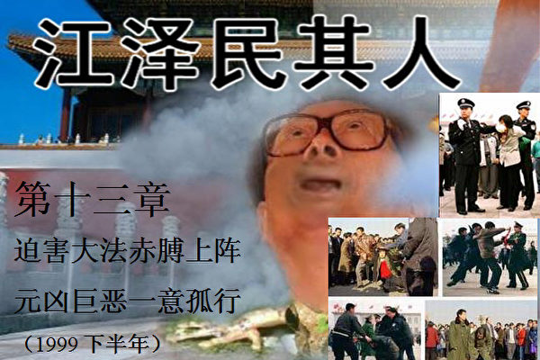</td>

【大纪元6月12日讯】江泽民当政十五年（包括后来垂帘听政的两年）经历了很多中国历史上的大事，比如香港和澳门的回归、加入世界贸易组织以及镇压法轮功，前面的事不是运气碰上了，就是利用其他人为己卖命而获，只有镇压法轮功是江泽民的独家“专利”。

镇压法轮功是江泽民政治生涯的一个转折点。如果说“六四”后进京，在险恶的政治斗争中，江是一步步站稳脚跟的话，镇压法轮功事件使江泽民立即背上了沉重的巨大包袱，这是企图速战速决的江泽民始料不及的。从江泽民一意孤行启动镇压机器那一刻开始，其命运就紧紧和镇压运动捆绑在一起，其一切决策也都是以此为中心。

恰如手无寸铁的基督徒在强大的罗马帝国长达300年的迫害中仍然屹立不倒一样，超世俗的信仰的力量是无法用世俗的概念去度量的。法轮功几年来和平理性的抗争让死不认错的江泽民骑虎难下。因此，要了解江泽民1999年之后的思想和行为，就必须对这场迫害有一个全面的了解。

<b>1. 罗织罪名</b>

从1999年“四‧二五”上访事件后，在全国范围对法轮功的调查摸底、舆论宣传准备、调动公安侦查搜集情报，以及各地党组织的思想准备工作就一直在紧张进行。江泽民把这当作头等大事来抓。

由于法轮功创始人李洪志先生1998年移居美国，江泽民甚至希望通过减少五亿美元的贸易顺差，引渡李先生回国。李先生于1999年6月2日发表了《我的一点感想》，其中说道：“我只是教人向善，同时无条件的帮助人解除疾病，使人达到更高的思想境界。我不收任何金钱与物质报酬。对社会对人民起到了积极的作用。普遍使人心向善、道德高尚。不知是不是因此而引渡我哪？……不过我听说通常引渡的人都是战争罪犯或人民的公敌。再有就是刑事罪犯。如果这样的话，我不知道我是符合以上的哪一条。”

李先生还说：“其实，我一再教人做人要以真、善、忍为准则，我自然也要做一个表帅。在我个人与“法轮功”弟子遭到无端的非议与不公正的对待时，都充分的表现出了大善大忍的胸怀，给政府充分的时间来了解我们，无声的忍受着。……其实我非常清楚有的人为何非要反对‘法轮功’。就是像媒体报导中说的学‘法轮功’的人太多了。一亿多人是不少，难道还怕好人多吗？不是好人越多越好、坏人越少越好吗？”

尽管江泽民可以看到李先生的所有谆谆劝善之言，但是他还是太习惯用自己那卑鄙小人的思维模式去猜测别人。江还认为没有人不怕死、也没有收买不了的人。所以，掌握了全部国家机器的江认为没有自己办不到的事情。

1999年6月7日，江在中央政治局会议上发表关于抓紧处理和解决法轮功问题的讲话，把法轮功的产生和迅速传播说成是“国内外敌对势力同我党争夺群众、争夺阵地的一场政治斗争”。

江泽民从来不为自己的结论提供任何论据和论证过程，也全然不顾法轮功和平、理性并且已经给亿万民众带来身心改善的事实，蛮横专断地要求所有共产党员、共青团员、在职干部、离退休干部，所在单位的党团组织和行政部门的领导都要停止修炼法轮功，并“在思想上划清界限”。

从政治局对他4月25日当晚写的那封信的反应上，江泽民感到大多数政治局委员乃至常委都在镇压法轮功的问题上相当冷漠，包括朱镕基领导的政府部门也认为把法轮功当作敌我矛盾处理实无必要。因此，江决定成立一个听命于他的跨部门领导小组，凌驾于一切政府机关之上，直接避开政府、司法系统、财政系统等部门对推行镇压命令的约束。于是他想到了李岚清。

当时在七名政治局常委中，除江外其他六名对镇压持反对态度。在中共高层口碑很坏的薄一波听说政治局其他常委都反对镇压，于是出来表态，表示坚决支持江的决定。

江泽民还决定去说服跟自己私交不错的李岚清。江泽民拿出党性和“亡党亡国”的帽子威逼李岚清，最终李岚清立场松动，同意了江的决定。

这样，江泽民按照他的设想成立了一个专门处理“法轮功”问题的领导小组，由李岚清任组长，并根据中共“枪杆子、笔杆子”的理论任命罗干和丁关根任副组长。江还任命公安部副部长刘京等有关部门的负责人为主要成员，统一研究解决“法轮功”问题的具体步骤、方法和措施，并指示中央和国家机关各部委、各省、自治区、直辖市密切配合。该机构于6月10日成立，故称其为“610办公室”。

就其性质而言，“610办公室”是个不折不扣的非法组织，其产生和存在都没有法律依据，和文革中的“中央文革小组”一样。“610办公室”的唯一目的就是绕过法律，绕过正常的经费和人员编制审批，调动全国的镇压和宣传机器迫害法轮功。这个非法组织的总头目其实就是江泽民，所有重大密令都是江泽民传达下去的。江怕留下证据，送去的密令从来不敢落款，但“610办公室”的人见到此类“白条”就会立刻执行。

江泽民利用自己独裁权力，采用非正常手段，绕开正常的法律体制，组建凌驾于各级司法系统之上的“610办公室”，并让“610”去胁迫从中央到地方的司法人员执法犯法，彻底中断了中国二十几年来的法制进程，对中国社会造成了难以估量的负面影响。

江泽民当时虽然跳得很高、喊得很响，但却也拿不出什么具体的办法。于是江泽民找曾庆红私下谋划，通过中央办公厅和国务院办公厅于1999年6月14日发表了《接待部分法轮功上访人员，中办国办信访局负责人发表谈话》，其中提到：“一、连日来，一些法轮功练习者纷纷传言，什么‘公安机关就要对炼功者进行镇压了’，‘党团员、干部参加炼功就要开除党（团）籍和公职’……这完全是无中生有、蛊惑人心的谣言……”“二、党和政府对待正常炼功健身活动的态度是十分明确的。……我现在再次重申：对各种正常的炼功健身活动，各级政府从未禁止过；人们既有相信并练习某一种功法的自由，也有不信某种功法的自由……”

现在回过头来看当年这些政府要员向全国正式发布的信誓旦旦的谈话和许诺，不难看出以江泽民为首的中共翻手为云、覆手为雨，从无信义可言。

本来法轮功的一切活动就都是公开的，所以那些信奉“真、善、忍”的法轮功学员对中共媒体并无戒心。但与此同时，大量的公安和特务伪装成法轮功学员，打入所有的法轮功炼功点搜集信息，对他们的各种活动进行照相和录像，调查清楚了每个法轮功炼功点的负责人的情况。

<b>2. 开始镇压</b>

7月19日，江泽民召开中共中央高层会议，以总书记的身份下达了开始镇压的命令。上万名武警荷枪实弹进入北京，周边军队进入一级战备状态。7月20日，江泽民下令进行了一场遍及全国范围的大逮捕，所有被认为是法轮功“骨干”的成员都被中共拘留或带走问话。江还在7月29日试图通过国际刑警组织引渡李先生回国，但遭到国际刑警组织的断然拒绝。

“六四”之时，中共就是先用机枪坦克杀人后使人们不敢说话，然后再用宣传机器全力说谎，在接下来只有一个声音的环境中，许多人都听信了中共的谎言。江泽民认为这一招对法轮功应该同样奏效。江下令销毁所有法轮功的书籍和音像制品，同时指示封锁互联网上所有可能得到法轮功真实资讯的网站，迫使民众只能从被江操控的国内媒体获取有关讯息。

在镇压前，北京市电信局提供263服务，也就是用户无需登记用户名和口令，拨打263后即可上网浏览，并且可以注册电子邮件信箱。在镇压开始的那一刻，263以技术维护的名义，停止邮件服务48小时，阻挡国内民众通过邮件与海外及时联系。

在镇压开始两天以后，7月22日下午三点，江泽民精心准备的谎言就登场了。一部三十多分钟诋毁法轮功的电视片在全国反复播放，片中充斥了各种千奇百怪的谣言。比如李洪志先生1999年2月在洛杉矶的讲法，原始录像中有一句话说“过去人所说的那种劫难是不存在的”，但是在电视上当局恰恰把“不”字给剪接掉了，这样这句话就变成了“过去人所说的那种劫难是存在的”，然后以此为由，说法轮功在宣传世界末日。

1999年的中国国民生产总值达到8万3千亿元人民币，拥有世界上数量最庞大的军队、武警、公安、劳教、监狱系统，还有2000多种报纸、杂志、上百家广播和电视等宣传机构，仅中央电视台就有12个电视频道，覆盖全国，而且通过卫星用外语向全球播放。7月20日以后，一夜之间这个庞大的国家机器忽然全力运转，目的只有一个——江泽民宣称：要在3个月内消灭法轮功。报纸、杂志、广播电台和所有的电视频道开足马力，24小时反复播放所谓的“揭批”文章和节目。警察把修炼群众从每一个炼功点赶走，将不服从的人押上警车抓走。所有的工厂、企业、学校、街道都要组织人们集体收看批判法轮功的新闻和节目。各国的中国大使馆也开始组织当地华人开“揭批会”，并向各国政府散发诋毁材料。全国上下烧书、抄家、抓捕、人人表态支持镇压，以及广播、电视、报纸铺天盖地的宣传批判，恍惚之间，如文革再临。

这里还不能不提到，江泽民同时还动用在香港收买的媒体对法轮功进行诋毁，其中最卖力气和最迷惑人的就是“凤凰卫视”。凤凰卫视表面看起来不偏不倚，但中共的重要稿件直接下到该电视台，不但一个字不能改动，而且谁如果敢提出任何异议，立即就得卷铺盖走人。工作人员都知道，凤凰卫视在最关键的时候，在最关键的问题上发挥着中央电视台不可替代的作用。

凤凰卫视总裁刘长乐是中共总参特务出身。1999年“4‧25”中南海事件后，刘长乐受罗干的秘密派遣，与伪科学家何祚庥合作，从99年5月就开始对法轮功竭尽造谣之能事，制作诬陷法轮功和法轮功创始人的专题节目，并在北京印刷发行了一本专门诬蔑法轮功创始人的书，不但内容荒诞无稽、通篇谎言，而且用词非常恶毒。凤凰卫视以民众喜闻乐见的形式包装自己吸引观众，以貌似公正的外表全力配合江泽民进行欺骗宣传，为镇压法轮功制造舆论，毒害了无数大陆和海外的华人。凤凰卫视人员后来纷纷出事，刘长乐被揭发参与中国银行前行长王雪冰经济违规及犯罪活动，接受盘问调查，中文台副台长赵群力驾机坠毁身亡，女主播遭遇重大车祸，资讯台记者被绑架。

看到江泽民倾尽全力镇压法轮功，不少社会学家当时估计，“以中国政府的力量，法轮功坚持不了一个星期。”

不过江泽民失算了。他一直没有搞清楚一个问题，法轮功实际上并不存在什么“骨干”，所谓的“负责人”也仅仅是在集体炼功的时候拿个录音机放音乐、或者有什么活动通知一下大家，除此之外，负责人与炼功点上的其他人没有任何区别。每一个人都有各自在社会上的工作，每一个人也都根据对《转法轮》的学习和了解去决定如何做。那种认为抓了“负责人”，法轮功就会群龙无首的情况并没有出现。大规模抓捕反而使那些普通的学员也都站出来，义无反顾地承担起和平请愿和讲清真相的作用。

从7月20日凌晨开始，大量的法轮功学员开始从各地涌向北京为法轮功鸣冤、上访，为自己的合法炼功权利申诉。7月21日和7月22日，中南海附近、西单、六部口、北海以及天安门等地不得不戒严。610办公室要求地方政府不惜代价阻止群众上访，通往北京的交通要道被严密封锁，军队进入一级战备状态。然而，仍然有许多人步行或骑自行车，穿山越岭赶赴北京。一些人在进京途中被当地公安截回并拘留，另一些人则成功到达北京。数万上访的学员被临时关押在丰台和石景山的体育中心。

在随后的几个月里，汇集北京城区的上访学员人数，最多时超过30万，而北京城近郊区长期以来都维持大约70万为法轮功上访请愿的人。这些人从政府官员、军人、知识份子、学生、商人到普通农民，从小孩到白发苍苍的老人都有。有些远在四川、云南、黑龙江、新疆的农民，甚至包括有些一辈子从没有出过远门的农村妇女，也毅然踏上了千里上访的遥遥旅途。一名吉林白山的妇女，在坐车去北京上访的时候被警察截在了辽宁，并被没收了所有的财物。她孤身一人，逃出警察局，从漫天风雪的东北，沿路要饭，走到了北京。一个四川农民在被北京的警察盘问时，打开自己的包袱，将9双穿烂的布鞋送到警察面前，说：“我走了这么远才到这儿，就为了说一句心里话。法轮功好！政府错了！”

当时到北京打横幅抗议的至少有两位省部级官员，出于安全考虑这里不便透露他们的名字。他们也同样被警察抓到，在询问并核实他们的姓名和身份后，警察吓了一大跳，赶紧让原单位领了回去。这里不但反映出修炼法轮功的人遍布各个阶层，同时也反映出江泽民的独裁，连这样高级别的干部也无法向江进言。

上访是中共在文革后为了解决大量冤假错案而制定的有中国特色的官民沟通渠道，是弱势群体讨一个说法的最后希望。江泽民在对待法轮功时，却制定了禁止为法轮功上访的“公安六条”。中共石家庄市“610办”在2005年农历新年之际下发了迫害法轮功的工作部署通知，该通知中有“六防”，其中最后一防就是“防止法轮功利用法律手段和上访搞对抗”。依法申诉被说成是“对抗”，就要被抓被判刑，“利用法律”就是“犯法”，这是江泽民迫害法轮功的一大隐蔽邪恶之处。可以说，江泽民在这方面是开了历史的“先河”。

江泽民感到最难以想像的是，尽管他已经下令采取了极其严厉的措施对待上访、请愿——包括罚款、监禁、开除公职，以及家庭连坐、单位牵连等手段，这些上访的法轮功学员似乎不为所动。江泽民简直无法相信世界上还有人会为了信仰而甘愿牺牲一切物质利益。这些法轮功学员对信仰的坚定，也让江更加妒嫉李先生，同时也更使他急于把法轮功镇压下去。

<b>3. 法轮功与国际社会的反应</b>

就在江泽民紧急动员镇压的时候，李洪志先生正好在澳大利亚悉尼参加世界各国部分学员主办的法轮大法修炼心得交流会。5月2日，李先生会见了《澳洲新报》、《自立快报》、《亚洲周刊》、中华电视公司等中文媒体的记者，当天下午，又会见了澳洲国家广播电视局、《悉尼晨锋报》、法新社等媒体的记者。

李先生在开场白中说：“我认为佛法是严肃的，通过媒体像做广告一样吹，这本身就是不严肃，所以我们就一直没有借用媒体来做这件事情。基本上都是学员觉得好，学了之后，他就把自己心里的感受，身体的好转，整个状态告诉他的亲戚、朋友。关于这方面的问题，我们任何一个人都不会对自己的亲属撒谎，对自己的丈夫撒谎。那么说出的话就是真实的，绝不会我受骗上当了，再叫我的妻子、儿女、亲戚、朋友再去上当，绝没有这种事情。”

李先生还表示，“学员当中有许多是高级知识份子，有许多是科学家，有许多是博士、硕士，特别是在美国那个环境下，有很多，不下几千人，那都是拿几个学位的。这些人不聪明吗？他们非常聪明。比如说，在我们中国大陆，有许多人是高级知识份子，有许多是高级干部，甚至于是搞政治工作的，他们经过了文化大革命，有过思想信仰，追求过，也有过盲目的信仰，也经历了这样、那样的运动，这些人是傻子吗？他绝不是，他能够盲目地追求一个东西、盲目地信仰一个东西吗？这些人是绝对不会。”

李先生的谈话打消了国外许多人对法轮功的很多疑虑。所以江泽民在开始镇压法轮功之后，第一件事就是把所有类似的、能够澄清法轮功事实真相的讯息截堵在国门之外。

在中国开始镇压的同一天，李洪志先生发表了一篇声明，呼吁世界各国政府、国际机构、善良的人们能给予支持和帮助，解决目前在中国发生的危机，同时希望中国政府及领导人不要把法轮功群众当成敌人。

接下来的几天里，李先生接受各国媒体采访，不断说明一点：法轮功不会构成对任何政权的威胁，相反，对任何政府、国家和民族都是有百利而无一害的。7月22日，法轮功明慧网发表李先生给中央和政府领导的一封信。在信中，他呼吁中国政府不要对无辜的法轮功群众采取打压政策，而应该通过和平对话方式解决问题。他预言这种不计后果对修炼人的残酷迫害，将最终导致国家和民族的灾难。这是所有善良的人们都不愿意看到的。

与国内数十万、甚至上百万人规模的和平请愿同时发生的还有世界各国法轮功学员的声援。7.20事件后，许多学员自发汇聚到美国首都华盛顿康乃迪大道2300号的中国驻美大使馆前静坐和平请愿。那以后的2个星期中，学员向美国各级政府、议员、媒体和世界170多个国家的驻美大使馆，讲述中国发生的迫害，希望他们能够帮助法轮功学员跟中国政府对话。

很快，自由社会的各国政府和人权组织就做出反应。1999年7月至12月，加拿大政府、联合国世界公民联合会、澳大利亚、美国参议院和众议院等纷纷通过决议,强烈抗议和谴责中共这一侵犯人权和践踏自由的行径，并呼吁营救受迫害的法轮功学员。

<b>4. 中共决策层</b>

自从镇压命令下达以后，作为真正掌握最高行政权力的国务院总理朱镕基竟然从此就从电视上消失了，一连半个多月没有露面。1999年8月中旬的一天，中央电视台播出了一则江泽民座谈国企脱困的新闻。本来国企三年脱困，是朱镕基就任总理时的豪言壮语，如今这个领域也交给了江泽民，看来朱镕基当时心灰意冷，一切都大撒把了。

在八月份的“人大”“三讲”汇报上，李鹏说：“对法轮功人员不要追究参与没参与，关键是看其思想认识是不是转变了。这一点，一定要向同志们讲明白。不要把人民内部矛盾转化成敌我矛盾，要把握分寸。”这也是李鹏在刻意和江泽民残酷镇压政策保持距离。

政治局委员们也对镇压不以为然。让江泽民十分恼火的是，除山东、辽宁等少数省份外，许多省市对镇压不感兴趣，对镇压的指令阳奉阴违，尤其南方一些省市如广东，到1999底仍然有“法轮功绝大多数是好人”，“在广东不判一个”等说法。被选为第四代接班人的胡锦涛、李长春也是消极敷衍、低调对待，不愿和江一样被绑在历史的耻辱柱上。

江泽民没办法，2000年2月只好亲自去广东督战。他批评广东对法轮功“镇压不力”、“软弱”，要李长春在政治局会议上做“检讨”，还亲自给深圳市委发传真要他们“守住阵地”……。在江泽民和罗干的高压下，广东终于开始劳教法轮功学员，第一批被劳教的学员中就有胡锦涛的大学同班同学张孟业。有人对江泽民说：你这是一石二鸟，既给广东省镇压法轮功开了先例（胡锦涛的同学都判了，谁还不能判？），又给胡锦涛套上了“出卖同学”、“不仁不义”的耻辱牌。

江泽民一个人在台前大跳大叫，中央许多人却像看小丑一样看着他表演。

<b>5. 胁迫朱镕基</b>

看到镇压的迟缓进展情势，薄一波给江出主意说：“政府在这件事情上工作很不力，这和镕基同志不重视、不公开表态有关。”

老百姓中流传着一句话：“马列主义一卷卷，毛泽东思想一本本，邓小平理论一篇篇，江泽民学说一句句。”实在是“黄鼠狼下耗子——一窝不如一窝”了。实际上，江泽民的“三讲”和“三个代表”加在一起也不过是几十个字而已，实在是算不上什么思想。然而，从镇压法轮功后，曾庆红开始在全国轰轰烈烈地推广“三讲”，江泽民也把“三讲”作为个人树碑立传的好机会。

按照曾庆红的想法，朱镕基在“四.二五”事件中亲自接见法轮功学员，他不出来讲话，会给外界造成党中央分裂的猜测。另外以朱的民望和信誉，如果支持镇压，可以让不少人倒向江泽民这边，也可以让那些来上访的法轮功断了希望。“三讲”运动是一个很好的强迫朱镕基表态的机会。

曾庆红把这些分析告诉江泽民后，江立即把朱镕基找去训了一次话，大意是说，国务院部门“三讲”进行得很不得力，要朱镕基把“三讲”当作维护执政党地位的运动重视起来。江泽民指责朱镕基长期以来“不知道服从政治的大局，对党中央的政策有抵触情绪，消极应付。要知道，‘三讲’中最重要的就是‘讲政治’。镇压法轮功就是当前最大的政治。”江说，“镕基同志，党中央要求国务院不但要‘讲政治’，而且要讲好，要把推广‘三讲’和当前最大的政治结合好，否则就是分裂党！”

从江办出来，朱镕基十分沉默。不久以后朱镕基还是违心地表态支持江泽民的镇压决定，也许他是不想再受当年被打成右派时吃的苦，或是想起了赵紫阳的凄惨状况。

“三讲”其实并没有什么成效，老百姓中流传着一副对联，借用政治局委员吴官正和政治局常委尉健行的名字说：“讲政治讲学习讲正气讲来讲去无官正，反贪污反腐败反堕落反来反去未见行。”

当年司马昭之心，路人皆知，但司马昭也是让贾充在前面干坏事，自己躲在后面；毛泽东发动文革是把林彪、江青和张春桥等人推在前台；但镇压法轮功这样愚蠢的毫无理性的行为，没有多少人愿意卖命，江泽民想躲在后头都不行，所以只好事事冲在前头，所有的黑锅都自己当众背上。他不但四.二五当晚连夜写信给政治局，还在9月份参加在新西兰奥克兰的亚太经合会议上，亲自给每个国家元首递上诬蔑法轮功的小册子，失尽体统。

江泽民满心希望各国元首“干涉一下中国内政”，对他的镇压表示赞同，结果碰了个大钉子。克林顿通过美国国务院早在1999年9月11日就公布了《国际宗教自由报告》，批评中国大陆对法轮功的迫害。不到三个月以后，克林顿在华盛顿的一次人权演讲中，公开批评中国镇压法轮功，把逮捕法轮功成员称为压制人权的“一个麻烦例子”。当然，江泽民不明白信仰自由是天赋人权，没有一个民主国家的元首敢说他江泽民镇压有理。看到递小册子收到了反效果，江泽民随即祭起了两顶常用的大帽子，曰“干涉内政”和“反华”。

<b>6. 劳民伤财的“庆典”</b>

中共对法轮功的舆论批判每天不断，新闻联播中至少有一条以上的新闻是抹黑法轮功的。这种情形整整持续了大约两个多月后，突然中断了几天，因为中共要为其夺取政权五十周年举行一次大型庆祝活动，舆论上也因此要营造出“安定团结”的政治局面来。

对五十周年庆典最翘首企盼的就是中共总书记江泽民了。他要在这一天把他的巨幅肖像和毛泽东、邓小平并列起来，享受一下君临天下的感觉；同时，他要像邓在建政三十五周年的庆典上一样，检阅三军，过一下军委主席的瘾；他还要让“紧密团结在以江泽民同志为核心的党中央周围”之类的标语走上天安门广场，以向全世界宣示他的权力。

当初中央政治局定下的原则是五十周年庆典按照三十五周年庆典的规模办，而在实际操作中这个原则被远远抛在一边。庆典前，朱镕基把计委的曾培炎和财政部长项怀诚找过去详细询问庆典工程的预算情况，得知各种献礼工程、提高公务员和离退休人员等的工资，追加基础设施建设等一共支出一千八百亿元人民币时，气得双唇紧闭，不发一语。后来他对工作人员说，“我这个总理什么也总理不了。比如北京这几项大工程劳民伤财，毫无必要，但是我砍得动吗？美国别说建国五十周年大庆，就是百年大庆，它华盛顿敢这样搞吗？谁搞谁下台。全国老百姓的钱能集中在首都用吗？”

江泽民则说：“我的意见是，庆典要有气势。五十周年的庆祝活动主要算政治账，不要过于拘泥经济账。何况我们现在的国力完全办得到。”

其实，即使中国的国力确实办得到，又有什么必要？江泽民这一次的挥霍，其耗费接近于100个希望工程，相当于救助2亿多个学生的款项。这笔钱可以让3千万下岗工人生活一年（按每人月费500元计）。

当江泽民的车队驶过天安门广场，当他也学着邓小平喊“同志们好”的时候，他却不像邓小平那么自信满满。因为他知道，当年北大的同学打出“小平你好”的标语时，至少邓得到了全国人民、至少是全国农民的拥戴，而他江泽民临近庆典之前，却把一亿多善良百姓打成了敌人，这些人连带他们的家属和亲朋好友是多么庞大的一个数字！

<b>7. 镇压升级</b>

镇压已经快三个月了，庆典前后，来北京上访的法轮功学员源源不断。让江泽民弄不懂的是，这个看似不堪一击的法轮功修炼者团体似乎具有出人意外的顽强生命力。

庆典结束的当天晚上，江泽民又找到了曾庆红。他说，“现在每天的动态清样上都有法轮功上访的消息，前一段时间我命令信访局把上访人员直接抓走，现在进京的这些法轮功都改到天安门炼功抗议了。各个省每天都有人来，而且在国际上我们也很被动。”

曾庆红说，“现在从常委、政治局委员到各级党组织，对镇压都很消极。我建议：第一、各地实行一把手负责制，各地如有上访的法轮功超过一定数量的，一把手撤职；第二、上访人员中山东来的几乎最多，告诉吴官正，如果再有上访人员就撤销他省委书记和政治局委员的职务，如果镇压得力，可以考虑他在十六大上当政治局常委；第三、胡锦涛的态度很暧昧，原来我们选定的第五代领导人李长春在广东的镇压，也很不得力。我们必须采取措施。”

送走了曾庆红，江泽民紧急召见中科院院长路甬祥，希望中科院组织一批院士宣扬科学和无神论，借此批判法轮功。路甬祥汇报说以何祚庥、庄逢甘、潘家铮为首的一批院士正准备联络一批宗教界人士成立一个揭批法轮功的组织，宣传无神论，“把批判运动引向深入”。江泽民对路甬祥说的这几个人很不以为然，让路甬祥去做钱学森的工作。

中科院当时炼法轮功的人相当多，“四.二五”中南海请愿时，站在府右街中南海正门对面大街的就是海淀区八大学院和中科院的教授和学生。由于中国科学院是中国最高科研教育机构，社会影响力极大，因此江泽民临时决定将刚刚到上海冶金研究所担任所长不到三个月的长子江绵恒马上调中科院任副院长。

一般来说，一个理工科博士毕业的人，要先做博士后，然后担任讲师、副教授、教授、博士生导师，带出一批博士并发表一批论文后，再担任系主任、学院院长，非常有成就的才能评为院士。江绵恒学术上没有建树，直接担任中科院副院长非常不合适，但江泽民既然提出来了，路甬祥也只能照办。就这样一天教授也没做过的江绵恒就成了中科院的领导。

台湾中研院院长、诺贝尔奖金得主李远哲对江泽民的安排嗤之以鼻。有人撰文说，“如果台湾今天就回归大陆，台湾中研院合并到大陆中科院里来，总不能让台湾这么个地方政府的中研院院长当堂堂大陆本土的中科院院长吧？你让李远哲在路甬祥手下听吆喝就够窝心的了，再让他和江绵恒平级，人家怎么能服气！？”

就在江绵恒11月就任中科院副院长以前，他通过江泽民的关系于1999年10月22日成立了中国网通公司。如果说，一开始他是看上了电信领域是一个暴利行业的话，自从网通开始运营之后，他便以封锁中国互联网为第一优先任务了。

法轮功在海外拥有一大批科技骄子，拥有硕士及硕士以上学历的在海外修炼者中占相当大的比例，拥有博士、教授、系主任头衔的也不乏其人。尤其是北美的法轮功修炼者，一直利用他们掌握的最新科技，通过互联网等手段突破网络封锁和国内学员互相呼应，不但把法轮功在国内受迫害的真相及时通报国际社会，同时也把国际社会对法轮功的声援反馈国内。

<b>8. 血债大家都要有份</b>

以乔石为首的一批退休老干部对江泽民的镇压十分反感。在1998年，乔石曾经对法轮功做过调查，并得出了法轮功于国于民有百利而无一害的结论。面对海外各国政府的压力和国内不断增长的上访潮，政治局开会时开始有人提出停止镇压、给法轮功平反的声音。

江泽民聼后心情极其糟糕。如果给法轮功平反，就意味着他江泽民在全国人民面前摔了个大跟头。谁不知道镇压是江泽民发动的？再说又把谁抛出去当替罪羊呢？

曾庆红告诉江泽民，要想在政治局里消灭平反声音，就必须加大镇压力度。薄一波也给江泽民出主意说，“六四”之所以没有人认真讨论平反问题，就是因为杀人杀得多了，这个问题就改正不起了。一旦平反，我党就得下台。现在镇压法轮功没有达到这个程度，所以政治局想牺牲江泽民，夺江的权。薄一波说：“我建议：第一、要打死几个法轮功，有了人命，他们就得考虑他们要为平反付出的代价；第二、要让常委和政治局人人公开表态支持镇压，这样所有的血债大家都有一份儿；第三、宣布法轮大法研究会为非法组织远远不够，这个定性必须升级，要让老百姓觉得只要修炼法轮功就是犯罪。”

江泽民采纳了建议。几天以后，在吴官正的地盘里，山东省招远市张星镇人赵金华因不肯放弃对法轮功的信仰而遭到电击、体罚和其他酷刑，10月7日被迫害致死。警察们按照上面的指示强迫赵金华放弃信仰，一边打一边问赵还炼不炼了，她至死都说炼。赵金华成为第一个被披露出来的遭迫害致死的法轮功学员。10月25日江泽民在接受法国费加罗报采访时公开称法轮功为“邪教”，并表示人大常委会正准备表决防范和严厉打击“邪教”的法律提案等。几乎与此同时，十几名来自沈阳、北京的法轮功学员在天安门纪念碑北侧，打起了一幅5米多长白底红字的横幅“法轮大法弟子和平请愿”。十五秒之后，周围二十多名警察和便衣蜂拥而上，对这些弟子拳打脚踢，并将他们迅速带走。

第二天，西方各大媒体都刊载了一则让江泽民火冒三丈的新闻。十几名法轮功学员避开警察层层围堵，在北京郊区一家宾馆召开新闻发布会，向在场的外国记者讲述修炼法轮功身心受益的情况和法轮功学员在中国受到残酷迫害的事实。许多驻京的西方大媒体记者都到场了解法轮功真相，并发出了相当准确的报导。江泽民当时仍在法国，接获消息后厉声喊道：“告诉罗干立即破案，把这些开会的法轮功全部抓起来杀掉！我就不信治不了法轮功！”在随后的几年里,参加新闻发布会的法轮功学员当中，绝大多数已经被判刑、劳教或“失踪”，其中丁延（32岁）和蔡铭陶（27岁）已经被迫害致死。

在对法轮功学员肆无忌惮的抓捕持续3个月后，甚至已经开始出现法轮功学员因为不放弃信仰而被迫害致死的案例后，面对国际社会强大的压力，江泽民忽然发觉自己在镇压程序的部署上，有个难以掩盖的重要漏洞：要对被抓法轮功学员定罪，竟然还没有一个合适的法律依据。法轮功问题说到底是个信仰问题，是个思想问题，而现代法律不能对思想定罪，只能是对某种行为定罪。要想“治得了”法轮功，首先还得解决这一尴尬。

在江泽民的授意下，1999年10月30日九届人大推出了一个所谓惩治“邪教”的决定。令国际社会好笑的是，江泽民居然迫不及待地命令法院依据这个10月30日通过的“法律”对早在7月份就被抓捕的法轮功学员进行判刑。现代法律有两个基本原则：法无明文规定不为罪，和不溯及既往。通俗地说，法律没有明文规定为犯罪的，就不能被判有罪。另外新的法律不能对颁布之前实施的行为定罪。但是江泽民却用10月份制定的“法律”去给7月份以前法轮功学员的行为定罪。据说过去有个“百发百中”的“神箭手”，他的诀窍是先射出一箭，然后以中箭处为圆心画靶子的圆圈。中共正是依靠这种手段保持着永远“伟大、光荣、正确”的。

但必须指出的是，一直到今天为止，中国的法律也没有取缔法轮功。虽然江泽民指示公安部在1999年7月发布过“六禁止”通告（禁止法轮功学员炼功、上访等），但公安部不是立法机关，因此“六禁止”并无法律效力。10月份人大颁布的“反邪教法”也不可能把法轮功定为邪教，因为法律在制定时只能说某种行为是犯罪，而不能说张三犯了罪。张三是否犯罪，取决于法院在审判时是否认定张三违反了某一条法律。所以，凡是“法轮功就是邪教”的说法，完全出自江泽民或人民日报，二者都无立法权，根本无法作为法庭判案的依据。

罗干在江泽民的授意下，指示北京市中级法院于1999年12月26日开庭“审判”了原法轮功研究会成员李昌、王治文、纪烈武和姚洁，对他们处以最高达18年的徒刑。判刑所援引的正是这些无效的“法律”。更狡猾的是，罗干特意选在了圣诞节过后的第二天，西方记者回国度假而不在北京的日子，以躲过国际社会的关注。当时，依照法庭公布的程序前往申请旁听的300多名法轮功学员则全部被抓走拘留、甚至劳教。

<b>9. WTO谈判</b>

江泽民现在迫切需要找一个机会和西方社会改善关系，也需要安抚国内因镇压而引起的民间怨气，于是他又想到了WTO。

江泽民在美国谈判代表团到达北京前召开政治局会议。江泽民在会议上说，“我们必须丢掉幻想，认为我们强硬一点，美国就会让步。克林顿倒是不在乎和我们签协议，但是美国国会不答应。1997年和今年4月份镕基同志访美的时候都因为美国国会从中作梗而没有签下来WTO，这次我们要继续努力，必要的让步是不可避免的。”

江泽民一直把加入WTO视为他个人树碑立传的好机会，因此在朱镕基与美国代表团谈判之际，一直都是他在幕后操作，所有的让步最后都是江泽民亲自拍板定下的。由于急于加入世贸，江泽民决定的让步要比朱镕基四月份美国之行的让步大得多。10月15日，当双方终于签订协议的时候，朱镕基已经吸取了“功高震主”的教训，没有出席协议签字仪式以及当晚在中南海举行的庆祝酒会。《新闻周刊》评论说，一纸世贸协议使朱镕基成了“隐形人”。

倒是江泽民喜气洋洋地出席酒会并接见美国谈判代表。他喜笑颜开地说：“人逢喜事精神爽”。

江泽民并没有爽得太久。当时部署对法轮功的镇压是江泽民每天的主要工作，但是无论江如何努力，又是派出驻外使节游说，又是给各国元首亲自递上诬蔑法轮功的小册子，国际社会却并不买账。1999年11月18日晚，美国众议院全体议员通过了要求中国政府停止镇压法轮功的218号决议案；第二天下午，美国参议院也通过了内容相似的217号决议案。

决议指出，法轮功是一种主张和平、摒弃暴力的个人信仰，而中共对法轮功的取缔不但违犯了中国的宪法，也违反了《国际公民政治权利条约》和《国际人权公约》；同时，数以千计的法轮功修炼者因为坚持信仰和向国际社会求助而被拘禁并在关押期间受到了非人的待遇和惨无人道的折磨。有鉴于此，决议要求中共立即停止对法轮功修炼者的迫害并要求美国政府竭尽全力，通过各种官方和民间渠道，包括联合国人权组织，向中共发出强烈呼吁，要求立即释放所有被关押的法轮功修炼者，停止一切对他们的非人道待遇和迫害行动，并按照中国宪法恢复法轮功修炼者的信仰自由。

*********

江泽民一意孤行镇压法轮功，给中国和世界带来巨大灾难。法国著名预言家诺查丹玛斯在其预言诗《诸世纪》中写到，“1999年7月，恐怖大王从天而降……。”那一年7月20日，太阳系呈现灾难天象，九大行星连成一个巨大的十字架，而就在同一天江政权开始对法轮功的镇压，江当时发话“我就不信共产党战胜不了法轮功”。随后中国被卷入持续6年的巨大灾难，天文数字的财力物力被江拿来镇压法轮功，至今还在继续。然而法轮功和平反迫害，讲真相始终如一，以不变应万变，从未退却或消失，海外更是广传全球，日益赢得世界的理解和尊敬。

<h1 align="center"><b>《江泽民其人》14：黑箱作业出卖国土</b></h1>
<H3><b>第十四章 黑箱作业出卖国土 民族败类千古罪人（1999年底）</b>
</h3>
<td align="center">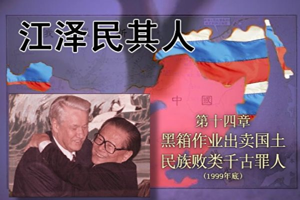</td>

【大纪元6月13日讯】海参崴、伯力、尼布楚、庙街、外兴安岭、库页岛、江东六十四屯……这些地名在中国人的头脑中也许永远都无法消除。炎黄子孙的祖先们在中国东北曾经留下了这片肥沃的土地，而如今它们却成为每一个中国人心中永远的伤痛和屈辱。

1999年12月9日和10日，是中国人耻辱的日子。在这两天里，江泽民在北京与来访的俄罗斯总统叶利钦签定了《中华人民共和国政府和俄罗斯联邦政府关于中俄国界线东西两段的叙述议定书》（以下简称《议定书》）。那片本来完全可以如香港、澳门一样回归祖国的土地，却被江泽民为了个人的目的，背着全国人民，拱手奉送给俄国，断了中华民族生存发展的后路。

众所周知，中俄边界近百年来纷争不断，60年代甚至曾为此爆发战争。如果条约真的一劳永逸地和平解决了中俄边界的百年纠纷，那么可以说这是一个功盖千秋的大事，一向好大喜功、号称要发展“中俄战略伙伴关系”的江泽民，绝不会错过这个在媒体前大大露脸的机会。

但是，1999年12月11日《人民日报》第一版中关于这个条约只有一个一百字的简短介绍。在江泽民委托库恩写的《江泽民传》中，对这样一件关乎国家民族的大事甚至连提都不敢提。事实上，江泽民与叶利钦的这次北京会晤在其传记中根本就找不到一丝踪影。为什么江泽民要删节历史、刻意回避这次“大国领袖”的会晤呢？

究其原因，是因为这是一个彻头彻尾的卖国条约，中间隐藏着惊天黑幕。在《议定书》中，江泽民出卖了100多万平方公里的宝贵领土，相当于东北三省面积的总和，也相当于几十个台湾；江泽民还将图们江出海口划给俄国，封死了中国东北通往日本海的出海口。

江泽民出卖的中国北方领土有几大块，一块是外兴安岭以南、黑龙江以北60多万平方公里的“外兴地区”，另一块是乌苏里江以东的“乌东地区”，有40万平方公里，还有就是唐努乌梁海地区，有17万平方公里，以及库页岛，有7.64万平方公里。

该《议定书》彻底否定了清朝康熙年间中国官兵浴血奋战换来的中俄边界平等条约——《尼布楚条约》，承认了从中华民国到历届中共政府都拒绝承认的中俄不平等条约，包括《瑷珲条约》、《北京条约》等。不仅如此，《议定书》还将大片未经签约而被沙俄强占的领土永久性地划归俄国，这其中包括1953年联合国大会表决裁定为中国领土的唐努乌梁海地区（约17万平方公里，相当于贵州省面积），还包括连不平等条约《瑷珲条约》都承认是中国领土的江东六十四屯（3600平方公里，相当于香港面积的3倍多），以及自金代开始即归中国管辖、在《中俄尼布楚条约》中明确划归中国的库页岛（7.64万平方公里，相当于两个台湾面积）。

中国历代政府曾尽力抵制俄国的入侵，自中华民国以来的历届中国政府也都不承认不平等条约。中共政权也曾声明并坚守：“对于帝国主义给中国人民的边界线，中国历届政府都未予承认，中华人民共和国也不予承认。”

这是因为，首先，按照维也纳《条约法公约》第52条规定“以威胁或使用武力而获缔结”的条约无效。而中国和沙皇俄国以及前苏联签订的一系列割地赔款的条约，如《瑷珲条约》、《北京条约》以及《中俄勘分西北界约记》都是属于武力威胁下的典型不平等条约，因而是不具备法律效力的。比如清政府1894年甲午战争失败后，曾经签订《马关条约》，将台湾和澎湖列岛永久割让给日本，但是因为《马关条约》属于不平等条约，所以日本战败后，中华民国政府就恢复了对台湾的主权。如果援引《马关条约》为先例，过去割让给沙俄和前苏联的土地，现在的中国政府完全可以理直气壮的讨回。其次，前苏联列宁政府也曾经正式宣布这些土地归属中国，一度要归还这些领土，这也是中国将来讨还领土的法理依据。

至于连不平等条约都没有签，却被沙俄直接侵略强占的唐努乌梁海地区、江东六十四屯、库页岛等中国领土，更是完全可以依法讨还的。但江泽民不但不讨还，反而又拱手送出去，因此被知情国人称之为“当代最大的卖国贼”。

更令人发指的是，江泽民签订的卖国条约实际上斩断了中华民族的生路。中国人的祖先留下的这片辽阔而肥沃的土地，不仅覆盖着大片原始森林，而且蕴藏丰量的矿产和石油，是未来中华民族腾飞和崛起最宝贵的生存资源。在中国960万平方公里的国土上，原始荒漠及彻底荒漠化的国土约占国土总面积的33%，严重水土流失的国土约占38%，而剩下生存条件较好的国土只占国土总面积的不到1/3！中华民族的人口重心已经从中原黄河流域向东南退到沿海一弧、沿（长）江一线，背后已是大海。人口还在继续增加，耕地还在继续减少，环境还在继续破坏。中国国土对人口的承载力已逼近极限。江泽民出卖的这片辽阔富饶的土地本来是中国未来生存和发展的希望，实际上江泽民已经把中华民族的后路彻底斩断，把炎黄子孙逼入绝境！

许多人对江泽民为什么签订卖国条约感到不可思议。本书的第二章实际上已经给出了答案。作为克格勃发展的远东局特务，这个身份一旦暴露，无论是江泽民还是共产党都可能会立即垮台。实际上，这也是中共内部在后来了解情况后不肯追究江泽民责任的原因。

因为领土问题牵扯到复杂的历史恩怨和民族感情，一向是最容易引起争议的。但有鉴于卖国问题是江泽民另一个无法解释也无法回避的罪行，本书不得不单独开辟此章，从历史背景、国际法规定、对中国的影响、江出卖领土的背后原因以及可能的解决方案等方面进行详细阐述。从中人们不难发现，这块本来中国可以理直气壮讨回、苏联也曾愿意归还，而且对中国未来发展具有巨大战略意义的领土，却被江泽民因为个人私利盘算而拱手相送，给中国人带来耻辱，给中国未来留下巨大隐患。

<b>1.领土主权</b>

历史上的俄罗斯是个欧洲国家，与中国并不接壤。沙皇时代，沙俄开始侵略扩张。当时的侵略者侵入中国东北，强占黑龙江流域雅克萨等地，所到之处，杀人放火，奸淫掳掠，无恶不作。康熙大帝于1685年派兵收复东北失地，两度攻克雅克萨，俄军伤亡惨重，被迫投降。1689年9月7日，沙俄与清政府在尼布楚举行谈判，并签订了《中俄尼布楚条约》。条约规定：中俄以格尔必齐河、格尔必齐河沿外兴安岭至海和额尔古纳河为界，以北属俄国，以南属中国。这是中俄双方在平等基础上签订的条约，也可作为中俄边界谈判的法律依据，然而这一条约却在江泽民的手中被彻底否定了。

1840年以后，清政府腐败软弱，沙皇俄国乘虚而入。遍观中国自鸦片战争后签订的一系列不平等条约，虽然不乏割地赔款的内容，但是从来没有一个国家像俄国一样侵吞了如此多的中国领土。更为恶劣的是，在第二次世界大战结束以后，被其他国家占领的中国领土绝大多数都归还了中国，唯有前苏联不但寸土未还，反而对中国进一步地蚕食侵吞。

沙俄在入侵中国的过程中，签订了十七个不平等条约，其中侵占土地最多的有三个，即《瑷珲条约》、《北京条约》和《中俄勘分西北界约记》，加起来一共从中国割走超过100多万平方公里领土。

<b>《瑷珲条约》</b>

1856年10月（咸丰六年），第二次鸦片战争爆发。1858年5月，英法联军攻占大沽，天津告急，北京震动。东西伯利亚总督穆拉维约夫乘概率领俄国哥萨克军队直逼瑷珲城下，以“助华防英”为借口，在两艘炮舰护送下来到瑷珲城内与清朝黑龙江将军奕山会晤谈判，要求撕毁中俄《尼布楚条约》，强占黑龙江以北、乌苏里江以东地区。在沙俄的武力威胁之下，奕山终于屈服，被迫于28日与穆拉维约夫签订了《瑷珲条约》。

《瑷珲条约》共3条。主要内容为：黑龙江以北、外兴安岭以南60多万平方公里的中国领土划归俄国，瑷珲对岸精奇哩江（今俄国结雅河）上游东南的一小块地区（后称江东六十四屯）保留中国方面的永久居住权和管辖权；乌苏里江以东的中国领土划为中俄共管；原属中国内河的黑龙江和乌苏里江只准中、俄两国船只航行。

值得注意的是，清政府当时没有批准《瑷珲条约》，还处分了奕山等人。

<b>《北京条约》</b>

1860年（咸丰十年）10月，英法联军攻占北京西郊，咸丰帝携后妃及亲贵逃往热河行宫（今河北承德郊外），其弟恭亲王奕䜣在京，接洽议和事宜。奕䜣求和心切，请求俄国驻华公使伊格那季耶夫出面调停。伊格那季耶夫乘机要挟，要求清政府同意他就领土问题所提出的要求。11月14日，奕䜣被迫签订了《中俄北京条约》。《北京条约》除了承认《瑷珲条约》以外，还把乌苏里江以东的中国领土（约四十万平方公里）也由共管而改为划归俄国，并规定中俄西部边界将另行重新划定，至此中国在东北丧失土地大约一百万平方公里。黑龙江口至图们江口大约40万平方公里的沿海地区也划归俄国，从而使中国失去了日本海的出海口。

<b>《中俄勘分西北界约记》</b>

早在19世纪初，沙俄就开始觊觎中国西部地区。道光皇帝在位时，沙俄就武装侵占了巴尔喀什湖东南的喀拉塔勒河、伊犁河等七河地区。咸丰四年（1854）又强占阿拉木图，把伊犁河下游一带据为己有。1864年（同治三年）9月，清政府处于外有沙俄大军压境、内有新疆回民反清举事的形势下，与沙俄在塔城谈判。在沙俄武力威胁和政治讹诈下，清政府于10月7日被迫签订了《中俄勘分西北界约记》。通过《中俄北京条约》和《中俄勘分西北界约记》，沙俄将中国西境的3个大湖——巴尔喀什湖、斋桑湖和伊塞克湖，连同周围广大地区，共达44万多平方公里的领土占为己有。（注：前苏联解体后，现在的俄罗斯版图不同于沙俄帝国，原中国西北这些地区现在被哈萨克斯坦和吉尔吉斯斯坦占有，已不属于现在的俄罗斯。）

<b>其他不平等条约</b>

同治十年（1871），沙俄又胁迫清政府签订《中俄伊犁条约》，随后于光绪八年至十年强迫清政府订立了5个勘界议定书，分段重新勘定了中俄西段边界。沙俄通过《中俄伊犁条约》和勘界议定书，共割占了塔城东北和伊犁、喀什噶尔以西约7万多平方公里的中国领土。

<b>未经签约而被抢占的领土</b>

沙皇俄国除了逼迫腐败无能的清政府、北洋政府订立城下之盟，以条约的形式侵吞中华国土外，还公然使用武力对条约规定为中国领土的地区进行吞并。

1900年7月中下旬，沙俄借口中国发生了“扶清灭洋”的义和团运动，出动17万大军将《瑷珲条约》中划归中国的江东六十四屯围住，对数万居民进行凶残杀戮。女人遭到奸污，许多人被俄军烧死﹐逃出者不足半。一时逃出村子者在黑龙江边被俄罗斯追兵射杀﹐血染江水﹐未及过江者被一同逼入江中。江东六十四屯自此被沙俄霸占。

江东六十四屯的大屠杀是一段浸透了血泪的历史，罪魁祸首就是沙皇尼古拉二世。叶利钦为尼古拉二世举行葬礼，江泽民不但未做一声指责或抗议，竟然还主动扑到叶利钦的怀里，搂住叶利钦的脖子与其亲热，连叶利钦都感到突然和尴尬，其丑态被外国记者摄入镜头发表出来，令人不堪目睹。不仅如此，江泽民甚至到俄罗斯亲自给屠杀了千千万万中国老百姓的凶残的哥萨克凶手们祭奠致敬，并在《议定书》中将江东六十四屯出卖给俄罗斯。

库页岛是中国最大的岛屿，位于黑龙江出海口之东，东面和北面临鄂霍次克海，西面隔鞑靼海峡与大陆相望。南隔宗谷海峡与日本接壤。从中国金代开始库页岛即归中国管辖。1689年的《中俄尼布楚条约》亦规定库页岛属于中国。该岛面积7.64万平方公里，相当于两个台湾。1789年，沙俄的远征军杀入该岛，赶走了岛上的原住民──鲜卑族赫哲人，独吞了岛上丰富的煤矿和油矿。

唐努乌梁海，地处外蒙古西北部，北靠萨彦岭，南抵唐努山，是位于两山之间的狭长地带，总面积约17万平方公里，相当于贵州省那么大。俄国先是在上个世纪二十年代策划该地区独立，随后于1944年将该地区并入版图。唐努乌梁海的居民以汉人为主，从清政府、民国政府到中共毛泽东政府，历来都不承认其独立的合法性，1953年联合国大会表决亦将唐努乌梁海地区裁决为中国领土。

<b>历届中共政府的态度</b>

领土问题在中国是个极其敏感的问题，历任领导人都不敢轻举妄动去承认历史上的不平等条约。

按《维也纳条约法公约》，在武力威胁下签订的不平等条约没有合法性，所以对以上不平等条约，历届中国政府也都未予承认。1972年，毛泽东开始以官方名义通知前苏联及其大使馆，提出“九不平等条约论”，即坚决拒绝承认俄国强加给中国的十七个不平等条约中的九个。中国加入联合国后，毛泽东也通知联合国，中国不接受这九个不平等条约。1972年毛泽东会见尼克松时说：“苏联占领我们的领土太多太多了，其中包括沙皇帝国和红色苏联占领的。这些占领的领土我们没法数清楚，有的中国政府，比如说国民党政府和清政府，声明的比我还多。我现在要的是以国际法声明最少的部分，那都是有清楚历史根据属于中国的地方。”

1978年10月中共发言人指出，1960年至1969年苏俄夺走185平方英里中国领土，1972至1977年在新疆伊犁夺走1080平方英里领土。同时还指出：除去中俄有争议地区之外，俄又霸占中国3475平方英里土地。

1979年9月29日中国透露：新疆20个地区俄中有争议领土约有11600平方英里至29696平方英里。

1982年1月8日李先念指出，中俄边境有争议地区达9万平方公里，全被俄国占领。

简单的历史回顾说明，从沙皇俄国到苏共建政，俄罗斯一直对中国的土地进行巧取豪夺，而从民国政府到毛泽东，都没有敢承认这些条约和占领地的合法性。

<b>2.前苏联一度宣布归还强占领土</b>

从沙皇俄国到后来十月革命后的苏联，都一直处心积虑地侵占中国的土地，但只有在苏维埃共产政权刚刚建立期间例外。因为那时的苏联不堪一击，随时都有被西方强国消灭的危险，所以列宁为拉拢中国共同抵抗苏联的敌人，一度提出要归还这些领土。

列宁在1919年发表对华宣言，声称“凡从前俄罗斯帝国政府时代，在中国满洲以及别处，用侵略的手段而取得的土地，一律放弃。”1920年9月27日，前苏联政府又宣布：“以前俄国历届政府同中国订立的一切条约全部无效，放弃以前夺取中国的一切领土和中国境内的一切俄国租界，并将沙皇政府和俄国资产阶级残暴地从中国夺取的一切，都无偿地永久地归还中国。”（见《俄罗斯苏维埃联邦社会主义共和国政府对中国政府的宣言》）

列宁未及实践他的诺言就去世了。斯大林掌权后，先是否认那个“对华宣言”的存在，继而杀人灭口，将签署此宣言的外交人民委员部副部长列文‧卡拉罕作为“叛国犯”枪决。

不管斯大林承认不承认，此宣言被正式签署就是合法文件，两国都必须遵守。到了江泽民掌权时却不可思议地推翻了这个宣言，把应该归还给中国的土地秘密送给了俄国。

<b>3.未谈判先签约</b>

中国改革开放后，吉林省一直希望打开图们江出海口，这对吉林省经济发展将产生深远影响，直接关系到吉林省经济能否腾飞。

为早日实施通海计划，几年来省政府投巨资完善珲春市及周边的市政、公路、铁路的基础设施建设，并多次与俄方谈判。因为当年割让图们江的条约是不平等条约等因素，经过三年多的努力，俄罗斯滨海边疆区已有诚意与中方合作建港出海。正当谈判进展顺利，即将进入决策的重要阶段，江泽民却背地里在丧权辱国的“中俄东段勘界议定书”上签了字，让中方代表傻了眼。至此，图们江出海口几乎被彻底封死，吉林百姓多年来盼望的开边通海战略计划变成了一堆废纸！

一位多次参加中俄关于图们江出海口合作问题谈判的中方代表悲愤地说：“每次谈判，我们都引经据典，据理力争，付出了巨大的努力。没想到在具有决定性的那次重要会议上（中俄签定领土条约的同一时间段），开始时俄方代表仍同往常一样，态度比较温和，不料中途出去接了一个紧急电话，回来后就一反常态，非常强硬地拒绝合作，使非常有利于我方的谈判被迫搁浅。”

这位代表后来才知道中俄已签了领土条约，当时中央没人及时通知他们。而俄国人却立即告知了参加图们江出海口合作谈判的俄方代表，使其立即变被动为主动。据说江泽民那么痛快就在丧权辱国的“中俄东段勘界议定书”上签字，令当时在场参加领土谈判的俄罗斯人都感到十分意外。

吉林省喊了五年、并已投入了巨大人力、物力、财力的“开边通海战略”，至此彻底化为了乌有。

2000年12月，在中共吉林省委制定的《吉林省国民经济和社会发展第十个五年计划》上，洋洋洒洒几万字，只字未敢再提“开边通海”之宏伟战略。

<b>4.江泽民从每人手里抢走一亩土地</b>

根据中国1990年《缔结条约程序法》第7条规定，有六种条约国家主席无权直接签署，而必须由全国人大常委会予以批准，其中第一项为“友好合作条约、和平条约等政治性条约”，第二项为“有关领土和划定边界的条约”。

这里不需要什么高深的知识，只需要常识就明白了。一方面，江泽民从未经过民众选票授权，他是被中共元老看中而成为国家最高领导人的，因此他没有权力代表13亿中国人民去签订条约。另一方面，中国的领土归全体民众所有，而非江泽民私人土地，在如此重大问题上，岂能只由中共独裁下的“橡皮图章”全国人大常委会讨论决定？更应该在全国广而告之，必要时可通过全民公投方式决定这些领土的归属。

而中国民众对江泽民签订的中俄边界的新条约，却一直被蒙在鼓里，到今天还不知道发生了什么事情。

由于中共片面强调经济发展，造成生态环境的不断破坏，中国可耕地面积已从上世纪80年代初的人均近2亩，减少到目前的人均1.4亩，而且还在进一步减少。江泽民割让的100万平方公里绝大部分都是极其肥沃的土地。家喻户晓的歌词“我的家在东北松花江上，那里有森林煤矿，还有那满山遍野的大豆高粱”描绘的就是东三省的沃土，而被江泽民割让的土地甚至更加肥沃，有人形象地比喻说，那里的土“攥一把都流油”。按照一平方公里合1500亩计算，江泽民出卖的国土相当于从13亿中国人每人手中夺走1亩肥沃的可耕地。

<b>5.江泽民给中国造成的国家安全隐患</b>

中国近代伟大的爱国者和民族英雄林则徐被道光皇帝发配至新疆后，他觉察到沙俄蓄谋侵略中国的野心，临终前几个月，曾大声疾呼，告诫国人：“终为中国患者，其俄罗斯乎！吾老矣，君等当见之。”不幸的是，由于江泽民的卖国行径，我们这一代人终于见证了历史的这一幕。

<b>军队后撤边界五百公里不设防</b>

江泽民以军委主席的身份命令中国边防军后撤，500公里不设防，而俄罗斯、哈萨克斯坦、塔吉克斯坦、吉尔吉斯斯坦4个国家不设防地带只有100公里宽（只有俄罗斯滨海边疆区的几个地段例外）。100公里以外，这4个国家共“拥有13万兵力（其中俄军为12万人）、3900辆坦克（其中90%是俄罗斯的）、5800辆装甲战车（俄罗斯所占的份额当时和后来都是90%）、4500门大炮、290架作战飞机和434架直升机”。而中共要驻军必须在500公里之外。

这个秘密是2002年俄罗斯新闻社军事评论员维克多．利托夫金披露出来的。原因是俄国有人大叫“吃了亏”，为澄清事实，说明俄国不但没吃亏，还占了大便宜，利托夫金写了一篇文章。确实是这样，真打起仗来，人家在100公里外出击，中共军队要从500公里外出击。

利托夫金的文章透露：“为了加强军事领域的相互信任，北京采取了一系列史无前例的措施，承担了单方面的义务，即：做到在与这几个国家交界的边界地区，在500公里宽的沿边地带，除边防人员外没有任何军队。对俄罗斯和其它几个独联体国家来说，这条沿边的‘不设防地带’则只有100公里宽”。

文章用调侃傻瓜的口气说：“俄中两国在‘不设防地带’100公里宽和500公里宽这种宽度上的‘不对等’，其理由说起来其实相当地简单，即我们之所以不能像中国人那样将自己的军队从边界线后撤500公里，是因为对我们来说这笔费用实在是太高了。……中国对这种状况表示理解。”

俄国那不设防的100公里地带是森林荒野，退出并不损失什么，但中国退出的那500公里宽的地带都是耗费巨资的军事设施。全部毁掉损失巨大。为何江泽民不签定个“对等”条约呢？俄国撤退费用太高，难道中国军队撤退的费用不高吗？别说中国没钱，就是有钱也不能签这种丧权辱国的条约。

文章对俄国人透了实底：“削减中国边境一带的（俄罗斯）驻军，尤其是拿它的费用同从东欧和波罗的海沿岸3国撤军的费用相比，对我们俄罗斯来说，实际上是没有花钱。”

也就是说，俄罗斯和前苏联各加盟共和国陈兵十余万，武器足备，而江泽民竟然令中方不设防，国防国防，何防之有？

当时，驻守在那里的中国边防官兵对这个条约义愤填膺，坚决不肯执行命令。为了尽快后撤让俄国满意，江泽民把了解真相的北方边防军全部调往福建。是什么原因使江泽民如此迫不及待、一意孤行呢？库恩的书中间接回答了这个问题。

库恩在年跨度“1989–1996年”的第7章用的题目是“领导地位”，清楚说明了江泽民当时的处境非常危险。此章的摘要中说，“江泽民采取了一系列战略行动巩固自己不断上升的政治实力”，“他召集了一次研究制定国防战略的秘密会议，参加人员包括总参军官和各军区司令。但其深层目的是在最近影响深远的人事变动后确保军队的忠诚。”

这个章节摘要一语道破江泽民当时的恐惧心理，江担心邓小平随时可能会把自己撤掉，于是在内部拼命送出军衔、用腐蚀军官打造自己在军队中的地盘。这还不能使江泽民安心，他希望取得俄罗斯等邻国从外部全力帮自己巩固权力。这就是江泽民为了权欲而秘密签定500公里不设防的不平等条约的一个重要原因。

<b>地缘政治</b>

由于地缘关系，俄罗斯一直对中国虎视眈眈，并假借合作、交流等名义伺机蚕食中国领土，窃取中国情报。清光绪二十二年（1896），沙皇俄国以共同防御日本在亚洲的霸权为名，诱迫清政府签订的不平等条约《中俄密约》，又称《防御同盟条约》，取得了中东铁路的筑路权，将铁路从西伯利亚直接通过黑龙江、吉林地方修到海参崴。其目的就是可以运用“铁路征服政策”，将侵略势力渗透到中国东北，把黑龙江、吉林等满蒙地区囊括为自己的势力范围，以便最终实现吞并中国东三省的野心。后该阴谋因1904年日俄战争而破产。

1945年初，第二次世界大战欧洲战场的战役已经接近尾声。前苏联、美国和英国首脑在前苏联的雅尔塔举行会议，为让日本尽快投降，英美敦促前苏联出兵中国东北。斯大林乘机胁迫民国政府承认外蒙古独立。当时在莫斯科谈判的蒋经国问斯大林，“你为什么一定要坚持外蒙古‘独立’？外蒙古地方虽大，但人口很少，交通不便，也没有什么出产？”斯大林回答说：“老实告诉你，我之所以要外蒙古，完全是站在军事的战略观点而要这块地方的。”斯大林拿出地图，指著说：“倘使有一个军事力量，从外蒙古向苏联进攻，西伯利亚铁路一被切断，俄国就完了。”

《人民日报》在2001年7月31日刊登了这样一篇文章，1958年7月，前苏联驻中国大使尤金向毛泽东、刘少奇、周恩来等中共领导人通报了前苏联方面的一项建议，由于前苏联的地理条件，他们的舰队活动范围受限制，而中国有漫长的海岸线，因此希望中苏共同建立一只联合舰队，共同对付美国。对这种侵犯中国主权的事情，毛泽东听了之后当时就表示了不满。再联想到前日前苏联要求在中国建立中苏共管的长波电台一事，毛泽东更为光火。于是毛泽东要求赫鲁晓夫亲自来北京商谈此事。1958年7月31日，苏共中央第一书记赫鲁晓夫到中国访问，当天与毛泽东举行会谈。毛泽东几次要求赫鲁晓夫解释什么叫“共同舰队”，而赫鲁晓夫则吞吞吐吐，无法回答，并再三表示一个舰队由两个国家来指挥是不可想像的。

俄罗斯新闻社2002年12月18日的那篇文章还透露说：“有趣的是，即便在俄罗斯前国防部长伊格尔‧罗季奥诺夫1997年访问北京之际，当他把中国称之为‘21世纪俄罗斯的潜在对手’的时候，俄中两国互信的气氛都没有受到一点儿影响。北京方面把他的这番话仅仅看作是这位将军的权宜之计，是他‘在向本国政府施加压力，以便为武装力量的发展获得更多的拨款’。”

由此可见，俄罗斯从来也没有拿中国当作朋友，而是定位为“21世纪俄罗斯的潜在对手”。而江泽民竟然毫不防备，继续与俄签订边界裁军协定，命令中国国防军从已经后撤的国境线再后撤，500公里内不设防，主动实现杜金教授《基本地缘政治》一书中俄国要求建立的缓冲地带，放弃国防，给俄军大开方便之门。

<b>6.卖国条约斩断民族生路</b>

卖国条约对中华民族所造成的伤害，人们现在根本无法估量，它已经远远超出了民族尊严、国家主权和领土完整的范畴。该条约对于中华民族的未来将成为致命一击。2000年12月28日，一位著名作家曾在他题为“斩断民族生路的《中俄边界新约》”的文章中指出：“中国之劫之难之凶之险，百年以降，唯此为大。”

<b>这绝非危言耸听。</b>

中国虽然号称拥有960万平方公里的土地，为世界上第三大国家，然而中国的人均可耕地面积却只有1.4亩，为世界平均水平的三分之一，美国的九分之一。中国许多地区的自然条件十分恶劣。西边是高原，西北是荒漠，正北是草原和沙漠，东南是大海。生存条件较好的国土，面积约为300万平方公里，仅仅占国土总面积的29%。当中国狂热的民族主义者沉迷在说“不”和“二十一世纪是中国的世纪”这样的呓语中时，即使是中国政府，在制定政策的时候也不得不考虑在人口密度已经接近土地、能源、淡水、矿产与森林资源承载能力的极限时，中国二十一世纪的生存空间在哪里？

在1999年的中央经济工作会议上，中国政府提出西部大开发战略。表面上政府是要开发西部地区的经济，改变西部地区封闭落后的局面，打破东西部发展不平衡的格局，并将生态环境建设、基础设施建设和特色产业作为西部三大发展重点。内行人却对此政策作出了完全不同的解读。

从30年代胡焕庸先生发现中国人口分布的胡焕庸线（指从黑龙江瑷珲到云南腾冲的近似分割中国东部人口密集区和西部稀疏区的直线）以来，中国人口分布的宏观格局几乎没有任何变化。胡焕庸线的西北面积为全国64%，人口仅占5.6%；东南面积为36%，人口却占94.4%；文明重心倾斜于东南已无可置疑。近半个世纪来，中国人口重心点始终在东南靠海的一个百余万平方公里的狭小地域内徘徊。由于人口增加、过度开发和环境恶化等因素交相作用，中国人口与文明的重心继续向生存环境较好的东南部转移。然而现在东南部地区的开发已经全部完成，继续往东南走就只能走到太平洋里去了。

“西部大开发”真的会让我们走出困境吗？就在国务院提出这一战略后不久，中国人民大学人口所的一位研究员发表了题目为《中国人口分布与可持续发展》的研究报告。报告中说“由于西部地区大多为高原、荒漠，土地可垦殖率低，而且远离沿海，……所以西部地区人口承载力比中东部地区低得多。……西部地区的水土流失、沙漠化等环境灾害要比中东部地区严重得多。……从人口承载力与人口压力的对比关系来说，尽管西部地区人口密度很低，但西部地区人口超载更加严重。因此西部地区相对于中东部地区的人口密度不仅不能增加，相反应该降低。”西部的人口需要继续迁移出来，东部却是一望无际的太平洋，我们还能退到哪里？

唯一的答案是东北。如果我们真的可以按照国际法和平谈判收复失地的话，二十一世纪的中华民族仍将大有可为。《瑷珲条约》与《北京条约》所丧失的一百多万平方公里土地相当于东北三省的面积之和，而且位于外兴安岭以南、黑龙江以北以及乌苏里江以东，那是我们的先人留给我们的原始森林和肥沃的土地，也是中华民族复兴的最后契机。

对于一个民族来说，最重要的就是生存，没有了领土这种最基本的生存条件，十几亿人的命运实堪忧虑。而江泽民却将这一片攸关国民经济发展和中华民族生死存亡问题的辽阔疆域，大笔一挥，兵不血刃地合法落入俄罗斯版图。这无疑是中华民族有史以来最大的卖国条约。

<b>7.江泽民出卖给其它国家的领土</b>

对于中越、中印、中国和其它前苏联国家等领土争端的解决，中共官方媒体也从来不敢公布条约的内容，所有出卖领土利益都属于黑箱作业。

江泽民和塔吉克、吉尔吉斯以及哈萨克，签订了中塔吉边界划定协定、中吉哈边界划定协定等，基本放弃了所有争端国土。例如他与塔吉克斯坦总统赖克莫诺夫签约，将靠近帕米尔地区的27,000平方公里的争议土地出卖给塔国，而中国仅得到1000平方公里。这是塔吉克的通讯社报导了有关条约内容，才在海外曝光。

江泽民在1996年出访菲律宾，主动提出放弃南沙群岛的主权争议，共同进行经济开发。

1996年11月底，江泽民访问印度，签署了《关于在中印边境实控线地区军事领域建立信任措施的协定》，为中印按照现在的控制线划分边界定下基调，这就等于承认了麦克马洪线，放弃了喜马拉雅山南麓肥沃的9万平方公里领土。

1999年12月30日，江泽民批准《中国和越南陆地边界条约》，将数百位将士浴血苦战付出生命而守卫的云南老山和广西法卡山划归越南，麻栗坡的爱国忠魂将永远埋骨越南。

<b>这里我们需要特别谈一谈钓鱼岛。</b>

钓鱼岛的归属问题十分微妙。从历史来看，钓鱼岛理所当然是中国的领土，但问题是台湾和大陆都在声明对钓鱼岛的主权。围绕钓鱼岛发生过几件大事，一个是在中日甲午战争后，大清因为战败而被迫签订《马关条约》，永久割让台湾和附属岛屿，此时钓鱼岛作为台湾岛的一部分割让给了日本。另一个是在1945年，日本战败之后，《马关条约》废除，日本对钓鱼岛占领的“合法性”也相应失效，但日本在归还台湾和澎湖列岛时，未予归还钓鱼岛，而是将其划给冲绳县管理，结果为今天的主权争议埋下伏笔。

虽然钓鱼岛本身只有几个荒岛，面积也只有6平方公里多一点，但按照1992年《联合国海洋公约》来看，此岛屿还包含74万平方公里的“海洋经济专属区”。1967年联合国勘探发现此海域蕴藏着8百亿桶的原油，按照现在国际原油市场价格每桶50美元计算，其价值将达4万亿美元，相当于现在大陆每年GDP的四倍。

按说这么大一笔财富，江泽民如果真是为民族大计考虑，至少也应该先拿过来再说，不管是按照历史上的“先占权”、按照《开罗宣言》、还是按照《波茨坦公告》或《中日联合声明》，中国收回对钓鱼岛的主权都是合理合法、名正言顺的。但是江泽民偏不，抱着“宁予友邦，不予家奴”的态度，不但自己不努力争取，对于中华民国（台湾）的努力还经常讽刺和掣肘。

在钓鱼岛问题上，江泽民完全不表态也是做不到的，原因就是钓鱼岛属于台湾的附属岛屿，其归属问题应该是和台湾共进退的，更何况台湾在这个问题上比中共强硬得多，甚至台湾的国防部副部长陈肇敏2003年年初在立法院还表示，钓鱼岛是台湾领土，如果非战不可，台军一定会维护领土完整。

这样，江泽民在宣示对台湾的主权时，就不能不顺带上钓鱼岛，但是态度之强硬和软弱却有天壤之别。江泽民对台湾从来都是“不放弃使用武力”，而当日本派出警察和直升飞机到钓鱼岛抓中国人，等于是在中国拥有主权的土地上抓人时，江泽民却通过发言人说“关于中日双方在这一问题上的分歧，我们一直主张通过和平谈判的方式来解决。”

在2003年，保钓人士为纪念“九一八”事变，申请了50人规模的驻京日本使馆前抗议活动，江泽民手下的警察以“扰乱社会治安”为名拒绝了申请。

江泽民以平等条约的形式，把凡是有争议的领土一律出卖，从来不经人大事先授权，更未交与全国人民讨论和投票，实为卖国贼！当他高喊“爱国”、民族主义、“反华势力”、“围堵中国”等调子的时候，最大的反华势力恰恰就是他自己。

<b>8.江泽民是主动卖国</b>

1999年底江泽民在签订卖国条约时，已经是党政军三位一体的最高当权者，所以该条约的签署与否，责任全在于江自己一人。退一步讲，即使卖国条约的签署曾得到党内干政大老的暗示或人大授权，他也完全可以拒绝签字，否则就是甘当历史罪人，这里仅举两例说明。

在二战将要结束时，蒋介石希望斯大林能够出兵东北消灭侵华日军，当时去莫斯科谈判的是蒋经国和宋子文。斯大林坚持要让外蒙古举行全民公投以决定是否脱离民国政府而独立。蒋介石于万般无奈下，让宋子文在协议书上签字。宋子文接到电报后，立即辞去外交部部长职务。尽管协议是让外蒙公投，而非割让外蒙古，但他仍然认为他签了协议就会成为民族罪人。最后在协议上签字的是接任外交部长的王世杰。

另一个具有可比性的故事为大清驻俄全权公使杨儒的经历。1900年8月15日，八国联军攻陷北京。8月19日，一直觊觎著中国东北的俄国人认为：“将额尔古纳河与阿穆尔河的右岸和乌苏里江左岸满洲的一部分归入我们的领土是绝对必要的。”9月11日，15万俄军全线越过中俄边界，将大清国数以千计的边民赶入黑龙江中淹死后迅速占领东北全境。10月1日攻占沈阳，强迫盛京将军增祺签下《奉天交地暂且章程》。《奉天交地章程》要求遣散驻守沈阳的清军，营口暂由俄国管理，拆毁东北各处炮台和军火库……

1901年1月4日，清廷命驻俄公使杨儒为全权大臣，“与俄在彼得堡办理交收东三省事宜”。杨儒为国家主权据理力争。3月25日，俄国人将杨儒关在俄外交部里威逼利诱，扬言如果还不答应俄方条件，他们就要宣布“将满洲改做俄国的一个省”。同时又引诱说，只要杨儒一签字，俄国立刻为他在彼得堡“置田若干，房屋若干，足以享用一生”。杨儒勃然变色，再次拒绝俄方威逼利诱。俄国人恼羞成怒，最后竟将杨儒从楼上扔了下去。杨儒坠地，严重受伤，满面鲜血地躺在异国的大街上。3月28日，悲愤已极的国人发动了声势浩大的“拒俄”集会，全国不分南北纷纷上书，反对将东北主权出卖给俄国。俄国人见势不好，怕各国乘机威胁俄国在华已有的利益，4月3日被迫声明“条约暂罢”。杨儒成为大清国在那段屈辱的历史中少有的死不低头的官员。

江泽民所处的时代和历史上签订一切不平等条约时完全不同。中国并未与俄罗斯、塔吉克斯坦、印度等国开战，更非签订城下之盟，何况中方理直，外方理屈。坚持中国固有领土不但义不容辞，而且毫无危险。以其当时身处的三位一体最高权位而言，完全可以说，江泽民是主动卖国，铁案如山。

针对海内外掀起的讨伐江泽民卖国罪行的大潮，江本人是如何应对的呢？他有没有找到推卸责任的替罪羊呢？没有。前面提到，他在自己的传记中居然把这次领土签约事件彻底隐瞒了。这是江做贼心虚的最好注脚。

<b>9.卖国是为了隐瞒汉奸历史</b>

中俄东西段边界从1991年开始勘察，当时正逢苏共下台，俄罗斯经济进入大萧条时期，而中国在邓小平南巡后，国力开始大发展，欧美国家与中国关系也从“六四”之后的冷冻期走向恢复。从当时国际环境来看，正是俄罗斯有求于中国的时候，中国实在没有必要、更没有理由无条件承认过去所有不平等条约，但是江泽民居然就承认了。

这让许多人对江泽民为什么签订卖国条约感到百思不解。本书的第二章曾经讲过，1945年前苏联红军突袭东北，获得土肥原贤二的全部特工系统档案，当然包括江泽民曾接受培训的青年干训班的文字及照片档案。此后在江泽民留学前苏联时，前苏联情报部门查看江泽民的档案，发现了江泽民充当汉奸的历史，便威逼利诱将其发展为远东局特务。

1991年5月，江泽民以中共中央总书记身份出访前苏联，在参观利加乔夫汽车制造厂时，克格勃就特意安排江泽民“巧遇”当年让江拜倒在石榴裙下的前苏联色情间谍克拉娃。江泽民曾是克格勃的远东局特务，这个身份一旦暴露，江可能立刻就会下台，甚至死无葬身之地。江泽民当然心知肚明，因此，不管多大的国家利益，江泽民也要跟俄罗斯做这笔交易。

而江泽民一旦签署条约，生米煮成熟饭，共产党也怕公开条约详情导致政党垮台，这是中共内部在后来了解情况后不肯追究江泽民责任的原因。江泽民知道，如果要犯错误，就一定要犯到中共一改正就相当于杀人犯投案自首的程度，这样自己反而才不会被追究责任。

2005年，曾任香港文汇报副总编、因为“六四事件”愤而辞职的香港资深新闻工作者程翔被内地扣查。据外界传媒消息，程翔被捕是由于在《明报》发表多篇署名为“钟国仁”的文章，专栏里详细披露“中俄边界”协定的种种细节，称之为二十一世纪最荒唐的‘代民做主’的丑剧。据香港报界确认，钟国仁就是程翔在《明报》专栏上的笔名。钟国仁在文章中分析了中国政府为什么不敢向老百姓公布和解释条约的三大苦衷：一是它表示中共在这个问题上连被它讥笑为卖国而赶下台的国民党政权都不如；二是江泽民在这个问题上比共产党其他领导人都不如；三这个标志着中国正式放弃偌大一块领土的条约，从谈判的过程到最后签署，都没有公开过。

中共对民间揭露江泽民卖国的问题恼羞成怒，在许多官方网站的论坛上，“中俄边界”一度成了被封锁的关键词。中国地图出版社的地图爱好者论坛因有人谈及江东六十四屯等被江出卖的领土而居然被关闭。

<b>10.公审江泽民或可成为讨还领土的唯一希望</b>

尽管如此，按照1969年5月联合国通过的《维也纳条约法公约》，讨还江泽民出卖的领土还有最后一线希望，那就是“公审江泽民”！

《维也纳条约法公约》第四十九、五十、五十一、五十二条规定，条约以“诈欺”、“贿赂”、“强迫”、“武力威胁”所缔结者无效。

江泽民实际上是为了保住总书记宝座而以出卖领土为代价换取俄罗斯不揭露他的克格勃远东局间谍身份。在此种情况下，江泽民无论批准或签订什么条约，按照《维也纳条约法公约》的规定都是无效的。如果江泽民在领土问题上遭到中国人民的审判，那么他签订的条约自然也就会不能算数。

所以，彻底调查江泽民签约的动机和整个过程，将其罪行公之于众并追究其法律责任，或许可以成为中国讨还北方领土的最后机会。

<b>11.炒作黑瞎子岛掩盖卖国</b>

1999年12月9日江泽民秘密签订的《议定书》，连当时的国防部长迟浩田都不许过问。迟浩田后来听到一些消息，问起条约的事情，结果收到的是1999年12月11日的《人民日报》，上面官方关于此条约的只有100多字的简短介绍。

2002年10月，江泽民访问美国之前，全美学生学者自治联合会在华盛顿DC国家记者俱乐部召开新闻发布会，要求江泽民公布条约内容，并表示炎黄子孙有权知道到底还有哪些土地属于中国。海内外报纸和网站广泛报导了这条消息。

几天以后，2002年10月14日和15日中共算是做了一个可笑的回应。在江氏喉舌《人民日报》网站的头版图片新闻，一个本来应该刊登国内外最重大新闻或政治动向的地方，破天荒地连续两天刊登十余幅照片，大标题为《组图：辽阔边疆神秘边界 中俄蒙边界掠影》和《组图：中俄蒙边界路漫漫 各口岸建设日日新》，未配任何文字报导。大概也是因为实在是无话可说吧。

中国国内外有许多批评者一直强烈指责江泽民在涉及重大国家利益的中俄边界谈判问题上黑箱作业，不允许民众过问和讨论。

然而，2004年10月17日后，情况忽然发生了变化。中共终于开始公开报导中俄边境问题。北京媒体报导说，中国外长李肇星与俄罗斯外长拉夫罗夫在北京签署《中俄关于两国边界东段的补充协定》，加上原有的《中俄东段国界协定》、《中俄西段国界协定》，使4300多公里的中俄边界“问题获得彻底解决”。

这个报导很让人费解，既然宣布签署了“两国边界东段的补充协定”，那么为何“协定”却没有公布过？更奇怪的是《中俄东段国界协定》、《中俄西段国界协定》用“原有的”一笔带过，到底“原有”到哪一年还是个谜。还有，这四个协定的内容至今没有公布出来，中俄边界问题彻底解决到什么程度更是个谜。这个谜需要由江泽民来揭谜底。

中共对于海内外追究江泽民出卖100多万平方公里土地、占98%中俄东段边界的《东段协定》噤若寒蝉，而在2005年突然对于只占2%边界的《东段协定的补充书》大肆炒作，说是《补充书》拿回来了半块黑瞎子岛。其实，这是中共为了掩盖江泽民卖国罪行而应付中国百姓的一个招术。

2005年5月31日国务院发展研究中心研究员盛世良做客新华网，提出一个观点，说是“把以前失去的属于自己的领土要回来了100 多平方公里，这毕竟是有划时代意义的事情。在旧中国，中国从来都是丢失领土，从来没有依法要回来一小块领土，这是第一次。”这是个什么逻辑呢？好比有人被抢了 1万块钱，本来完全有理由都要回来，可有一天，对方只还了1块钱，被抢的人竟说，“好，那9999块不要了。归还1块钱毕竟是有划时代意义的事情。”还有比这更走狗奴才的逻辑吗？

其实黑瞎子岛在1929年“中东路事件”时被斯大林领导的苏军占领，其本身就是中共甘当苏共走狗、赤裸裸卖国的明证。

1929年5月27日，苏俄驻哈尔滨总领事馆召集远东各地重要共产党干部举行共产国际会议，商讨对华侵略事宜。此时被中方发现，经搜查捉到苏共、中共党员39人，查收到扰乱中国秩序、企图分化中国的文件等共数万册。

1929年7月，东北地方当局根据中华民国政府要逐步在中国境内收回中国主权的决定，根据1919、1920年苏俄政府曾公开发表的“放弃一切与中国的不平等条约”和“放弃沙皇俄国在中国所有特权”的声明，宣布接管中国境内的“中东铁路管理权”。1929年8月，苏俄非但不承认自己以前的宣言和声明，而且宣布与中国断交，并调动10万大军，发动大规模的侵华战争。中华民囯政府为了自卫，命张学良负责国境边防，兵分东西两路，进行阻击和抵抗。史称“中东路事件”。

同时，斯大林在1929年9月26日给中共发来了指示：“谁忠诚地、真正地、坚定地、并且是毫无保留地武装起来保卫苏俄，谁才是革命者，才是国际主义者。”1929年10月26日，共产国际又频频发来电报，明确指出“武装保卫苏俄就是要在全国发动武装暴动”。

1929年11月，李立三在中共“二大”上宣布“中央提出的‘武装保卫苏俄’，即将是全国的武装暴动。”时任“中共满州省委书记”的刘少奇称：“中东路事件”是帝国主义对苏联武装进攻的开始。1929年12月8日，中共中央发表了第60号通告，标题是“执行武装保卫苏俄的实际策略就是全国的武装暴动”。

于是中共在南方各省大搞武装暴动，牵制中华民囯政府军，使之难以北调抗苏，与苏俄在北方的武装侵华里应外合。黑瞎子岛就是在这次“中东路事件”中被苏俄强占的。

苏俄侵华、占领黑瞎子岛过程中，中共为一党之私竟甘当汉奸、走狗，出卖民族利益。而如今，中共居然把只收回一小部分本来完全属于中国的黑瞎子岛称为自己的“功绩”。果真如此，婊子也可立牌坊了。

更令人愤慨的是，据《南方周末》记者近距离的环岛观察，在划归给中国的西部一部分中，基本上没有什么开发的痕迹，全是湿地以及茂密的青草和低矮树木。俄罗斯《共青团真理报》报导中提到，还给中国的土地上，除了干草和鲜鱼，没有任何其他的东西。俄国曾规划将黑瞎子岛分成四个区：生态区、农场区、休闲体育区和住宅区。划给中国的，是他们想作为生态区的那一块，也就是最荒凉的部分。黑龙江大学俄罗斯研究所所长李传勋说“不管怎么说，要开发黑瞎子岛，还需要时间和充分的论证。”

而俄罗斯得到了什么呢？一位史学家亚历山大－维甚涅夫斯基说：“这些岛屿还真不是俄罗斯的。”但俄远东联邦区总统全权代表普利科夫斯基说，根据两方的协定，所有哈巴罗夫斯克居民在岛上开发和使用过的设施，都留在了俄罗斯境内。

据俄罗斯媒体报导，黑瞎子岛面积300多平方公里，岛上自然资源丰富多样，70％的面积可用做耕地、割草场或者牧场，岛上栖息著珍贵的毛皮兽和水鸟，在黑龙江及其支流以及河滩湖泊中有许多种鱼类，比整个伏尔加河流域的还要多。这里现在已有果菜园15000个左右，有成千上万的市民到这里观光。岛屿每年出产4000多吨土豆，夏天可喂养1500头牛，年产奶量可达1700吨。岛上有10个农场，几个城中工业企业的旅游基地。在大乌苏里斯基岛上坐落着两个有常住人口的村庄。这些肥土沃野本来都应该归还中国，现在却把好处永远留给了俄罗斯。

这就是连俄国人都承认应该归还给中国的黑瞎子岛签约事件。拿回一块荒地，把值钱的部分彻底送给俄国，这明明是卖国，中共却把自己打扮成“英雄”。

※ ※ ※ ※

江泽民卖国的动机，同秦桧卖国求荣如出一辙：其一是力求自保，保自己的间谍历史不被公开；其二是求荣，求得俄罗斯的对自己政治权势的支持。江泽民采取了非常卑鄙的手段。中共同俄罗斯的领土谈判一直在进行，其中的关键是谈判底线的确定。江为了达到自己的目的，就另搞一套，把邓小平的调子当幌子，私自确立底线，黑箱作业，搞先下手为强，并尽可能封锁消息，隐藏很深，包括中共内部高层都不知详情。可是没有不透风的墙，高层人士，特别是军方高级将领，如迟浩田等了解到部分事实真相后，江泽民就开始耍赖，摆出“死猪不怕开水烫”的架式，把个人的责任与中共存亡捆绑在一起，逼人缄口。这时，面对绝对可以引发全国抗议的政府卖国行为，中共害怕了，维持权力统治成为了他们共同的最高利益。于是，2005年6月，在把大部分黑瞎子岛彻底送出、仅拿回一点儿土地后，江泽民立即指示开动国家机器，把相当于他所出卖领土万分之一面积的利益，夸大成40年谈判巨大成就，中共也上下大肆炒作，以点盖面，掩盖其真正的卖国行径，欺骗人民。江与中共沆瀣一气、互为利用找到了共同感觉。

<h1 align="center"><b>《江泽民其人》15：假反腐收拾异己</b></h1>
<H3><b>第十五章：假反腐收拾异己 放狠话阿扁上台（2000上半年）</b>
</h3>
<td align="center">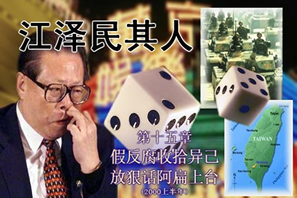</td>

【大纪元6月14日讯】江泽民的最大“贡献”是在共产党统治中第一次实现了“贪官治国”。

对于江泽民来说，“贪官治国”并不是坏事。一个人要让别人对他效忠总要有些理由，有的人是靠他的智慧和威望，有的人是靠国民公认的选举，而江泽民既无智慧，也未经选举，如果全部都任用清官，则会凸现他的无能和贪腐，朱镕基的“清官形象”和“功高震主”已经证明清官路线在江泽民这里是行不通的。而贪官最大的好处是民愤很大，从声望上来说，不可能对江泽民带来威胁。

具有讽刺意味的是，“贪官治国”下的贪官们高举的“反贪”大旗比谁都高。在政治斗争中因腐败落马的高官们，个个都是在大大小小的会议上高唱“反腐倡廉”。“中国第一贪”家族的江泽民，“反腐”的口号更是成了他欺骗民心、打击政敌的工具。通观库恩给江泽民写的传记，里面充斥着江泽民在各个场合大喊“反腐”的讲话。所以，看一个人的好坏，不要看他说了什么，而是要看他做了什么。在江的治下，效忠他的“贪官”平步青云，而二心异己分子则在反腐败名义下被狠手整治，还有一些对江无用的小卒更成为杀鸡儆猴的倒霉鬼。

2000年，江在全国人民的面前，借远华案大耍两面手法，赤裸裸地上演一场收拾异己、死保心腹的经典闹剧。

<b>1.“惊天”远华走私大案</b>

“远华案”由来已久。案件的主角是厦门远华集团董事长赖昌星。赖于1994年成立远华集团，后来从事走私活动。据官方消息透露，从96年到案发，远华集团从事走私犯罪活动达五年之久，走私货物总值人民币530亿元，偷逃税额人民币300亿元，合计造成国家损失830亿元。当时被称为中共自1949年建国以来的“第一大走私案”。

尽管厦门远华公司走私案在港澳炒翻了天，中国媒体仅仅在1999年11月《北京晚报》的一个角落首次披露，然后媒体一片沉默。2000年海外媒体如《华尔街日报》、《纽约时报》、《华盛顿邮报》、《洛杉矶时报》等开始大篇幅报导，使远华案受到前所未有的关注。

据媒体报导，“远华案”案发的起因，是1999年3月，当时的中国总理朱镕基接到一封匿名信，揭发厦门市的远华集团公司大规模走私详情，其中含有相当详细的人证物证，因此而扯出这起金额达天文数字的走私大案。

对这起案件，朱镕基表示：“不管清查到谁，都要一查到底，绝对不讲情面”。江泽民也假惺惺地表示：不论是谁，都决不手软。但不久，专案组就发现案件跟江泽民身边的人如贾廷安、贾庆林有密切关联，江泽民的立场立即发生改变。

2000年初，香港《经济日报》引述北京消息人士说，中共中央派出的“四二○专案调查组”，必须在3月初两会召开之前全部结案，以使当局能在两会期间，将这一案件作为“跨世纪反腐败大案”的反贪污“重大成果”，公诸于众。这显示江泽民最真实的算计，不过是希望能够利用这个案件来为自己贴金，同时希望尽早结束调查，免得查到自己的家门口上来。

<b>未结案先灭口</b>

到了2000年，纪检、监察、海关、公安、检察、法院、金融、税务等部门协同办案，厦门特大走私案及相关的职务犯罪的案情被基本查清。在这期间，共有600多名涉案人员被审查，其中有近300人被追究了刑事责任。

2001年，各级人民法院已对厦门特大走私案涉及的167起案件做出判决，涉及被告人269人。但在2001年7月还没有结案时，就已有几人被判处死刑，并已执行，其中包括中国工商银行厦门市分行原行长叶季谌、厦门海关东渡办事处船管科原科长吴宇波，还有王金挺、接培功、黄山鹰、庄铭田、李宝民和李士专等人。

这么一个世纪大案，在没有完全查明的情况下就枪毙十几个从犯，事实上等于把证据消灭了，让“远华案”成为结不了的悬案。这其中的原因，就是因为案件牵扯到了江泽民自己身边的人，所以江泽民迫不及待地要杀人灭口。而这种阴险的杀人灭口，却被江泽民拿来当作自己的决心和成绩在媒体上大吹特吹。

<b>江泽民说谢谢赖昌星</b>

　　
在远华案中，江泽民的心腹、江办主任贾廷安就曾向赖通风报信。赖昌星透露，他和江泽民五个秘书中的三个都很熟，包括大秘书贾廷安。

很多人对于贾廷安这个名字很陌生。贾廷安是江泽民当总书记时的办公厅主任。从江泽民在电子工业部时，他就担任江的秘书。1985年1月，贾廷安跟随江泽民从北京回到上海。1989年6月，又随江泽民回到北京。贾是江泽民最重要的秘书、幕僚，内部称其为“大秘书。”
　　
2004年，江泽民把江办主任贾廷安调升军委办主任，还硬以“特殊情况”和“有利于工作”为由，提出将贾廷安从上校直接擢升为中将。军委委员们说贾的行政级别也就是司局级、军衔是上校，这样做底下会造反。江泽民不死心，再次提出，在中央军委讨论时，二度被搁置，可见贾廷安是江的心腹。
　　
赖昌星介绍，“他（江泽民）的家在中南海里，是一个大房子，很大。他住一边，警卫和秘书什么的住另一边。一般他都在中南海住。有一段时间，他家里在装修，就在钓鱼台住了一段时间。好像九七、九八都在钓鱼台住。”

赖昌星对《远华案黑幕》的作者盛雪说，虽然他和江泽民本人没有直接接触，但他曾有意给中央军委捐款。江的秘书便报告给了江泽民。赖昌星披露，“江泽民说：不用了。他（江泽民）叫我留着钱好好做生意，还说谢谢我。他本来也知道我是他秘书的好朋友。”

有一次江泽民出国访问回来，贾廷安去接机。贾廷安向江泽民汇报说，接到一份报告，说是广东一宗汽车走私案跟李纪周有关（公安部原副部长）。然后，贾廷安就叫江泽民的另外一个秘书先问问赖昌星，问这个事和赖昌星有没有关系。

赖昌星还提到，这个秘书是江泽民家里的管家，家里上上下下都交给他。这个秘书来问赖昌星，赖昌星回答：“那个事情跟我一点关系都没有，完全没有。”这个秘书说：“知道和你没有关系，他们就好办”。

赖昌星随即在珠海通知了李纪周（当时李纪周随朱镕基到广东反走私），并安排了李纪周的女友、原公安部交通局官员李莎娜躲藏（后已被捕）。

赖昌星和贾廷安关系密切到这种程度，江泽民又还能整谁？不管江喊得怎么高调，其实都只是他拿来整治自己政敌的幌子。

<b>整治姬鹏飞和刘华清</b>

在这个轰动一时的远华大案中，江泽民真正要整治的人实际上是中共资深外交官姬鹏飞的儿子姬胜德和军委副主席刘华清的女儿、儿媳妇。

江泽民鼠肚鸡肠，谁要说一句看不起他的话，他是非要报复的。有两个人一直被江泽民惦记着，一个是姬鹏飞，另一个是刘华清。这两个人在各自的领域里人脉都非常深，也都没拿江泽民当回事。说起来不能怪这两位老人不尊重钦定的“核心”，是因为江确实平庸无能，样样不通。

姬鹏飞曾是中共外事系统实权派，也曾是接管香港的首脑人物。历任国务院副总理、国务委员、港澳办主任、人大副委员长、中顾委常委，权高位重。改革开放前，他的孙子穿戴着从外国带回来的时髦衣服，走到哪里都是风头十足。江泽民是什么东西？根本没有放在眼里。姬胜德提起江泽民来也出口不逊，这都让江泽民脸色铁青。姬胜德是中共元老姬鹏飞的独子，是总参情报部常务副部长，和赖昌星私交非常好。而刘华清的女儿是姬胜德的下级，所以江泽民把他们串起来打。

1999年3月中旬，姬胜德在珠海接获通知，让他赶回北京玉泉山参加军委扩大会议。姬胜德赶到会场一看，发现气氛不对劲，无人跟他打招呼。接着就被抓起来了，当时大有判死刑之势。姬胜德出事后，正在北京香山养老的姬鹏飞曾先后四次写信给江泽民等请求宽恕独子姬胜德，免其一死，但遭到拒绝。姬鹏飞绝望之下于2000年2月10日13时52分服安眠药自杀身亡。

关于姬鹏飞的死讯，中共官方喉舌新华社只发了一则简短的消息。江泽民没有出席他的追悼会，中央军委、军方的四总部、国防部也没有送花圈。但姬胜德母亲许寒冰终于通过元老与遗孀路线为儿子争得死缓。

被关在总参监护所的姬胜德参加完父亲葬礼后，感觉前途更加无望，于8月13日用牙刷柄割脉，并吞服70多片利眠宁（安眠药），但自杀未遂。姬鹏飞的妻子许寒冰要求江泽民准予其子姬胜德以高血压症为由保外就医被拒，又提出每周探望三次、送食品不受限制的要求。又遭拒之后，许悲愤难抑，于2001年9月14日晚吞服安眠药自杀，在三O一医院被抢救了过来。对这个为共产党卖命一生的家庭，江泽民真有点斩尽杀绝的意思。

对于前中央政治局常委、中央军委副主席刘华清，江泽民是早就想动手了，只是一直找不到好机会。刘华清是“六四”之后邓小平给没摸过枪的江泽民安排的军事“保姆”，乱提拔将军的江泽民当然不肯要人整天给他做什么指导。

邓小平在89年“六四”天安门事件后，安排江泽民担任中共中央总书记、军委主席时，担心江泽民与军队毫无渊源，因而特地安排刘华清、张震两员老将出任军委副主席，为江泽民保驾，以稳定军心。

江泽民在翅膀逐渐变硬了之后，开始在军中培植自己的势力，破格提拔了一批中青年将领。不久，江泽民改变了以往不问军事的习惯，更多的直接插手军中的事务。刘华清、张震曾经多次声称，要由懂军事的人领导军队，以此来表达对江泽民插手军队的不满。甚至有人说，刘华清在政治局会议上经常指著江泽民的鼻子教训他，因为他觉得他是邓小平安排下来的，在没打过一天仗的江泽民面前摆摆老资格是理所当然的。他哪里知道江泽民是小人，得罪不起。

1999年，五十年大庆，江泽民传令不许军队退休老军头穿军装，其实就是为了突出自己。阅兵前，江泽民到天安门城楼上会见党政军要员，但见刘华清上将军装帽徽威风凛凛，江觉得他简直是跟自己叫阵，憋着火问道：“不是说不准穿军装吗，你怎么搞的？”刘华清没有买账，冲口而出：“你一天仗没打过都可以穿军装，我怎么就不能穿！”

江一时被噎得说不出话，气得脸色煞白，浑身哆嗦，直到阅兵式要开始被请下城楼坐上阅兵车时才缓过劲儿来。阅兵回去以后，江便对由喜贵说，要狠狠整整刘华清。

中共十五大以后，张震宣布退休，邓小平也已经去世。同时，经过一段时间的精心布置，江泽民在军中的势力也已经日益强大。这时候，江泽民意识到整刘华清的时机成熟了。刘华清本身没什么把柄，但那时刘的女儿刘超英（总参情报部五局上校副局长）卷入了美国的政治献金丑闻。刘超英的上司正好是姬胜德，而姬胜德的朋友是赖昌星。这终于给了江一个机会。

赖昌星向《远华案黑幕》作者盛雪谈到姬胜德时，他说：“不管我在北京、深圳、厦门，还是在香港，只要他到那里，知道我在，就一定会和我见面喽。我们见过的面是数不清了。”打击赖昌星并不是江泽民的真正目的，他要打的是姬胜德和刘华清的女儿。
　　
小女儿刘超英和二儿媳郑莉是刘华清最疼的两个人。因为她们被捕的事，刘华清寝食难安，斟酌再三，别无他路，只有老著脸皮亲自打电话给江泽民讲情，但江泽民接电话后没有说一个字，听完之后就放下了电话，嘴角浮起一丝得意与轻蔑。曾庆红曾经对刘华清说：你反对江主席，咱们奈何不了你，但是把你儿媳、老婆、子女抓起来是绰绰有余。

刘华清儿媳妇郑莉（总政治部军官）被捕后，曾从两个女兵日夜看守中乘上洗手间之机，逃了出来。她逃到了河南，给刘华清打了电话，问刘是否知道她被捕的事，刘回答知道，她才死了心，知道此时无人能救她，就黯然回到中调组去自首。

刘的女儿刘超英在北京国际机场贵宾室被抓的时候，也曾傲气的喊道：“我是刘华清女儿，你们为什么乱抓人？”但是，十几个军人根本不回答，硬是一声不吭地把她从机场带走了。当刘超英仍然骄横十足，拒绝交代时，中纪委审查人员上去给了她一记耳光和一顿臭骂，从来没有受过这等待遇的刘超英此时才意识到自己的处境，开始交待问题。

在处理刘的亲属一案中，全过程由江泽民亲自坐阵，直接下令，给办案人员撑腰。刘华清亲属被抓后，据说江泽民的“近臣”曾向他建议：“要善待恩人的后人”，也就是说刘华清辅佐他有功，但江一听就火冒三丈，让他立即闭嘴。

<b>远华案打到贾庆林</b>

远华案中牵涉到的另一个主角就是江泽民的亲信贾庆林。

厦门远华案于1999年遭揭发，是中国自1949年以来被曝光的最大贪污走私案，涉案资金确定为700亿人民币左右，牵涉多达250名以上的地方、省甚至是中央级别的官员。他们被指控在1994年到1999年期间，收受数百万美元的贿赂，使价值数亿美元包括汽车、燃油、原材料、重型机器和奢侈品的货物通过厦门港口走私到中国。而1994至1996年，贾庆林是福建省委书记和福建省人大常委会主任，这是江泽民查远华案不让往上查的原因。

贾庆林生于1940年3月，河北泊头人，因为与江泽民同具第一机械部工作经历，幸运地受到“老上级”江泽民的欣赏，因此随着江泽民后来当上中共总书记，政治前途一路水涨船高。

在江泽民打垮北京市委书记陈希同后，1996年时任福建省委书记的贾庆林，被江泽民提拔到北京当市长，之后再出任北京市委书记和政治局委员，由此可见江对他的器重。

贾庆林于1962年毕业于河北工学院电力系，在一机部办公厅政策研究室任职。1978年出任中国机械设备进出口总公司总经理，1985年调到福建工作，93年初升任福建省长，年底升福建省委书记。

远华案案发后，专案组在赖昌星公司里搜出贾庆林到远华公司和他的合影。赖说，专案组要抓他回去，真要回去一说出贾庆林来，贾就完了。 所以贾庆林上调时，福建就有“福建贪官，北京做官”的顺口溜出现。

2003年，中纪委四位副书记向中央委员会提出对贾庆林资格政审、组织程序进行复核，各民主党派和政协人士纷纷提出反对贾庆林任政协主席的同时，国务院审计署又爆出了贾庆林在福建主政期间的特大经济丑闻。

行将届满的国务院审计署，于2003年1月下旬，向中共中央政治局、人大常委会提交了本届审计国债专项建设资金报告、该报告披露：1993年，由福建省委决定，投资二十亿元，建设福州长乐国际机场，至1997年初，已超支十二亿元。而1993年至1997年，贾庆林在福建省长、省委书记任期内，还挪用和侵吞建造长乐机场建设费用。经查证，其中十二亿八千万元，是被福建省委、省政府挪用侵吞了，大多消耗在给高干搞福利或下落无据、不明。福州长乐国际机场建成后，从1998年初运营至2002年，五年间累计亏损达十五亿五千万元。其原因是：建设规模过度超前，目前旅客量和货运量，只达到设计规模的百分之三十，机场建造实际成本是国内同等机场的一点二五倍。传说该审计报告还披露：在兴建过程中，贾庆林、贺国强先后十一次签发挪用国土专项资金来垫付超支经费达十二亿元。

审计署还查证：借建机场挪用、侵吞的资金，部分是兴建和购买了五百七十多幢豪华别墅，分布在福州，厦门，珠海、大连、青岛、无锡、杭州、北京等地，被二百三十多名高官匿名侵吞。

2000年12月，国务院审计署在审计国债专项建设资金时，已在审计报告中重点提出：在兴建机场、建设高速公路、三峡工程、农业综合开发这四大建设中，严重挤占挪用建设资金、严重超支、投资资金下落不明等情况严重，并点了“贾贺工程”（“假祸工程”）存在着挪用及资金去向不明等问题。

当时，这一报告送江泽民审阅时，江泽民仅作了简单的批示：类似长乐机场情况，比较普遍，问题出在管理上。之后便退回给国务院了。

贾庆林当福建省委书记时，他的太太林幼芳在中国外贸集团福建省总公司任党委书记。林与远华撇不清关系，有严重贪腐行为。为此，2000年江泽民让贾庆林与她离婚，用来表明贾跟林幼芳“划清界线”。

不过，林幼芳曾在2000年1月公开否认了有关她的丈夫已经同她离婚的报导。她说：“我结婚四十年，我们的关系很好，有一个幸福的家庭。”当时，她还澄清指出，她“从来没有听说过那家在香港注册的华远公司”。当然林幼芳是在装傻，涉及走私的集团是福建厦门的“远华集团”而非 “香港注册的华远公司”。福建人都说，林幼芳负责福建的外贸，不认识福建的第一大进出口大富户，只有傻瓜才相信。她的辩白是越描越黑。

到底贾庆林是否与林幼芳办理了离婚手续到现在还是个谜。2005年4月28日贾庆林以中共中央政治局常委、全国政协主席身份宴请连战一行。在官方照片可以看到，连战身边站着夫人方瑀，但东道主的贾庆林身边却不见其夫人林幼芳。

1999年9月18日，江泽民刻意“考察北京城市建设工作”，和当时面临弹劾声浪的北京市委书记贾庆林同时出席公开活动。外界普遍认为，这是江泽民挺贾的一个政治动作。

临近十届人大、政协“两会”召开，被江泽民内定为十届政协主席的贾庆林，迫于压力正式以书面形式，以健康为由，向中央政治局提出，要求请辞政治局委员、政治局常委的职务，与妻子返回家乡“休养”，但被江泽民严词拒绝。江泽民说：你要下台了，我就完了。可见江泽民有不可告人的经济犯罪没有披露出来。江利用贾，贾保护江，他们之间的利害关系可见一斑。

据媒体报导，中共北京市委在国宾馆设宴，庆贺市委书记贾庆林晋升暨欢送。贾庆林在宴会上默不作声，一杯接一杯地喝五粮液，还自言自语地说：“不是我贾庆林要高升……”直到醉倒。在2002年11月的十六大会议上，贾庆林坐在主席台上愁眉苦脸的图片泄露了他的内心世界，做江家帮身不由己。

尽管江泽民把贾庆林塞进中共最高权力机构，但远华案始终是贾永远挥之不去的阴影。贾和远华案的关系，也成为中共腐败政治的最大经典，成了江泽民反腐空话的最大讽刺。江泽民想用远华案打击异己，最后却是搬起石头砸了自己的脚。

<b>2.成克杰之死</b>

2000年，正在厦门远华走私案调查紧锣密鼓地展开的时候，广西自治区主席成克杰被处死了。

成克杰是少数民族（壮族）出身，早年曾任广西柳州地区铁路局技术员、工程师、总工程师、副局长、局长。他从基层做起，逐级而上，1986年出任广西壮族自治区政府副主席，1990年升任广西自治区主席，1992年成克杰跻身十四大中共中央委员，1998年又“更上一层楼”，在九届全国人大一次会议出任人大常委会副委员长，成为副总理级的“党和国家领导人”。

但成克杰在担任广西壮族自治区主席期间，伙同情妇先后收受贿赂达4109万多元人民币。2000年7月31日，成克杰被北京市第一中级人民法院以“收受巨额贿赂”罪名判处死刑，剥夺政治权利终身，并处没收个人全部财产。成克杰立即申请上诉，于8月22日被北京市高级人民法院驳回。9月7日，最高人民法院核准了北京市高级人民法院按照刑事诉讼法的规定上报的对成克杰执行死刑的裁决。9月14日，北京市第一中级人民法院行刑队对成克杰执行了死刑。

一位副总理级的“党和国家领导人”一个半月就干脆利索的给“喀喳”了，成克杰因此成为中共建政以来因受贿犯罪而被处以极刑的职务最高、处死最快的领导干部。

9月21日官方报纸的一篇社论中说，成克杰被处决，是当局针对高干不管职位多高都不能逍遥法外的警号。社论还说：“对成克杰的判决，以及政府矢言彻查这起厦门走私案，证明政府在肃贪方面，言出必行。”可是成克杰贪的那点钱还不够江泽民那“中国第一贪”的儿子江绵恒贪污的零头多。

事实上，不是因为官方查到了成克杰有什么十恶不赦的罪行后才被捕的，而是被捕之后才搜罗证据，而搜证的手段又是非常卑鄙的。有家室的成克杰非常倾心一位有夫之妇李平。1993年底，成克杰和李平决定双双和自己的原配离婚之后再结婚，于是他贪污了400万准备和她到外国去安度晚年。办案人员当然并不知情，为了达到让李平吐露真言的目的，办案人员把成克杰和别的女人胡混的照片给她看，女人的妒忌心使她的心理防线彻底崩溃了，认为自己从头到尾都被成克杰欺骗了，就把他俩的计划全部吐露出来。成克杰迅速被判处了死刑。原来办案人员给李平看的是不实的照片，那上面的成克杰不过是用换头术搞上去的。最后李平知道受骗了，哭叫着说：是她害死了成克杰！是她害死了成克杰！

揪贪官也不是这么个揪法儿。这样流氓的办案作风，必然有其肮脏的目的在背后。

据消息人士透露，人大副委员长成克杰被处死的真实原因是得罪了江泽民。原因是成克杰曾表现出对人大代表、歌星宋祖英有点“关心”过度，引起江泽民醋海生波，导致小命不保。可叹的是成克杰至死也不知道自己得罪了谁，是谁非要他的命不可。

成克杰为什么在远华大案要开审的时候被迅速处死，一直是外界难解的谜。即使中共内部，包括中共中央纪律检查委员会和全国人大常委会内部仍有不少人对“成克杰之死”继续表示极大的兴趣。

<b>3.台湾大选</b>

一进入2000年，世界各地的华文媒体就聚焦在3月份将举行的台湾总统大选上。这次大选政党竞争激烈，3个主要的总统候选人分别是民进党主席陈水扁、亲民党主席宋楚瑜以及国民党主席连战。陈、宋民意测验指数相当接近，连稍低。

江泽民对于台湾这次备受全球瞩目的选举有点六神无主，不知所措。一直以来江泽民都指示中宣部把民进党描绘成激进的“台独”派，不断对之施以舆论打击，期望以此左右台湾民意。但是看起来台湾民众并不买账，陈水扁获得的民众支持率居高不下。如果陈水扁真的当选，江泽民不知自己该怎样反应。要打仗的话，江泽民自己是一摸枪杆子就发毛的人。而且江更担心那些老军头乘机坐大，一旦战争打响，弄不好自己的军权都被架空。因此，对江泽民来说，仗肯定是不能打的。可是如果不打仗，长期以来国内舆论的导向早已煽动起了中国民众越来越狂热的民族主义情绪，面对军方和民意的双重压力，江泽民又不敢显得太软弱，怕处理不好自己的权位都可能要受到影响。一想到这个进退两难的可能局面，江就觉得脑袋发凉。

但是作为最高当权者，江泽民必须对台湾大选这一重大事件做政治表态。所以江最后玩的又是做秀的本事。

3月4日，江泽民在北京向参加第九届全国人大三次会议的代表发表讲话，故作义正词严地说，如果台湾当局无限期拒绝通过谈判和平解决两岸统一问题，就只能被迫采取一切可能断然措施。江呼吁代表在台湾和中美关系问题上采取强硬立场。

不过明眼人能够看出，这是一个玩文字的游戏。这个讲话实际上已经为自己留了后路。“如果台湾当局无限期拒绝通过谈判和平解决两岸统一问题”，到底谁是当局，已经没有明确的指向，因为不管谁当选，都将成为“当局”，因此江的讲话实际上等于没有态度，其中并没有中国媒体炒作的“坚决反对台独”的含义。“无限期”也是一个没法解读的字眼，如何才算做“无限期”，几年，几十年？总而言之，如果台湾在江泽民任内所剩的这几年不谈统一，都绝不可能算做“无限期”拒绝和谈。这个台阶搭得真是够宽的。

不过，就在2月1日，美国众议院通过“台湾安全加强法”，对台海可能发生的战争表示强烈关注，所以江泽民想再硬起腰板都硬不起来。1996年台海演习江泽民栽的大跟头记忆犹新。对江泽民的铁銹腰板来说，洋人无疑是强大的硫酸。只要碰到外国人，江泽民的骨头就一定会松软下来。

但江会做出姿态。正在这时，中央电视台播放了系列片《中国军队》，带着强烈的恐吓意图。部队也不断往台湾对面集结，显出如果陈水扁当选，台海难免一战。民间到处充满硝烟弥漫的紧张气氛。但当北京有几所大学的学生计划上街游行，发泄不满时，却没有被批准。一些零星游行也被当局驱散。江泽民怕的是一旦开放民意自由表达的渠道，民间长期压抑的各种不满，都会发作出来，那么中共的统治也就岌岌可危了，自己这个总书记位置自然也就泡汤了。

每当遇到难题，江泽民就会想到朱镕基。他是江泽民深为妒忌，又常常无可奈何的人。但江瞧不起朱的没有心机，也知道该什么时候利用朱，把他当枪使。只有想到这点的时候，江对朱强烈的忌恨才会稍稍缓解，取而代之的是暗自窃喜。

朱镕基掌管经济，比任何人都清楚自己的家当到底有多少，所以他心里压根儿就不希望台海发生战争。虽然朱长个铁面，但对台政策实际是个温和派。

但在3月15日，离台湾总统选举还有不到三天的时候，朱镕基被江泽民推到了前台。在星期三的记者会上，故作愤怒的朱镕基用拳头捶击著桌面，以非常强硬的口气警告说，搞台湾独立的人没有好下场，中国政府不允许任何形式的台湾独立，这是中国的底线。朱镕基说，现在台湾人民面临紧急的历史时刻，何去何从，切莫一时冲动，以免后悔莫及。一位西方记者当即向他提问：大陆有可能在什么时候对台湾采取什么样的行动？朱镕基只能闪烁其辞地回答：几天后你们等著看吧！

朱镕基发表谈话后，台湾总统候选人反应各不相同。两个领先的候选人对朱的谈话却都持反对态度。

民进党候选人陈水扁星期三晚上在屏东举行的造势晚会上表示，只有台湾人民有权利选择自己国家的领导人，中共并没有这个权利。陈水扁问到：是台湾人民在选自己的总统，还是中共领导人在替我们指名？我们是在选台湾未来的新领导人，还是在选特首？

独立候选人宋楚瑜同一天在台北市中正纪念堂广场向支持群众表示，台湾所有的民众绝对不接受武力恐吓。

另外一位独立候选人许信良指出，朱镕基星期三的谈话某些部分台湾必需正视，但某些部分也势必激起台湾民众的反感。许信良一方面劝台湾人民不要用直接的情绪回应，另一方面，他表示要告诉朱镕基，走向一个中国原则的困难之一，就是中国经常动不动就用这种武力恫吓的语言来对台湾喊话。

令江泽民没有想到的是，朱的谈话在台湾民间引起了更强烈的反弹，很多台湾年轻人对此威胁性谈话感到愤怒，结果反而朝江泽民更不希望看到的方向发展。“统”、“独”之争实际上是意识形态之争，而强制是改变不了人心的。陈水扁就职演说中，讲了段意味深长的话，“历史证明，战争只会引来更多的仇恨与敌意，丝毫无助于彼此关系的发展。中国人强调王霸之分，相信行仁政必能使‘近者悦、远者来’、‘远人不服，则修文德以来之’的道理。这些中国人的智慧，即使到了下一个世纪，仍然是放诸四海皆准的至理名言。”这恰恰反衬出借“六四”投机爬上来的江泽民笃信强权，只相信强制与恐吓，丝毫不尊重中国古人的智慧。

18日，台湾选民选出反对党民进党领导人陈水扁为下一届总统，结束了国民党在台湾超过半个世纪的统治。陈水扁以39%的得票率当选，居第二的宋楚瑜得票率为37%，国民党候选人连战得票率仅有23%。这次出席投票选民占所有符合条件的选民的82.7%。毫无疑问，不久前中共当局对台湾选民的威胁和对民进党的攻击，促进了陈水扁的当选。

选举完毕，中南海一夜灯火未熄。江泽民怎么也没有想到，国民党会败得如此之惨，如此轻易被民进党拿走了政权。这让江气急败坏，大骂下面的人饭桶。后来很多人把责任归咎到朱镕基身上。朱在台湾人中的形象也受到打击，成了凶神恶煞的代表，对他没有半点好感。朱成了江一手导演的戏中受伤最重的人。

这次选举结果不但对江泽民震动很大，实际也震惊了整个中共高层。

2000年3月19日晚上，中共官方电视新闻的播音员用沉闷的语调宣读了中共中央台湾事务办公室的一份声明：希望刚刚执政的民进党当局不要走得太远。中共的无奈显出北京当局束手无策，对台湾民意了解与判断严重错误。

中国外交部发言人孙玉玺在星期二的新闻发布会上表示，将采取观望的态度。

江泽民的态度，和选举前夕的宣传调门相比，一下子温和多了。他若无其事的态度，好像选前他根本没有发表过强硬谈话，也忘掉了他让朱当黑脸的事情。反衬之下，倒像是朱镕基自己没事找事搞了一场闹剧。朱镕基对自己当初被江利用发表谈话后悔不已。

几年后，吕加平上书中央领导和人大代表、政协委员，披露江泽民利用台湾问题搞两头敲，以打台湾的担保，取得军队将领和官兵的信任继续执掌军权，而同时又向美国总统许诺：只要你们支持我连任中央军委主席，我就不会让解放军打台湾。

江泽民始终喊要打台湾，并几次作出要大打特打的样子，其实都是故作姿态。江泽民实际上是把台湾当成了手里的一张王牌，每到自己的权力发生危机时就拿出来晃悠晃悠，作出要大打特打的样子，让军队过过干瘾，然后再收回去，留着下次危机时再用。 

(版权归大纪元所有﹐欢迎转载﹐不得更改)
