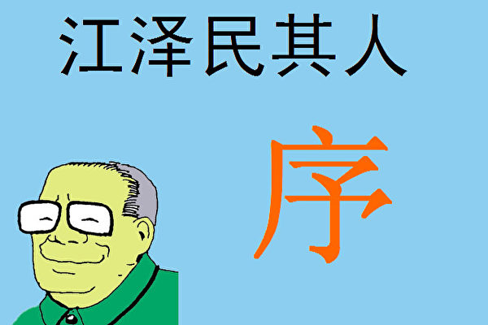
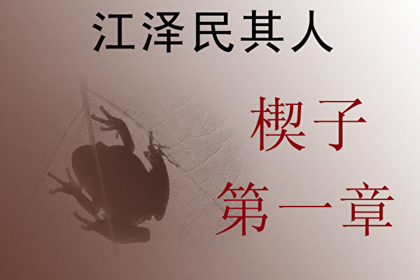
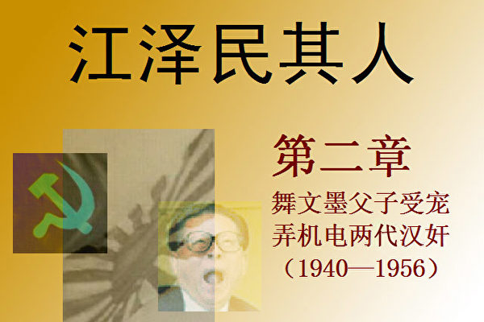
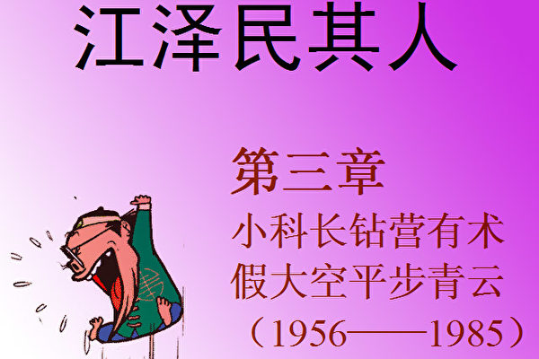
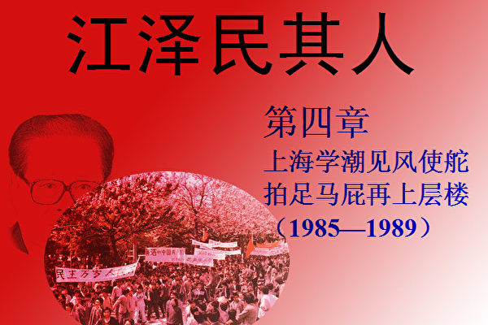

   + <a href='https://github.com/dfchunsring/wer/blob/master/downldoad/jzmqr-pic-2.0-20161021.epub?raw=true'>《江泽民其人》epub电子书</a>        
+ <a href='https://github.com/dfchunsring/wer/blob/master/downldoad/ultiGoalCmCN8k.epub?raw=true'>镶崁8k mp3 的共产主义的终极目的中国篇 简体版epub电子书</a>
+ <a href='https://github.com/dfchunsring/wer/blob/master/fq/um4.1.apk?raw=true'>安卓版4.1(apk)</a>
    - <a href='https://github.com/dfchunsring/wer/blob/master/fq/um4.1.apk?raw=true'>安卓版4.1(apk)</a>
    - <a href='https://github.com/dfchunsring/wer/blob/master/fq/u1704.exe?raw=true'>桌机版17.04(exe)</a>
+ <a href='https://github.com/dfchunsring/wer/blob/master/fq/fg-20160129-32.zip?raw=true'>安卓版3.2(zip)</a>
    - <a href='https://github.com/dfchunsring/wer/blob/master/fq/fg-20160129-32.zip?raw=true'>安卓版3.2(zip)</a>
    - <a href='https://github.com/dfchunsring/wer/blob/master/fq/fg764p.exe?raw=true'>桌机版7.64(exe)</a>

<h1 align="center"><b>《江泽民其人》序─江泽民为何物？</b></h1>

<table border="0" cellspacing="3" cellpadding="3">
<tbody>
<tr>
<td align="center"></td>
</tr>
<tr>
<td align="center"><b>江泽民其人</b>
</td>
</tr>
</tbody>
</table>

【大纪元5月30日讯】如果冥冥之中有定数的话，历史的安排也必然会让某些人的出身极不光彩。

2003年3月12日，出席中共人大会议的江泽民参加了湖北省代表团的讨论。江泽民说：“1966年至1970年我在武汉锅炉研究所当所长，当时正值文革，……，造反派把我的档案查了个底朝天。也好，证明了我历史清白。”

听者无意，言者有心。身为总书记，为什么要表白自己“历史清白”呢？

因为江泽民的历史的确不清白。他的生父江世俊（又名江冠千）是日伪时期的汉奸，江泽民上的大学是日伪中央大学，他还编造故事说是过继给了死人，他在留苏期间又为贪恋一俄国女子遭克格勃收买……江泽民的历史完全是一本糊涂账，何来清白？造反派就是把档案查翻天，又如何能找到档案中根本就没有，被江谎报、隐瞒的重大历史问题呢？

在2005年初江泽民隆重推出他委托美国商人库恩写的《江泽民传》，对隐瞒历史做出公开回应。

有句古话叫“此地无银三百两”。江泽民在传记中为自己贴金的词汇里，出现频率最高的就是充斥满书的“爱国”二字了，甚至他上日伪大学的那一段历史的题目就叫“我是一个爱国者”──“爱国”乃是国民的本分，是与生俱来的品行，是一方水土养育的情结──任何一个清白的人，绝不需要到处叫卖自己是爱国者。

一个基本事实是，江的生父是替侵华日军做事的汉奸。在江泽民参加工作后的一生中，甚至他让人写的传记里面，都对他的生父唯恐避之不及，只有寥寥一句“生父于1973年去世”。

江泽民编造说他在13岁时被过继给了刚刚死去的共产党员叔父江上青。江泽民21岁大学毕业，13岁到21岁这8年间，是谁供养著江泽民呢？按江上青女儿江泽慧对库恩所说，江泽慧一家是“无尽的贫穷饥饿”，那么是谁替江泽民交纳高昂的学费去读贵族中学和南京中央大学，是谁让他在兵荒马乱物价飞涨的年代能够去学琴棋书画，是谁让他在离开校门不久，就可以在上海滩开着美式吉普车狂兜（库恩书中所言）？在这20多年中养育他的，难道不是他的生父吗？这跟8年前就死去的江上青有什么关系呢？江泽民的生活根本就不沾“过继”的边。后来共产党得了天下，江泽民才想起家族中有一位共产党的烈士，于是摒弃生父，要去过继死人，那是后话了。

我们不是要搞“出身论”，而是从江泽民隐瞒、编造出身历史看出了他的欺骗本性。甚至到了晚年，江更是变本加厉，还要把他的汉奸父亲暗示成抗击侵华日军的英雄。江泽民在传记中用他堂妹江泽慧的嘴不止一处地说，“我们全家都是革命者”“家里的男人都打仗去了”“他们全都出去参加了革命，既打日本侵略者，也打国民党。”这对于不知道他们家汉奸底细的大陆读者，很具有极大的迷惑性和欺骗性。

1999年12月11日《人民日报》报导，江泽民同叶利钦在北京签署了中俄边界议定书。令人惊讶的是，在江泽民让库恩写的传记中却找不到这次会晤的一丝踪影。大家知道，江泽民是连何时何地给谁唱了一首什么歌儿这些鸡毛蒜皮的事都要在传记中隆重写下一笔的，他跟其他国家领导人的会面更是一个不落了，为何偏偏漏掉了同叶利钦签署领土边界这样有关民族社稷的大事呢？原来，江泽民在这个条约中把从满清以来历届中国政府都不承认的中俄不平等条约全部承认了──江泽民签署的是个地地道道的卖国条约，断送了子孙后代讨回失地的合法依据，拱手让给俄国100多万平方公里肥沃的黑土地，相当于数十个台湾。面对海内外华人讨伐江泽民卖国罪行的风起云涌之势，江泽民竟然删节历史，这只能使其卖国贼的行为欲盖弥彰。

江泽民还在传记中把自己包装成如何关心人民的疾苦。看看他在1998年的大洪水中的作为吧。在当年9月上旬，无数人正在水灾的死亡线上挣扎时，江泽民却邀请电影艺术家们在中南海开派对，库恩称其为江泽民“心目中的开心一刻”。在联欢会上，江在女演员的伴唱下演奏著俄罗斯的旧日情歌《莫斯科郊外的晚上》。兴奋之际，江泽民和众人唱起了《大海啊，故乡》，库恩在书中描述“尤其是江本人，更是引吭高歌”。多么具有讽刺意味啊，人民在滔滔洪水的汪洋大海中苦苦挣扎，江泽民却在中南海的温柔乡中高歌《大海啊，故乡》。一个隐瞒汉奸出身窃取高位的人，他心里哪有人民的死活？

江泽民还让库恩把自己塑造成生活俭朴、反腐败的领头人。大家都知道，这些年中国的腐败是愈演愈烈，其根子就出在江泽民和他的家族本身。他的儿子们无才无德却营造起江家的金钱王国，成为名符其实的“中国第一贪”。

民间早就传说江泽民雪夜给李先念在上海养的小老婆送生日蛋糕之事，李当时有客人，江泽民亲自在门外等候了几个小时以表忠心。这事本来太过离奇，无以考证。有道是做贼心虚，江泽民在他的自传中居然为送蛋糕一事出面辩解，外人才知原来果有此事。书中美其名为“关心领导”，称那只蛋糕“是宾馆里的最后一只蛋糕”，目的是“与关键人物谋求共识”。果真如此，中国也就没有贪污受贿了，那个行贿者不是“关心领导”、“谋求共识”呢？

江泽民的发迹，一靠编造自己是烈士遗孤，从而得到烈士的战友汪道涵和张爱萍的一再提携，二靠溜须拍马，讨得党内大老的欢心，最后竟窃取了高位。

江泽民掌权后，为了出风头，开始在国际外交场合跳舞卖唱，完全不顾国际外交礼仪和中华民族尊严，使国家的颜面尽失。江泽民的“戏子”称呼就是这么来的。他跟西班牙国王见面时会突然拿出梳子梳起头来；别人要为他挂勋章时他会迫不及待一把抢过来自己戴上；在国宴进行途中他或者突然拉起东道国的第一夫人跳起舞来，或者从餐桌上突然站起来高歌一曲“我的太阳”，或者色迷迷的盯着小姐弹起琴来……这些不成体统的戏子行为都成为了西方媒体炒作的笑料。单说他同克林顿的几次见面。93年、97年江泽民访美，98年克林顿访华，江每次都要或弹或拉或唱，表演完毕每次都要求克林顿演奏萨克斯，可克林顿从不附和。97年江泽民访美时，记者会上有人提到西藏问题，江泽民突然高歌《牧场上的家》，弄得人们莫名其妙。江泽民背林肯的演说词更是经典。跟学生对话要背，接受记者采访要背，出国访问要背，别人没让他背他主动要背，别人让他背他就乖乖地背，哪有一国之君的正形？

江泽民走火入魔的还要算他的“说外语”。江泽民出访拉丁美洲，七老八十的他还要花几个月时间强化速成去现学现卖说西班牙语，放着正经的国家大事不顾，完全是戏子作了山大王，改不了现眼的本性。在他自己的传记中，江泽民炮制了一个谬论，说是“如果你由于语言的差异而无法与他人交流，你们怎么能交流观点或者达成协议呢?”懂点常识的人都知道，靠他那点三脚猫外语，就能与人自由的交流？世界上那么多的国家元首，他们都说着各自不同的母语，难道他们竟然不能达成外交协议？

也许是共产党国家的领导人历来都比较严肃，这一下来了一个“人来疯”的江泽民，西方政客竟把江当做共产党的异数，乐得看他尽情表演。

真有雄才大略的人不会在这些作秀上倾注精力。江泽民之所以蹦蹦跳跳“人来疯”，因为他的能力也就局限在一个学校文艺委员的戏子水平上。西方政客们用红地毯来欢迎他，不是因为他江泽民有多大的能耐，西方感兴趣的是江泽民兜里揣的订单和中国的潜在大市场。而中国经济的发展是海外20多年来5000多亿美元的对华投资加上中国人民勤劳而廉价的劳动力造成的。有巨额投资，有廉价劳工，有聪明的人才，当然会制造出丰富的产品。而江泽民的无能、专横、妒忌和保守，恰恰造成了中国政治改革的全面停滞、社会道德的全面下滑和贪污腐败的全面横行，更是让经济发展付出了资源、生态、环境、社会的巨大损失。事实上，中国的橱窗式经济繁荣是以牺牲子孙后代的可持续性发展和生存环境为根本代价的。江泽民对民族未来的伤害，对中国政治改革的全面停滞和倒退，对人权信仰的空前破坏——这些滔天罪恶是他这个历史的罪人还不清的。

江泽民让库恩写的传记中一个劲儿想把自己说成具有多么大的处事能力。事实上，重大事件发生后，比如大洪水、大使馆被炸、台湾选举、闹“非典”等等，江总是把别人推到前面，自己做缩头乌龟。“非典”时，江明明是贪生怕死，逃跑到了上海避难，可是，他在传记中用“一直住在上海”来为他的逃跑辩解。要知道几天前中央刚开完人大政协会议，江还在会上讲话呢。怎么能用“一直住在上海”这样的话来为自己的逃跑开脱呢？

除了拉帮结派，到处唱歌作秀之外，江泽民真正上心的、真正作为十万火急的头等大事来抓的，就是迫害法轮功了。外界都知道的，是江泽民在国际场合分派诽谤法轮功的传单小册子；外界不知道的，是2002年3月5日晚长春法轮功学员在8个有线电视频道插播45分钟真相节目后江泽民的快速反应。库恩在传记中提供了江泽民在长春的密友的回忆。密友说，法轮功结束对长春有线电视系统的插播后刚过10分钟，9点10分，江泽民就打电话给他。江在电话中非常气愤地问，“法轮功分子在长春有线电视里播节目！谁是你们市的市委书记？”──从江泽民对这起发生在外地的事件的迅速反应，而且立即向市委书记发威，可以看出江泽民是迫害法轮功的总指挥，而且是直接听取汇报，发布命令。要知道，中国大使馆被炸，几天之内，江泽民面都没敢露一下。

江泽民在他自己的传记中为自己辩护、贴金的一大手法就是用他说过什么话来证明他就是什么人。我们知道，哪个因腐败落马的高官不是在大大小小的会议上高喊“反腐倡廉”呢？我们不要看一个人说什么，要看他做什么。对于能说会唱的江泽民，尤其如此。

对生父的不孝，对其组织的不忠，对人民的不诚，造就了江泽民这个“不仁不义不礼不智不信”祸乱中华的人形大丑。如果我们还让江泽民继续用谎言来为他自己树碑立传，那就是贻误子孙了。

江泽民写的传记是处处充满谎言和矛盾的一本书，江泽民的一生同样是处处充满谎言和自相矛盾的一生。

还原一个真实的江泽民，是我们这一代见证历史的人们不可推卸的责任。

<h1 align="center"><b>《江泽民其人》一：瞒身世欺骗共党</b></h1>

<h3><b>第一章：瞒身世欺骗共党 编瞎话过继死人</b>
</h3>
<tr>
<td align="center"></td>
</tr>
【大纪元5月31日讯】在江泽民当上海市长时﹐上海坊间就流传他是癞蛤蟆转世。令人惊讶的是﹐这样一个科学发达的直辖市﹐又是江发迹的地方﹐对这种说法人们不但不惊讶﹐反而很认同。1989年江进京后﹐许多北京人也都叫他“江大蛤蟆”。这或许是因为江泽民长的太像蛤蟆﹐也可能因为有“妲己闹朝廷”在先﹐狐狸精能转生成美女祸乱朝廷﹐那癞蛤蟆转生当上海市长也不算先例。

这吸入千年邪气的蟾蜍﹐乃水泽之民﹐某年某月某日投人胎转生到江苏省扬州市田家巷一个江姓富裕家庭﹐遂得名“江泽民”。

<b>1﹒汉奸出身</b>

江泽民的祖父是江石溪﹐父亲江世俊﹐母亲吴月卿。江泽民无兄﹐有一姐江泽芬﹐妹妹江泽南（泽兰）﹑弟弟江泽宽﹐在江氏家族中江泽民是长房长孙。

1915年﹐中医师江石溪在45岁当口突然弃医从商﹐后来曾受聘大达内河轮船公司﹐为驻扬州协理﹐生活富裕后迁居到有钱人居住的城内琼观街田家巷。

江石溪有子女七人﹐其中两人早年夭折﹔老六江世侯（即江上青）1928年参加了共产党闹革命的行列﹐1939年被乱枪打死时才28岁﹐留下同岁的遗孀王者兰和两个年幼的女儿江泽玲﹑江泽慧﹔老五江世雄文革六十年代末中风而死﹔老七江树峰是扬州大学教师﹐1993年11月在北京去世﹔老大江世俊日军侵华时堕落为卖国汉奸﹐成为江氏家族的耻辱。

不论谁当政﹐汉奸卖国贼都为人所痛恨。因而江世俊的儿子江泽民对父亲避之犹恐不及。江不但绝口不提亲生父亲﹐甚至在自己当中共总书记时﹐把情妇亲信都提拔成了高官﹐任他们大贪大腐﹐也不肯拉亲生兄弟姐妹一把﹐不与他们往来﹐几乎到了不承认他们的地步。

这个不可思议的现象到邓小平去世后才被揭示出来。邓去世后﹐江泽民三权在握﹐他迫不及待的组织了一个专门写作班子为自己写传记。这个写作班子在走访搜集资料时费尽心思﹑不辞辛苦也找不到江能服人的政绩﹐反而了解到其大量鲜为人知的不光彩一面﹐其中就包括伪造出身的问题。江泽民对这个写作班子非常恼火﹐命其立即解散。但人的嘴巴不上封条总有缝隙﹐江的丑事还是被陆续传了出来。

江泽民的父亲是江世俊。1940年11月汉奸汪精卫的日伪政府成立后﹐江世俊投奔南京﹐改名江冠千﹐担任南京汪伪政府宣传部副部长兼社论委员会主任委员﹐为《中华日报》主笔胡兰成（张爱玲的前夫）手下一员大将。胡兰成与周作人并称当时国内最著名的两大汉奸作家。胡兰成离开中国后在日本出了本《历史的漩涡》﹐书中特意提及江世俊（江冠千）和他共事的历史。

为了让长子将来出人头地﹐江世俊不但送江泽民去学费不菲的扬州中学﹐还送他去汪精卫伪政府办的伪中央大学读书﹐而且从小就送他去学弹钢琴。那个年代正是中国人民处在水深火热﹑受苦受难之时﹐一般人连生计都难以维持﹐而这位阔少的父亲挣的大钱却是做汉奸换来的。江泽民没有辜负父亲的苦心栽培﹐不但弹拉跳唱﹐又歌又舞﹐还会京戏﹑越剧。

江泽民当政后曾回扬州祭祖﹐重修祖坟就动用了国库150万元。但记者发现一个奇怪的现象﹐江泽民喋喋不休的只谈在他七岁时就死去的祖父江石溪﹐却小心翼翼的避免谈到为他苦心经营的汉奸父亲江世俊。

<b>2﹒“烈士遗孤”</b>

共产党讲究出身﹐动不动就问“阶级成分”。为了能够往上爬﹐从建立档案的那一刻起﹐江泽民就把比自己大15岁的六叔江上青的名字偷偷填在了“父亲”的栏目中﹐一来江上青闹过革命﹐二来已成“烈士”﹐盖棺不再犯错﹐所以保险系数达到了极限。江泽民就这么壮著胆把出身从“汉奸狗崽子”变成了“革命烈士子弟”。为此他往穷困的寡妇六婶王者兰家走动的勤了﹐手里总不忘拎着点礼物。

江泽民小学毕业后没考上著名的扬州中学﹐只考进江都县立初级中学﹐心中闷闷不乐。第二年﹐他凭借着父亲的关系转入扬州中学就读。后来又在父亲的周旋下﹐伪中央大学送给他一个名额。江泽民耳濡目染﹐已经开始熟悉官场后门的权钱交易了。不过让他扫兴的是﹐最终取得抗战胜利的是国民政府﹔国民政府不承认汪精卫伪政权﹐所以也不承认伪中央大学﹐对江泽民在那里的学历也不予承认。因为尽管美国人库恩在《江泽民传》中把江泽民就读的南京伪中央大学称为“江苏最负盛名的高等学府”﹐但实际上那个真正最负盛名的中央大学﹐早已随国民政府迁到西南的抗日大后方去了﹐而南京这个所谓“中央大学”是汪伪汉奸政府后来拼凑起来的。

1989年﹐江泽民出任中共中央总书记不久﹐江苏的南京大学在整理旧学籍档案时﹐发现这位江泽民于1943年至1945年曾在南京大学前身之一的中央大学就读﹐并找到了他当年的成勣单和贴有照片的借书证。南京大学校方十分高兴﹐校友会赶紧给江泽民发了一封“认亲信”﹐但江泽民迟迟没有回信﹐令他们大失所望。看来江泽民不仅对自己的出身讳莫如深﹐对自己的学籍也唯恐避之不及。

上世纪90年代初﹐江泽民到江苏视察﹐特地访问了南京大学。南大校方在安排他的行程时﹐有意把江泽民过去住过的宿舍楼放在他的参观路线上。当江泽民走到这里时﹐不由自主地停了下来﹐遥望当年的宿舍﹐若有所思。当时﹐所有的陪同者都停了下来﹐四周鸦雀无声。南大的领导没有胆量上前说一声﹐“这就是你当年在此求学的住处﹐现在仍完好无损”。江泽民也一改喜欢高谈阔论的习惯﹐只是出奇的沉默著……

江泽民出任国家主席后﹐出访时被称作“戏子”的本事都是当阔少时练就的﹐那时他有足够的经济条件学弹钢琴﹑吉他等乐器。

而那时江上青的遗孀和女儿却过着非常贫困的生活。江上青次女江泽慧对《江泽民传》名义作者库恩回忆说﹕“在我11岁之前﹐我唯一记得的就是无尽的贫穷饥饿﹐家里没有多少粮食﹐有时根本连一点儿吃的都没有。”

江泽慧的话无疑把江泽民所有传记里的“过继”问题给否定了。1938年3月出生的江泽慧比江泽民小11岁﹐假定过继给死人也成立的话﹐那江泽慧在江泽民“过继”时才一岁。如果江世俊夫妇真如传记中所描绘的那样好心接济著弟弟的遗孀﹐为何江泽慧说11岁之前“有时根本连一点儿吃的都没有”﹖既然江世俊夫妇知道弟媳妇连孩子都养活不了﹐就应该收养那两个亲侄女﹐怎可能好事没做倒忍心把自己儿子送过去跟着一起“绝食”呢﹐这于情于理都说不过去。

江泽民是江家的长子长孙﹐他还有一个姐姐江泽芬和一个弟弟江泽宽。在中国的社会伦理传统和子嗣继承规矩中﹐如果没有特别特殊的情况﹐长子长孙是不可以作过继的。

江泽民杜撰出的生动有加的过继仪式更是让人摸不着头脑。除了那些穿帮的西方礼仪（比如13岁的江泽民起身拥抱比他只大十几的江上青遗孀什么的）﹐库恩在其《江泽民传》中还有这样一段描写﹕“‘我希望这个孩子能够继承他父亲的遗志﹐’江世俊在过继仪式上说道﹐‘向万恶的敌人复仇。’那年﹐江泽民13岁。”

这当然只能是一个笑话。江世俊随后便效忠于汪精卫的日伪政府﹐而江上青是中共烈士﹐不知江上青的“万恶的敌人”包不包括汪精卫的卖国政府﹖江上青是1939年死的﹐那时共产党未成势力﹐还被叫做“共匪”﹐汉奸江世俊避之惟恐不及﹐怎么可能把儿子过继给死去的“共匪”﹖

江泽民的堂妹江泽慧接受库恩的采访﹐谈到江泽民所谓的“过继”时更是“精彩”﹕

“在以后的日子里﹐江主席一直叫他的生母‘妈妈’﹐叫他的养母‘娘’”﹐“在我们的文化中﹐这两个称谓都是‘母亲’的意思。不过﹐它们在亲密程度上还是有细微的不同。‘娘’要显得更亲一些﹐更像一个爱称。”库恩特地注释﹐这两个称谓之间的区别很像英语里面“Mother”和“Mom”的区别。

事实上﹐扬州人管妈妈叫“姆妈”（“姆”读第一声﹐“妈”读第四声）或“阿母”（ “阿”读第一声﹐“母”读第四声）。绝没有叫妈妈为“娘”的。扬州几十年前倒是还有人说到老婆时用“我娘子”﹐但无人管母亲叫“娘”的。这段描写更证明江泽民从来没有过继给江上青的遗孀做养子。

江泽慧还对库恩说﹐“要理解江泽民主席﹐就必须懂得他的养父﹐也就是我的生父﹐江上青。”这种肉麻的话﹐江泽慧也说得出口。江上青成天在外闹革命﹐同江泽民相处无多﹐江家其他人又素对江上青的革命不理解﹐江上青被捕后﹐江家营救江上青的法庭说辞就是“上青仅仅是个被勾引而误入歧途的青年”﹐而且江泽民还只是个10来岁的小孩子﹐江上青能对他有什么影响?

自从江泽民成立的写作组调查出他篡改出身后﹐江惊恐万状﹐利用手中的权力急着出各种各样的回忆录﹑传记等等﹐利用一切机会大篇幅的反复述说自己在13岁时过继给了已成“烈士”的江上青。

2002年10月﹐在江泽民的授意下﹐由其亲信﹑时任广东省委书记的李长春在省委组织部管辖的刊物《广东支部生活》上刊出了一篇文章﹐大谈江泽民的“过继”问题。令人捧腹的是文章的第三部分﹕“烈士夫人誓育遗孤”──由生父江世俊悉心栽培的江泽民转眼成了“遗孤”﹗别小看这期杂志﹐发行量竟高达近两百万册﹐远远超过当时发行最红火的《南方都市报》两倍﹐其重点旨在告诉读者“江泽民是烈士遗孤”。

一个月后﹐2002年11月中共十六大上﹐为江泽民漂白出身有功的李长春就被提拔进了政治局常委会。一年后﹐2003年11月29日﹐《中记传媒网》发表消息﹐根据《中央治理党政部门报刊散滥和利用职权发行工作协调领导小组》办公室的意见﹐《广东支部生活》被宣布停刊。

李长春为了升官真下了大工夫﹐而库恩那本中文版的《江泽民传》里居然说“过继”是有法律手续的。但遗憾的是三十年代还是宗族长手握决定权﹐过继儿子不需要法律证书。

<b>3﹒顺藤攀爬</b>

当然﹐江泽民自己偷偷篡改出身还不行﹐其出身还必须得到王者兰一家的认可。江泽民知道物质投资是必要的﹐就开始到六婶娘那里去走动﹐但绝不空着手﹐总是拿着些让母女都惊喜的礼物。人是有感情的﹐感情培养起来﹐看见什么事就可以睁一只眼闭一只眼﹐何况江泽民谎报出身也只能使王者兰一家有收获而无损失。

对于江泽民来说﹐只在档案材料里有一个“烈士子弟”出身远远不够﹐并不是所有的“烈士子弟”都能飞黄腾达﹐没人提拔也不行。于是江泽民便时常蒐寻﹑打听哪位高层干部曾和江上青认识。

1982年﹐任国家进出口管委会副主任的江泽民有一次无意中听到﹐当时任国务院副总理的张爱萍有一段在皖东北特委工作的经历﹐这让他欣喜若狂。自那天起﹐江泽民开始搜集张爱萍的爱好﹑特长。当他发现张爱萍爱好书法时﹐就有了一个投其所好的主意。

一次会议结束﹐张爱萍忽听身后有人喊道﹕“张副总理﹗”他回头一看﹐原来是国家进出口管委会副主任江泽民。此前﹐因工作关系﹐他们曾有多次接触。江泽民匆匆几步走到他的身边﹐紧张地问道﹕“您还记得江上青吗﹖”张说﹕“当然记得﹐我们是好朋友。很可惜﹐他英年早逝。”江泽民脸上顿时露出耐人寻味的表情﹐声调提高了八度﹐说﹕“他是我的养父﹗……”张爱萍震惊得半天没回过神儿来。

张爱萍和江上青（原名江世侯）的相识是在抗日战争时期﹐当时江上青曾受中共党委派至皖东北特委与张爱萍一起工作过﹐遂成朋友。1939年江上青28岁遇难时﹐张爱萍正好29岁。江泽民知道张爱萍喜好书法﹐就找了一个“为江上青墓立新碑”的理由向将军求字。这一举动既让王者兰母女三人感动﹐又在张爱萍面前坐实了江上青“养子”的名分。

众所周知﹐因汪道涵的竭力推荐﹐江泽民当上了上海市长﹐这当然与江泽民自称是江上青的“养子”有直接关系。抗战初期﹐也就是所谓的“国共合作”时期﹐江上青曾经是汪道涵的顶头上司。那时共产党员江上青负责安徽国民党的地方政府及地方武装统战工作﹐取得了国民党安徽省第六行政区专员兼保安司令盛子瑾的赏识。江上青将中共派的一批上海﹑江苏等地的地下共产党员安排到盛子瑾下属的各个县里担任行政职务﹐汪道涵就是其中的一个。

当江泽民得知汪道涵和江上青的关系后抓住不放﹐一口一个“恩师”﹐在汪的提携下﹐江泽民仕途极顺﹐一路攀升。但在江手握党﹑政﹑军大权之后﹐去上海接见这个﹑会见那个﹐就是不理汪道涵﹐被上海人大骂“良心被狗吃了”。

和汪道涵﹑张爱萍建立了关系之后﹐江还不满足﹐他决不肯放过任何一块能够铺垫通往官场高层的垫脚石。

在赵紫阳担任总书记期间﹐江泽民直接讨好赵紫阳的机会不多﹐只能用迂回战术﹐先讨好赵的秘书。于是﹐江曾经拉住赵氏的一个秘书强认“老乡”的丑事一度在中南海里传为笑谈。中共前中央军委领导人之一洪学智上将是安徽金寨人﹐江泽民在他面前主动谈及自己的祖籍是安徽﹐借此与洪学智攀上了“老乡”。见什么人说什么话﹑下什么菜碟﹐这已经成为江泽民闯荡官场的最大特点。

<b>4﹒“一荣俱荣”</b>

随着江泽民的官职不断提升﹐他愈发恐惧出身被揭穿﹐不仅从不提及自己的生父﹐甚至还故意冷落自己的亲姐亲弟﹐掩饰与他们的关系。江的亲姐被划为右派﹐遭遣送回家﹐不得不靠每月8块钱艰难度日。只因怕汉奸出身曝光﹐江泽民对亲姐姐竟伸不出亲情之手。而据库恩在《江泽民传》中透露﹐那时候江泽民每个月都分别寄10多块钱给他的两个堂妹。堂妹江泽慧自己也说“那个时候﹐这可是一大笔钱了”。

江泽民住进中南海后﹐两个堂妹更是“鸡犬升天”。“扬州世明双语学校”﹐是扬州目前最大的也是条件最好的学校之一﹐该校不但有幼稚园部而且还有中小学部。该校名义上挂靠在“中国红十字会”的名下﹐但幕后老板是江上青的大女儿江泽玲﹐该校的官方网站上有江泽民的题字。同时﹐江让银行给江泽玲的儿子邰展无抵押贷款做生意。

江泽民更毫无顾忌的提升江上青的二女儿江泽慧。据官方报导﹐江泽慧从安徽农业大学一个普通教师窜升到安徽省人大常委会副主任﹑安徽农业大学党委书记﹑校长﹐不久火箭般升任中国林业科学研究院院长﹐成为国家林业局党组成员。现有头衔还有全国政协委员﹑全国政协人口资源环境委员会副主任﹑中国科协常委﹑科普工作委员会主任﹑国务院学位委员会委员﹑国际竹藤组织董事会联合主席﹑中国花卉协会会长﹑中国竹产业协会会长﹑中国林学会理事长等职。

江上青去世时﹐大女儿江泽玲才三岁﹐小女儿江泽慧一岁零四个月﹐对“父亲”只是有概念而形像模糊。江泽慧姐妹俩心里明白﹐中共的“革命烈士”多了﹐并不是哪个烈士子女都能高升。父亲江上青没有给自己带来任何好处﹐父亲死后自己连饭都没得吃﹐而江泽民利用了父亲拼命钻营﹐攀上了汪道涵那根高枝儿﹐抱牢了张爱萍这条粗腿﹐顺藤往上爬。如果没有堂哥篡改出身﹐江泽慧姐妹连想都不敢想会有今天这样显赫的地位。父亲这块“革命烈士”招牌也只有在堂哥江泽民的手里才最大限度的赚出利益来。所以她们自觉自愿的“自律”﹐在任何情况下都和江泽民的说辞保持一致。

不过人被捧晕的时候也会失口爆大料。有一次﹐几个知己和江泽慧侃大山﹐有人说﹕“你真好命﹐摊上江泽民这么个好哥哥﹐你才有今天。”江泽慧撇撇嘴说﹕“你说反了﹐是他好命﹐摊上我们这个好家庭﹐他才有今天。没有我们家给他撑著﹐他还不是黑五类﹖”有人小心地问﹕“他不是过继给你妈做儿子了吗﹖”“那个时候我们多困难啊﹐我妈还盼著有亲戚把我们给收留了呢﹖怎么可能过继别人的孩子﹐而且那时候他们家有钱﹐我们家没钱﹐他们那时候理也不理我们﹐后来用得着我们了﹐……谁沾谁的光啊﹗我们心里都有数。”

看看江泽民编的成长历程﹐实在是自相矛盾。为了淡化汉奸色彩﹐他说在中小学就很革命﹐热衷爱国运动﹐其实他大部分时间是在父亲的培育下拨弄琴棋书画﹔到了上大学时﹐号称爱“革命”的他并没有真正“爱国”﹐去追随南下的中央大学﹐而是去了日伪政府的南京中央大学﹐江泽民说是他要走“科学救国”之路﹔要“科学救国不理政治”吧﹐但现在出的传记里又说在校期间是积极参与共产党的地下活动﹐还入了党﹐而且还是当时上海中共活动的积极分子。库恩在江的传记中﹐描写了很多江泽民在校期间参与的所谓“革命活动”﹐这些都无从考证。但是﹐那时发生过一个众所周知的中共领导的“6.23”反蒋大示威。1946年6月23日在上海由中共的周恩来﹑吴学谦﹑乔石﹑钱其琛等领导发动了一场300多家单位的5万多人参与的大游行。可是到现在也没有任何文字史料和当事人可以证明江泽民以地下党员身份参加了“6.23”游行和接受执行了地下党分配的什么具体任务。

江泽民的“革命经历”﹐不过是怎么样对自己有利﹐就怎么去编。

历史的安排会让丑角的出身不光彩﹐但是﹐也会利用他欺骗和伪装的本性﹐安排他走到权力的顶峰。当他被历史抛弃的时候﹐历史就会安排时代的见证者们把他的底细完整地揭示出来以警后人──是谓天意。

<h1 align="center"><b>《江泽民其人》二：弄机电两代汉奸</b></h1>

<h3><b>第二章：舞文墨父子受宠 弄机电两代汉奸</b>
</h3>
<tr>
<td align="center"></td>
</tr>
【大纪元6月1日讯】江泽民给人的感觉是能歌善舞，至少可以摆弄三种乐器：钢琴、二胡和吉他。为显示自己的乐器才能，江泽民甚至到了不顾一切的地步。1999年3月30日，江在奥地利总统克莱斯蒂尔的陪同下到莫扎特故乡萨尔斯堡参观。莫扎特故居最有价值的收藏品是这位大师1785年在维也纳购买的一架钢琴。在总统介绍完这件200多年前的文物后，江泽民立刻跑到钢琴凳前坐下，拉开架子要演奏。如果江泽民弹奏莫扎特的代表作《唐璜》或《费加罗的婚礼》倒也算是对大师的追思和怀念，但江竟然开始弹奏不伦不类的《洪湖水浪打浪》。克莱斯蒂尔有心阻止江不要去碰大师的文物，但又要顾及外交礼节，表情十分尴尬，而江泽民一边演奏一边色迷迷地盯着旁边的一位漂亮中国小姐，希望能看到她赞赏的眼神。

当江泽民沉醉于炫耀他精通乐器，包括乐器之王──昂贵的钢琴时，他可能没有想到，由此也揭示出他父子两代汉奸的历史。

<b>1﹒汉奸洗脑术</b>

在汪伪时期，能够付得起贵族中学和汪伪中央大学的学费，并且能够练就一手钢琴的家庭绝不是一个普通的家庭。

江泽民的父亲江世俊在1940年的时候投奔南京，当时南京伪政府由三巨头──汪精卫、陈公博和周佛海主持，其中陈公博和周佛海都是中国共产党的创始人，一大代表，党内排名比毛泽东还要靠前。

汪精卫另立政府，从部长到办事员，需要一整套人马及后备人才，于是无耻文人、忘义商人、赋闲政客、旧日官僚蜂拥而上。南京汪公馆前，车马盈门，四十年代最新流线型灰、蓝、红、绿各色轿车及稍为老式的黑白两色卧车，从秦淮两岸的豪宅，从玄武湖畔，从西子湖边，从上海、从苏州、从无锡、从扬州，八方聚集，像从地下钻出来一样，一时沉渣泛起，都在抓住机会，争先恐后，蝇营狗苟，趋炎附势，其中就有商界文人江世俊。

江世俊是个善于投机和趋炎附势的人。当时侵华日军兵锋极盛，从中国大陆东北、华北、华中直打到上海、武汉、广州，随后香港、马尼拉、南洋诸岛接连沦陷；1941年底，山本五十六几乎全歼珍珠港的美国机群及舰队；而蒋介石中央政府却在用汉阳造老旧步枪与大刀片抵抗飞机坦克，因此许多人相信“亡国论”而去端侵华日军的饭碗。但江世俊出于小商人的精明打算，也需要防备有朝一日侵华日军战败后，国民党卷土重来，于是放弃自己原来的名字不用，而改用大号“江冠千”。

江世俊是文学和电机方面的爱好者，也在这两方面颇花过一些功夫。他悉心研究纳粹的宣传手段，尤为欣赏雷妮．瑞芬舒丹导演的纳粹纪录片《意志的胜利》，此片采用艺术的手法和类似宗教的狂热把希特勒塑造成为一个“神”。在希特勒上台最初几年，GDP以每年100%的高速增长，似乎也成了“意志的胜利”的旁证。雷妮为纳粹1936年奥运会拍摄的纪录片《奥林匹亚》更是“把奥运会转化成了法西斯仪式。”这些影片从美学的角度来说，让当时无数的年轻人如痴如醉。

江世俊主持伪中央政府宣传部日常工作，他把全部的心血研究用于法西斯宣传上。他也深深懂得了舆论的力量。虽然他每日“公务繁忙”，但是总不忘抽出一些时间，对江泽民进行“谆谆教导”。后来人觉得江泽民“六四”前封杀《世界经济导报》事出偶然，实则大谬。媒体的力量，江泽民在十五岁以前就已经懂得了，只不过日后在共产党官场的摸爬滚打中，吸收了更多共产党的宣传“理论”，锻炼得越来越成熟，也越来越有机会付诸实践罢了。

江世俊一手策划了“大东亚圣战太平洋战绩展”，利用他学到的宣传技巧和电机知识，用声光演示日美之间的空战和海战，日军开炮，美机中弹坠毁，模拟得栩栩如生；《奇袭珍珠港》的巨幅油画，占满墙壁，战云蔽空，零式战斗机黑蚊一般俯冲起落，显示日军武士道精神，以及天照大神保佑的“武运长久”，让观众感到侵华日军不可战胜，会永远留在中国，“歼英灭美”指日可待。

同时江世俊还参与策划了抗击英美的电影《万古流芳》，高酬聘名导演，请形象高大的明星高占非演林则徐，完全按侵华日军仇美需要改造历史。

为粉饰太平，让市民淡忘几年前的南京屠城，江世俊还搞民俗形式的宣传，利用佛教文化“盂兰盆会”，大放河灯，在报导中渲染秦淮河中，玄武湖上，绿波中一片莲灯花海，南京市民观者如堵，挤满秦淮两岸、夫子庙前，于无形中被麻醉洗脑，沉醉于“太平盛世”。

江世俊负责的日伪宣传部编创通俗儿童歌曲，深知洗脑要从娃娃抓起，用“宝刀如电气如虹，为争一盛荣，”灌输儿童为“民族”昌盛富强可以杀人和发动战争；用“千里万里，大风扬扬，”歌颂侵华日军进军亚洲千辛万苦，为争取东亚民族解放在大风中长途跋涉，英勇牺牲；用儿童读物连环画《英美侵华史》，煽动对英美的仇视，歌颂“大东亚共荣圈”，“亚洲人民齐努力，歼英灭美竟全功”。

江泽民算是比较早熟的人，当时一直亦步亦趋地跟着江世俊学习这一系列麻醉洗脑技术，而且天生坏水儿，一说即通，一点就会。今天的中共以倾国之力堆起北京、上海、深圳、广州四大橱窗城市，灯红酒绿，纸醉金迷。各路歌星、影星、笑星一起上阵宣传“盛世大联欢”。然而中国九亿农民人均年收入仅2620元人民币，低于联合国贫困线标准──人均年收入不超过三百六十五美元，即三千多元人民币。也就是说九亿农民整体贫困。这些农民和城市三千万下岗职工及家属，如果不是饿著肚子，光看电视宣传，真的以为自己生活在天堂里，这也是拜当年法西斯和汉奸给江泽民培养的宣传“才能”的种子，加上共产党的党文化浇灌和江泽民的“天分”而得以成熟发扬，结出的果子。

在江泽民三权在手之后，他利用密友陈至立任教育部长的机会，给孩子们洗脑，最令人发指的就是企图在教科书中把岳飞和文天祥排斥出民族英雄之列，并美化遗臭万年的卖国贼秦桧。江还采用类似《意志的胜利》的手法，斥资三千万美元，让张艺谋拍出了风景和动作美轮美奂的影片《英雄》来美化暴君秦始皇，并在人民大会堂首映。这种青出于蓝而胜于蓝的手笔，既有他老子当年对他的影响，又结合了江后来学到的中共宣传手法，其财力投入上更犹有过之。应该说江世俊所编造谎言的范围和深度是无法与江泽民相比的。

江泽民喜欢秦淮河畔的花柳繁华、温柔富贵。侵华日军捧红了色艺双绝的帝国之花李香兰，她演唱了许多红遍大江南北的歌曲，如《何日君再来》、《夜来香》、《卖糖歌》、《歌舞今宵》等等，在沦陷区听到如此甜美和风光旖旎的歌声，人们自然会淡忘几年前的那场屠城。李香兰主演了《支那之夜》并唱红了与影片同名的歌曲，描写一个中国姑娘虽然挨了日军的打，却还痴心不改地爱恋着日本侵略者。这种用甜歌和美女细致入微的洗脑手段，也令江泽民印象深刻。江泽民曾亲自指示中央电视台每年春节联欢晚会都要以宋祖英歌唱“盛世”的颂歌开幕，这种苦心就可见一斑。

对于当年貌美如花的李香兰，江泽民更是念念不忘。1991年，日本四季剧团来华演出大型音乐剧《李香兰》，其中不乏对历史的改述。当时已经71岁的李香兰本来准备亲自来华参加大连的闭幕演出，后因身体不适而不得不取消行程，江泽民还叹息了很长时间，为没有和当年千万男人的梦中情人直接见面说上几句话而遗憾。

江世俊年年祭祀孔子，举行大典，表演“八佾舞于庭”，以示弘扬中华文化，并且按照《礼记》王制，猪、牛、羊三牲作为“太牢”祭后分割送给日伪政府部、局级官员。江泽民打着弘扬民族文化的旗号，实则为中共涂脂抹粉，与乃父一脉相承。

<b>2﹒“青年干训班”</b>

侵华日军间谍总头目、陆军大将土肥原贤二有个得力助手叫丁默邨（亦名丁默村、丁默根）。当年丁以战略方案《上海特工计划》脱颖自荐，于上海基斯菲尔路76号成立“特工总部”，丁默邨、李士群分别任正、副主任。丁默邨早在1939年即就任伪国民党中央委员、中央常务委员兼社会部部长，相当于中共政治局常委兼国安部长。

江世俊望子成龙，深知唯有特工人员出身才能得到侵华日军的特殊信任与重用，如丁默邨之流，大有前途；而丁默邨在另选校址重建伪国民政府中央大学之前，就想到决不能让侵华日军办的大学培养出抗日分子，因此训练“职业学生”掺杂其中，监视抗日思想或行为，及早发现蛛丝马迹，并加以逮捕消灭已成为当务之急。于是丁创办南京大学青年干训班，吸取侵华日军经验，从高级官员子弟中，选拔幼苗，从小培养，以期植入心扉，处变不惊，应对有方。汪伪政府部、局级汉奸趋之若鹜。

丁默邨一共办了四期未来干部培训，每期人数不等。江世俊见缝插针，力荐其子，称之为特殊材料，极擅于隐藏自己。

有意思的是，特工训练除业务技术科目外，也上政治课，从思想上控制特工人员。一切特工被禁止信奉正神。德、意、日结成轴心国后，彼此交流特工资讯，无神论的祖师爷、宣布“上帝死亡”的尼采邪说被当作时髦的“先进文化”，成了特工精神训练的重要教材。

江泽民参加了第四期培训。干部培训班是以中央大学的名义办的，请有关专业教授及特工兼课，每期结业，直接送入中央大学。江泽民选择了电机系，这与其父业余爱好有关，也因为江泽民对江世俊在大东亚圣战展览上显示的电机技能感到好奇和新鲜。

江泽民除免费入学外，还有特殊津贴，出手阔绰，与趋炎附势的狐朋狗友徜徉花街柳巷。特工行当使江腐化很早，所以在江泽民任电子工业部部长时，第一次出差美国就嫖妓熟练。这在当时部长一级尚很少见。

这个青年干部学习班的成员，嗅觉都忒灵敏，侵华日军投降后纷纷逃散。落入中共手中者，都成了保卫部门的业余教员，定期给保卫干部上课。而江泽民也给中共上了一课，他虽然“干正事的能力不如一个地方单位的小科长”，却以特工手段，耍弄了土八路中一切新老对手。

2003年10月，有人公开发出呼吁，希望知情人提供一张照片，其题目为《李士群江泽民合影》，摄制于1942年6月。这张照片的见证人指出，李士群接见伪中央大学青年干训班（秘密）第四期成员，当时一共23人合影。第二排左五即为江泽民。

汪伪特工头子李士群1924年加入中国共产党。1927年4月12日，李士群受中共指派，前往苏联接受“特工”训练，1928年底返回上海，在中共“特科”工作。1938年，李士群投靠侵华日军，建立“76号特工总部”。与李士群在青年干训班的合影成为江泽民汉奸特务出身的铁证，也是他挥之不去的梦魇。

1945年9月3日，日军战败投降，中国失地开始光复。国民党政府在当月26日颁布《收复区中等以上学校学生甄别办法》，对日军侵华时的沦陷区公立专科以上的在校学生进行甄审。同年10月，国民政府教育部颁布命令，将上海交大、重庆交大和南京中央大学三校合并为一，以徐家汇的上海交大为校址。由于南京中央大学和上海交大等六所院校被列为汉奸伪学校，其在校学生为伪学生，均要进行甄审，因此江泽民也在有汉奸嫌疑的伪学生甄审之列。可就在此时，正待甄审的江泽民却突然离校跑掉了。

跑掉的原因是他看到了陈公博的下场。南京政府在1945年9月9日受降仪式结束后，立即由中方代表何应钦向日本代表冈村宁茨提出引渡陈公博回国受审，10月3日陈公博被押送回国。从国民党政府对于汉奸的严厉手段，江世俊也感到大难就在眼前，于是他把“江冠千”的名字丢掉，摇身一变，又成了商人、工程师、文学爱好者“江世俊”，跑回老家乡下隐姓埋名了一段时间。

江泽民则离校逃跑，流落到了江西永新一个叫棉花坪的地方。没有了《支那之夜》的歌声，也没有了秦淮河畔的《玉树后庭花》，更没有了特务经费和人人称羡的阔少生活，江泽民饥寒交迫，流落街头。后来当地一位农民收留了他，让他在那里一待就是半年多的时间，才被他的家人接走。

在走之前，江在那位农民家的一本旧医书上写下如果今后他发达了，一定回来看看之类的话，并且签下了自己的名字。江当总书记以后，曾去过井岗山，途中就在永新待了一天，而且特意去看了一下棉花坪。但随行人员都不知道他为什么熟悉这样一个小地方，也不知道他为什么要去看看。1997年，当时那位农民的后人找到了那本旧医书，大吃一惊。就找到了尉建行妻子（也是永新人）的一个亲戚，想通过他来想点办法，但是最后还是被那个亲戚劝住了。

在江泽民出逃期间，中共上海学委利用广大学生对甄审的不满情绪，发动六校学生成立学生联合会，并从1945年10月到1946年3月的半年内（正好是江避难江西永新棉花坪的半年之内）组织六校学生先后七次上街游行（其中最著名的是11月6日的示威游行，简称11.6游行），八次请愿，多次举行中外记者招待会。与此同时，南京、北平等地被列入伪学校的学生也在当地中共地下党的领导和鼓动下相继行动，走上街头游行抗议，引起社会舆论很大反响。

这么大这么风风火火的运动，江泽民如果参与了，以其巧舌如簧就足够附会出二、三十集自我吹嘘的电视剧，但江泽民硬是从不提起，实际原因是他根本没什么可说的，一说就露馅儿。当时他既不在南京也不在上海，而是躲在一个不为人知的偏僻角落，焦急地盼望着甄审活动停止的消息。

江泽民后来为掩饰这段历史，说他在1943年参加了中共地下党组织的学生运动。这纯属瞎掰，完全是为蒙骗不懂历史背景的外行，须知当时在侵华日军占领区学校里，并没有发生过中共地下党领导的学生运动，只有秘密的地下反日抗日斗争活动，在国统区才有要求蒋介石国民党政府抗日的学生运动。这种中共在国统区发动的学运与其说是为了抗日，倒不如说为了损毁蒋介石的声望和希望国民党与日本人两败俱伤。

江泽民对于大学毕业后1948年在上海的这段历史，历来也很避讳。据中共中央提供的简历里，介绍江1947年大学毕业后，接着就是有关1949年中共建政后的经历。

事实上江泽民当时的两个老板分别是美国人和国民党，用中共的话讲，就是剥削者和反革命。这段实情除了海外学者以外，也再没人提起。江泽民和马克思敌人的短暂共事，这是他在中共统治时期无论如何不敢说的。

1947年，江在上海交大毕业后于1948年进入了美资海宁洋行下属的食品工厂任动力科技术工程师，同年该厂被国民党联勤总部斥资收购，改为京沪杭警备司令部属下的第一粮粖厂，江仍任动力工程师。由于该厂属国民党严格控制的军工企业，对厂内工作人员、尤其对关键岗位的人员的审查极为严厉，有共产党嫌疑的，不受信任的，均不得重用。该厂并无地下党组织存在，江泽民一直夹着尾巴做人，生怕人问起他的家庭和历史。

<b>3﹒克格勃特工</b>

1949年中共军队进入上海，工厂改名益民食品一厂，江泽民又成了共产党的工程师。当时去工厂视察工作的中共干部正是后来被称为“红朝帝师”的汪道涵，而食品厂的董事长则是汪道涵的妻子。

见什么人说什么话的江泽民自然不会放过和汪道涵拉关系的机会。他先是以同是上海交大校友的身份和汪道涵套近乎，结果在聊天过程中，发现汪道涵竟然曾经是江上青的下属，而且喜欢诗词。江泽民立即拿出自己“是江上青养子”的杀手锏，并不伦不类地念了一句苏东坡悼亡妻的《江城子》。“十年生死两茫茫”这句话让汪道涵很感慨，因为江上青正好死了十年了。江泽民攻心成功，大获全胜。知书达理的汪道涵感念江上清旧日的提携之情，对此深信不疑，立刻决定提拔江泽民。这大大增加了江泽民对这个新出身的信心，从此汪道涵也成了江泽民这个伪出身的证明人。江泽民的仕途之路至少有一半是汪道涵为他铺就的。

和一般干部不同，江必须搞好四个方面的关系：一个是要和下级搞好关系，避免群众对他有不良反映或检举揭发，一个是要搞好上级所有干部的关系，免生不良印象，引起身份上的怀疑，再一个要和顶头上司的丈夫、有权有势的汪道涵靠近，并进一步和汪的家庭建立亲密关系，尤其重要的是要对中共烈士江上青遗孀王者兰及其家庭进行情感投资，于是他更加积极地去讨好假“干妈”，并娶了王者兰的姨侄女王冶坪为妻，生了两个孩子。

汪道涵将江泽民由益民食品厂副工程师调上海肥皂厂副厂长，再调一机部上海第二设计分局电器专业科长，1954年11月调往长春第一汽车制造厂。因为需要学会控制全厂供电系统，要去莫斯科培训，江首先在长春进行了四个月俄语训练，1955年3月与12名技术员同赴莫斯科。

江泽民各方面的感情投资都没有浪费，大获丰收，这个出身76号总部干部培训班的丁默邨门徒，拿出一半《官场生存术》与《厚黑学》对付中共土八路绰绰有余。

在莫斯科斯大林汽车厂，江泽民坐在控制中心的小板凳上耐心地控制供电仪器。这和十二年前《大东亚圣战大展》上的电器设备相差不多，只是规模大些。由于江冠千的电器爱好，使江泽民与电机结缘，一路走向苏联。但是福不是祸，是祸躲不过。

1945年苏联红军分三路突入东北，在长春搜到土肥原贤二的全部特工系统档案，当然包括青干训练班的文字及照片档案。苏联克格勃如获至宝，深知这些文件大有利用价值。这批文件后来果然给俄国带来近邻中国广袤的肥沃黑土，此事稍后在叙。

在中共大规模镇反、肃反运动中，并没有发现叛徒李士群行踪。有人称他因为曾有在苏联接受特工训练的经历，所以眼看侵华日军战败在即，就溜之乎也。当时陈公博已经跑到了日本，李士群一边做逃跑准备，一边窃笑陈太无眼光。日军如果战败自然无法庇护陈，如果日军能够战胜，又何必逃跑？李士群想来想去，觉得苏联最为可靠，一旦侵华日军战败，苏联就是战胜国，无论蒋介石还是中共都不会为一个过时的特务和苏联撕破脸皮。

1955年正是中苏开始交恶的一年，双方已面和心不和。双方都在对方民族中下手培养间谍。周恩来下手更早，与一对在苏联红色恐怖中逃亡到上海的白俄医生夫妇建立友谊，利用他们给在华苏联专家看病之机窃取高层情报。这对夫妻后来在文革中被上海红卫兵打死，为中共献出了生命。

江泽民在留学苏联期间为搞好各方面关系而使出浑身解数，到处吹拉弹唱、讲笑话，出风头。苏联情报部门看在眼里，记在心头，觉得中共治下会弹钢琴、拉二胡、懂外语的干部必定曾经家世显赫、财大气粗，又是南京人士，说不定是社会名流，甚至是汉奸。于是去档案馆查看是否有江泽民的档案。一查之下，发现江果然是大名鼎鼎的汉奸江冠千的儿子，于是派出一位色情间谍克拉娃诱江泽民就范。

俄罗斯的年轻姑娘大多高鼻深目，风情万种，像电影明星一样。相比之下，江泽民不再惦记自己的糟糠之妻，一头扎进美女克拉娃的怀抱，也算开了洋荤。江泽民许多的风流情事，现在早已传得路人皆知，此事后续章节再表。

江泽民与克拉娃两情相悦之际，克拉娃在江耳边轻声说出李士群三个字，吓得江六神无主。克格勃乘虚而入，给了江一笔钱，除了保证不泄漏他的汉奸历史，还保证他回国前可以与克拉娃风流快活，唯一的条件是加入克格勃远东局，负责收集中共留苏学生及中国大陆各种情报。

江泽民自莫斯科返国后，继续为克格勃效力。苏联当局也信守承诺，未重蹈斯大林五十年代出卖中共东北龙头高岗的覆辙，没有暴露江泽民的俄谍身份。

1991年5月，江泽民以中共中央总书记的身份出访苏联。当时，江泽民不会想到几个月后，这个地球上的第一个共产党国家会在一夜之间轰然倒塌。虽然当时苏共危机四伏，然而“瘦死的骆驼比马大”，苏共的克格勃组织在江泽民到访之前，就查到了江泽民的风流韵事和间谍经历。

在江访问原来的利加乔夫汽车制造厂时，《人民日报》曾载文说江泽民见到当年和他在一起的职工和他们的子女时，如何热泪盈眶，但实际上一位知情人透露说，就在江泽民参观工厂时，路过某宿舍，“正好”走出一个女人，见到江泽民就叫：“亲爱的江啊！”江泽民一见到这个女人，立即流出眼泪。这个女人就是当年让江拜倒在石榴裙下的克拉娃。这样的“巧遇”安排对克格勃来说实在是小菜一碟，他们了解江泽民过去风流事的程度以及江的心思就像知道自己长著几个脚趾头。那次出访江泽民与老情人重温了旧梦，回来就签署了中国和俄罗斯勘分东段边界的叙述议定书，无偿割让领土上百万平方公里。

在苏联解体后，江泽民巴结俄罗斯更加不敢怠慢。无论是叶利钦，还是曾做过克格勃最高领导人的普京，任何一个微妙的暗示都足够江泽民几天睡不着觉的。所以苏联虽然不复存在，但江泽民的卖国热情依旧不减当年。

江世俊和江泽民这两代侵华日军汉奸的经历，共产党没有追查过，原因就是共产党很爱侵华日军和那场侵华战争。如果不是卢沟桥事变，蒋介石早晚还是要消灭共产党；如果不是“九一八”事变，张学良丢了东北，中共也不能成功策动西安事变。毛泽东在庐山会议上亲口说，共产党在抗日时期的任务，就是配合日军夹击抗日军民，促使侵华日军多多占领中国土地。这样中共才有国民党鞭长莫及的沦陷区，并在那里继续搞整风、种鸦片、发展自己的队伍。所以中共对于日本汉奸的镇压远远没有镇压国民党旧部那么严厉，那么刀刀见血。毛泽东接见日本社会党人士佐佐木更三、黑田寿男、细迫兼光等时还说，如果没有日本皇军侵略大半个中国，中国共产党就夺取不了政权。

江泽民到苏联时，已经牢牢掌握了法西斯的宣传和统治精髓。到了苏联后，他发现苏联的历史都是假的，大学生不熟悉马克思、恩格斯，人人都学的《联共党史》整个是按斯大林的利益篡改历史，苏共把对马克思、列宁的理论崇拜变成了对斯大林的现实崇拜。

这让江泽民若有所思。原本他从来没有想过如果他执政的话，采用什么办法维持政权。苏联共产党又给他上了一课。

1956年2月，赫鲁晓夫在苏共二十大上做《秘密报告》，全面揭露斯大林的滔天罪行。消息迅速扩散到苏联全国，当苏联百姓知道斯大林屠杀了上千万苏联人时愤怒冲天，大街上到处都是撕碎的斯大林标准像，和被砸毁的斯大林铜像。这种对斯大林信仰180度的大转弯，使江泽民更加懂得暴露真相的可怕。

由于害怕中国人留在苏联会受到不良影响：从苏联打倒斯大林联想到中国对毛泽东的个人崇拜。政治压倒一切，除了外交使节，留在苏联的人员全部匆匆奉调回国，江从苏联的这场大揭发中知道了斯大林犯下滔天罪行竟然可以通过镇压和欺骗一直执政到死，这其中的手腕、方法江泽民铭记在心，并反复思考和玩味。

<h1 align="center"><b>《江泽民其人》三：小科长钻营有术</b></h1>
<H3><b>第三章：小科长钻营有术 假大空平步青云</b>
</h3>
<td align="center"></td>

【大纪元6月2日讯】<b>1﹒洋外号“客里空” </b>

1956年，是江泽民的而立之年，他满了30岁。年初，江泽民结束了在莫斯科斯大林汽车厂的实习，回到东北长春，参加筹建长春第一汽车制造厂，准备夏天正式投产。江泽民先被任命为该厂动力处的一个科长，到了那年夏天第一辆解放牌卡车生产出来以后，他又被任命为副处长，顶头上司是一位苏联技师和处长陈云衢。陈云衢是个专家，但不是党员，江泽民因此理所当然地担任了党支部书记。

江泽民在仕途之路上，可没少沾党票的光。中共在建立政权之后，在用人问题上，一贯重用党的干部，不信任非党员的技术人员和知识份子。江泽民本没有共产党的革命历史，照理说他是日伪中央大学培养出来的汉奸人才，并且在共产党占领上海之前为国民党服务过，充其量也只能是一个被观察使用的改造对象。但是江泽民利用其叔父江上青是共产党的烈士，假借过继承祧之说，成功地给自己弄了块“烈士遗孤”的金字招牌，成了共产党放心使用的干部。这样一来，他既是党员干部又是技术人才，真成了共产党的香饽饽。

在长春一汽，江泽民认识了同样来自于江浙地区的“老乡”沈永言，成了朋友，到了晚上无所事事的时候，就凑到一起闲聊天。工间休息的时候他们常凑到一起打乒乓球。据说江输的时候多，赢的时候少，但江一输了球就会咕噜几句俄语，然后再坐到一边。

在技术上，江的同事们公认他业务不行。但是江泽民有个本事，按照东北人的说法是“贼能侃贼能唱”，功夫都长在嘴皮子上了。在工厂里，江泽民与苏联专家关系最融洽，在“俄罗斯民歌”上达到了高度统一。江泽民最拿手的职责不是攻克技术难关，而是陪同各类代表团参观工厂。所以同事们讥讽的送他一个有50年代特色的洋外号：“客里空”。

客里空是位苏联小说中的人物，其人说话“假大空”，爱钻营，凡到办真事时就露馅。这个外号是对江的评语，也是对共产党提拔干部的准则的评语。

共产党吹喊的口号实在了得，从“共产主义人间天堂”到“四个现代化”，从“小康”到“三个代表”，现在还在画“和谐社会”的大饼。共产党不事生产，遇到危机的时候就以血腥暴力恐吓民众，危机过去了就接着靠吹和骗混日子，因此善于讲大话讲假话的干部对共产党来说实在不可或缺。在1958年毛泽东发起的“大跃进”运动中，说假话大话到了登峰造极的地步，翻出当年的官方报导，可见一端：

1958年6月8日报纸率先报导了河南遂平小麦亩产2,105斤的“卫星”；到9月18日《人民日报》报导广西环江红旗农业社的水稻亩产“卫星”时，已高达130,434斤了。农业部七月份公报夏粮产量比上年增长69%，总产量比美国还多四十亿斤。汽车工业也发生大跃进，仅仅半年全国各地就研制出二百多种汽车，不但制成了汽车，还采用了V型发动机、液压动力转向、自动变速装置等先进技术，使中国汽车达到了世界先进水平。

在那些达到“世界先进水平”的汽车里，就包括江泽民他们在长春一汽为完成任务而“创造”出的使用“木制气泵、竹木车身”的汽车新产品。江泽民学工科出身，当然知道他们的“创作”除了骗人没有什么真用处，但是他知道必须这样做才能和党保持一致，才能继续向上爬。于是，江泽民总能编造出理由来鼓动下属完成党交给的荒唐任务。

果不其然，就在那个不说假话办不了大事的“大跃进”时代，1958年底至1959年初，长春汽车制造厂重组，动力处合并成了新的动力分厂，江泽民骗人有功，对了党的胃口，自然更上一层楼，成了分厂的厂长。

<b>2﹒饿死人的年代</b>

大跃进带来的是经济灾难和可怕的大饥荒。因为农民们被强行组织到“人民公社”里去搞大炼钢铁、大跃进，地里的粮食没人种也没人收，各家各户的存粮又都被收缴到公社里一起吃大锅饭，农村开始出现断粮饿死人的事。很快饥荒从个别地方蔓延到全国，从农村发展到城市。专家估计在1959年到1961年约三年间，大约有两千万到五千万中国人因饥饿丧生。很多饥荒严重地区出现了易子相食的人间惨剧，河南信阳地区、四川仁寿县等地有的村庄整户整村的人被饿死，十室九空。

东北由于人少地多的优越自然条件，算是三年人祸中的轻灾区。但即使这样，汽车制造厂的工人们也吃不饱肚子了，做重工的壮劳力每个月也只有30斤的口粮，凭票购买。江泽民愈加觉得这东北的日子难熬。

江从苏联实习回厂后不久，王冶坪和两个年幼的儿子也从上海搬来了长春。与别人相比，先任处长后升厂长的“客里空”一家的生活条件算是相当不错的，除了他自己挣钱，王冶坪也拿一份理想的工资。江一家分到了一套位于四层的单元房，三室一厅。房子有苏式中央供暖系统、煤气灶、自家用的卫生间，还有特别适合于东北严寒天气的双层玻璃窗。这条件是当时中国绝大多数人梦寐以求的。

物质上的满足并不能使习惯于江南生活的王冶坪愉快，一年没有几天能穿裙子，而大部分时间裹在笨重棉衣棉裤里更使喜爱漂亮的王冶坪对江泽民充满了埋怨，怨他害的全家从大上海迁徙到这冰天雪地的地方。

汪道涵调江泽民去苏联实习是为了提拔这个后辈兼好友，但是却令江泽民离开上海到长春工作。本来江泽民也舍不得离开大上海的繁华，但他从长远角度着想，觉得这还不失为一条迂回升迁之路。

王冶坪生长在上海，是江泽民六叔江上青的妻子王者兰的娘家侄女，毕业于上海外国语学院，比江泽民小两岁。风流的江泽民从南京的日伪中央大学转到上海交通大学以后，去过王家几次，跟王冶坪有那么一点意思，但两人没真当回事。到了1949年，共产党眼看要得天下了，江泽民忽然灵机一动，追求起王冶坪来了。

王者兰对江世俊一家人有些怨气。江上青死时共产党还被称作共匪，大哥江世俊规劝六弟脱离共匪未果，为了避嫌就尽量不来往。江上青的死，江世俊认为是自找的，所以虽然自己花天酒地，但从不接济王者兰一家。28岁的寡妇带着一岁和三岁的两个女儿日子过得非常艰苦。二女儿江泽慧接受库恩采访时，说了真心话：“家里没有多少粮食，有时根本连一点儿吃的都没有。”

共产党建政以后，形势反了过来，江世俊倒成了抬不起头的人，儿女的日子也变得不好过。江泽民为了牢牢抓住凭空杜撰的“革命烈士遗孤”身份，就要更进一步拉近与王者兰家族的关系。于是，当王者兰再去上海娘家的时候，看见江泽民正和侄女王冶坪谈恋爱呢。王者兰不知江泽民的心思，还以为这孩子和他那无情无义的汉奸爸爸不一样，所以很赞同这门亲事。1949年12月，中共的“开国大典”刚过不到两月，江泽民就火速地同王冶坪结婚了。这场婚事把虚构的“烈士遗孤”金字招牌牢牢地砸在了江泽民的脑门子上。

王者兰自己则在上海一家银行里找到了工作，退休后20多年一直由自己的大女儿江泽玲照顾。在江泽民就任上海市长不到一个月的时候，王者兰在扬州去世，死时74岁。

<b>3﹒“猫头鹰”红杏出墙</b>

婚后一段日子江氏夫妻关系还不错。王在1952年和1954年相继生下江绵恒、江绵康两个儿子。

好景不长。江泽民在1955年去了苏联实习，留下王冶坪一人在上海带着两个幼子。战后的苏联男少女多，与《山楂树》那种两男追一女的情况颇有不同。早在南京就学会了穿花街、逛柳巷的江泽民到莫斯科汽车制造厂后不久就投入了苏联美女的怀抱。江回国后，眼里的王冶坪失去了魅力。虽然江泽民嘴上不说，但女人心细，王冶坪还是察觉到了。

“深夜花园里四处静悄悄，只有风儿在轻轻唱，夜色多么好，令人心神往，多么迷人的晚上……但愿从今后你我永不忘！”江泽民自从苏联回来后，就整天哼哼《莫斯科郊外的晚上》这首歌，他的心里自然是怀念风情万种的美女间谍克拉娃。王冶坪在那些天寒地冻的日子里听了这首歌就尤其难过，她当年带着孩子从上海到长春本来就极不情愿。住惯了江南都市后很难适应东北的严寒天气，再加上江泽民整天不着家，下了班就去和苏联专家唱歌跳舞，王冶坪一个人照顾两个孩子，常常一肚子怨气。

眼见丈夫回来后的变化，王冶坪感觉江泽民的心似乎还留在苏联的某个地方。尽管她常常有意无意的追问江泽民在苏联平常休息的时候，尤其是晚上下班后都做些什么，但特别爱“扯”的江泽民一直支支吾吾，口风特紧，这让王冶坪越发怀疑。

现在很多人都觉得王冶坪的长相实在困难，还讽刺说江泽民家里养了只猫头鹰。不过据长春汽车制造厂的人回忆说，王冶坪当年是厂里“三枝花”中的一枝，颇有些姿色。也许那时王冶坪才30岁上下，正是迷人的少妇年龄，再加上从大上海来的，姿色之外还带了一些都市气质。

王冶坪是学外语的，到了汽车厂没有合适的工作，但因为江泽民是干部，厂里给特殊照顾，安排王冶坪作了个秘书。长春汽车制造厂早期有两个分厂，江泽民在长春第一汽车制造厂当厂长时，王冶坪在长春第二汽车制造厂上班。王冶坪对江泽民的怀疑不好对别人讲，有次实在忍不住对二厂厂长倾诉出来，在厂长的极力宽慰下，王冶坪终于找到了平衡心理的着力点──红杏出墙。

好事不出门，坏事传千里。那个时候，这种事传出去非同小可，有人想不开甚至会自杀，但事发后王冶坪依然我行我素。当时汽车制造厂很多人茶余饭后扯的主要话题就是江泽民戴绿帽子的各种传闻。江泽民假装听不见，但夫妻俩回家就吵翻了天。

于是江找到时任一机部第一副部长的汪道涵，死活要调离长春。江泽民最具有说服力的理由就是，“人家都知道我戴了绿帽子，让我怎么再开展工作？”汪道涵对提拔过自己的江上青的“养子”深表同情。1962年，在汪道涵的帮助下，江泽民被调回上海，任一机部上海电器科学研究所副所长。王冶坪也回到了朝思暮想的大上海，被安排在同一单位工作。同时，根本不懂技术的王冶坪的履历上多了个职务“科技人员”。下属见江是汪副部长亲自过问的，就格外照顾，分配给江一套好房子，是位于1960年建的曹杨新村的一套宽大而敞亮的两室一厅的套房。从这件事上江泽民更体会到“权”就是“利”。从此他尤其重视如何讨好汪道涵，“恩师”二字整天不离嘴。

1965年，一机部组织了一个代表团出席在日本举行的科技会议，江也被安插进了代表团，在出访日本时还绕道香港参观了一通。江回来后，汪道涵建议任命江泽民担任新成立的武汉热工机械研究所所长兼党委副书记。江的仕途在汪道涵的亲自过问下非常顺利。江泽民此时不但庆幸江上青当过共产党的官，更庆幸他死得早，否则以江上青和江世俊的关系，即使不划清界限，又怎么会这么照顾他这个“汉奸狗崽子”呢？

<b>4﹒“江牛皮”在武汉</b>

1966年，江泽民40岁，所谓不惑之年。五月，江泽民被任命为一机部在武汉新成立的武汉热工机械研究所所长，并代理党委书记。这个任命把江泽民提拔成了十三级干部，也即跨进了中共高干圈子。更让江泽民庆幸的是，从上海调到新单位武汉时，正是毛泽东发动“文化大革命”前夕，因为调来时间太短，人们提不出什么东西来批判，江因此在被中共称为“触及每个人灵魂”的浩劫中却没怎么被触及灵魂。不过江泽民到这个研究所当所长时间不长却有了一个绰号──“江牛皮”。

毛泽东发动文化大革命，为的是在党内把丢失的独裁大权从刘少奇等人手中夺回来。他发动学生和基层工人起来“造反夺权”，一时间几乎所有的“当权派”都被冲击、揪斗，甚至被关押、毒打。在上海，张春桥、王洪文组织的造反夺权尤为激烈。“轰轰烈烈”的文革过后，许多当年在上海的同事劫后余生，纷纷打听各自的下落，他们却惊讶地发现江泽民这个“牛皮”所长竟然躲到武汉，基本没受冲击，还在72年被派到罗马尼亚转了一圈。那些吃尽了文革苦头的同事不禁不平地感叹，“还是人家江牛皮牛呀，人人都得脱层皮的文革人家都能躲过去，这‘牛皮’不是白给的呀。”

其实江泽民在文革中也是吓得够呛。虽然武汉热机研究所新成立，上上下下都是从各地调来的新人员，不像老单位那样人与人之间积累了很多矛盾和冤仇，因而文革搞起来时没有太多私仇公报的残酷，但是毕竟所长江泽民是“当权派”，文革中的揭批调查很让江害怕，担心他那日伪时期的丑事被调查出来。1966年11月，江泽民借探亲和汇报工作为借口，先到北京探听了一下政治风情，紧接着赶快回上海住了几周听听风声，对依然在上海工作的王冶坪一再嘱咐，千万不要乱讲话，尤其是出身问题。

王冶坪自然不会怠慢，因为江泽民要是成了汉奸，她自己就成了汉奸家属，一荣俱荣，一损俱损。王冶坪给江出了个主意，故意在一些小事上做得差一点，把造反派的注意力转移到那些无关政治大局的小事上来。

回到武汉所以后，江泽民采用了小事全承认，大事不含糊的态度。群众批判他工作不踏实，只会吹牛皮，他就自我检讨“大家说的对，我是江牛皮”。江泽民从小受扬州戏子的熏陶，口袋里总装着把梳子，时不时地就拿出来梳梳头发，不管人前人后，女里女气的还自我感觉良好。在批判“走资派”时，群众指出江泽民是“小梳子，大脑袋”，“资产阶级作风”，江泽民也赶紧认了。2003年江泽民在人大会议期间会见湖北代表团时说,“造反派问我最怕什么，我说最怕毛主席。就为了这句话，我被批斗了三天。”心里没鬼，怕毛主席干什么？当时的人们爱还爱不过来呢！那时候“政审”（政治审查）人员到处搞内查外调，许多人几十年前的陈年烂谷子的事都被翻出来了。江泽民始终没有被打倒的原因是他有金字招牌“革命烈士遗孤”──“烈士”已死，无从对证，调查的人也就到此为止。

<b>5﹒长期战略性的“投资”</b>

1969年，中共九大召开，中国政局开始发生变化。“烈士遗孤”江泽民很快通过了政治审查，先被送到“五七干校”劳动锻炼，紧接着在1970年被调回北京一机部任外事局副局长，被重新起用。

中共九大以后，在国际上非常孤立，美苏两个超级大国都成了中共的危险敌人。中苏两个共产党国家发生边界冲突，在边境上还打了几场狠架。中共为了摆脱孤立的地位，在世界上使劲拉拢一些共党小兄弟。继阿尔巴尼亚之后，中国又拉拢来了罗马尼亚，并靠罗马尼亚和巴基斯坦的牵头，与美国和解，从此开始了近20年（1970至1989年）的联美抗苏的国际战略。
为了报答罗马尼亚共产党的知遇之恩，中共决定派人帮助罗马尼亚的工业建设。在组建中国援助罗马尼亚技术小组时，江泽民因为其外语优势被选为组长。

据说周恩来约见了江泽民，对他还很欣赏。周是中共党内的不倒翁，以其内里残忍而表面特能迷惑人著称。在外人看来，周是谦谦君子，实际上他一手主持上海顾顺章灭门案，连八十多岁的老太太和几岁的小孩儿以及救命恩人都一起杀掉，手段十分毒辣。中共历次政治斗争，没有周恩来的参与，绝不会搞得那么大动静。

会面后，江泽民被任命为组长，于1971年率中国技术小组赴罗马尼亚进行15个工厂建设的可行性研究。江泽民1972年回国以后，被扶了正，成了一机部的外事局局长，他在这个位子上一呆就是八年。

1972年的时候，毛泽东看出中国社会和经济已经被他的文化大革命给破坏得不成样了，于是与周恩来一起，让已经被打成“党内第二号走资派”的邓小平复出，实施整顿，力图恢复正常生产秩序。江泽民这样靠嘴上本事吃饭的人对于重整经济没什么大用，所以这期间江只能守在外事局局长的位子上。不过外事局可是个“油水部门”。在那个一切物资都很匮乏的七十年代，跟外事沾边的都能近水楼台先得月。江守在这个位子上，时不时地给领导“捎点”好东西，上下讨好，左右逢源。

江泽民没有忘记汪道涵，虽然在那段时间里，汪道涵一度十分落魄，但投资要长远地看。江明白，以汪道涵在党内的资历和身份，一朝东山再起的可能性太大，如果现在不进行长期战略性的投资，等汪重新恢复职务后再怎么巴结恐怕都已经迟了。

在汪道涵处于每人每月食油四两、糖半斤时，江泽民从罗马尼亚满载而归没忘立刻赶到汪家，送上从罗马尼亚带回的奶粉、糖果之类，令汪道涵全家大开“洋荤”。江的大儿子江绵恒也是靠了江泽民能给领导经常孝敬点紧俏商品，才得以进了大学，1977年以工农兵学员的身份在复旦大学毕业。

江泽民工作平平，无善可陈。最早的江泽民传记写作组依据其经历，找了很多知情人，希望能挖掘出他的功绩，但没有人能说出任何从今天看仍能站得住脚的动人事例。大家普遍认为，不能说江泽民工作不努力，不积极，相反他跟形势，跟领导非常紧，实际上是个风派。江泽民曾说，一机部技术司某司长对他称赞有加。写作组费了很大力气找到了这位已故司长的夫人。结果司长夫人说：其丈夫生前曾讲过，江泽民这个人三分成绩，他能说成是十分。
江泽民常常研究《官场现形记》，深刻懂得在中共治下，只有善于钻营、吹牛拍马，才能左右逢源、官运亨通，在历次政治运动中，只有江泽民整别人，没有别人整江泽民的。有一个原江泽民所在单位的老知识份子，到今天仍对当年江泽民使用诬告手段把他打成资产阶级右派耿耿于怀。

<b>6﹒权力的滋味</b>

1976年是中国历史上一个重要的转折。那一年，江泽民50岁。中国发生了唐山大地震，震级达到7.8级，死亡了几十万人。这一年，周恩来、朱德和毛泽东三位中共巨头接连过世。

1976年9月，毛泽东去世不久，被毛临终托孤的叶剑英，没有按照毛的意图既支持江青也扶持华国锋。相反，叶剑英与汪东兴和华国锋联手，发动了一场宫廷政变，用汪东兴控制的8341部队逮捕了当时中共党的副主席王洪文、政治局常委张春桥、政治局委员江青和姚文元。江青虽然是毛的遗孀，但是在毛泽东路线的旗帜下，毛的尸骨未寒，老婆江青和侄子毛远新就成了阶下囚，正应了那句话，“中共的领导人都没有好下场”。

“四人帮”倒台，大快人心。北京人传说着一个笑话，说开始搞批邓运动时，有一天负责批邓的江青碰到了邓小平，邓问，批邓工作怎么样了？江青答道，已经轰轰烈烈地展开一个月了，估计再有一个月就能把你批倒批臭了。邓上下打量了一下江，说了一句，要是我批你江青，一个星期都用不了，你就臭不可闻了。

笑话归笑话，当时华国锋、叶剑英他们可也不敢轻视这个曾一度被称为“上海帮”的“四人帮”在上海的力量。当时上海的“四人帮”死党炮制了告全党全国人民书，准备搞上海起义。无奈“四人帮”在军队中没有人支持，起义很快便土崩瓦解。马天水、徐景贤、王秀珍三个“上海帮”的主力被骗到北京，看到大势已去只好投降。在这种情况下，华国锋、叶剑英为首的中央派了苏振华、倪志福、彭冲出任中共上海市委的第一、第二、第三书记，兼任市革委会主任和第一、第二副主任。苏、倪、彭三人被任命为中共中央工作组的组长和第一第二副组长，进驻上海。

为了对上海更好的进行控制、接管，选择上海人进工作组非常重要。当时在北京一机部外事局工作的江泽民，因其有在上海工作过的经历，也被临时抽调来做了一名组员，随队进驻上海。

事实证明中央对上海的担心是多余的。上海帮虽然在大上海经营了许多年，但是他们的极左路线根本就不得人心。中央工作组进驻上海的同时，驻沪三军三万余人，受命乘数百辆大卡车，在上海市区游行。军人们齐声高呼“打倒四人帮”，“坚决拥护中央的英明决定”，口号喊得震天响。一天下来，上海市人民的怕心被解除了，“四人帮”的余威被彻底摧毁了，被压抑了多年的上海人民，在复旦、交大、师院等大学学生的带动下，走上街头欢呼打倒“四人帮”。正如邓小平在那个笑话中对江青讲的，用不了一个星期就能把“四人帮”批得臭不可闻。上海百姓对中央工作组的欢迎让江泽民受宠若惊。

没过太长时间，工作组不再需要了，江泽民恋恋不舍的回到了北京，继续担任一机部外事局局长。这次在中央工作组的经历，握有尚方宝剑的权力感，和人见人求的得意滋味，对江来说就像吸了大麻一样太上瘾了。他决心一定要往上爬，做个人上人。

<b>7﹒押宝</b>

1978年，江泽民押错了宝，没有想到邓小平会复出，十一届三中全会召开，中国开始实行改革开放政策。江泽民因为在“批邓、反击右倾翻案风”运动中有过紧跟形势的激烈批邓言论，而差点被划到“三种人”里面去，仕途受挫。直到1980年才有了转机，这次还是受惠于汪道涵。

1979年，为贯彻邓小平的改革开放新政策，中央以谷牧为主任成立了两个部委级的委员会，即国家进出口委员会和外国投资委员会，汪道涵任副主任之一。1980年8月，汪道涵被任命为上海市长，而这时候江泽民正处于在一机部混不下去的困境，于是汪道涵向谷牧力荐江泽民，说他是有文化的干部，而且是烈士遗孤。于是江泽民峰回路转，升成了进出口和外国投资委员会的副主任，相当于副部长级。

江在这个任上做的一件事就是主持了对经济特区的评估。原中共中央总书记胡耀邦的秘书阮铭回忆江泽民说，“我见过他一面。1981年的时候，开一个关于特区工作的一个会议。那时候江泽民是一个进出口办的一个副主任，负责主持这个会议。他在这个会议上讲了许多比较空洞的话，他不支持对特区更大一步的开放，但是他也不敢反对胡耀邦的决定。所以就讲了一些模棱两可的话。给我感觉他比较官僚，善于投机。”

有个熟悉江泽民的干部说，我原以为江泽民像李鹏、林汉雄、邹家华、叶正大等人一样，是已故中共高干的子女，是靠找了父亲的老战友上去的，后来才知道江泽民四处撒网，利用一切可以利用的关系。

当时改革派和保守派的斗争还很激烈，江泽民见风使舵，忽左忽右，好在最后时刻看出是改革派占上风，而没有押错了宝。

有了一定地位，再往上爬就容易多了。利用江上青的关系，江泽民非常顺利的被任命为张爱萍直接领导的电子工业部副部长，后来转成部长。北京一机部与江一起工作过的人说，他工作并不太用心，但善于走上层路线。他会利用任何人，抓住任何机会。他经常利用大量的时间去设法认识、看望中央级、部级领导人。江泽民随身揣著一个小本儿，没事儿就掏出来复习，里面记着对他有价值的领导人以及他们七大姑八大姨的生日、爱好等等。他还有一个本事，与现中央领导人和已故中央领导人的子女（包括后来对他升迁为中共中央总书记起了重要作用的曾庆红）混得很熟。1989年江泽民初去邓小平家，抢著给小太子党倒水，给邓小平拿拖鞋的丑事至今还是太子党们饭桌上消遣的谈资。

在汪道涵和张爱萍的提携下，于1982年3月，56岁的江泽民出任电子工业部部长，并在同年的中共十二大上成为中央委员。

江泽民在电子工业部的几年间，并无大的建树，倒是传出了不少风闻。国内媒体曾报导过一名市领导出访时去看脱衣舞而遭同伴检举的事。其实，江泽民在八十年代访问美国时，也曾溜到拉斯维加斯的红灯区去看脱衣舞、嫖娼，回来用的是公款报销。当时一般高级领导人还不敢如此出圈儿，可是江泽民有在苏联和克格勃美女鬼混的历史，去美国红灯区嫖个娼在江来说不过尝个鲜而已。

后来，在江泽民手握党政军大权的十几年中，中国的“娼盛”已经远远超过了先进的西方资本主义国家，以江泽民为首的贪官污吏们都有了自己半明半暗的情妇、二奶，脱衣舞已经不再是高官到国外才能欣赏的特权，而是泛滥在全国各地的“先进”文化。中国民谣对江泽民的这一贡献总结说，“男的不嫖娼，对不起党中央；女的不卖淫，对不起江泽民”。

江泽民当电子工业部部长时，他的野心更大了。这时他已经不会再去巴结一般高官了，而是巴结副总理以及有干政权的中共元老们。电子工业部经常进口一些最新款的国外电子产品，借着这个工作便当，江泽民常常亲自将大彩电等高级进口电器送到高干们家中，名义上却说是让领导们试看、试用以便指教工作。在那些核心层的政治老人们面前，江泽民彻底放下身段，甚至会单腿跪地的帮领导把电视频道调好。

当时部里有些“木头”脑袋的人表示不理解，建议这种事派个秘书去就可以了，部长不必亲自出马。江泽民却表示，“这样有利于向党的先辈们学习。”虽然部里有些明眼人看不上江的这种恶劣作风，但长期被拍马屁的高级领导可没有那么敏感的神经，提起江泽民，他们都称赞“此人工作很踏实”。江泽民凭借这种“雕虫小技”为更上一层官楼打下了基础。

<h1 align="center"><b>《江泽民其人》四：上海学潮见风使舵</b></h1>
<H3><b>第四章：上海学潮见风使舵 拍足马屁再上层楼（1985——1989）</b>
</h3>
<td align="center"></td>

【大纪元6月3日讯】<b>1﹒左右逢迎主政上海 </b>

江泽民似乎与上海有着不解之缘。他在南京当汉奸，却因为转学到上海交大而成功地隐瞒了一部分汉奸历史；他在电子工业部成绩平平，却因为到上海当市长和市委书记，而有了用镇压学潮的鲜血染红顶戴花翎的机会；当上总书记之后，江泽民更是不遗余力地经营上海帮以稳固其权力；一遇到像SARS这样的危机，江泽民首先想到的也是躲到上海。

江泽民来到上海的时候是1985年，这是上海市委书记陈国栋和上海市长汪道涵一起大力推荐的结果。陈和汪这么做不仅仅是出于对“红色江山”的考虑，也是为了还江上青一个人情。

江上青曾经是汪道涵的顶头上司。抗战初期，汪道涵担任江上青直接领导的中共安徽嘉山县县委书记，而陈国栋也因为江上青的大力推荐，担任了安徽灵璧县县长。

四十多年后，这两位出身华东系统的中共干部都成了封疆大吏，对假称江上青遗孤的江泽民大加扶持。

从江泽民被推荐的过程不难看出，江爬上高位跟他本人的工作能力并无关系，不过是沾了死人的光且又善于攀爬而已。

上海是好几位具有干政大权的中共大老每年过冬必去的地方，尤其是可以左右党中央的陈云和左右国务院的李先念，这都给了江泽民继续巴结权贵往上爬的可遇不可求的良机。

陈云就是在上海出生的。遵义会议后，红军北上逃跑，陈云奉命到上海恢复地下党的工作。中共建政后，陈云曾担任中央书记处书记，同时出任中共政务院（后改称国务院）副总理，兼国家财政经济委员会主任。所有与陈云关系密切的干部，几乎都是计划经济的支持者，在政治上偏向左倾，因此都可称为保守派。包括后来接任中组部部长的陈云亲家宋任穷、陈云的学生姚依林，华东系统的干部几乎都是陈云的嫡系。这其中还包括陈云的副手，华东地区财经委员会主任，现任政治局常委曾庆红的父亲曾山。其他如陈国栋、汪道涵以及华东局组织部长胡立教，也都曾在陈云手下任职。而李先念更是跟邓小平矛盾重重，对改革开放持怀疑和否定的态度。

在邓小平和陈云、李先念等人的较量中，虽说邓小平是第二代领导核心，但他一直受到陈云和李先念的制约，双方从没有一方占有绝对的优势。身为上海市长的江泽民骨子里是个铁杆的保守派，见到陈、李的时候毕恭毕敬，伺候加奉承，为计划经济唱赞歌，但邓小平方面，江也不敢得罪。在胡耀邦和赵紫阳的面前，江泽民完全是另一副嘴脸，还是要做一点改革的姿态的。

<b>2﹒初试强权高压</b>

江泽民到上海时正赶上城市改革刚刚开始，百姓忽然发现副食品和其它日常生活用品的价格在一年之间上涨了百分之十七。此次物价上涨，被中共称之为物价闯关。这关不但没闯过去，反倒引发了巨大的社会不满和学潮，学生要求政府解决两个问题：一、生活费用增加；二、官员腐败的问题。

当时中央还是胡耀邦主政，胡已经开始积极推进政治体制的改革。江泽民自然以改革派的面目出现。江跑到大学去对一万多名师生发表演讲，承认消费品价格的攀升出人意料，但是他又解释说市场经济最终会把价格稳定到一个合理的范围。学生们当时听信了江的话。

1986年发生了几件事：7月，当时的中国科技大学副校长方励之从美国普林斯顿大学进修后回国，发表了一系列演讲，提倡民主理念。9月，台湾第一个反对党“民主进步党”成立，十四年后，这个党在大选中获胜，开中华民国政党轮替之先河。不少学生从美国之音中听到了这一消息，同文同种的台湾可以成立反对党，这也令当时受到些民主启蒙的大学生们感到兴奋。

到了年底，在安徽省基层人民代表的选举中，科大党委不准许大学生和研究生与官方指定的候选人进行竞选，直接引发学潮。12月初，中国科大等合肥高校上万名学生先后两次上街示威。消息传至上海，令学潮规模扩大，上海同济大学、交通大学学生纷纷上街响应，要求民主、自由、平等，并且提出废除专制独裁。其后学潮席卷北京乃至全国。

上海的学生要求与江泽民对话，并且提出了政治改革、新闻自由、放松控制等要求。江泽民带着上海市委宣传部长陈至立在12月8日到上海交大与学生对话。整个过程十分富有戏剧性。

江泽民走上讲坛的时候是带着讲稿的，他带上老花镜，摊开一张纸，开始大谈经济五年计划的成果，但是这显然不是学生们感兴趣的东西，台下三千多名学生嘘声一片。江泽民恼怒的抬起头，摆出严厉的姿态盯着学生，看谁不把他放在眼里。学生们照嘘不误。有学生喊道：“你那个东西，我们在报纸和电视上天天看，现在你应该先听我们讲！”还有学生开始喊抗议口号。

江泽民指著那个嘘得最响的学生声色俱厉的说：“你嘘我是没有用的，我告诉你大风大浪我见得多了！你叫什么名字？你敢上台来吗？你敢上来讲吗？”

没想到这位学生真的起身到了台上，接过了麦克风，开始侃侃而谈他的民主观点。另外十多个学生也立即跳到台上，和江泽民面对面地站着，准备跟他理论，这个阵势让江的两腿有些发软。这些学生要求新闻自由，要求对游行示威进行公开、公正的报导，要求张贴大字报进行辩论。学生们的发言吸引了下面所有人的注意。

最让江泽民大惊失色的是，他们竟然质问到一个极其敏感的问题：“你是如何当上市长的？”江一边尴尬地赔著笑，一边往后退，一直退到讲台边上，并趁著大家没有注意到他的时候，示意陪他一起去交大的陈至立把每一个上台的学生都用照相机照下来，以便秋后算账。

学生一阵激动的演讲之后，终于，轮到江泽民说话了，“刚才我一进到校园，就看到你们的大字报，”江尽力堆出一脸笑容说，“你们要求建立一个‘民有、民治、民享’的政府，这是1863年11月19日，林肯在葛底斯堡公墓为了纪念南北战争中阵亡的烈士发表的演讲。现在我想请问你们，谁能一字不差地背下来这篇演说？”

激动的学生们不知道江泽民葫芦里卖的什么药，都不说话了。面对学生的沉默，惯于用作秀转移视线的江泽民恢复了自信。他挺了挺肚子，清了清嗓子，开始用英文大声背诵头一天晚上反复记忆的美国宪法的开篇部分，以及林肯1863年在葛底斯堡的演讲。

不可否认，当年处于文革之后、改革开放的初期，学生们的英文水平普遍不高，江泽民一直背到他不会背的地方才停下来，洋洋得意地问“听懂了吗？我告诉你们，中国和美国的国情不一样……”正当江泽民滔滔不绝的阐述什么民主要以党的领导为前提时，一位学生高声喊道“我们现在要有宪法规定的游行示威的自由，要新闻公开报导！”江泽民收起了挤出来的笑容，色厉内荏地说：“谁阻断交通、破坏生产，就是阻断改革，谁就要负政治责任！”这当然吓不倒学生。任何一个国家的游行示威没有不妨碍交通的，如果以此理由进行限制，当然也就不存在宪法所规定的游行示威的公民权利了。软硬不吃的学生们虽然再没机会拿到麦克风，但依然情绪激动的继续和江泽民对峙。

下午的会见长达三个多小时，气氛逐渐升温。江谎称有外事活动，离开了会场。因为心慌意乱，急于逃跑，江出门时一头撞在半开的门上，虽然伤口不深，但流了很多血。江顾不上包扎，用手捂著额头急步出门，钻进汽车溜了。江泽民的狼狈逃窜被学生们当作笑话传了很长时间。

贵为上海市长的江泽民回到办公室，第一件事居然是亲自打电话给上海交大的党委书记何友声，让他到陈至立那里去取下午发言的学生相片，并叮嘱他一定要找出这些学生的姓名和所在班级。何友声意识到问题的严重性，连声答应一定照办。

随后江泽民指示，上海交大因为搞资产阶级自由化，必须关闭所有学生社团和学生刊物，除了舞会，不搞学生集体活动。江泽民那个时候就开始用声色犬马的方法转移民众对民主和人权的关心，这一招儿还比较奏效。等到1989年学潮兴起的时候，各地学生游行串联如火如荼，上海交大的学生照样关起门来搞通宵舞会，自此以后直到89年北京学生5月13日绝食，上海其他学校大学生都出来游行声援时，上海交大的学生还日日开舞会。直到1989年5月19日戒严的前一天，交大学生才出来参与了大规模的游行。

在江泽民和交大学生对话的第二天，学生们涌上街头，在人民广场集会后游行到市政府，要求继续与江泽民对话。整个会面几乎是头一天的重复。这次江泽民有了经验，事先紧急命令2000名警察在广场待命。在武力的保护下江泽民不再露出笑容，他非常强硬、寸步不让，和前一天判若两人。对话失败，警察强行疏散聚集起来的学生，将最活跃者用大公共汽车拉走，学生们一哄而散。这两天的经验使江泽民尝到了强权的重要和武装镇压的甜头。

报复心极强的江泽民绝不肯放过任何一个不服从他的人，当然更不会忘记当众挑战、让他下不来台的学生。那些被陈至立拍下照片的学生不是同一年级的，毕业时间不同，当时中国实行大学生毕业分配制度，身为市长的江泽民竟然有精力一直追踪那些学生的毕业分配情况，直到他们一个不落的都被分配到穷苦边远地区才算完。

<b>3﹒雪夜送蛋糕，暗中倒胡</b>

政坛上的人都知道这样一个规律，凡是对下级对民众越狠的人越是巴结上级。其实这两个截然不同的表现都是为了达到同一目的──掌握更大的权力、控制更广的地盘。

做为上海市的市长有着得天独厚的上爬优势，就是中共党内大老中的几个重量级人物都喜欢到上海休养。江泽民要上北京觐见这些人，求爷爷告奶奶也不容易见上一面，这送上门来的好机会江又怎肯放过。和报复交大学生一样，江泽民溜须拍马也尤为用心专注，把几个重量级大老侍候得迷迷糊糊的。

没政绩升官的人都是踩着别人上去的，江泽民更是如此。

学潮落幕了，邓小平在1986年12月30日发表了“旗帜鲜明地反对资产阶级自由化”的讲话，其中说：“上海的群众中传说中央有个保护层，对是否坚持四项基本原则，是否要反对自由化，也有两种意见。”江泽民第二天就读到了邓小平的讲话，他明白胡耀邦的改革理念与党内保守势力格格不入，陈云、李先念等人早就欲除去胡耀邦而后快，而胡之所以在台上是有邓小平这把大伞遮阳。如今邓小平公开宣示对胡耀邦“反自由化不力”的不满，中央倒胡的气味愈来愈浓。

对邓小平的讲话，江泽民如获至宝，他认为在此关头表白自己和中央保持完全一致是非常重要的，但苦于没有机会和邓小平等中共大老们对上话。

刚好就在这年冬季，国家主席李先念又来上海，住在宾馆里。一天晚上李召见了江泽民，并且一起吃了饭，席间无意中提到那天过生日。虽说江泽民当上海市长两年后，上海人就发生了“菜篮子”危机，可中央几位大老们的生日江都牢记心中。江泽民边吃心里边纳闷，李先念的生日他背得滚瓜烂熟的，明明是“1909年6月23日”,怎么在冬天过起生日来了。

当时中国还没有“包二奶”这个词汇，但如《毛泽东的私人医生》中所记载的高级干部的生活作风问题却非常普遍。有人说彭德怀被打倒并不是因为大跃进的问题，而是他反对“中南海文工团”。彭德怀公开讲“我不反对毛主席和周总理跳舞，虽然我自己从来不跳舞。但是跳舞就跳舞吧，干嘛一定要为陪中央首长跳舞就组织一个中南海文工团，尽弄些年轻漂亮的姑娘成天关在这里。老百姓知道了是要骂娘的！”中央一级的高干几乎人人如此，李先念自然也不例外。他在上海有个小老婆，是护士出身，不但对李体贴周到，还为李生了个儿子。

江泽民明白了，原来不是李先念的小老婆过生日就是小儿子过生日。江泽民当然知道这份礼非送不可，谁都知道“枕边风”最硬，尤其是“偏门风”更硬。江泽民本来是为了胡耀邦那事来的，没想到又出了这么件事。他压住自己的懊恼情绪，边吃饭边小心翼翼地打探李先念对胡耀邦的看法，当他听明白李的态度后，马上态度诚恳地表示李老的话使自己终生受益，自己坚决按照李老的指示办。李先念大悦。饭后江泽民不敢久留，因为还有一件“天大的事”没有办。

当司机送江回家后﹐问他还有什么事情可办﹐江说没有了﹐让他回家。望着车子渐远﹐江料定司机不会再看到他﹐连家门也没进﹐立即偷偷出去买了一个大蛋糕。虽然天色不早﹐江还是毫不犹豫﹐未带任何人﹐自己坐计程车再次去宾馆。这时李先念正在接见别人﹐警卫看见江又来了﹐好心叫他进去﹐江摇摇头﹐恭立在门口。不巧的是那天天气寒冷还飘着雪花﹐而江泽民历来车接车送﹐第一次去只穿了一件薄大衣﹐而第二次没想到会在外面站那么久﹐所以冻得哆哆嗦嗦。警卫看江冻成这样子﹐多次叫他进去﹐江只是笑笑一言不发。江知道这样更能讨得李先念和他的小妾对自己的好感。手提着蛋糕的江站了整整四个小时﹐被接见的人还是没走﹐江后来在警卫的多次劝说下﹐只好把蛋糕留下﹐失望地回去了。

李先念的访客走后，警卫把蛋糕送进去并说江在外面恭恭敬敬站了数小时之久。李先念一时感动得不行，连声说：“小江不错，现在这种人很少啦！”

库恩在《江泽民传》中写道：“江对李照顾得异常周到，以至于出现了一个毫无根据的谣言──说江泽民是李的女婿。”的确如此，谣言的传播是由于民众当时不了解中共大老们举足轻重的地位，因而也不明白江泽民的真正用意。事实上，类似这样的付出最终使江泽民在“六四”前夕得到了最大的回报，江后来替代赵紫阳成为中共中央总书记。这将在下一章细表。

<b>4﹒胡耀邦下台</b>

据在场的人回忆说，在1987年1月16日，由邓小平、陈云、彭真、薄一波、王震等人召开的民主生活会上，胡耀邦被迫辞职。实际上与其说是辞职，倒不如说是撤职。在会上胡耀邦听到逼他下台时，当时呆住了，震惊得半天说不出话来。那次会上胡几十年的朋友也发了言，局势已经明朗了。胡耀邦为了维护所谓党的团结，违心地做了一次让他一直后悔到死的检讨。最后胡耀邦说了十个字──“可以不做事，但是要做人。”散会后胡耀邦像个孩子一样毫无掩饰地大哭起来。他痛心的是为何几十年推心置腹的朋友也能在此刻落井下石。

共产党不需要胡耀邦这样的人，“做人”是没有用的，谁为老百姓说话，必然就会对专制权力造成威胁。彭德怀、胡耀邦以及后来的赵紫阳都是明证。而逢迎拍马、两面三刀、镇压民众毫不手软的江泽民是共产党最需要的，因此江渐渐的成了党内大老们注意的对象。

1987年10月，和江泽民闹得不可开交的上海市委书记芮杏文终于走了。芮杏文可以说是铁杆的改革派，和赵紫阳关系非常密切。长期以来，紧跟保守派大老的江泽民对于芮杏文非常排斥，江在上海结帮搭伙形成的“上海帮”也处处与芮杏文作对，使其无法开展工作。为了摆平这种矛盾，赵紫阳任命芮杏文到中央去做书记处书记，连一届市委书记都没有做满。

<b>5﹒妒忌朱镕基</b>

江泽民虽然拉帮结伙占据上海地盘，但他当上海市长的两年中市民们叫苦连天。在1986年，全国很多地方的经济呈现一片繁荣景象，全国人民面对日益丰富的市场供应眉开眼笑时，上海人民许多东西还要凭票购买。

原来，1986年广东省长叶选平上缴国税是2.5亿人民币，而上海市长江泽民为了自己的政绩却上缴了125亿人民币，是叶选平上缴的50倍。仅仅两年，江泽民就把上海人民拖入到需要解决“菜篮子问题”的困境。

不管江泽民对党内大老们的马屁拍得如何山响，江泽民整了这一大堆烂摊子却是摆在邓小平面前的现实。邓不得不紧急派“经济沙皇”朱镕基到上海当市长给江收拾残局，让江泽民转任市委书记，只需耍嘴不用管实事。中共当时实行“市长负责制”，市长还是一言九鼎的。但不管把上海搞得怎样糟糕，1987年11月中共十三届一中全会上，善走上层路线的江泽民还是从中央委员升任中央政治局委员，进入到中共最高权力机构。

朱镕基既不是太子党，也不是烈士“遗孤”，在党内远远没有江泽民人脉广泛，更何况他还在1957年的“反右”斗争中当了右派，被下放劳改，一耽误就是二十年。可以说朱镕基的升迁跟他的才干和个人魅力有很大关系。

1988年4月25日，朱镕基身穿驼色西服，系著红黑相间的领带出现在800多名上海市人民代表面前。按照大会规定，市人大常委会主任、副主任、市长、副市长、高级人民法院院长和高级人民检察院检察长的候选人可以做不超过十分钟的施政演说，最长不得超过十五分钟。前面的人都讲了不到十五分钟即告结束，而朱镕基一上台开口就得了满堂彩。整个会场中一会儿是掌声，一会儿是哄堂大笑，气氛活跃而热烈。妒忌心极强的江泽民看到朱镕基如此受欢迎，心里就像爆炸了一样，表情十分尴尬。

在那种场合下，江泽民只能竭力掩盖、强装笑脸。别人鼓掌时，他勉强地跟着拍两下手，别人哄堂大笑时，他咧咧嘴做出笑的样子，表情比哭好看不了多少。平时一点小事江泽民都容不下别人，更不用说朱镕基在如此多的人面前风头十足，江泽民对朱镕基的嫉妒从这个时候就深深种下了。

朱镕基到上海后抓了不少小事，比如坚持阅读群众来信并做亲笔复信等；同时他也抓了几件大事，比如和兄弟省市的关系、“菜篮子工程”、交通问题和上海的市政建设。朱镕基曾经亲自到黄浦江上游解决污染问题，使上海人日常饮用水的质量得到改善。这一系列的成功使朱镕基大获人心。

在这些方面江泽民比不了，就避免提，省得给朱加分。那些在江泽民当市长期间舒舒服服过日子的副市长和局级干部们到了朱镕基这可得真干事。朱镕基相貌跟一般人都不太一样，拉下脸来就更令人生畏。朱的脾气又特别急，训斥起副市长和局级干部们可以让他们当众下不来台。这些人就跑到江泽民那里去哭诉和告状。江泽民趁机严厉训斥朱镕基搞不团结，个人主义膨胀，弄得朱不得不忍气吞声再去和局级干部们做自我批评。

1991年4月，在七届人大四次会议上，朱镕基当选为国务院副总理，一次，邓特意指著朱镕基对江泽民说：“我不懂经济，他懂！”其真意是：“你不懂经济，他懂！”江泽民听后心里如打翻了五味瓶，却又不敢和邓顶撞，暗中对朱镕基却更加妒恨了。1992年朱镕基成为中央政治局常委，进入中国最高领导层。1998年，朱镕基担任了中国第五任总理。那时不学无术的江泽民已经担任总书记、国家主席和军委主席多年了。

<b>6﹒媒体阵地要死守</b>

虽说江泽民正事做不了，但吹的功夫却是一流。

江泽民早年跟着汉奸父亲做日伪宣传工作的经历使他深深体会到媒体的力量。所以在上海他把重点放在舆论宣传上，宣传部门也要挑选自己的嫡系人马。

在上海发行的有很多都是全国性媒体，无论对江泽民是表扬还是批评，最终都很可能会被中央的大老们看到。从他当市长开始，江泽民就对媒体报导的内容异乎寻常地关注，有时甚至让媒体工作者觉得他是个偏执狂。“六四”前的《世界经济导报》事件在外人看来是个偶然，但是对于江来说实在是一种自然反应。

举例来说，江泽民在一次记者会得意表演中，使用英文词汇“Faces”代表中文“面貌”一词，当《解放日报》第二天负责地将“Faces”用“面貌”代替以便使老百姓人人看得懂时，江泽民却大发脾气。因为他本想炫耀他的英文，虽然用得不太确切，谁知道却被媒体把这个机会一笔勾销了。为此江泽民事后特意命令他的私人秘书给《解放日报》打电话。这位秘书教训那名记者：“你还是写三个Face吧，这更符合江市长的意思。”

从1986年开始，江泽民代替市委宣传部和市里所有主要媒体的高级编辑开会。历任市长从无此先例，不过这却成了江的一个例行的主要工作。同年10月，黄浦江边的一栋政府大楼发生火灾，威胁到相邻的上百户居民的房屋。后来大火虽然灭了，但因为灭火而大量用水却造成市区许多旧水管炸裂，南京路上都淌满了溢出的自来水。上海电视台两次奔赴事故现场，连续关注这一灾难。江认为这些关注民众焦点的直言不讳的报道使他这个市长面子上难堪，因而非常生气，在一周后的防火会议上，他责怪宣传部说：“像这样的报导不应该只是提醒人们，应该让人们了解上海基础设施的问题，并且看到问题正在逐步改进。”

还有一次是1987年5月4日，江泽民和地方人民代表开会，他得知上海新客站附近的一个水管往街道上漏水，将近一年也无人理会。有位代表几次给闸北区政府写信，总是得到同样的回复：“问题正由有关单位解决。”

江泽民喜欢做秀尽人皆知，他一共主抓了三个项目，空港、码头，还有就是火车站，因为这些地方是脸面所在。新客站漏水不仅仅影响上海的脸面，更会影响江泽民的脸面，于是他找到地方供水局，向他们叫喊：“找个人把那个水管修了！”据说水管当天便修好了。

几个星期后，《解放日报》记者许锦根向人大代表询问有关解决水管爆裂问题的进展，结果得知江泽民亲自处理这桩小事。许锦根认为市长实在不该事必躬亲，于是便写了篇文章，叫做“事必躬亲的另一面”，发表在1987年7月6日的《人民日报》上，文章对江泽民只顾及个人做秀却忽略全局、不从根本上解决问题的做法提出尖刻批评道：“领导干部参与每一件小事是非常不正常的，这只会在下级干部中间造成依赖和拖延的作风。”

江泽民看到这篇文章后怒火中烧。这篇文章虽然没有点他的名，但矛头毫无疑问就是指向上海的最高市领导人。文章结尾的影射简直让他暴跳如雷，其中说：“全国一些报纸不断载文，表彰某些市长解决出租收费过高的问题，但是如果这种事情继续下去，还要物价局局长或者出租车公司的总经理干什么呢？”

在全国最权威的党报头版被人公开取笑，这还了得！江泽民在7月10日特别召开由上海宣传机构所有党政官员参加的特别会议。江用拳头狠狠地砸著桌子说：“许锦根一点儿也不知道管理这个城市是什么样子，这个作家真的认为自己了不起，我认为他应该多走出办公室到处看一看！”与会的《解放日报》编辑们垂著头，满脸不自在。结果这次会议演变成责骂许锦根和其上级领导的讲坛。这还不算，江泽民随后对有关媒体进行整顿，一大批说实话的总编、领导被撤换掉。从此以后，上海媒体再也不敢点评江泽民。

(版权归大纪元所有﹐欢迎转载﹐不得更改)
